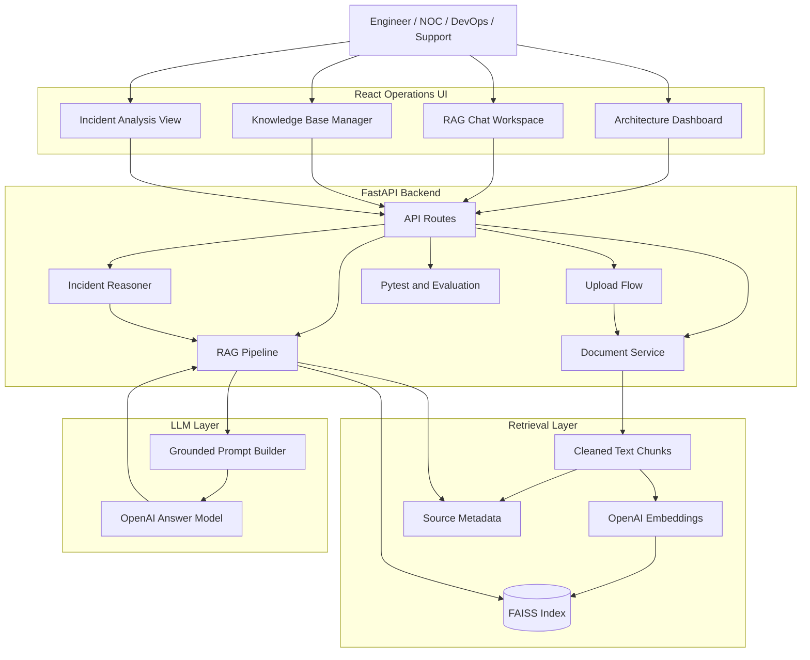

# Amdocs AI Course Portfolio

<p align="center">
  <strong>AI-Augmented Software Engineering portfolio with Python, Flask, SQLite, RAG, FastAPI, React, Docker, AWS, testing, and production-minded documentation.</strong>
</p>

<p align="center">
  <a href="#featured-project">Featured Project</a> |
  <a href="#skills-demonstrated">Skills</a> |
  <a href="#course-milestones">Course Milestones</a> |
  <a href="#repository-map">Repository Map</a> |
  <a href="#quick-start">Quick Start</a> |
  <a href="#quality-and-security">Quality</a>
</p>

<p align="center">
  
  
  
  
  
  
  
  
  
</p>

---

## Overview

This repository documents my hands-on work during the **Amdocs AI Engineer / AI-Augmented Software Engineering course**.

It is structured as a practical engineering portfolio, not just a collection of homework files. The repository includes Python fundamentals, Flask applications, SQLite persistence, NLP and RAG experiments, Docker and AWS labs, and a full-stack AI project focused on technical incident operations.

The main goal is to show steady progress from basic Python exercises to a production-minded AI application with architecture, testing, documentation, Docker delivery, and responsible RAG behavior.

**Author:** Reem Mor — [github.com/reem-mor](https://github.com/reem-mor)

**Documentation hub:** [docs/course-summary.md](docs/course-summary.md) · [docs/setup.md](docs/setup.md) · [docs/submission-checklist.md](docs/submission-checklist.md)

---

## Featured Project

### IncidentIQ - Full-Stack Incident Assistant RAG Application

[IncidentIQ](projects/incident-assistant-rag/) is the main portfolio project in this repository.

It is a full-stack Retrieval-Augmented Generation application for **technical incident operations**. The product is designed for NOC, DevOps, Support, and Data Services teams that need fast, grounded answers from runbooks, incident procedures, uploaded documents, and operational knowledge.

It is not a generic chatbot. It retrieves relevant context first, applies grounding rules, refuses unsupported questions, and returns visible evidence to the user.

| Area | Implementation |
|------|----------------|
| Domain | Incident triage, runbooks, escalation, alert explanation, operational support |
| Backend | FastAPI, Pydantic, OpenAI API, FAISS, pytest |
| Frontend | React, TypeScript, Vite, operations-style UI |
| RAG | Document ingestion, chunking, embeddings, FAISS retrieval, grounded prompting |
| Guardrails | Similarity threshold, no-context refusal, source transparency, confidence fields |
| Delivery | Docker Compose, screenshots, evaluation flow, technical documentation |

**Project links**

- [IncidentIQ README](projects/incident-assistant-rag/README.md)
- [Architecture documentation](projects/incident-assistant-rag/docs/architecture.md)
- [RAG pipeline documentation](projects/incident-assistant-rag/docs/rag_pipeline.md)
- [Testing plan](projects/incident-assistant-rag/docs/testing_plan.md)
- [Demo script](projects/incident-assistant-rag/docs/demo_script.md)
- [Reflection](projects/incident-assistant-rag/docs/reflection.md)

---

## Main Project Architecture



---

## Skills Demonstrated

| Category | Skills |
|----------|--------|
| Python | Functions, validation, OOP concepts, data structures, NumPy, clean project structure |
| Web Backend | Flask, FastAPI, REST APIs, request handling, JSON responses, error handling |
| Frontend | HTML, CSS, JavaScript, React, TypeScript, Vite, operational UI workflows |
| Data | SQLite, CRUD operations, conversation history, metadata handling |
| AI Engineering | RAG, embeddings, FAISS, prompt grounding, no-context refusal, source attribution |
| DevOps | Dockerfiles, Docker Compose, Nginx container, AWS EC2, SSH, Security Groups |
| Quality | pytest, evaluation questions, documentation, demo scripts, reproducible setup |
| Security | `.env` usage, secret separation, `.gitignore`, `.dockerignore`, no frontend key exposure |

---

## Course Milestones

| Lesson | Focus | What was practiced | Portfolio value |
|--------|-------|--------------------|-----------------|
| 01 | Jupyter and Python basics | Markdown, notebooks, variables, simple calculations | Establishes clear technical communication and Python basics |
| 02 | Python foundations | Functions, lists, dictionaries, validation, control flow | Builds reusable problem-solving patterns |
| 03 | OOP and NumPy | Classes, arrays, structured logic, data operations | Adds scalable coding habits and numerical foundations |
| 04 | NLP and RAG foundations | Tokenization, embeddings, semantic search, FAISS, LLM APIs | Connects Python skills to AI application patterns |
| 05 | Flask web development | Routes, slugs, HTTP methods, forms, Jinja2, static files | Introduces browser-based Python applications |
| 06 | SQLite and RAG web app | SQLite, CRUD, REST endpoints, session memory, FAISS, Hugging Face, Gemini, async UI | Demonstrates a complete AI web prototype with persistent chat |
| 07 | Docker and AWS EC2 | Docker images, containers, volumes, networks, Dockerfile, EC2, SSH, Nginx, Security Groups | Shows deployment workflow and container fundamentals |
| Project | Full-stack AI system | FastAPI, React, FAISS, OpenAI, Docker Compose, tests, evaluation, documentation | Shows end-to-end AI software delivery |

---

## Repository Architecture

```mermaid
flowchart TB
  Repo[amdocs-ai-course]

  Repo --> Resources[resources]
  Repo --> Lectures[lectures]
  Repo --> Homework[homework]
  Repo --> Projects[projects]
  Repo --> Docs[CONTRIBUTING.md]

  Resources --> CourseSlides[Slides and course material]

  Lectures --> L01[01 Jupyter and Python Basics]
  Lectures --> L02[02 Python Intro]
  Lectures --> L03[03 OOP and NumPy]
  Lectures --> L04[04 NLP and RAG]
  Lectures --> L05[05 Flask Intro]
  Lectures --> L06[06 Flask Advanced RAG]
  Lectures --> L07[07 Docker and AWS]

  Homework --> HW01[HW01 Notebook Basics]
  Homework --> HW02[HW02 Python Exercises]
  Homework --> HW03[HW03 Titanic CLI and Tests]
  Homework --> HW04[HW04 RAG Application]

  Projects --> MainProject[IncidentIQ Full-Stack RAG]
  Projects --> Prototype[IncidentIQ Prototype]

  MainProject --> Backend[FastAPI Backend]
  MainProject --> Frontend[React Frontend]
  MainProject --> Retrieval[FAISS Retrieval]
  MainProject --> Docker[Docker Compose]
  MainProject --> Evaluation[Tests and Evaluation]
```



---

## Repository Map

```text
amdocs-ai-course/
├── README.md
├── LICENSE
├── CONTRIBUTING.md
├── requirements.txt
│
├── docs/                          # Course docs, architecture, checklists
│   ├── course-summary.md
│   ├── setup.md
│   ├── docker-aws-notes.md
│   ├── rag-notes.md
│   ├── submission-checklist.md
│   ├── architecture/
│   ├── screenshots/               # Index only (assets live with HW/projects)
│   └── diagrams/
│
├── resources/
│   ├── lecture01.pdf … lecture06_docker_aws.pdf
│   └── handouts/                  # DOCX/PPTX guidelines
│
├── lectures/                      # 01–07 lesson folders
├── homework/                      # hw01–hw05
├── exercises/                     # Index to runnable labs
│
└── projects/
    ├── README.md
    └── incident-assistant-rag/    # Capstone (IncidentIQ)
```

---

## Learning Path

```mermaid
flowchart LR
  Python[Python Foundations] --> Data[OOP, NumPy, Validation]
  Data --> Web[Flask Web Apps]
  Web --> DB[SQLite Persistence]
  DB --> RAG[RAG and FAISS]
  RAG --> FullStack[FastAPI + React]
  FullStack --> Docker[Docker Compose]
  Docker --> Cloud[AWS EC2 Lab]
  Cloud --> Portfolio[Production-Minded Portfolio]
```



---

## Homework Index

| HW | Topic | Folder | Main Value |
|----|-------|--------|------------|
| 01 | Jupyter notebook basics | [homework/hw01](homework/hw01/) | Markdown, notebook formatting, Python basics |
| 02 | Python exercises | [homework/hw02](homework/hw02/) | Functions, data structures, NumPy, recursion |
| 03 | Titanic ticket system | [homework/hw03](homework/hw03/) | Input validation, CLI flow, clean structure, testing mindset |
| 04 | RAG application | [homework/hw04](homework/hw04/) | Retrieval, generation, app structure, AI workflow (in progress) |
| 05 | EC2, Docker, Nginx lab | [homework/hw05/nginx-docker-lab](homework/hw05/nginx-docker-lab/) | AWS instance, SSH, container runtime, HTTP validation, screenshots |

---

## Course Handouts

Official assignment briefs in [`resources/handouts/`](resources/handouts/):

| Handout | Used for |
|---------|----------|
| [project_guidelines.pptx](resources/handouts/project_guidelines.pptx) | Course project requirements |
| [mid-course-project-guidelines.docx](resources/handouts/mid-course-project-guidelines.docx) | Mid-course project scope |
| [rag-application-homework-guidelines.docx](resources/handouts/rag-application-homework-guidelines.docx) | Homework 04 — full RAG app |
| [ubuntu-ec2-docker-nginx-student-exercise.docx](resources/handouts/ubuntu-ec2-docker-nginx-student-exercise.docx) | Homework 05 — EC2/Docker/Nginx lab |
| [bedrock-kb-flask-project-guideline.docx](resources/handouts/bedrock-kb-flask-project-guideline.docx) | Bedrock KB + Flask + EC2 track |

---

## Project Index

| Project | Folder | Description |
|---------|--------|-------------|
| IncidentIQ - Incident Assistant RAG | [projects/incident-assistant-rag](projects/incident-assistant-rag/) | Full-stack RAG application for technical incident operations with React, FastAPI, FAISS, OpenAI, Docker, tests, evaluation, and documentation |

---

## Why This Repository Matters

This repo shows the path from course exercises to a realistic AI engineering project:

1. Start with Python fundamentals and clean validation.
2. Build small applications and CLI flows.
3. Add web interfaces with Flask.
4. Add persistence with SQLite.
5. Add RAG with embeddings, FAISS, and LLM calls.
6. Upgrade into a full-stack React and FastAPI application.
7. Package the system with Docker.
8. Practice deployment concepts with AWS EC2 and Nginx.
9. Document the result as a portfolio project that can be reviewed by a lecturer, mentor, or hiring manager.

---

## Quality and Security

This repository follows practical engineering habits:

- Clear folder structure for lectures, homework, resources, and projects.
- Project-level README files with setup and usage instructions.
- Environment variables for API keys and secrets.
- `.env` files excluded from git.
- Docker and `.dockerignore` usage for cleaner builds.
- Tests where relevant, especially for validation and RAG flows.
- Source transparency and no-context behavior in the main RAG project.
- Documentation for architecture, testing, demo flow, and reflection.
- Course prototypes are preserved for learning history. Before production use, any hard-coded tokens from early experiments should be rotated and moved into environment variables.

---

## Quick Start

### 1. Clone the repository

```bash
git clone https://github.com/reem-mor/amdocs-ai-course.git
cd amdocs-ai-course
```

### 2. Create a Python virtual environment

```bash
python -m venv .venv
```

Windows:

```powershell
.\.venv\Scripts\Activate.ps1
```

macOS / Linux:

```bash
source .venv/bin/activate
```

### 3. Install root dependencies

```bash
pip install -r requirements.txt
```

### 4. Optional NLTK setup

Some NLP and RAG lectures require local NLTK resources:

```bash
python -c "import nltk; nltk.download('punkt'); nltk.download('punkt_tab'); nltk.download('stopwords'); nltk.download('wordnet'); nltk.download('omw-1.4'); nltk.download('averaged_perceptron_tagger_eng')"
```

### 5. Run the main RAG project

```bash
cd projects/incident-assistant-rag
```

Then follow the dedicated setup guide:

[projects/incident-assistant-rag/README.md](projects/incident-assistant-rag/README.md)

---

## Common Commands

### Run HW03 tests

```bash
cd homework/hw03
pytest -v
```

### Run Flask intro demo

```bash
cd lectures/05_flask_intro
python app.py
```

### Run advanced Flask RAG demo

```bash
cd lectures/06_flask_advanced_rag
cp .env.example .env
python app.py
```

### Check Docker

```bash
docker --version
docker ps
docker images
```

### Run the main project with Docker Compose

```bash
cd projects/incident-assistant-rag
docker compose up --build
```

---

## Environment Variables

Create local `.env` files only where needed. Do not commit secrets.

Typical variables used across the AI and RAG exercises:

```env
GEMINI_API_KEY=your-google-ai-studio-key
HF_TOKEN=your-huggingface-token
OPENAI_API_KEY=your-openai-key
```

For the main IncidentIQ project, use the project-specific `.env.example` files in:

```text
projects/incident-assistant-rag/
```

---

## Suggested Demo Flow

A reviewer can understand the repository quickly with this flow:

1. Open this root README.
2. Review the course milestones and skills table.
3. Open [IncidentIQ](projects/incident-assistant-rag/).
4. Run the app locally or with Docker Compose.
5. Index sample documents.
6. Ask a grounded incident question.
7. Ask an unrelated question and verify the no-context refusal.
8. Review tests, evaluation, architecture docs, and screenshots.

---

## Learning Outcomes

After working through this repository, a reviewer should see evidence that I can:

- Progress from Python basics to production-style AI application delivery
- Design and implement RAG pipelines with FAISS, embeddings, and grounded LLM responses
- Build web UIs with Flask and React and connect them to REST APIs
- Apply Docker and AWS EC2 concepts in hands-on labs
- Write tests, document architecture, and present work suitable for course grading and portfolio review

Detailed progression: [docs/architecture/repository-architecture.md](docs/architecture/repository-architecture.md) · [docs/rag-notes.md](docs/rag-notes.md)

---

## What This Repository Demonstrates

- Python programming fundamentals.
- Clean validation and CLI application structure.
- OOP, NumPy, and practical data handling.
- Flask routing, forms, templates, and static assets.
- SQLite persistence and CRUD operations.
- NLP and RAG foundations.
- FAISS-based semantic search.
- FastAPI backend development.
- React frontend development.
- SQLite-backed conversation memory in prototypes.
- Full-stack AI application delivery.
- Dockerized local deployment.
- AWS EC2, SSH, Security Groups, and Nginx container validation.
- Testing, evaluation, documentation, and presentation.
- Practical thinking for NOC, DevOps, and incident operations use cases.

---

## Future Improvements

- Add GitHub Actions for automated tests.
- Add a root-level screenshot gallery.
- Add consistent README templates across all homework folders.
- Add architecture diagrams for more lecture demos.
- Add cloud deployment notes for AWS labs and full-stack projects.
- Add a portfolio landing page for finished projects.
- Add deployment options for Render, AWS ECS, or Elastic Beanstalk.

---

## License and Usage

Original code in this repository is licensed under the [MIT License](LICENSE).

Course PDFs, PPTX, and DOCX files in `resources/` are educational materials from the Amdocs training program and are not necessarily covered by MIT.

Do not commit private keys, production credentials, personal secrets, or sensitive data.
