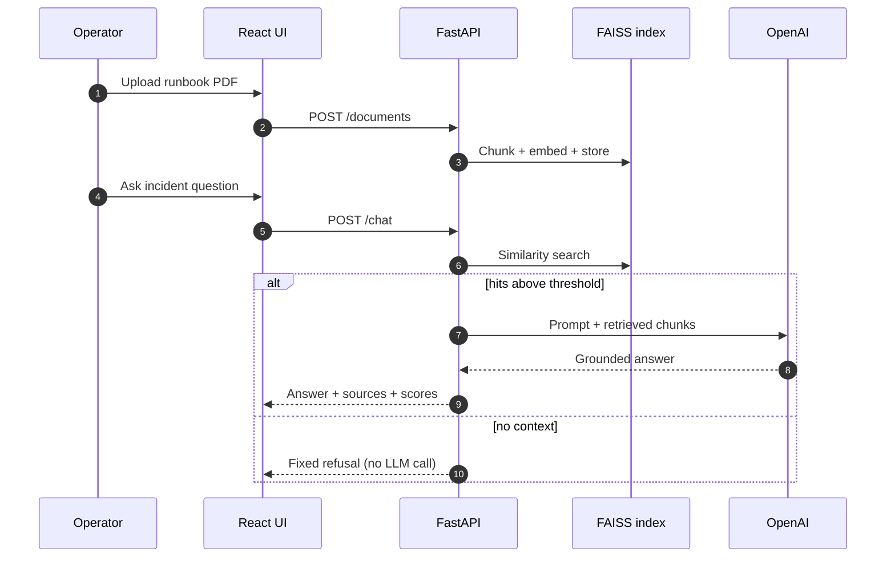

<div align="center">

# AI Engineering Portfolio

### Learning archive & capstone projects — Amdocs / Lab17 AI-Augmented Software Engineering

**Python → RAG → agents → Docker → AWS Bedrock · by an AI Engineer × SRE**

[](https://github.com/reem-mor/ai-engineering-portfolio/actions/workflows/ci.yml)
[](#technology-stack)
[](#technology-stack)
[](#technology-stack)
[](#license)

[Summary](#project-summary) · [Architecture](#architecture) · [Use cases](#use-cases) · [Flow](#end-to-end-flow) · [Tools](#tools--integrations) · [Flagships](#flagship-repositories) · [Screenshots](#see-it-working) · [Quick start](#quick-start) · [Docs](#documentation)

**Re'em Mor** · B.Sc. CS (GPA 91) · production SRE/NOC · [github.com/reem-mor](https://github.com/reem-mor)

> Former repo name: `amdocs-ai-course` (GitHub redirects automatically)

</div>

---

## Project summary

This repository is my **honest learning archive**: lecture write-ups, homework, labs, and **in-repo capstone projects** that show how I progressed from Python fundamentals to full-stack RAG and AWS agentic systems.

> **Core principle:** flagships live in **their own repos** — this archive shows the **progression and engineering habits** behind them.  
> Third-party course slides are **not** redistributed ([`resources/MANIFEST.md`](resources/MANIFEST.md)).

| Audience | Start here |
|----------|------------|
| **Recruiter / hiring manager** | [Flagship repositories](#flagship-repositories) → [**PITER AiOps**](https://github.com/reem-mor/piter-aiops) |
| **Technical reviewer** | [`projects/incident-assistant-rag/`](projects/incident-assistant-rag/) capstone |
| **Student / self-learner** | [Quick start](#quick-start) · [`docs/setup.md`](docs/setup.md) |

---

## Architecture

Colour-coded ecosystem — **archive (learning) → capstones in-repo → extracted flagships**:


<details>
<summary><b>Interactive portfolio map</b> — mermaid</summary>


</details>

| Layer | Location | Role |
|-------|----------|------|
| 🔵 **Curriculum** | `lectures/`, `homework/` | Authored notes + runnable demos |
| 🟣 **Capstone** | `projects/incident-assistant-rag/` | Featured RAG app — 90 tests, evaluation harness |
| 🟠 **Iteration** | `projects/incident-rag-bedrock/` | Bedrock KB stepping-stone → PITER |
| 🟢 **Pointers** | `projects/piter-aiops/`, `course-assistant-bot/` | Link to external repos |
| 🩷 **Meta** | `docs/`, `AGENTS.md`, `.mcp.json` | Setup, audit, agent tooling |

Map: [`docs/architecture/repository-architecture.md`](docs/architecture/repository-architecture.md)

---

## Use cases

| # | Scenario | Where |
|---|----------|-------|
| 1 | Review **course progression** (Python → RAG → agents) | `lectures/` + [Learning path](#learning-path) |
| 2 | Run **featured capstone** locally (Docker) | `projects/incident-assistant-rag/` |
| 3 | Compare **OpenAI+FAISS** vs **Bedrock KB** vs **Bedrock Agent** | capstone · bedrock iteration · [PITER repo](https://github.com/reem-mor/piter-aiops) |
| 4 | Reproduce **CI** (ruff + pytest) | [`.github/workflows/ci.yml`](.github/workflows/ci.yml) |
| 5 | Study **MCP / agent tooling** setup | [`docs/AGENT-TOOLING.md`](docs/AGENT-TOOLING.md) |
| 6 | Audit **portfolio hygiene** | [`docs/AUDIT_2026.md`](docs/AUDIT_2026.md) |

---

## End-to-end flow

<details>
<summary><b>Capstone RAG path</b> — upload → index → grounded chat</summary>



Full capstone docs: [`projects/incident-assistant-rag/README.md`](projects/incident-assistant-rag/README.md)

</details>

---

## Tools & integrations

### In this archive

| Tool | Purpose |
|------|---------|
| **pytest + ruff** | CI quality gate |
| **MCP servers** | [`/.mcp.json`](.mcp.json) — course-tools, playwright, aws-knowledge, kaggle |
| **Docker Compose** | Capstone + lecture demos |
| **FAISS / OpenAI** | Local RAG capstone |
| **Bedrock KB** | Learning iteration project |

Agent bootstrap: [`docs/AGENT-TOOLING.md`](docs/AGENT-TOOLING.md) · [`scripts/setup-dev.ps1`](scripts/setup-dev.ps1)

### MCP catalog (committed config)

| Server | Use |
|--------|-----|
| `course-tools` | Lecture 08 stdio demo |
| `playwright` | E2E / UI capture (hw07) |
| `aws-knowledge` | AWS documentation |
| `kaggle` | hw07 datasets |

---

## Flagship repositories

Standalone repos — **lead with these on your profile review**:

| Project | One line | Repository |
|---------|----------|------------|
| **PITER AiOps** | Bedrock Agent + RAG + tools · incident triage · safe escalation | [**piter-aiops**](https://github.com/reem-mor/piter-aiops) |
| **HINDSIGHT** | SecOps document pipeline · Gemini extraction · deterministic enrich | [**hindsight**](https://github.com/reem-mor/hindsight) |
| **course-assistant-bot** | Bilingual Telegram cohort bot · uv · 224 tests | [**course-assistant-bot**](https://github.com/reem-mor/course-assistant-bot) |

---

## See it working

### Featured capstone — IncidentIQ

| API (Swagger) | KB index | Grounded chat | Refusal (no context) |
|:---:|:---:|:---:|:---:|
| [](projects/incident-assistant-rag/screenshots/01_swagger_all_api_endpoints.png) | [](projects/incident-assistant-rag/screenshots/04_frontend_knowledge_base_index_success.png) | [](projects/incident-assistant-rag/screenshots/06_frontend_rag_chat_grounded.png) | [](projects/incident-assistant-rag/screenshots/07_frontend_rag_chat_irrelevant.png) |

| Tests (90) | Evaluation 5/5 |
|:---:|:---:|
| [](projects/incident-assistant-rag/screenshots/11_backend_tests_90_passed_pytest.png) | [](projects/incident-assistant-rag/screenshots/12_backend_evaluation_5_of_5.png) |

Architecture PNG: [`projects/incident-assistant-rag/docs/architecture.png`](projects/incident-assistant-rag/docs/architecture.png)

### External flagships

Screenshots live in each repo's README — [**PITER**](https://github.com/reem-mor/piter-aiops#see-it-working) · [**HINDSIGHT**](https://github.com/reem-mor/hindsight#-see-it-working) · [**bot**](https://github.com/reem-mor/course-assistant-bot#see-it-working)

---

## Learning path

| Stage | Topics | Path |
|-------|--------|------|
| Foundations | Python, OOP, NumPy | `lectures/01`–`03` |
| RAG & web | Embeddings, FAISS, Flask | `lectures/04`–`06`, `homework/hw04` |
| Ops & agents | Docker, MCP, n8n, Bedrock | `lectures/07`–`11`, `homework/hw05`–`hw07` |
| Capstone | Full-stack grounded RAG | `projects/incident-assistant-rag/` |

Index: [`lectures/README.md`](lectures/README.md) · [`homework/README.md`](homework/README.md)

---

## Technology stack

| Area | Technologies in archive |
|------|-------------------------|
| Languages | Python 3.12 |
| Web | FastAPI, Flask, React, Vite |
| AI | OpenAI, FAISS, AWS Bedrock KB/Agent, LangChain |
| Ops | Docker, EC2 labs, n8n, MCP |
| Quality | ruff, pytest, GitHub Actions |

---

## Quick start

```bash
git clone https://github.com/reem-mor/ai-engineering-portfolio.git
cd ai-engineering-portfolio
python -m venv .venv && source .venv/bin/activate   # Windows: .\.venv\Scripts\Activate.ps1
pip install -r requirements-dev.txt
```

**Capstone (Docker):**

```bash
cd projects/incident-assistant-rag && docker compose up --build
```

**CI parity:**

```bash
cd projects/incident-assistant-rag/backend && pip install -r requirements.txt && pytest -q
cd projects/incident-rag-bedrock && pip install -r requirements.txt && pytest -q
```

Human setup: [`docs/setup.md`](docs/setup.md)

---

## Documentation

| Doc | Contents |
|-----|----------|
| [`docs/setup.md`](docs/setup.md) | Clone, venv, per-project deps |
| [`docs/AGENT-TOOLING.md`](docs/AGENT-TOOLING.md) | MCP, skills, CI matrix |
| [`docs/AUDIT_2026.md`](docs/AUDIT_2026.md) | Employer-readiness audit |
| [`docs/SECURITY_REMEDIATION.md`](docs/SECURITY_REMEDIATION.md) | Secrets hygiene |
| [`docs/extraction/`](docs/extraction/) | Flagship extraction runbooks |
| [`AGENTS.md`](AGENTS.md) | Cross-tool agent guidance |

---

## License

MIT for original code — [`LICENSE`](LICENSE). Course slides/handouts: [`resources/MANIFEST.md`](resources/MANIFEST.md) only.
