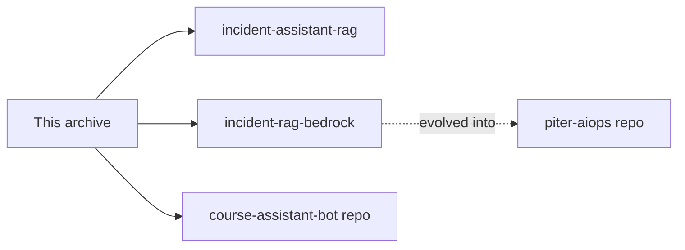

# AI Engineering Portfolio

<p align="center">
  <strong>Re'em Mor — AI Engineer × SRE</strong><br>
  Production NOC/SRE in regulated environments → building grounded AI systems that survive on-call.
</p>

<p align="center">
  <a href="#start-here">Start here</a> ·
  <a href="#flagship-repos">Flagships</a> ·
  <a href="#in-this-archive">In this archive</a> ·
  <a href="#learning-path">Learning path</a> ·
  <a href="#quick-start">Quick start</a>
</p>

<p align="center">
  <a href="https://github.com/reem-mor/ai-engineering-portfolio/actions/workflows/ci.yml"></a>
  
  
  
  
</p>

> **Former name:** `amdocs-ai-course` — renamed for portfolio clarity. Same content: lectures, homework, and capstone projects from the Amdocs / Lab17 **AI-Augmented Software Engineering** program.

---

## Start here

| If you are… | Go to |
|-------------|-------|
| **Recruiter / hiring manager** | [Flagship repos](#flagship-repos) below — start with **PITER AiOps** |
| **Reviewer checking course work** | [In this archive](#in-this-archive) → [`projects/incident-assistant-rag`](projects/incident-assistant-rag/) |
| **Cloning to learn** | [Quick start](#quick-start) · [`docs/setup.md`](docs/setup.md) |

**About me:** B.Sc. CS (Open University of Israel, GPA 91) · production SRE/NOC (regulated multi-jurisdiction gaming) · bilingual EN/HE · [github.com/reem-mor](https://github.com/reem-mor)

---

## Flagship repos

Standalone, production-minded systems — each with CI, tests, and docs:

| Project | One line | Repository |
|---------|----------|------------|
| **PITER AiOps** | Bedrock Agent + RAG + tools for incident triage & safe escalation | [**piter-aiops**](https://github.com/reem-mor/piter-aiops) |
| **HINDSIGHT** | Semantic search over incident logs & ops documents | [**hindsight**](https://github.com/reem-mor/hindsight) |
| **course-assistant-bot** | Bilingual Telegram cohort bot — schedule, homework, RAG, admin | [**course-assistant-bot**](https://github.com/reem-mor/course-assistant-bot) |



---

## In this archive

Course-authored work kept here (not duplicated in flagships):

| Project | Path | Notes |
|---------|------|-------|
| **IncidentIQ** (capstone) | [`projects/incident-assistant-rag/`](projects/incident-assistant-rag/) | FastAPI · OpenAI · FAISS · React · Docker · 90 tests |
| **Bedrock RAG iteration** | [`projects/incident-rag-bedrock/`](projects/incident-rag-bedrock/) | Learning step before PITER · 111 tests |
| **Pointers** | [`projects/piter-aiops/`](projects/piter-aiops/) · [`course-assistant-bot/`](course-assistant-bot/) | Link to external repos |

<details>
<summary><strong>Repository tree</strong></summary>

```text
ai-engineering-portfolio/
├── lectures/          # Lessons 01–11 + demos
├── homework/            # hw01–hw07
├── exercises/           # Lab index
├── projects/
│   ├── incident-assistant-rag/   # featured capstone
│   ├── incident-rag-bedrock/     # Bedrock KB iteration
│   └── piter-aiops/              # → external repo pointer
├── course-assistant-bot/         # → external repo pointer
├── docs/              # setup, audit, agent tooling, extraction
└── AGENTS.md          # cross-tool agent guidance
```

</details>

---

## Learning path

| Stage | Topics | Where |
|-------|--------|-------|
| Foundations | Python, OOP, NumPy | `lectures/01`–`03` |
| RAG & web | Embeddings, FAISS, Flask | `lectures/04`–`06`, `homework/hw04` |
| Ops & agents | Docker, EC2, MCP, n8n, Bedrock | `lectures/07`–`11`, `homework/hw05`–`hw07` |
| Capstone | Full-stack grounded RAG | `projects/incident-assistant-rag/` |

Full milestone table: [`lectures/README.md`](lectures/README.md)

---

## Quick start

```bash
git clone https://github.com/reem-mor/ai-engineering-portfolio.git
cd ai-engineering-portfolio
python -m venv .venv && .\.venv\Scripts\Activate.ps1   # or source .venv/bin/activate
pip install -r requirements-dev.txt
```

**Featured capstone (Docker):**

```bash
cd projects/incident-assistant-rag && docker compose up --build
```

**CI parity (offline tests):**

```bash
cd projects/incident-assistant-rag/backend && pip install -r requirements.txt && pytest -q
cd projects/incident-rag-bedrock && pip install -r requirements.txt && pytest -q
```

Agent/MCP setup: [`docs/AGENT-TOOLING.md`](docs/AGENT-TOOLING.md) · Human setup: [`docs/setup.md`](docs/setup.md)

---

## Quality & security

- Secrets via `.env` only — [`docs/SECURITY_REMEDIATION.md`](docs/SECURITY_REMEDIATION.md)
- CI: ruff + pytest ([`.github/workflows/ci.yml`](.github/workflows/ci.yml))
- Employer audit: [`docs/AUDIT_2026.md`](docs/AUDIT_2026.md)
- Grounded RAG: source attribution + no-context refusal in capstone projects

---

## License

MIT for original code — [`LICENSE`](LICENSE). Third-party course slides are **not** in this repo ([`resources/MANIFEST.md`](resources/MANIFEST.md)).
