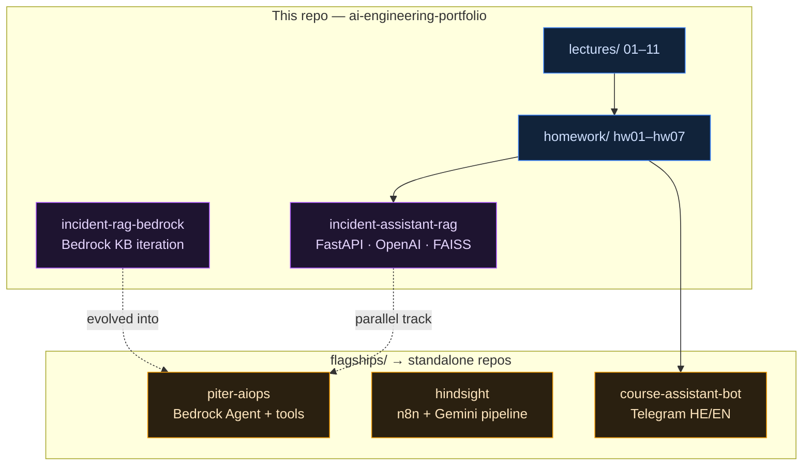
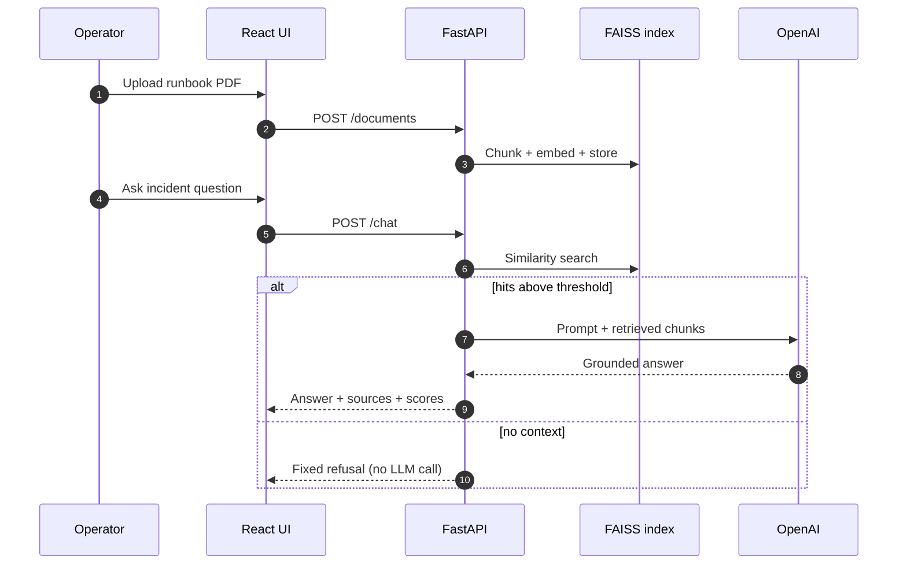
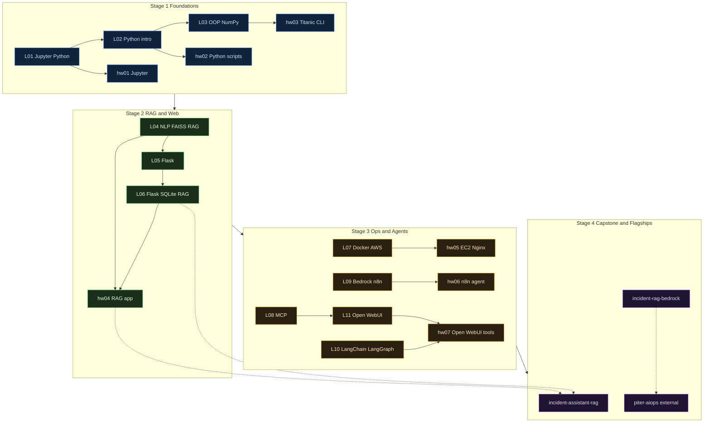

<div align="center">

# AI Engineering Portfolio

### Learning archive & capstone projects — Amdocs / Lab17 AI-Augmented Software Engineering

**Production-minded AI systems · grounded RAG · agentic ops · AI Engineer × SRE**

[](https://github.com/reem-mor/ai-engineering-portfolio/actions/workflows/ci.yml)
[](#technology-stack)
[](#sre--devops-credibility)
[](#technology-stack)
[](#technology-stack)
[](#license)

<p>
  
  
  
  
  
  
  
  
  
</p>

[Summary](#project-summary) · [Structure](#repository-structure) · [Pins](#github-pin-recommendations) · [Architecture](#architecture) · [Syllabus](#syllabus) · [Journey](#end-to-end-learning-journey) · [Flagships](#flagship-repositories) · [Screenshots](#see-it-working) · [SRE](#sre--devops-credibility) · [Quick start](#quick-start) · [Docs](#documentation)

**Re'em Mor** · B.Sc. CS (GPA 91) · production SRE/NOC · [github.com/reem-mor](https://github.com/reem-mor)

> Former repo name: `amdocs-ai-course` (GitHub redirects automatically)

</div>

---

## Project summary

This repository is my **honest learning archive**: lecture write-ups, homework, labs, and **in-repo capstone projects** that show how I progressed from Python fundamentals to full-stack RAG and AWS agentic systems.

> **Core principle:** flagships live in **their own repos** — this archive shows the **progression and engineering habits** behind them.  
> Third-party course slides are **not** redistributed ([`resources/MANIFEST.md`](resources/MANIFEST.md)).

| Audience | Start here |
|----------|------------|
| **Recruiter / hiring manager** | [GitHub pins](#github-pin-recommendations) → [**PITER AiOps**](https://github.com/reem-mor/piter-aiops) |
| **Technical reviewer** | [`projects/incident-assistant-rag/`](projects/incident-assistant-rag/) capstone |
| **Student / self-learner** | [Quick start](#quick-start) · [`docs/SYLLABUS.md`](docs/SYLLABUS.md) · [`docs/STRUCTURE.md`](docs/STRUCTURE.md) |

---

## Repository structure

**Committed tree** (what GitHub reviewers see):

```text
docs/  lectures/  homework/  exercises/  projects/  flagships/  resources/  scripts/
```

| Folder | Role |
|--------|------|
| `lectures/` | Lessons 01–11 — demos colocated with notes |
| `homework/` | Assignments hw01–07 — evidence colocated |
| `projects/` | In-repo capstone + Bedrock iteration only |
| `flagships/` | Pointers → external production repos |
| `docs/` | Syllabus, setup, architecture, agent tooling |

Full map (including local-only folders): [`docs/STRUCTURE.md`](docs/STRUCTURE.md)

Clean local clutter (`.venv` caches, old PITER copy): `.\scripts\clean-workspace.ps1`

---

## GitHub pin recommendations

Pin these on your profile review — order matters for first impressions:

| Pin | Repository | Why |
|-----|------------|-----|
| 1 | [**piter-aiops**](https://github.com/reem-mor/piter-aiops) | Flagship — Bedrock Agent + RAG + tools + safe escalation |
| 2 | [**hindsight**](https://github.com/reem-mor/hindsight) | SecOps document pipeline · semantic search |
| 3 | [**course-assistant-bot**](https://github.com/reem-mor/course-assistant-bot) | Production Telegram bot · uv · 224 tests |
| 4 | **ai-engineering-portfolio** (this repo) | Honest learning arc + featured capstone |

Setup commands: [`docs/portfolio/GITHUB_PROFILE_PLAYBOOK.md`](docs/portfolio/GITHUB_PROFILE_PLAYBOOK.md) · Pointer index: [`flagships/README.md`](flagships/README.md)

---

## Architecture

Colour-coded ecosystem — **archive (learning) → capstones in-repo → external flagships**:


<details>
<summary><b>Interactive portfolio map</b> — mermaid</summary>



</details>

| Layer | Location | Role |
|-------|----------|------|
| 🔵 **Curriculum** | `lectures/`, `homework/`, `exercises/` | Authored notes + runnable demos |
| 🟣 **Capstone** | `projects/incident-assistant-rag/` | Featured RAG app — 90 tests, evaluation harness |
| 🟣 **Iteration** | `projects/incident-rag-bedrock/` | Bedrock KB stepping-stone → PITER |
| 🟠 **Flagships** | `flagships/` | Pointers to external repos |
| 🩷 **Meta** | `docs/`, `AGENTS.md`, `.mcp.json` | Setup, syllabus, agent tooling |

Map: [`docs/architecture/repository-architecture.md`](docs/architecture/repository-architecture.md)

---

## Use cases

| # | Scenario | Where |
|---|----------|-------|
| 1 | Review **course progression** (Python → RAG → agents) | [`docs/SYLLABUS.md`](docs/SYLLABUS.md) |
| 2 | Run **featured capstone** locally (Docker) | `projects/incident-assistant-rag/` |
| 3 | Compare **OpenAI+FAISS** vs **Bedrock KB** vs **Bedrock Agent** | capstone · bedrock iteration · [PITER](https://github.com/reem-mor/piter-aiops) |
| 4 | Reproduce **CI** (ruff + pytest) | [`.github/workflows/ci.yml`](.github/workflows/ci.yml) |
| 5 | Study **MCP / agent tooling** setup | [`docs/AGENT-TOOLING.md`](docs/AGENT-TOOLING.md) |
| 6 | Audit **portfolio hygiene** | [`docs/AUDIT_2026.md`](docs/AUDIT_2026.md) (historical; see banner) |

---

## End-to-end flow

<details>
<summary><b>Capstone RAG path</b> — upload → index → grounded chat</summary>



Full capstone docs: [`projects/incident-assistant-rag/README.md`](projects/incident-assistant-rag/README.md)

</details>

<details>
<summary><b>RAG evolution track</b> — two honest paths</summary>

```text
Track A (OpenAI + local FAISS):
  L04 demos → L06 Flask RAG → hw04 (target) → incident-assistant-rag (capstone)

Track B (AWS Bedrock):
  L09 Bedrock Flows → incident-rag-bedrock (iteration) → piter-aiops (flagship Agent)
```

</details>

---

## Syllabus

Full curriculum: [`docs/SYLLABUS.md`](docs/SYLLABUS.md)

<details>
<summary><b>Lectures 01–11</b> — topics & skills</summary>

| # | Topic | Path | Skills |
|---|-------|------|--------|
| 01 | Jupyter & Python basics | `lectures/01_jupyter_python_basics/` | Python |
| 02 | Python foundations | `lectures/02_python_intro/` | Python |
| 03 | OOP & NumPy | `lectures/03_oop_numpy/` | Python, NumPy |
| 04 | NLP, embeddings, FAISS, RAG | `lectures/04_nlp_rag/` | RAG, NLP |
| 05 | Flask web development | `lectures/05_flask_intro/` | Flask, Docker |
| 06 | Flask + SQLite + RAG | `lectures/06_flask_advanced_rag/` | RAG, SQLite |
| 07 | Docker & AWS EC2 | `lectures/07_docker_aws/` | Docker, AWS, SRE |
| 08 | Model Context Protocol | `lectures/08_mcp/` | MCP, agents |
| 09 | Bedrock Flows & n8n | `lectures/09_flows_bedrock_n8n/` | Bedrock, n8n |
| 10 | LangChain & LangGraph | `lectures/10_langchain_langgraph/` | LangChain, ML |
| 11 | Local models & Open WebUI | `lectures/11_local_models_webui/` | Ollama, MCP |

</details>

<details>
<summary><b>Homework hw01–hw07</b> — assignments & status</summary>

| HW | Topic | Status | Path |
|----|-------|--------|------|
| hw01 | Jupyter intro | Complete | `homework/hw01/` |
| hw02 | Python foundations | Complete | `homework/hw02/` |
| hw03 | OOP / Titanic CLI | Complete | `homework/hw03/` |
| hw04 | RAG web app | **Scaffold** — see capstone | `homework/hw04/` |
| hw05 | EC2 / Docker / Nginx | Complete | `homework/hw05/` |
| hw06 | n8n customer-support agent | Complete | `homework/hw06/` |
| hw07 | Open WebUI + MCP tools | Complete | `homework/hw07/` |

</details>

---

## End-to-end learning journey

<details>
<summary><b>Four-stage colored flow</b> — mermaid</summary>



Source: [`docs/diagrams/learning-path.mermaid`](docs/diagrams/learning-path.mermaid)

</details>

| Stage | Topics | Path |
|-------|--------|------|
| Foundations | Python, OOP, NumPy | `lectures/01`–`03`, `homework/hw01`–`03` |
| RAG & web | Embeddings, FAISS, Flask | `lectures/04`–`06`, `homework/hw04` |
| Ops & agents | Docker, MCP, n8n, Bedrock, LangGraph | `lectures/07`–`11`, `homework/hw05`–`07` |
| Capstone | Full-stack grounded RAG | `projects/incident-assistant-rag/` |

Index: [`lectures/README.md`](lectures/README.md) · [`homework/README.md`](homework/README.md) · [`exercises/README.md`](exercises/README.md)

---

## Tools & integrations

### In this archive

| Tool | Purpose |
|------|---------|
| **pytest + ruff** | CI quality gate |
| **MCP servers** | [`.mcp.json`](.mcp.json) — 8 servers (see below) |
| **Docker Compose** | Capstone + lecture demos |
| **FAISS / OpenAI** | Local RAG capstone |
| **Bedrock KB / Agent** | Learning iteration + external PITER |

Agent bootstrap: [`docs/AGENT-TOOLING.md`](docs/AGENT-TOOLING.md) · [`scripts/setup-dev.ps1`](scripts/setup-dev.ps1)

### MCP catalog (committed config)

| Server | Use |
|--------|-----|
| `course-tools` | Lecture 08 stdio demo |
| `playwright` | E2E / UI capture (hw07) |
| `kaggle` | hw07 datasets |
| `aws-knowledge` | AWS documentation |
| `aws-api` | AWS API operations |
| `bedrock-kb` | Bedrock Knowledge Base retrieval |
| `n8n-workflows` | hw06 / lecture 09 |
| `lovable` | Optional UI experiments |

---

## Flagship repositories

Standalone repos — pointers and clone steps: [`flagships/README.md`](flagships/README.md)

| Project | One line | Repository |
|---------|----------|------------|
| **PITER AiOps** | Bedrock Agent + RAG + tools · incident triage · safe escalation | [**piter-aiops**](https://github.com/reem-mor/piter-aiops) |
| **HINDSIGHT** | SecOps document pipeline · Gemini extraction · deterministic enrich | [**hindsight**](https://github.com/reem-mor/hindsight) |
| **course-assistant-bot** | Bilingual Telegram cohort bot · uv · 224 tests | [**course-assistant-bot**](https://github.com/reem-mor/course-assistant-bot) |

---

## See it working

### Featured capstone — IncidentIQ

| API (Swagger) | KB index | Grounded chat | Refusal (no context) |
|:---:|:---:|:---:|:---:|
| [](projects/incident-assistant-rag/screenshots/01_swagger_all_api_endpoints.png) | [](projects/incident-assistant-rag/screenshots/04_frontend_knowledge_base_index_success.png) | [](projects/incident-assistant-rag/screenshots/06_frontend_rag_chat_grounded.png) | [](projects/incident-assistant-rag/screenshots/07_frontend_rag_chat_irrelevant.png) |

| Tests (90) | Evaluation 5/5 |
|:---:|:---:|
| [](projects/incident-assistant-rag/screenshots/11_backend_tests_90_passed_pytest.png) | [](projects/incident-assistant-rag/screenshots/12_backend_evaluation_5_of_5.png) |

Architecture PNG: [`projects/incident-assistant-rag/docs/architecture.png`](projects/incident-assistant-rag/docs/architecture.png)

### Bedrock learning iteration

| KB overview | Grounded answer | Refusal / low confidence | pytest (111) |
|:---:|:---:|:---:|:---:|
| [](projects/incident-rag-bedrock/screenshots/01_bedrock_kb_overview.png) | [](projects/incident-rag-bedrock/screenshots/08_app_question_and_answer.png) | [](projects/incident-rag-bedrock/screenshots/09_app_refusal_or_low_confidence.png) | [](projects/incident-rag-bedrock/screenshots/11_pytest_passed.png) |

### Ops homework highlights

| hw05 EC2 + Docker + Nginx | hw06 n8n agent | hw07 Open WebUI KB | hw07 tool server |
|:---:|:---:|:---:|:---:|
| [](homework/hw05/nginx-docker-lab/screenshots/01-ec2-instance-and-security-group.png) | [](homework/hw06/n8n-customer-support-agent/screenshots/01_full_workflow.png) | [](homework/hw07/screenshots/03-kb-indexed.png) | [](homework/hw07/screenshots/00-tool-server-openapi.png) |

### External flagships

Screenshots live in each repo's README — [**PITER**](https://github.com/reem-mor/piter-aiops#see-it-working) · [**HINDSIGHT**](https://github.com/reem-mor/hindsight#-see-it-working) · [**bot**](https://github.com/reem-mor/course-assistant-bot#see-it-working)

---

## SRE & DevOps credibility

Production habits backed by repo evidence — not demo-only AI:

| Signal | Where |
|--------|-------|
| CI gate (ruff + 4 pytest matrices) | [`.github/workflows/ci.yml`](.github/workflows/ci.yml) |
| Health / deep checks | capstone `/health` endpoints |
| No-context refusal (deterministic) | capstone + bedrock iteration |
| RAG evaluation harness | capstone eval 5/5 screenshot |
| Docker Compose reproducibility | capstone, hw07 |
| Secrets hygiene | [`.env.example`](.env.example), MCP `${env:VAR}` |
| Incident-domain corpus | shared runbook samples across projects |
| EC2 / container ops lab | [`homework/hw05/nginx-docker-lab/`](homework/hw05/nginx-docker-lab/) |

---

## Technology stack

| Area | Technologies in archive |
|------|-------------------------|
| Languages | Python 3.12 |
| Web | FastAPI, Flask, React, Vite |
| AI | OpenAI, FAISS, AWS Bedrock KB/Agent, LangChain, LangGraph |
| Ops | Docker, EC2 labs, n8n, MCP, Kubernetes & Terraform (production context) |
| Quality | ruff, pytest, GitHub Actions |

---

## Quick start

```bash
git clone https://github.com/reem-mor/ai-engineering-portfolio.git
cd ai-engineering-portfolio
python -m venv .venv && source .venv/bin/activate   # Windows: .\.venv\Scripts\Activate.ps1
pip install -r requirements-dev.txt
```

**Capstone (Docker):**

```bash
cd projects/incident-assistant-rag && docker compose up --build
```

**CI parity:**

```bash
cd projects/incident-assistant-rag/backend && pip install -r requirements.txt && pytest -q
cd projects/incident-rag-bedrock && pip install -r requirements.txt && pytest -q
cd lectures/10_langchain_langgraph && pip install -r requirements.txt && pytest -q
cd homework/hw07/open-webui-tools && pip install -r requirements.txt && pytest -q
ruff check .
```

Human setup: [`docs/setup.md`](docs/setup.md)

---

## Documentation

| Doc | Contents |
|-----|----------|
| [`docs/README.md`](docs/README.md) | **Documentation hub** — start here for all meta-docs |
| [`docs/STRUCTURE.md`](docs/STRUCTURE.md) | Repository layout (committed vs local-only) |
| [`docs/SYLLABUS.md`](docs/SYLLABUS.md) | Full curriculum map (lectures + homework + projects) |
| [`flagships/README.md`](flagships/README.md) | External repo pointers + pin order |
| [`docs/setup.md`](docs/setup.md) | Clone, venv, per-project deps |
| [`docs/AGENT-TOOLING.md`](docs/AGENT-TOOLING.md) | MCP, skills, CI matrix |
| [`docs/AUDIT_2026.md`](docs/AUDIT_2026.md) | Employer-readiness audit (historical) |
| [`docs/SECURITY_REMEDIATION.md`](docs/SECURITY_REMEDIATION.md) | Secrets hygiene |
| [`docs/extraction/`](docs/extraction/) | Flagship extraction runbooks |
| [`docs/portfolio/GITHUB_PROFILE_PLAYBOOK.md`](docs/portfolio/GITHUB_PROFILE_PLAYBOOK.md) | Profile README + pins |
| [`AGENTS.md`](AGENTS.md) | Cross-tool agent guidance |

---

## License

MIT for original code — [`LICENSE`](LICENSE). Course slides/handouts: [`resources/MANIFEST.md`](resources/MANIFEST.md) only.
