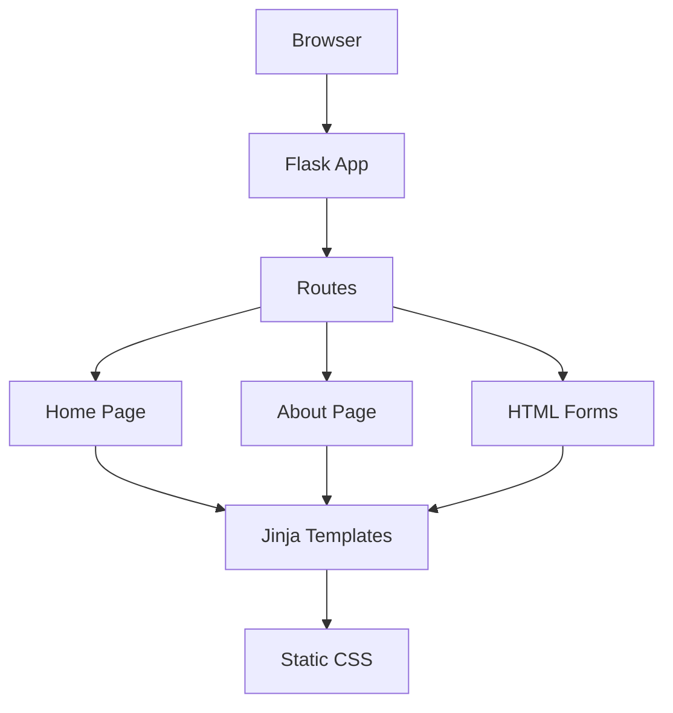
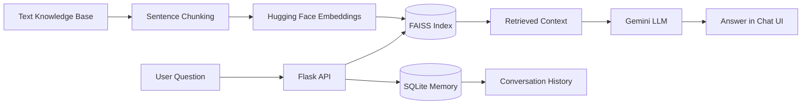
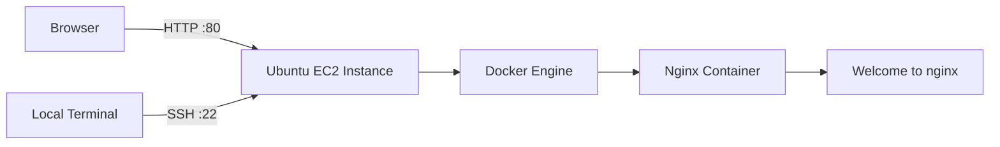
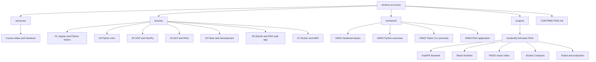
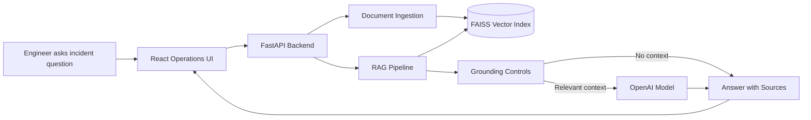

# Amdocs AI Course Portfolio

<p align="center">
  <strong>Hands-on AI-Augmented Software Engineering portfolio covering Python, Flask, SQLite, RAG, FastAPI, React, Docker, AWS, testing, and production-minded project delivery.</strong>
</p>

<p align="center">
  <a href="#featured-project">Featured Project</a> |
  <a href="#course-milestones">Course Milestones</a> |
  <a href="#repository-map">Repository Map</a> |
  <a href="#learning-path">Learning Path</a> |
  <a href="#homework-index">Homework</a> |
  <a href="#quick-start">Quick Start</a> |
  <a href="#quality-and-security">Quality</a>
</p>

<p align="center">
  
  
  
  
  
  
  
  
  
</p>

---

## Overview

This repository documents my work during the **Amdocs AI Engineer / AI-Augmented Software Engineering course**. It includes lecture practice, homework assignments, Python fundamentals, Flask web development, SQLite persistence, NLP/RAG experiments, backend development, Docker/AWS exercises, and full-stack AI application projects.

The repository is organized as a learning and portfolio workspace. Each area is designed to show not only completed exercises, but also engineering decisions, documentation, testing, deployment thinking, and practical delivery.

---

## Featured Project

### IncidentIQ - Full-Stack Incident Assistant RAG Application

[IncidentIQ](projects/incident-assistant-rag/) is the main portfolio project in this repository. It is a full-stack Retrieval-Augmented Generation application for **technical incident operations**.

It helps NOC, DevOps, Support, and Data Services teams query operational runbooks and incident documents while keeping answers grounded in the knowledge base.

| Area | Implementation |
|------|----------------|
| Domain | Technical incident operations, runbooks, escalation, alert triage |
| Backend | FastAPI, Pydantic, OpenAI API, FAISS, pytest |
| Frontend | React, TypeScript, Vite, operations-style UI |
| RAG | Document ingestion, chunking, embeddings, FAISS retrieval, grounded prompting |
| Guardrails | Similarity threshold, no-context refusal, visible sources, confidence fields |
| Delivery | Docker Compose, screenshots, evaluation flow, documentation |

**Project links**

- [IncidentIQ README](projects/incident-assistant-rag/README.md)
- [Architecture documentation](projects/incident-assistant-rag/docs/architecture.md)
- [RAG pipeline documentation](projects/incident-assistant-rag/docs/rag_pipeline.md)
- [Testing plan](projects/incident-assistant-rag/docs/testing_plan.md)
- [Reflection](projects/incident-assistant-rag/docs/reflection.md)
- [Demo script](projects/incident-assistant-rag/docs/demo_script.md)

---

## Course Milestones

The later course lessons connect the foundation work into practical web, database, RAG, Docker, and cloud deployment skills.

| Lesson | Focus | What was practiced | Portfolio value |
|--------|-------|--------------------|-----------------|
| Lesson 5 | Flask fundamentals | Flask application structure, routes, URL variables, HTTP methods, forms, Jinja2 rendering, template inheritance, static files | Shows the foundation needed to build browser-based Python applications |
| Lesson 6 | SQLite + advanced Flask + RAG web app | SQLite connections, table creation, CRUD operations, Flask form integration, SQLAlchemy concepts, REST endpoints, session memory, FAISS retrieval, Hugging Face embeddings, Gemini response generation, vanilla JS chat UI | Demonstrates a full RAG prototype with persistent sessions and a working browser interface |
| Lesson 7 | Docker + AWS EC2 | Docker images, containers, volumes, networks, Dockerfile builds, EC2 launch, SSH access, Docker installation on Ubuntu, Nginx container on port 80, Security Groups, cleanup | Demonstrates containerization and cloud deployment workflow |

---

## Lesson 5 - Flask Web Development

Lesson 5 focuses on the fundamentals of building Flask web applications.

**Key concepts practiced:**

- Flask as a lightweight Python web framework.
- WSGI, Werkzeug, and Jinja2 basics.
- Simple Flask application with `Flask(__name__)`.
- Route decorators with `@app.route()`.
- Dynamic URL values using slugs.
- HTTP methods such as `GET` and `POST`.
- HTML form handling.
- `render_template()` and the `templates/` directory.
- Passing variables from Flask to HTML.
- Jinja2 loops and reusable templates.
- Static CSS files.



---

## Lesson 6 - SQLite, Flask, and RAG Prototype

Lesson 6 expands Flask into data persistence and an AI-powered RAG application.

**SQLite and Flask topics practiced:**

- SQLite database connections with Python `sqlite3`.
- Creating tables and inserting rows.
- Parameterized SQL statements.
- `SELECT`, `UPDATE`, and `fetchall()`.
- Flask forms that write data into SQLite.
- Rendering database records into HTML tables with Jinja loops.
- SQLAlchemy and Flask-Migrate concepts.

**RAG prototype capabilities demonstrated:**

- Flask API routes for engine status, chat sessions, messages, session rename, and session deletion.
- Background RAG engine initialization so the UI can load while documents are embedded.
- `.txt` document loading and sentence-level chunking.
- Hugging Face cloud embeddings.
- FAISS vector search.
- Gemini answer generation.
- SQLite-backed conversation memory with `sessions` and `messages` tables.
- Vanilla JavaScript frontend with session list, message rendering, engine status polling, and async chat requests.



---

## Lesson 7 - Docker and AWS EC2

Lesson 7 moves from local development into containerization and cloud deployment basics.

**Docker topics practiced:**

- Docker images as application recipes.
- Containers as running instances of images.
- Docker container lifecycle commands.
- Dockerfiles and image builds.
- Volumes for persistent/shared data.
- Docker networking concepts.
- Running containers from existing images.
- Nginx as a containerized web server.

**AWS lab practiced:**

- Launching an Ubuntu EC2 instance.
- Connecting over SSH using a key pair.
- Installing Docker Engine on Ubuntu.
- Running an Nginx container with port mapping `80:80`.
- Configuring Security Groups for SSH and HTTP.
- Validating browser access through the EC2 public IP.
- Cleaning up containers and terminating EC2 resources.



---

## Repository Architecture



---

## Repository Map

```text
amdocs-ai-course/
├── README.md
├── CONTRIBUTING.md
├── requirements.txt
│
├── resources/
│   ├── lecture01.pdf
│   ├── lecture02.pdf
│   ├── lecture03.pdf
│   ├── lecture04_flask_intro.pdf
│   ├── lecture05_flask_advanced.pdf
│   ├── lecture06_docker_aws.pdf
│   └── project_guidelines.pptx
│
├── lectures/
│   ├── 01_jupyter_python_basics/
│   ├── 02_python_intro/
│   ├── 03_oop_numpy/
│   ├── 04_nlp_rag/
│   ├── 05_flask_intro/
│   ├── 06_flask_advanced_rag/
│   └── 07_docker_aws/
│
├── homework/
│   ├── hw01/
│   ├── hw02/
│   ├── hw03/
│   └── hw04/
│
└── projects/
    ├── README.md
    ├── incident-assistant-rag/
    └── incidentiq/
```

---

## Learning Path

| Stage | Focus | Main Skills |
|-------|-------|-------------|
| 01 | Jupyter and Python basics | Markdown, notebooks, variables, control flow |
| 02 | Python foundations | Lists, dictionaries, functions, validation, clean code |
| 03 | OOP and NumPy | Classes, reusable logic, arrays, vector operations |
| 04 | NLP and RAG | Tokenization, embeddings, semantic search, FAISS, LLM APIs |
| 05 | Flask web applications | Routes, slugs, HTTP methods, forms, Jinja rendering, static files |
| 06 | SQLite and RAG web application | SQLite, CRUD, REST APIs, session memory, FAISS, Hugging Face, Gemini, async UI |
| 07 | Docker and AWS | Containers, images, Dockerfiles, EC2, SSH, Nginx, Security Groups |
| Project | Full-stack AI system | FastAPI, React, RAG, Docker, testing, documentation |

---

## Homework Index

| HW | Topic | Folder | Main Value |
|----|-------|--------|------------|
| 01 | Jupyter notebook basics | [homework/hw01](homework/hw01/) | Markdown, notebook formatting, Python basics |
| 02 | Python exercises | [homework/hw02](homework/hw02/) | Functions, data structures, NumPy, recursion |
| 03 | Titanic ticket system | [homework/hw03](homework/hw03/) | Input validation, CLI flow, testing mindset |
| 04 | RAG application | [homework/hw04](homework/hw04/) | Retrieval, generation, app structure, AI workflow |

---

## Project Index

| Project | Folder | Description |
|---------|--------|-------------|
| IncidentIQ - Incident Assistant RAG | [projects/incident-assistant-rag](projects/incident-assistant-rag/) | Full-stack RAG application for technical incident operations with React, FastAPI, FAISS, OpenAI, Docker, tests, and evaluation |
| IncidentIQ prototype | [projects/incidentiq](projects/incidentiq/) | Earlier incident assistant implementation and experimentation workspace |

---

## Main Project Architecture - IncidentIQ



---

## Quality and Security

This repository is written with portfolio-level engineering habits:

- Clear project structure and documentation.
- Separate lecture, homework, and project workspaces.
- Environment variables for production API keys and secrets.
- `.env` files are excluded from git.
- Project-specific README files explain setup and usage.
- Tests are included where relevant, especially for Python validation and RAG flows.
- Docker is used for full-stack project delivery.
- The main RAG project includes hallucination controls, no-context behavior, source transparency, and evaluation questions.
- Course prototypes are kept for learning history. Before production use, any hard-coded tokens from early lessons should be rotated and moved into environment variables.

---

## Quick Start

### 1. Clone the repository

```bash
git clone https://github.com/reem-mor/amdocs-ai-course.git
cd amdocs-ai-course
```

### 2. Create a Python virtual environment

```bash
python -m venv .venv
```

Windows:

```powershell
.\.venv\Scripts\Activate.ps1
```

macOS / Linux:

```bash
source .venv/bin/activate
```

### 3. Install root dependencies

```bash
pip install -r requirements.txt
```

### 4. Optional NLTK setup

Some NLP/RAG lectures require local NLTK resources:

```bash
python -c "import nltk; nltk.download('punkt'); nltk.download('punkt_tab'); nltk.download('stopwords'); nltk.download('wordnet'); nltk.download('omw-1.4'); nltk.download('averaged_perceptron_tagger_eng')"
```

### 5. Run the main RAG project

```bash
cd projects/incident-assistant-rag
```

Then follow the project-specific setup instructions in:

[projects/incident-assistant-rag/README.md](projects/incident-assistant-rag/README.md)

---

## Common Commands

### Run Python tests for HW03

```bash
cd homework/hw03
pytest -v
```

### Run NLP/RAG lecture demos

```bash
python lectures/04_nlp_rag/demos/nltk_basic.py
python lectures/04_nlp_rag/exercises/exercise_01_tokenization.py
```

### Run Flask intro demo

```bash
cd lectures/05_flask_intro
python app.py
```

### Run advanced Flask RAG demo

```bash
cd lectures/06_flask_advanced_rag
cp .env.example .env
python app.py
```

### Run Docker checks

```bash
docker --version
docker ps
docker images
```

---

## Environment Variables

Create local `.env` files only where needed. Do not commit secrets.

Typical variables used across the AI/RAG exercises:

```env
GEMINI_API_KEY=your-google-ai-studio-key
HF_TOKEN=your-huggingface-token
OPENAI_API_KEY=your-openai-key
```

For the main IncidentIQ project, use the project-specific `.env.example` files in `projects/incident-assistant-rag/`.

---

## Submission Workflow

See [CONTRIBUTING.md](CONTRIBUTING.md) for the full submission process.

Recommended workflow:

```bash
git checkout -b docs/readme-refresh
git status
git add .
git commit -m "docs: update README with lessons 5 to 7 progress"
git push
```

---

## What This Repository Demonstrates

- Python programming fundamentals.
- Clean validation and CLI application structure.
- OOP, NumPy, and practical data handling.
- Flask routing, forms, templates, and static assets.
- SQLite persistence and CRUD operations.
- NLP and RAG foundations.
- FAISS-based semantic search.
- Backend API development.
- SQLite-backed conversation memory.
- Full-stack AI application delivery.
- Dockerized local deployment.
- AWS EC2, SSH, Security Groups, and Nginx container validation.
- Testing, evaluation, documentation, and presentation.
- Practical thinking for NOC, DevOps, and incident operations use cases.

---

## Future Improvements

- Add GitHub Actions for automated tests.
- Add a root-level project gallery with screenshots.
- Add consistent README templates across all homework folders.
- Add architecture diagrams for more lecture demos.
- Add cloud deployment notes for AWS labs and full-stack projects.
- Add a portfolio landing page for finished projects.

---

## License and Usage

This repository is used for course learning, homework submissions, and portfolio demonstration. Do not commit private keys, production credentials, or sensitive data.
