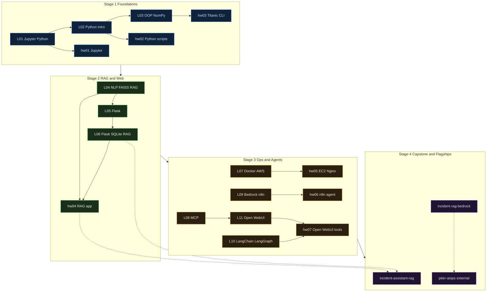

# Syllabus — AI-Augmented Software Engineering

Canonical curriculum map for the **Amdocs / Lab17** program as documented in this archive.

**Indexes:** [`lectures/README.md`](../lectures/README.md) · [`homework/README.md`](../homework/README.md) · [`exercises/README.md`](../exercises/README.md)

---

## Four-stage learning journey

| Stage | Lectures | Homework | Focus | Skills |
|-------|----------|----------|-------|--------|
| **1 — Foundations** | 01–03 | hw01–03 | Python, Jupyter, OOP, NumPy | Python, pytest |
| **2 — RAG & Web** | 04–06 | hw04 | Embeddings, FAISS, Flask, SQLite RAG | RAG, Flask, Docker |
| **3 — Ops & Agents** | 07–11 | hw05–07 | Docker, AWS, MCP, n8n, Bedrock, LangGraph, Open WebUI | SRE, Docker, MCP, agents |
| **4 — Capstone & Flagships** | — | — | Full-stack RAG + external products | FastAPI, Bedrock Agent, CI |

---

## Lectures (01–11)

| # | Folder | Topic | Key artifacts | Skills |
|---|--------|-------|---------------|--------|
| 01 | [`01_jupyter_python_basics/`](../lectures/01_jupyter_python_basics/) | Jupyter & Python basics | Types, f-strings, matplotlib | Python |
| 02 | [`02_python_intro/`](../lectures/02_python_intro/) | Python foundations | Lists, dicts, functions, file I/O | Python |
| 03 | [`03_oop_numpy/`](../lectures/03_oop_numpy/) | OOP & NumPy | Classes, inheritance, arrays | Python, NumPy |
| 04 | [`04_nlp_rag/`](../lectures/04_nlp_rag/) | NLP, embeddings, FAISS, RAG | Tokenization, Word2Vec, HF embeddings | RAG, NLP |
| 05 | [`05_flask_intro/`](../lectures/05_flask_intro/) | Flask web development | Routes, Jinja2, Dockerfile | Flask, Docker |
| 06 | [`06_flask_advanced_rag/`](../lectures/06_flask_advanced_rag/) | Flask + SQLite + RAG | REST API, FAISS, chat UI | RAG, Flask, SQLite |
| 07 | [`07_docker_aws/`](../lectures/07_docker_aws/) | Docker & AWS EC2 | Images, volumes, EC2 lab, Mermaid arch | Docker, AWS, SRE |
| 08 | [`08_mcp/`](../lectures/08_mcp/) | Model Context Protocol | FastMCP stdio server, tool-calling | MCP, agents |
| 09 | [`09_flows_bedrock_n8n/`](../lectures/09_flows_bedrock_n8n/) | Bedrock Flows & n8n | 10 workflow exports, KB flows | Bedrock, n8n |
| 10 | [`10_langchain_langgraph/`](../lectures/10_langchain_langgraph/) | LangChain & LangGraph | Memory, routing, sklearn/PyTorch demos | LangChain, ML |
| 11 | [`11_local_models_webui/`](../lectures/11_local_models_webui/) | Local models & Open WebUI | Ollama, KB concepts → hw07 | Ollama, MCP |

Official slide PDFs are **not** in this repo — see [`resources/MANIFEST.md`](../resources/MANIFEST.md).

---

## Homework (hw01–hw07)

| HW | Folder | Topic | Status | Evidence |
|----|--------|-------|--------|----------|
| hw01 | [`hw01/`](../homework/hw01/) | Jupyter intro | Complete | Notebook |
| hw02 | [`hw02/`](../homework/hw02/) | Python foundations | Complete | `python_intro.py`, `python_advanced.py` |
| hw03 | [`hw03/`](../homework/hw03/) | OOP / Titanic CLI | Complete | Notebook + pytest |
| hw04 | [`hw04/`](../homework/hw04/) | RAG web app | **Scaffold** — full impl in capstone | Docker scaffold under `my-rag-app/` |
| hw05 | [`hw05/`](../homework/hw05/) | EC2 / Docker / Nginx | Complete | [`nginx-docker-lab/screenshots/`](../homework/hw05/nginx-docker-lab/screenshots/) |
| hw06 | [`hw06/`](../homework/hw06/) | n8n customer-support agent | Complete | [`n8n-customer-support-agent/`](../homework/hw06/n8n-customer-support-agent/) |
| hw07 | [`hw07/`](../homework/hw07/) | Open WebUI + MCP tools | Complete | [`screenshots/`](../homework/hw07/screenshots/), Playwright e2e |

Submission workflow: [`CONTRIBUTING.md`](../CONTRIBUTING.md)

---

## RAG dual-track progression

```text
Track A (OpenAI + local FAISS):
  L04 demos → L06 Flask RAG → hw04 (target) → incident-assistant-rag (capstone)

Track B (AWS Bedrock):
  L09 Bedrock Flows → incident-rag-bedrock (iteration) → piter-aiops (flagship Agent)
```

| Project | Location | Stack |
|---------|----------|-------|
| **IncidentIQ** (capstone) | [`projects/incident-assistant-rag/`](../projects/incident-assistant-rag/) | FastAPI · OpenAI · FAISS · React · 90 tests |
| **Incident RAG (Bedrock)** | [`projects/incident-rag-bedrock/`](../projects/incident-rag-bedrock/) | Flask · Bedrock KB · React · 111 tests |
| **PITER AiOps** | [`flagships/piter-aiops/`](../flagships/piter-aiops/) → external | Bedrock Agent + tools · 300+ tests |

---

## External flagships

See [`flagships/README.md`](../flagships/README.md) for clone instructions and GitHub pin order.

| Project | Repo |
|---------|------|
| PITER AiOps | [reem-mor/piter-aiops](https://github.com/reem-mor/piter-aiops) |
| HINDSIGHT | [reem-mor/hindsight](https://github.com/reem-mor/hindsight) |
| course-assistant-bot | [reem-mor/course-assistant-bot](https://github.com/reem-mor/course-assistant-bot) |

---

## Learning path diagram

Source: [`docs/diagrams/learning-path.mermaid`](diagrams/learning-path.mermaid)



---

## Author

Re'em Mor — [github.com/reem-mor](https://github.com/reem-mor)
