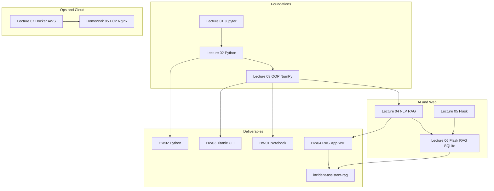

# Repository Architecture

This document explains how [`amdocs-ai-course`](../) is organized and why. The layout prioritizes **reviewability** for lecturers and **portfolio clarity** for employers.

## Design principles

1. **Progressive complexity** — lectures → homework → projects
2. **Runnable artifacts** — each major folder has a README with run instructions
3. **Separation of concerns** — course slides in `resources/`, code in `lectures/` and `homework/`, capstone in `projects/`
4. **Protected capstone** — `projects/incident-assistant-rag/` is maintained independently; root docs link to it without modifying it

## Top-level layout

```text
amdocs-ai-course/
├── README.md                 # Portfolio entry point
├── LICENSE                   # MIT (original code)
├── CONTRIBUTING.md           # Homework submission workflow
├── requirements.txt          # Course-wide Python dependencies
├── .env.example              # Placeholder env vars (no secrets)
├── docs/                     # Cross-cutting documentation (this folder)
├── resources/                # PDF slides + official handouts
├── lectures/                 # Per-lesson code and notes (01–07)
├── homework/                 # Assignments hw01–hw05
├── exercises/                # Index to runnable labs (no duplicate code)
├── projects/                 # Capstone (IncidentIQ)
└── .gitignore
```

## Learning flow



## Folder responsibilities

| Folder | Role | Mutability |
|--------|------|------------|
| `resources/` | Read-only course PDFs and DOCX/PPTX handouts | Add handouts; do not edit PDFs |
| `lectures/` | Lesson-aligned code; demos stay near slides | Extend per lesson |
| `homework/` | Graded assignments with evidence | One folder per HW |
| `exercises/` | Navigation index only | README links only |
| `docs/` | Portfolio and course meta-docs | Root-level docs only |
| `projects/incident-assistant-rag/` | Capstone — IncidentIQ | **Do not modify from root reorg** |

## Documentation map

| Question | Read |
|----------|------|
| What is this repo? | [`README.md`](../README.md), [`course-summary.md`](../docs/course-summary.md) |
| How do I run things? | [`docs/setup.md`](../docs/setup.md) |
| Docker / AWS labs? | [`docs/docker-aws-notes.md`](../docs/docker-aws-notes.md) |
| RAG progression? | [`docs/rag-notes.md`](../docs/rag-notes.md) |
| Before submit? | [`docs/submission-checklist.md`](../docs/submission-checklist.md) |
| Capstone architecture? | [`projects/incident-assistant-rag/docs/`](../projects/incident-assistant-rag/docs/) (in-project) |

## Screenshot locations

Root `docs/screenshots/` is an **index only**. Actual images stay with their assignments:

- HW05 EC2 lab: `homework/hw05/nginx-docker-lab/screenshots/`
- Capstone UI/API: `projects/incident-assistant-rag/screenshots/` (in-project)

## Why conservative naming

Lecture folders use names like `04_nlp_rag` instead of `lecture-04` to preserve existing imports, Docker paths, and README links. Renaming would add risk without improving discoverability — the root README and this file provide the map.

## Author

Reem Mor — [github.com/reem-mor](https://github.com/reem-mor)
