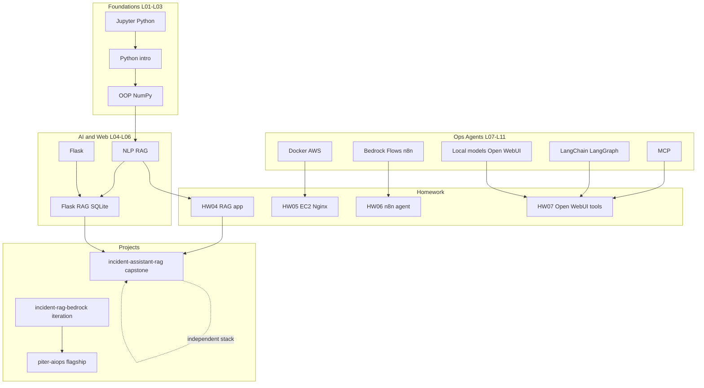

# Repository Architecture

How [`amdocs-ai-course`](../../) is organized and why. The layout prioritizes **reviewability**
for lecturers and **portfolio clarity** for employers (2026).

## Design principles

1. **Progressive complexity** — lectures → homework → projects
2. **Runnable artifacts** — each major folder has a README with run instructions
3. **Separation of concerns** — third-party IP in [`resources/MANIFEST.md`](../../resources/MANIFEST.md) only; code in `lectures/` and `homework/`; portfolio work in `projects/`
4. **Honest framing** — flagships extract to own repos; this archive links out (see [`docs/extraction/`](../extraction/))
5. **Generated output stays untracked** — SPA bundles, `catboost_info/`, local indexes

## Top-level layout

```text
amdocs-ai-course/
├── README.md                 # Portfolio entry point
├── AGENTS.md / CLAUDE.md     # Cross-tool agent guidance
├── LICENSE                   # MIT (own code) + IP carve-out for course material
├── CONTRIBUTING.md           # Homework submission workflow
├── requirements.txt          # Course-wide Python deps (UTF-8)
├── .mcp.json                 # Project MCP servers (env-interpolated secrets)
├── scripts/                  # Maintenance (project extraction)
├── docs/                     # Meta-docs, audit, extraction runbooks
├── resources/MANIFEST.md     # Course slides/handouts (not in repo — Drive only)
├── lectures/                 # Lessons 01–11
├── homework/                 # Assignments hw01–hw07
├── exercises/                # Lab index (links into lectures/homework)
├── oz_veruach_bot/           # Standalone product (extraction-ready)
└── projects/                 # Capstone + iterations + flagship copy
    ├── incident-assistant-rag/   # Featured capstone
    ├── incident-rag-bedrock/     # Learning iteration
    └── piter-aiops/              # Flagship copy (extraction-ready)
```

## Learning flow



## Folder responsibilities

| Folder | Role | Notes |
|--------|------|-------|
| `resources/` | IP-safe manifest | PDFs/DOCX **not** committed — see MANIFEST |
| `lectures/` | Lesson code + notes | 01–11; demos colocated with lessons |
| `homework/` | Graded work + evidence | hw01–hw07; screenshots per assignment |
| `exercises/` | Navigation index | No duplicate code |
| `docs/` | Cross-cutting docs | Includes [`extraction/`](../extraction/) |
| `projects/` | End-to-end systems | See [`projects/README.md`](../../projects/README.md) |
| `oz_veruach_bot/` | Standalone Telegram bot | Extract when ready — [`EXTRACTION.md`](../../oz_veruach_bot/EXTRACTION.md) |

## Extraction status

| Path | Verdict | External repo |
|------|---------|---------------|
| `projects/piter-aiops/` | Extract when ready | `reem-mor/piter-aiops` *(not created yet)* |
| `oz_veruach_bot/` | Extract when ready | `reem-mor/oz-veruach-bot` *(not created yet)* |
| HINDSIGHT | Already external | [`reem-mor/hindsight`](https://github.com/reem-mor/hindsight) |

Runbooks: [`docs/extraction/README.md`](../extraction/README.md).

## Documentation map

| Question | Read |
|----------|------|
| What is this repo? | [`README.md`](../../README.md), [`course-summary.md`](../course-summary.md) |
| How do I run things? | [`setup.md`](../setup.md) |
| Screenshot index | [`screenshots/README.md`](../screenshots/README.md) |
| RAG progression | [`rag-notes.md`](../rag-notes.md) |
| Security / history | [`SECURITY_REMEDIATION.md`](../SECURITY_REMEDIATION.md) |
| Capstone architecture | [`projects/incident-assistant-rag/docs/`](../../projects/incident-assistant-rag/docs/) |

## Author

Re'em Mor — [github.com/reem-mor](https://github.com/reem-mor)
