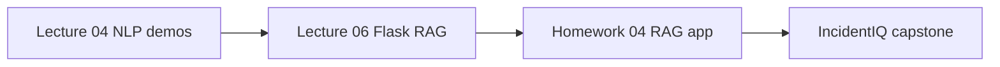

# RAG Notes

How Retrieval-Augmented Generation appears across this course, from first demos to the capstone.

## Learning progression

## Stage 1 — NLP and vector search (Lecture 04)

**Folder:** [`lectures/04_nlp_rag/`](../lectures/04_nlp_rag/)

- Tokenization, Word2Vec, semantic similarity
- FAISS indexing demos
- Sample RAG script: `demos/rag_example.py`
- Exercises: `exercises/exercise_01_tokenization.py`, `exercise_02_word_vectors.py`

## Stage 2 — Flask RAG web app (Lecture 06)

**Folder:** [`lectures/06_flask_advanced_rag/`](../lectures/06_flask_advanced_rag/)

- SQLite conversation history
- `rag_engine.py` — retrieval + generation
- Browser UI with async loading states
- Uses sample doc: `data/risk_analysis_report.txt`

## Stage 3 — Homework 04 (full RAG application)

**Folder:** [`homework/hw04/`](../homework/hw04/)

**Handout:** [`resources/handouts/rag-application-homework-guidelines.docx`](../resources/handouts/rag-application-homework-guidelines.docx)

Requirements summary:

1. Choose a meaningful topic
2. Build a knowledge base with FAISS
3. Implement RAG pipeline with LLM integration
4. Deliver a working web interface
5. Validate with test questions and edge cases

**Status:** Dockerfile starter present; application code in progress.

## Stage 4 — Capstone (IncidentIQ)

**Folder:** [`projects/incident-assistant-rag/`](../projects/incident-assistant-rag/)

Production-minded full-stack RAG for incident operations:

- FastAPI + React + FAISS + OpenAI
- Grounded answers, no-context refusal, source transparency
- 90 pytest tests, evaluation harness, Docker Compose

All capstone documentation lives inside that project folder — see its README and `docs/` subfolder.

## Core RAG concepts (course-wide)

| Concept | Typical implementation here |
|---------|----------------------------|
| Chunking | ~700 chars, sentence-aware overlap |
| Embeddings | OpenAI `text-embedding-3-small` or lecture-specific models |
| Vector store | FAISS `IndexFlatIP` with normalized vectors |
| Retrieval | Top-k search + score threshold |
| Grounding | Strict prompt: answer only from context |
| Safety | Refuse when no relevant chunks; show sources |

## Handouts

| Document | Topic |
|----------|-------|
| [`rag-application-homework-guidelines.docx`](../resources/handouts/rag-application-homework-guidelines.docx) | HW04 full RAG app |
| [`mid-course-project-guidelines.docx`](../resources/handouts/mid-course-project-guidelines.docx) | Mid-course project scope |
| [`bedrock-kb-flask-project-guideline.docx`](../resources/handouts/bedrock-kb-flask-project-guideline.docx) | Bedrock KB + Flask track |
