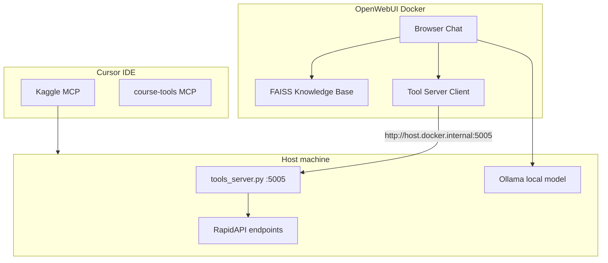

# HW07 — Open WebUI Knowledge Base + Live Tools Server

**Date:** 2026-06-28  
**Status:** Approved for implementation

## Summary

Homework for the Local Models + MCP lecture: index a Kaggle Netflix CSV in Open WebUI (FAISS KB), expose live RapidAPI lookups via a FastAPI OpenAPI server on port 5005, and register that server as Open WebUI tools. Cursor development uses Kaggle MCP + lecture 08 course-tools MCP.

## Architecture

## Deliverables

| # | Deliverable | Implementation |
|---|-------------|----------------|
| 1 | Knowledge Base | Upload `netflix_titles.csv` to Open WebUI; FAISS indexing |
| 2 | Tool server | `homework/hw07/open-webui-tools/tools_server.py` on `:5005` |
| 3 | WebUI tools | Register `http://host.docker.internal:5005` in Settings → Tools |

## Tool server endpoints

| Endpoint | Purpose |
|----------|---------|
| `GET /health` | Smoke check |
| `POST /tools/search_title` | IMDb-style title lookup via RapidAPI |
| `POST /tools/country_info` | Country facts (maps to Netflix `country` column) |
| `POST /tools/streaming_status` | Streaming availability by title + ISO country code |

External calls are isolated in `rapidapi_client.py` with a fakeable `RapidApiClient` seam for deterministic pytest.

## MCP configuration

Added to `.mcp.json` and `.cursor/mcp.json`:

- **kaggle** — HTTP `https://www.kaggle.com/mcp`, auth via `KAGGLE_API_TOKEN`
- **course-tools** — stdio FastMCP from `lectures/08_mcp/server/tools_server.py`

Secrets use `${env:...}` interpolation only.

## Testing strategy

- **Unit/integration:** pytest with mocked RapidAPI (`TestClient`, `httpx.MockTransport`)
- **CI:** matrix entry `hw07-open-webui-tools` in `.github/workflows/ci.yml`
- **Manual E2E:** Open WebUI KB + tool screenshots documented in `SUBMISSION.md` and `OPEN-WEBUI.md`

## Environment variables

| Variable | Purpose |
|----------|---------|
| `KAGGLE_API_TOKEN` | Kaggle MCP / CLI dataset download |
| `RAPIDAPI_KEY` | Live tool server API calls |
| `RAPIDAPI_OMDB_HOST` | Optional RapidAPI host override |
| `RAPIDAPI_COUNTRIES_HOST` | Optional RapidAPI host override |
| `RAPIDAPI_STREAMING_HOST` | Optional RapidAPI host override |

## Distinction from Lecture 08

Lecture 08 implements **stdio MCP** for Cursor. HW07 implements **HTTP OpenAPI** for Open WebUI. Same conceptual tool-calling pattern, different transport.

## References

- [`homework/hw07/README.md`](../../homework/hw07/README.md)
- [`lectures/11_local_models_webui/README.md`](../../lectures/11_local_models_webui/README.md)
- [Open WebUI tool servers](https://docs.openwebui.com/features/extensibility/plugin/tools/openapi-servers/)
- [Kaggle MCP docs](https://www.kaggle.com/docs/mcp)
