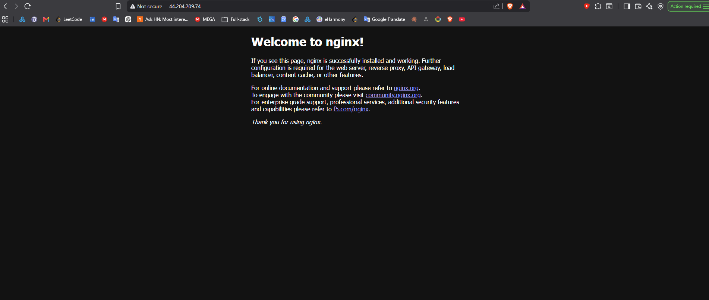

# Nginx Docker Lab (AWS EC2)

Hands-on lab: launch an Ubuntu EC2 instance, install Docker, run the official Nginx container, validate it in a browser, then clean up.

## Overview

This folder holds submission evidence for the **Ubuntu EC2, Docker Installation, and Nginx Container** lab. It contains numbered screenshots that document each step from instance launch through termination.

## What this demonstrates

- Provisioning and configuring an EC2 instance (security group, SSH access)
- Installing and verifying Docker on Ubuntu
- Running the Nginx container with port mapping (`-p 80:80`)
- Confirming the Nginx welcome page over the instance public IP
- Stopping/removing the container and terminating the instance to control cost

## Prerequisites

- AWS account with permission to create EC2 instances
- EC2 key pair (`.pem`) stored locally — **never commit this file**
- Security group allowing SSH (port 22) and HTTP (port 80)
- SSH client (OpenSSH, PuTTY, or Windows Terminal)

## Lab workflow

| Step | Action |
|------|--------|
| 1 | Launch EC2 (Ubuntu), configure security group |
| 2 | SSH into the instance |
| 3 | Install Docker and verify (`docker --version`, hello-world) |
| 4 | Run Nginx: `docker run -d -p 80:80 nginx` |
| 5 | Confirm container is running: `docker ps` |
| 6 | Open `http://<public-ip>` in a browser |
| 7 | Stop/remove container (`docker stop`, `docker rm`) |
| 8 | Terminate the EC2 instance in the AWS console |

## Repository layout

```
nginx-docker-lab/
├── README.md           ← this file
├── SUBMISSION.md       ← email checklist
└── screenshots/        ← numbered evidence (01–08)
```

## Screenshots

| File | Step | What it proves |
|------|------|----------------|
| [`01-ec2-instance-and-security-group.png`](screenshots/01-ec2-instance-and-security-group.png) | 1 | EC2 instance running; security group allows SSH and HTTP |
| [`02-ssh-connection-to-ec2.png`](screenshots/02-ssh-connection-to-ec2.png) | 2 | Successful SSH session to the instance |
| [`03-docker-installed-and-tested.png`](screenshots/03-docker-installed-and-tested.png) | 3 | Docker installed and basic verification |
| [`04-docker-run-nginx-container.png`](screenshots/04-docker-run-nginx-container.png) | 4 | `docker run` for Nginx with port 80 published |
| [`05-nginx-container-docker-ps.png`](screenshots/05-nginx-container-docker-ps.png) | 5 | `docker ps` shows the Nginx container running |
| [`06-nginx-welcome-page-browser.png`](screenshots/06-nginx-welcome-page-browser.png) | 6 | Nginx welcome page in the browser |
| [`07-docker-run-and-cleanup.jpg`](screenshots/07-docker-run-and-cleanup.jpg) | 7 | Container stop/remove and cleanup commands |
| [`08-ec2-instance-terminating.png`](screenshots/08-ec2-instance-terminating.png) | 8 | EC2 instance termination in AWS console |

### Preview




## Submission

See [`SUBMISSION.md`](SUBMISSION.md) for the full checklist. In short:

1. Attach all screenshots from `screenshots/` (or reference this repo).
2. Paste the GitHub repository link in the email body.
3. Use a clear subject line that includes the lab name and your name.

Example subject: `Nginx Docker Lab — <Your Name>`

## Security and cost

- **Do not** upload `.pem` key files or AWS secrets to GitHub.
- **Terminate** the EC2 instance when the lab is complete to avoid ongoing charges.

## Related material

- Lecture notes: [`lectures/07_docker_aws/README.md`](../../lectures/07_docker_aws/README.md)
- Slides: [`resources/lecture06_docker_aws.pdf`](../../resources/lecture06_docker_aws.pdf)
