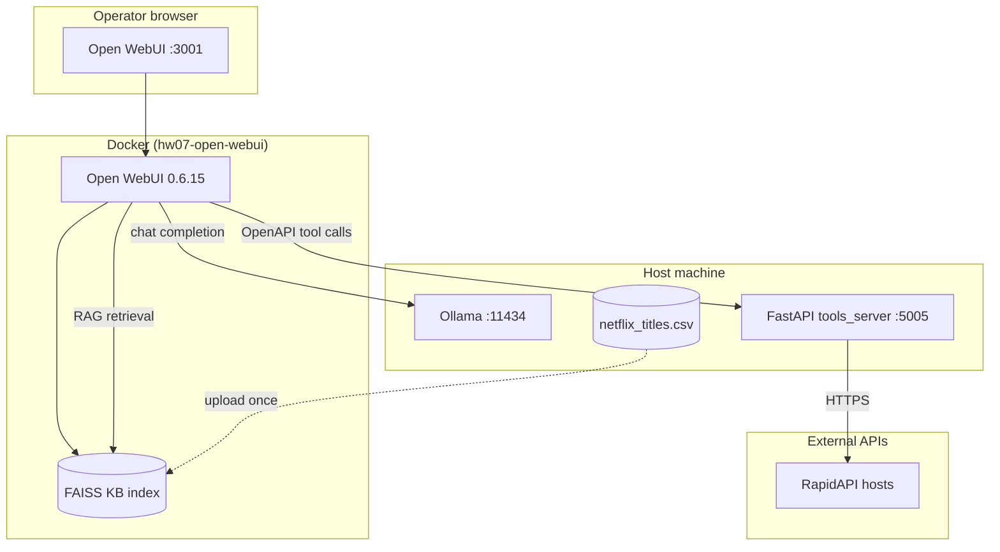

# HW07 — System Architecture & Design

Homework 07 implements a **local-first AI assistant** that combines static dataset knowledge (Kaggle CSV) with live external APIs (RapidAPI). The design mirrors production patterns used by AI engineers running **Open WebUI + Ollama** on a workstation, not a cloud-hosted chat product.

## Local vs cloud decision

| Layer | Deployment | Rationale |
|-------|------------|-----------|
| **LLM inference** | **Local** — Ollama on host (`:11434`) | Privacy, offline use, no token billing; aligns with Lecture 11 |
| **Chat UI + KB index** | **Local** — Open WebUI Docker (`:3001`) | FAISS indexing and chat history stay on disk; reproducible homework stack |
| **Tool server** | **Local** — FastAPI on host (`:5005`) | Open WebUI discovers tools via OpenAPI; host binding lets Docker reach `host.docker.internal` |
| **RapidAPI** | **Cloud** — outbound HTTPS only | “Live” lookups (country facts, title metadata, streaming) require external data the CSV cannot provide |

**Verdict:** This homework is intentionally **local models + local orchestration + cloud APIs for live enrichment**. Do not deploy Open WebUI or the tool server to a public VPS without authentication, TLS, and origin restrictions.

## High-level architecture



## Request flows

### Flow A — Knowledge Base question

1. User attaches `#netflix-shows` in chat.
2. Open WebUI embeds the query and retrieves chunks from the FAISS index built from `data/netflix_titles.csv`.
3. Ollama generates an answer grounded in retrieved rows (e.g. TV Show vs Movie counts).
4. No call to `tools_server` or RapidAPI.

### Flow B — Live tool question

1. User enables tools in chat (Admin → Tools registers `http://host.docker.internal:5005`).
2. Model selects an OpenAPI operation (`country_info`, `search_title`, `streaming_status`).
3. Open WebUI backend POSTs to `/tools/*` on the host tool server.
4. `tools_server` calls RapidAPI (or mock fixtures when `HW07_MOCK_RAPIDAPI=1`).
5. Structured `ToolResponse` JSON returns to the model for the final answer.

### Flow C — Combined (recommended demo)

1. Attach KB **and** enable tools.
2. Ask: *Compare Netflix titles listed for Japan in our dataset with live country info for Japan.*
3. Expect KB retrieval for CSV facts + `country_info` tool call for capital/region/population.

## Component responsibilities

| Component | Path | Responsibility |
|-----------|------|----------------|
| Dataset | `data/netflix_titles.csv` | Static Netflix catalogue for KB indexing |
| Tool server | `open-webui-tools/tools_server.py` | OpenAPI surface, CORS, health, structured errors |
| RapidAPI client | `open-webui-tools/rapidapi_client.py` | HTTP seam, mock/live switch, response normalization |
| Compose stack | `docker-compose.yml` | Pin Open WebUI, wire Ollama, disable auth for E2E |
| Orchestration | `scripts/start-stack.{ps1,sh}` | Preflight, Docker up, background uvicorn |
| E2E evidence | `e2e/` | Playwright captures submission screenshots 01–06 |
| Tests | `open-webui-tools/tests/` | pytest — contract, mock mode, error paths |

## Tool server design

### OpenAPI contract

Open WebUI ingests `/openapi.json` and exposes `operationId` values as chat tools:

- `search_title` — IMDb-style autocomplete (Netflix title enrichment)
- `country_info` — normalized `{name, capital, region, population}`
- `streaming_status` — live availability by ISO country code

All tool routes return HTTP **200** with:

```json
{ "ok": true|false, "source": "mock|rapidapi", "data": {}, "error": null|string }
```

This keeps Open WebUI from treating upstream API failures as transport errors.

### Configuration

| Variable | Purpose |
|----------|---------|
| `RAPIDAPI_KEY` | Live RapidAPI authentication |
| `HW07_MOCK_RAPIDAPI=1` | Deterministic fixtures for E2E/screenshots |
| `RAPIDAPI_*_HOST` | Override marketplace hosts if defaults change |

### Observability

- `GET /health` — `status`, `mock_mode`, `rapidapi_configured`, `tools_ready`
- Structured logs: `tool=<name> ok=<bool> source=<mock|rapidapi> latency_ms=<float>`

## Security posture (local homework)

- Open WebUI: `WEBUI_AUTH=false` only for automated E2E; use auth on `:3000` personal installs.
- Tool server binds `0.0.0.0:5005` so Docker can reach the host — acceptable on an isolated dev machine.
- CORS restricted to localhost Open WebUI origins; credentials disabled.
- Never commit `.env`, RapidAPI keys, or Open WebUI sqlite volumes.

## Testing strategy

| Layer | Command | What it proves |
|-------|---------|----------------|
| Unit/integration | `python -m pytest open-webui-tools/tests` | OpenAPI contract, mock mode, error shaping, normalization |
| Stack smoke | `curl localhost:5005/health` | Process up, config flags |
| E2E | `npx playwright test` (stack running) | KB upload, tool registration, screenshot evidence |

CI runs **pytest only** (`.github/workflows/ci.yml` → `hw07-open-webui-tools`). Playwright is manual/local because it requires Docker + Ollama + GPU-friendly model pull.

## Related course material

- [`lectures/11_local_models_webui/`](../../lectures/11_local_models_webui/) — Ollama, Open WebUI, KB vs MCP
- [`lectures/08_mcp/`](../../lectures/08_mcp/) — stdio MCP for Cursor (different transport from HTTP OpenAPI tools)
