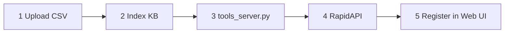

# Homework 07 — Open WebUI KB + Live Tools (Interactive Guide)

> **GitHub path:** https://github.com/reem-mor/amdocs-ai-course/tree/main/homework/hw07  
> **Architecture deep-dive:** [`ARCHITECTURE.md`](ARCHITECTURE.md) · **Submit:** [`SUBMISSION.md`](SUBMISSION.md)

Build a **local AI assistant** (Open WebUI + Ollama) that answers from a **Kaggle CSV Knowledge Base** and calls **live RapidAPI tools** through your own Python server.

---

## The 5 homework steps



| Step | What you do | Python required? |
|------|-------------|------------------|
| **1** | Download Kaggle CSV → upload in Open WebUI | No |
| **2** | Let Open WebUI index the file (FAISS) | No |
| **3** | Run `tools_server.py` on `:5005` | Yes |
| **4** | Call RapidAPI from that server | Yes |
| **5** | Register tool server URL in Open WebUI | No (UI config) |

---

## Pre-flight checklist

- [ ] [Ollama](https://ollama.com/) installed → `ollama pull llama3.2:3b`
- [ ] Docker running
- [ ] Node.js 18+ (Playwright screenshots)
- [ ] `homework/hw07/data/netflix_titles.csv` present
- [ ] Optional: [RapidAPI](https://rapidapi.com/) key for live calls

---

## Quick start (one command stack)

**Linux / macOS**

```bash
cd homework/hw07/scripts
./start-stack.sh --mock-rapidapi    # deterministic tools for screenshots
```

**Windows**

```powershell
cd homework\hw07\scripts
.\start-stack.ps1 -MockRapidApi
```

| Service | URL |
|---------|-----|
| Open WebUI | http://localhost:3001 |
| Tool server | http://localhost:5005/docs |
| Tool URL (from Docker) | `http://host.docker.internal:5005` |
| Ollama | http://localhost:11434 |

---

## Step-by-step walkthrough

### Step 1 — Upload dataset

1. Open http://localhost:3001 → **Workspace → Knowledge → Create**
2. Name: `netflix-shows`
3. Upload [`data/netflix_titles.csv`](data/netflix_titles.csv) ([Kaggle source](https://www.kaggle.com/datasets/shivamb/netflix-shows))

**Screenshot:** `screenshots/01-kb-collection-created.png`, `02-kb-csv-uploaded.png`

### Step 2 — Index Knowledge Base

Wait until the file shows indexed / ready (FAISS embeddings complete).

**Screenshot:** `screenshots/03-kb-indexed.png`

**Verify in chat:** attach `#netflix-shows` and ask:

> How many rows are type TV Show vs Movie?

Expected grounded answer: **2676** TV Show, **6131** Movie (8807 rows).

**Screenshot:** `screenshots/04-kb-chat-answer.png` — must show **complete text**, not grey skeleton bars.

### Step 3 — Local tool server

```bash
cd homework/hw07/open-webui-tools
cp .env.example .env
# Optional: RAPIDAPI_KEY=... for live API
python -m uvicorn tools_server:app --host 0.0.0.0 --port 5005
```

**Endpoints**

| Tool | Purpose |
|------|---------|
| `GET /health` | Stack health + config flags |
| `POST /tools/country_info` | Live country facts |
| `POST /tools/search_title` | IMDb-style title lookup |
| `POST /tools/streaming_status` | Streaming availability |

All tools return `{ ok, source, data, error }` with HTTP 200.

### Step 4 — RapidAPI integration

Set in `.env`:

```env
RAPIDAPI_KEY=your_key_here
HW07_MOCK_RAPIDAPI=0
```

Smoke test:

```bash
curl -X POST http://localhost:5005/tools/country_info \
  -H "Content-Type: application/json" \
  -d '{"country_name":"Brazil"}'
```

Mock mode (no key, for E2E):

```bash
export HW07_MOCK_RAPIDAPI=1
```

### Step 5 — Connect tool to Open WebUI

1. **Admin → Settings → Tools → Manage Tool Servers**
2. Add URL: `http://host.docker.internal:5005`
3. Save → Open WebUI discovers OpenAPI tools automatically
4. In chat: enable **Tools**, ask *"What is the capital of Brazil?"*

**Screenshots:** `05-tool-server-configured.png`, `06-tool-chat-answer.png`

---

## Combined demo (best grade)

Attach `#netflix-shows` **and** enable tools:

> Compare Netflix titles listed for Japan in our dataset with live country info for Japan.

Expect: KB retrieval + `country_info` tool call.

---

## Validate before submit

```bash
homework/hw07/scripts/validate-submission.sh
```

```bash
cd homework/hw07/open-webui-tools && python -m pytest tests -q   # 24 passed
```

### Regenerate all screenshots (Playwright)

```bash
# Clean volume (avoids duplicate tool servers in screenshot 05)
docker compose -f homework/hw07/docker-compose.yml down -v

homework/hw07/scripts/start-stack.sh --mock-rapidapi
cd homework/hw07/e2e
npm install && npx playwright install chromium
npx playwright test submission-screenshots.spec.ts
npx playwright test tool-server-openapi.spec.ts   # optional OpenAPI evidence
```

---

## Repository layout

```text
hw07/
├── README.md                 ← this guide
├── ARCHITECTURE.md           ← system design
├── SUBMISSION.md             ← email + GitHub checklist
├── OPEN-WEBUI.md             ← manual UI runbook
├── docker-compose.yml
├── data/netflix_titles.csv
├── open-webui-tools/         ← FastAPI + pytest
├── e2e/                      ← Playwright
├── scripts/                  ← start/stop/validate
└── screenshots/              ← 01–06 submission evidence
```

---

## Troubleshooting

| Symptom | Fix |
|---------|-----|
| Tool connection refused from Docker | Use `host.docker.internal:5005`, bind uvicorn to `0.0.0.0` |
| KB answer hallucinated | Attach `#netflix-shows`; confirm indexing finished |
| Screenshot shows skeleton bars | Re-run Playwright; model still streaming — wait for full reply |
| Duplicate tool servers in screenshot 05 | `docker compose down -v` then restart stack |
| `RAPIDAPI_KEY` errors | Set key in `.env` or use `HW07_MOCK_RAPIDAPI=1` |
| Model not found | `ollama pull llama3.2:3b` |

---

## Why local (not cloud)?

| Layer | Deployment |
|-------|------------|
| LLM + UI + KB | **Local** (Ollama + Docker Open WebUI) |
| Tool server | **Local** (FastAPI on host) |
| Live enrichment | **Cloud** (RapidAPI HTTPS outbound only) |

See [`ARCHITECTURE.md`](ARCHITECTURE.md) for diagrams and security notes.

---

## E2E development (build backwards)

Best practice: test from **external API → local server → Web UI**, not all at once.

| Step | What to test | How in this repo |
|------|--------------|------------------|
| **1. External API** | RapidAPI returns expected data | `curl` / mock via `HW07_MOCK_RAPIDAPI=1` |
| **2. Local server** | `tools_server.py` endpoints work | `curl localhost:5005/tools/*`, `/docs` |
| **3. Logging** | See requests in terminal | Structured logs in `tools_server.py` |
| **4. Full Web UI E2E** | KB vs tool routing in chat | Playwright `submission-screenshots.spec.ts` |

**One-command backward smoke:**

```bash
homework/hw07/scripts/e2e-smoke.sh
```

**Playwright API-layer E2E (no Docker required):**

```bash
cd homework/hw07/e2e
npx playwright test e2e-pipeline.spec.ts tool-server-openapi.spec.ts
```

**Full UI E2E + screenshots 01–06 (Docker + Ollama required):**

```bash
homework/hw07/scripts/start-stack.sh --mock-rapidapi
cd homework/hw07/e2e
npx playwright test submission-screenshots.spec.ts
```

Watch tool server logs during Step 4 — you should see `tool=country_info ok=true` when the Web UI invokes a tool.

---

## Related

- Lecture 11: [`lectures/11_local_models_webui/`](../../lectures/11_local_models_webui/)
- MCP contrast: [`lectures/08_mcp/`](../../lectures/08_mcp/)
- Agent skill: [`.cursor/skills/hw07-open-webui/SKILL.md`](../../.cursor/skills/hw07-open-webui/SKILL.md)
- CI: `hw07-open-webui-tools` in [`.github/workflows/ci.yml`](../../.github/workflows/ci.yml)
