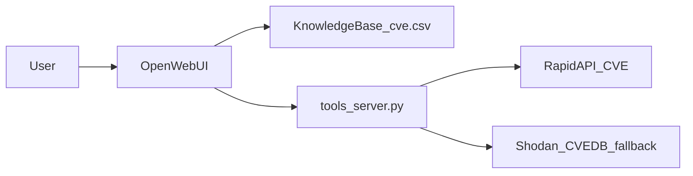

# HW07 — CVE Intelligence Assistant

Self-hosted Open WebUI assistant that answers **historical** CVE questions from a Kaggle/NVD knowledge base and **live** CVE-risk questions via a local FastAPI tool server (RapidAPI primary, Shodan CVEDB fallback).

## Architecture



| Path | Use when |
|------|----------|
| **Knowledge Base** | Questions about the uploaded CSV — trends, CVSS in dataset, "in my data" |
| **`lookup_cve` tool** | Live EPSS, KEV, current CVSS for a specific CVE ID |
| **`search_cves` tool** | Live keyword search by product/vendor (not bulk CSV analytics) |

## Prerequisites

- Docker Desktop
- Python 3.12 + repo `.venv`
- Secrets in **repo root** [`.env`](../../.env) (copy from [`.env.example`](../../.env.example))

| Variable | Required | Purpose |
|----------|----------|---------|
| `KAGGLE_API_TOKEN` | Dataset download | Kaggle CVE CSV (preferred source) |
| `OWUI_EMAIL` / `OWUI_PASSWORD` | Bootstrap, screenshots | Open WebUI JWT auth |
| `OWUI_API_KEY` | KB upload (optional) | Alternative to JWT |
| `RAPIDAPI_KEY` + `RAPIDAPI_CVE_HOST` | Optional | Live CVE via RapidAPI; omit → CVEDB fallback |
| `OWUI_URL` | Optional | Default `http://localhost:3000` |
| `TOOLS_SERVER_PORT` | Optional | Default `5005` |
| `HW07_KB_ID` | Auto-written | KB id after bootstrap (non-secret) |

Optional local overrides only: [`homework/hw07/.env.example`](.env.example).

## Setup

```powershell
cd homework\hw07
pip install -r requirements.txt

# 1. Docker stack (hw07-ollama, hw07-open-webui, hw07-tool-server)
docker compose up -d --build
docker exec hw07-ollama ollama pull nomic-embed-text
docker exec hw07-ollama ollama pull llama3.1

# 2. Dataset — Kaggle preferred; NVD fallback documented below
python data\download_dataset.py          # uses KAGGLE_API_TOKEN from repo root .env
python data\validate_dataset.py          # requires: cve_id, description, cvss, published, keyword

# If Kaggle fails:
python data\fetch_nvd_csv.py             # NVD Apache-focused fallback → data/cve.csv

# 3. Knowledge base + tool registration + custom model
python owui_kb_setup.py --csv .\data\cve.csv --name "CVE Intelligence" `
  --description "Historical CVE / CVSS records for RAG"
python scripts\bootstrap_owui.py

# 4. Verify
python scripts\verify_env.py
python scripts\verify_tool_server.py
python scripts\run_demo_chats.py
```

## Dataset sources

| Source | Script | Notes |
|--------|--------|-------|
| **Preferred** | `data/download_dataset.py` | Kaggle `satyabrata/nvd-vulnerabilities`; `--force` to re-download |
| **Fallback** | `data/fetch_nvd_csv.py` | NVD API Apache Struts/Log4j/HTTP subset when Kaggle unavailable |

Required CSV columns: `cve_id`, `description`, `cvss`, `published`, `keyword`.

## Tool server

Endpoints on `http://localhost:5005`:

| Endpoint | Operation ID | Description |
|----------|--------------|-------------|
| `GET /health` | — | Liveness + upstream mode |
| `GET /cve/{cve_id}` | `lookup_cve` | Live CVE details |
| `GET /search?keyword=` | `search_cves` | Live keyword search |

Response `source` field: `rapidapi` or `cvedb_fallback`.

Register in Open WebUI: **Admin → External Tools →** `http://host.docker.internal:5005/openapi.json` (Docker OWUI) or `http://tool-server:5005/openapi.json` (compose network).

## Demo questions

| Type | Question |
|------|----------|
| KB | Which CVEs in my dataset affected Apache Struts, and their CVSS scores? |
| Tool | What is the current EPSS score and KEV status for CVE-2021-44228? |
| Search | Search live CVE records for apache struts. |
| Hybrid | From my dataset, what Apache CVEs exist? Then give live EPSS for CVE-2021-44228. |

## Tests and validation

```powershell
python -m pytest tests/ -q
python data\validate_dataset.py
python scripts\verify_tool_server.py
python scripts\run_demo_chats.py    # writes TEST_RESULTS.md
```

## Screenshots

Capture submission evidence:

```powershell
pip install playwright
playwright install chromium
python scripts\capture_screenshots.py
```

Output: [`screenshots/`](screenshots/) — see [`SUBMISSION.md`](SUBMISSION.md) for the checklist.

## Security

- Never commit `.env`, API keys, tokens, or `data/*.csv`.
- All secrets load from repo root `.env` first.
- Scripts never print secret values.

## Layout

| File | Purpose |
|------|---------|
| [`tools_server.py`](tools_server.py) | FastAPI live CVE tool server |
| [`owui_kb_setup.py`](owui_kb_setup.py) | Idempotent KB create + CSV upload |
| [`env_loader.py`](env_loader.py) | Root `.env` first, local overrides second |
| [`docker-compose.yml`](docker-compose.yml) | OWUI + Ollama + tool-server |
| [`prompts/system_prompt.md`](prompts/system_prompt.md) | Paste into model settings |
| [`TEST_RESULTS.md`](TEST_RESULTS.md) | Demo Q&A pass/fail (generated) |
