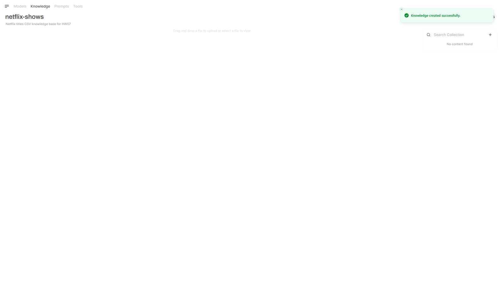
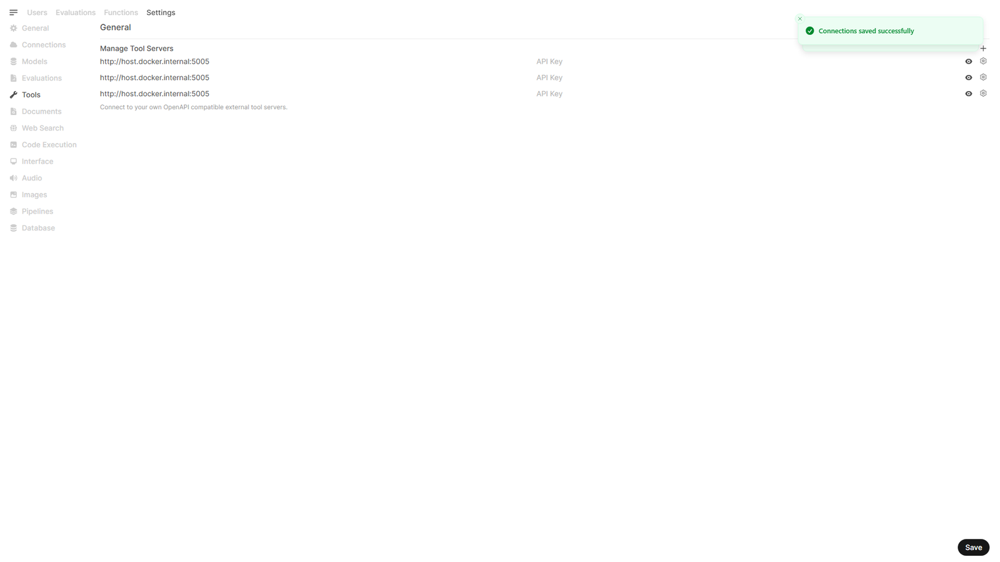

# Homework 07 — Open WebUI Knowledge Base + Live Tools Server

Connect a **local Open WebUI** assistant to two data sources:

1. **Knowledge Base** — Kaggle Netflix Shows CSV indexed in Open WebUI (FAISS).
2. **Live tools** — FastAPI OpenAPI server on port 5005 calling RapidAPI for real-time lookups.

Related course material:

- [`lectures/11_local_models_webui/`](../../lectures/11_local_models_webui/) — Ollama, Open WebUI, KB, MCP contrast
- [`lectures/08_mcp/`](../../lectures/08_mcp/) — stdio MCP for Cursor (different transport from this homework)

## Requirements checklist

| HW requirement | Evidence |
|----------------|----------|
| KB: upload Kaggle CSV, index in Open WebUI | [`screenshots/01`](screenshots/01-kb-collection-created.png)–[`03`](screenshots/03-kb-indexed.png) |
| Local Python server on `:5005` calling RapidAPI | [`open-webui-tools/tools_server.py`](open-webui-tools/tools_server.py), [`screenshots/05`](screenshots/05-tool-server-configured.png) |
| Register tool server in Open WebUI | [`screenshots/05`](screenshots/05-tool-server-configured.png) |
| KB + live tool chat demos | [`screenshots/04`](screenshots/04-kb-chat-answer.png), [`06`](screenshots/06-tool-chat-answer.png) |
| Automated tests | 13 pytest tests — see [`TEST-RESULTS.md`](TEST-RESULTS.md) |

## Repository layout

```text
hw07/
├── README.md, SUBMISSION.md, TEST-RESULTS.md, OPEN-WEBUI.md
├── docker-compose.yml          ← Open WebUI on :3001 (WEBUI_AUTH=false for E2E)
├── scripts/start-stack.ps1     ← orchestrates Docker + tool server
├── e2e/                        ← Playwright submission screenshots
├── data/netflix_titles.csv
├── open-webui-tools/           ← FastAPI tool server + pytest
└── screenshots/                ← submission evidence (01–06)
```

## Stack orchestration (recommended)

```powershell
cd homework\hw07\scripts
.\start-stack.ps1 -MockRapidApi   # optional: deterministic tool responses for E2E
cd ..\e2e
npm install
npx playwright install chromium
npx playwright test submission-screenshots.spec.ts
.\scripts\stop-stack.ps1
```

- **Open WebUI:** http://localhost:3001 (Docker, pinned `0.6.15`, auth disabled for automation)
- **Tool server:** http://localhost:5005 (host uvicorn)
- **Tool URL from Docker:** `http://host.docker.internal:5005`

Manual fallback: [`OPEN-WEBUI.md`](OPEN-WEBUI.md). For an existing Open WebUI on `:3000` with auth, set `OPEN_WEBUI_EMAIL` / `OPEN_WEBUI_PASSWORD` before running Playwright.

## Screenshots

| File | What it proves |
|------|----------------|
| [`01-kb-collection-created.png`](screenshots/01-kb-collection-created.png) | Knowledge collection created |
| [`02-kb-csv-uploaded.png`](screenshots/02-kb-csv-uploaded.png) | `netflix_titles.csv` uploaded |
| [`03-kb-indexed.png`](screenshots/03-kb-indexed.png) | File present / indexing complete |
| [`04-kb-chat-answer.png`](screenshots/04-kb-chat-answer.png) | KB-grounded chat (`#netflix-shows`) |
| [`05-tool-server-configured.png`](screenshots/05-tool-server-configured.png) | Tool server registered in Admin → Tools |
| [`06-tool-chat-answer.png`](screenshots/06-tool-chat-answer.png) | Live tool chat (`country_info`) |





## Prerequisites

- [Ollama](https://ollama.com/) with a chat model (e.g. `ollama pull llama3.2:3b`)
- Docker Desktop
- RapidAPI key for live calls (optional if using `HW07_MOCK_RAPIDAPI=1`)
- Node.js 18+ for Playwright E2E

## Quick start (manual)

### 1. Dataset

Expected file: [`data/netflix_titles.csv`](data/netflix_titles.csv) ([Kaggle source](https://www.kaggle.com/datasets/shivamb/netflix-shows)).

### 2. Tool server

```powershell
cd homework\hw07\open-webui-tools
copy .env.example .env
# Set RAPIDAPI_KEY for live API calls
uvicorn tools_server:app --host 0.0.0.0 --port 5005
```

Verify: http://localhost:5005/health and http://localhost:5005/docs

### 3. Open WebUI + KB + tools

See [`OPEN-WEBUI.md`](OPEN-WEBUI.md) or run `scripts/start-stack.ps1`.

## Demo prompts

**KB-only (attach `#netflix-shows`):**

- "How many rows are type TV Show vs Movie?"
- "Which country appears most often in the dataset?"

**Live tool:**

- "What is the capital of Brazil?" → `country_info`
- "Search live metadata for Squid Game" → `search_title`

## Tests

```powershell
cd homework\hw07\open-webui-tools
..\..\..\.venv\Scripts\python.exe -m pytest tests -q
```

CI matrix: `hw07-open-webui-tools` in [`.github/workflows/ci.yml`](../../.github/workflows/ci.yml).

## MCP (development workflow)

Repo MCP config includes **Kaggle** (dataset download) and **course-tools** (lecture 08 stdio server). See [`.mcp.json`](../../.mcp.json) and [`docs/setup.md`](../../docs/setup.md).
