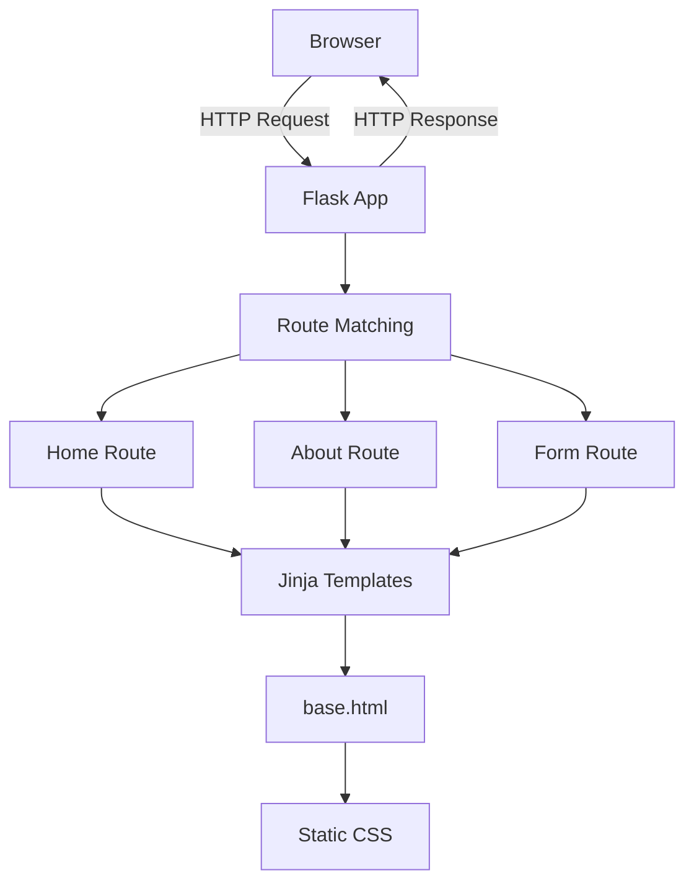

# Lecture 05 - Flask Web Development

**Slides:** [`resources/lecture04_flask_intro.pdf`](../../resources/MANIFEST.md)

---

## Overview

This lecture introduces Flask as a lightweight Python web framework for building APIs, simple web applications, and prototypes. The focus is on understanding the request-response cycle, route functions, URL variables, HTTP methods, HTML rendering, Jinja2 templates, and static assets.

The final result is a small multi-page Flask application with clean routing, reusable templates, and separated CSS.

---

## Topics Covered

- Flask as a Python microframework.
- WSGI, Werkzeug, and Jinja2.
- Creating a simple Flask application with `Flask(__name__)`.
- Route decorators with `@app.route()`.
- URL variables and slug values.
- HTTP methods: `GET` and `POST`.
- HTML forms and form submission.
- Rendering HTML with `render_template()`.
- Passing Python variables into HTML templates.
- Jinja2 syntax: variables, loops, blocks, and inheritance.
- Static files and CSS organization.

---

## Architecture



---

## Project Structure

```text
05_flask_intro/
├── app.py
├── requirements.txt
├── templates/
│   ├── base.html
│   ├── index.html
│   └── about.html
└── static/
    └── css/
        ├── main.css
        └── about.css
```

---

## Key Concepts

### Minimal Flask Application

```python
from flask import Flask

app = Flask(__name__)

@app.route("/")
def home():
    return "Hello World!"

if __name__ == "__main__":
    app.run(debug=True)
```

### Route with URL Variable

```python
@app.route("/hello/<name>")
def hello(name):
    return f"Hello {name}!"
```

### Rendering HTML Templates

```python
from flask import render_template

@app.route("/")
def home():
    return render_template("index.html")
```

Flask looks for HTML files inside the `templates/` directory.

### Template Inheritance

`base.html` defines the shared layout:

```html
<!doctype html>
<html lang="en">
<head>
  <title>Flask App</title>
  <link rel="stylesheet" href="{{ url_for('static', filename='css/main.css') }}">
  
</head>
<body>
  <nav>
    <a href="{{ url_for('home') }}">Home</a>
    <a href="{{ url_for('about') }}">About</a>
  </nav>
  <main>
    
  </main>
</body>
</html>
```

Child templates extend it:

```html

About

  <h1>About</h1>
  <p>This is the About page.</p>

```

---

## Jinja2 Quick Reference

| Syntax | Purpose |
|--------|---------|
| `{{ variable }}` | Print a variable |
| `` | Loop over a collection |
| `` | Conditional rendering |
| `` | Inherit from a parent template |
| `` | Define a replaceable section |
| `{{ url_for('home') }}` | Generate URLs by function name |
| `{{ url_for('static', filename='css/main.css') }}` | Link static files safely |

---

## HTTP Methods Example

```python
from flask import Flask, render_template, request, redirect, url_for

app = Flask(__name__)

@app.route("/login", methods=["GET", "POST"])
def login():
    if request.method == "POST":
        name = request.form.get("name", "Guest")
        return redirect(url_for("success", name=name))
    return render_template("login.html")

@app.route("/success/<name>")
def success(name):
    return render_template("success.html", name=name)
```

---

## Running the Demo

```bash
cd lectures/05_flask_intro
python -m venv .venv
```

Windows:

```powershell
.\.venv\Scripts\Activate.ps1
pip install -r requirements.txt
python app.py
```

macOS / Linux:

```bash
source .venv/bin/activate
pip install -r requirements.txt
python app.py
```

Open:

```text
http://127.0.0.1:5000/
```

---

## Exercises

### Exercise 1 - Add a Contact Page

Add a `/contact` route that renders `contact.html` and extends `base.html`.

### Exercise 2 - Add a Dynamic Greeting Route

Create a route:

```text
/greet/<name>
```

It should render a page saying:

```text
Hello, {name}! Welcome.
```

### Exercise 3 - Render a List with Jinja

Create a `/fruits` route that passes a Python list into a template and renders it with a Jinja loop.

### Exercise 4 - Add a Basic JSON Endpoint

Create:

```text
/api/info
```

Expected response:

```json
{
  "app": "Flask Demo",
  "version": "1.0",
  "routes": ["/", "/about", "/api/info"]
}
```

---

## Common Pitfalls

| Mistake | Fix |
|---------|-----|
| `TemplateNotFound` | Confirm the file is inside `templates/` and the filename matches exactly |
| CSS not loading | Put CSS under `static/` and reference it with `url_for('static', ...)` |
| `url_for()` error | Use the function name, not the URL path |
| Form data missing | Confirm the input has a `name` attribute and the form uses the correct method |
| Changes not visible | Hard refresh the browser or restart the Flask server |

---

## What This Lecture Demonstrates

- A clear Flask project structure.
- Dynamic routing.
- HTML rendering with Jinja2.
- Form handling basics.
- Static CSS separation.
- Reusable template architecture.
