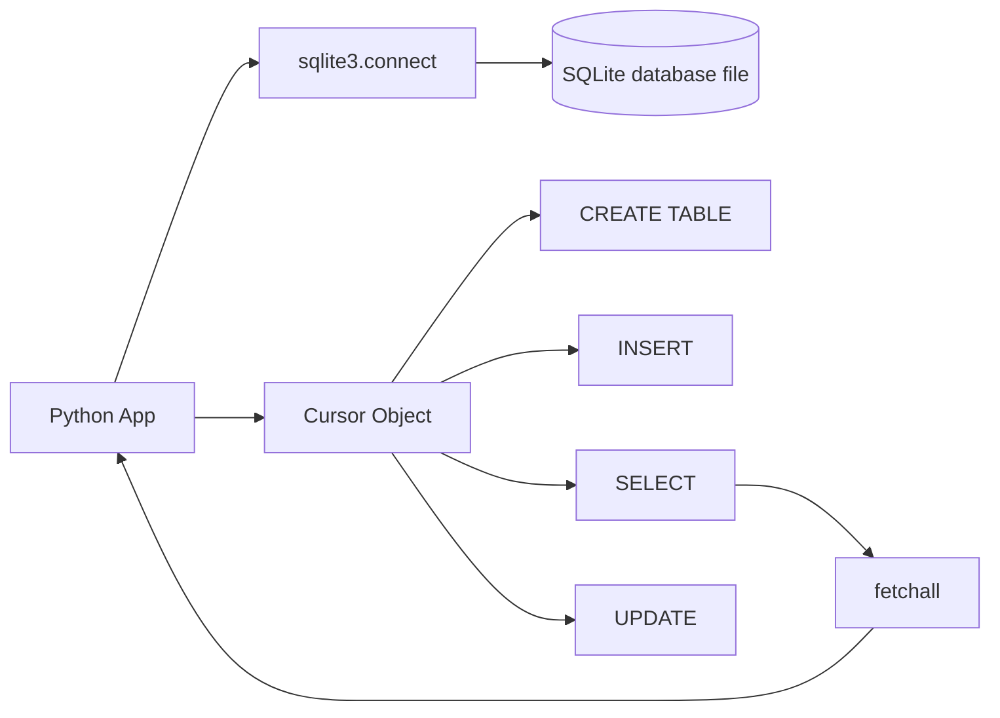
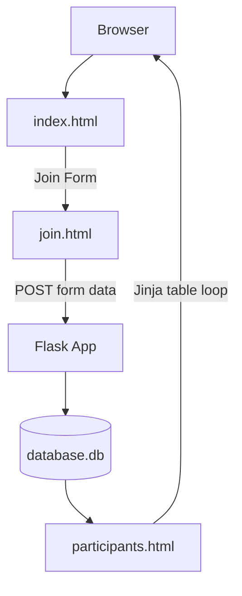
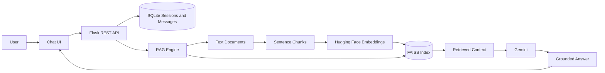

# Lecture 06 - SQLite, Advanced Flask, and RAG Web App

**Slides:** [`resources/lecture05_flask_advanced.pdf`](../../resources/lecture05_flask_advanced.pdf)

---

## Overview

This lecture connects database persistence, Flask web development, and Retrieval-Augmented Generation into one practical application flow.

The first part focuses on SQLite with Python and Flask. The second part applies these ideas to a RAG web app with persistent chat sessions, a REST API, FAISS retrieval, LLM generation, and a browser interface.

---

## Topics Covered

- SQLite as a lightweight embedded database.
- Connecting to SQLite with Python `sqlite3`.
- Creating tables with SQL.
- Inserting, selecting, updating, and fetching records.
- Parameterized SQL statements with `?` placeholders.
- Viewing SQLite data with DB Browser for SQLite.
- Flask integration with SQLite.
- Rendering database rows in HTML with Jinja loops.
- SQLAlchemy and Flask-Migrate concepts.
- REST API design with Flask and JSON responses.
- SQLite-backed conversation memory.
- Background RAG initialization.
- Hugging Face embeddings.
- FAISS vector search.
- Gemini response generation.
- Vanilla JavaScript frontend with async `fetch()` calls.

---

## SQLite Architecture



---

## Flask + SQLite Flow



---

## RAG Web App Architecture



---

## Project Structure

```text
06_flask_advanced_rag/
├── app.py                  # Flask routes and REST API
├── database.py             # SQLite session and message memory
├── rag_engine.py           # RAG loading, embedding, retrieval, generation
├── rag_example.py          # Original script kept for reference
├── requirements.txt
├── chat.db                 # Local generated SQLite database, gitignored in production
├── data/
│   └── Risk Analysis Report.txt
├── templates/
│   └── index.html
└── static/
    ├── css/
    │   └── style.css
    └── js/
        └── app.js
```

---

## SQLite Key Concepts

### Create a Connection

```python
import sqlite3

conn = sqlite3.connect("database.db")
cursor = conn.cursor()
```

If the database file does not exist, SQLite creates it automatically.

### Create a Table

```python
cursor.execute(
    """
    CREATE TABLE IF NOT EXISTS participants (
        name TEXT,
        email TEXT,
        city TEXT,
        country TEXT,
        phone TEXT
    )
    """
)
conn.commit()
```

### Insert Data Safely

Use placeholders instead of string formatting:

```python
cursor.execute(
    "INSERT INTO participants VALUES (?, ?, ?, ?, ?)",
    (name, email, city, country, phone),
)
conn.commit()
```

### Fetch Data

```python
cursor.execute("SELECT * FROM participants")
rows = cursor.fetchall()
```

---

## REST API Surface

| Method | Path | Purpose |
|--------|------|---------|
| `GET` | `/api/status` | Check if the RAG engine is ready |
| `GET` | `/api/sessions` | List chat sessions |
| `POST` | `/api/sessions` | Create a new chat session |
| `GET` | `/api/sessions/<session_id>` | Load a session with messages |
| `PATCH` | `/api/sessions/<session_id>` | Rename a session |
| `DELETE` | `/api/sessions/<session_id>` | Delete a session |
| `POST` | `/api/sessions/<session_id>/messages` | Send a question and receive an answer |

---

## Conversation Memory

The RAG app stores chat history in SQLite.

```text
sessions
├── id
├── title
├── created_at
└── updated_at

messages
├── id
├── session_id
├── role
├── content
├── context_json
└── created_at
```

This allows the application to preserve conversations across restarts and use recent messages as context for follow-up questions.

---

## Background Initialization Pattern

Embedding documents can take time. To avoid blocking the first page load, the app initializes the RAG engine in a background thread.

```python
def _start_background_init():
    database.init_db()
    thread = threading.Thread(
        target=_initialise_engine_background,
        daemon=True,
        name="rag-init",
    )
    thread.start()
```

The frontend polls:

```text
GET /api/status
```

When the engine is ready, the input box is enabled.

---

## Running the App

```bash
cd lectures/06_flask_advanced_rag
python -m venv .venv
```

Windows:

```powershell
.\.venv\Scripts\Activate.ps1
pip install -r requirements.txt
python app.py
```

macOS / Linux:

```bash
source .venv/bin/activate
pip install -r requirements.txt
python app.py
```

Open:

```text
http://127.0.0.1:5000/
```

---

## Exercises

### Exercise 1 - Add Source Attribution

Display the retrieved source file and score for each answer in the frontend.

### Exercise 2 - Add a Dedicated Messages Endpoint

Create:

```text
GET /api/sessions/<session_id>/messages
```

It should return only the messages for that session.

### Exercise 3 - Add Rate Limiting

Limit each session to 20 messages and return:

```text
429 Too Many Requests
```

when the limit is exceeded.

### Exercise 4 - Add Document Upload

Create:

```text
POST /api/documents
```

It should accept a `.txt` file, save it into `data/`, and rebuild the RAG index.

### Exercise 5 - Improve Secret Management

Move API keys into environment variables and provide a `.env.example` file.

---

## Common Pitfalls

| Mistake | Fix |
|---------|-----|
| SQLite connection errors | Use one connection per thread or open connections inside functions |
| App freezes on startup | Move heavy RAG initialization into a background thread |
| FAISS index is empty | Confirm documents exist in `data/` and chunking produced text |
| API key committed accidentally | Rotate the key, remove it from git history if needed, and use `.env` |
| Frontend sends before engine is ready | Disable input until `/api/status` returns `ready: true` |
| Browser shows old CSS/JS | Hard refresh or disable cache in DevTools |

---

## What This Lecture Demonstrates

- SQLite persistence in Python.
- Flask form and database integration.
- REST API design.
- Persistent chat memory.
- RAG pipeline engineering.
- Background indexing and status polling.
- Practical full-stack AI prototype development.
