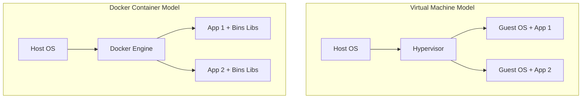
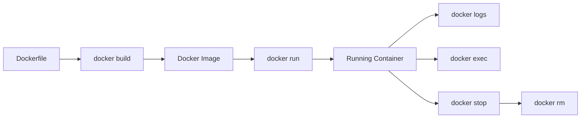
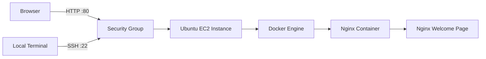

# Lecture 07 - Docker and AWS EC2 Deployment

**Slides:** [`resources/lecture06_docker_aws.pdf`](../../resources/MANIFEST.md)

---

## Overview

This lecture moves from local Python and Flask development into containerization and basic cloud deployment.

The goal is to understand why Docker solves environment problems, how images and containers work, how to build and run a containerized application, and how to validate a simple deployment on an Ubuntu EC2 instance using Docker and Nginx.

---

## Topics Covered

- Docker introduction and motivation.
- Virtual machines vs Docker containers.
- Docker images and containers.
- Docker volumes and networks.
- Dockerfile basics.
- Building custom images.
- Running and managing containers.
- Inspecting containers and logs.
- Removing containers and images safely.
- Running an Ubuntu bash container.
- Running an Nginx container.
- AWS EC2 instance setup.
- SSH access to Ubuntu EC2.
- Installing Docker Engine on EC2.
- Security Groups for SSH and HTTP.
- Browser validation through public IP.

---

## Docker Concepts

| Term | Meaning | Example |
|------|---------|---------|
| Image | Read-only recipe for a container | `nginx`, `python:3.12-slim` |
| Container | Running instance of an image | `docker run nginx` |
| Dockerfile | Instructions for building an image | `FROM`, `WORKDIR`, `COPY`, `RUN`, `CMD` |
| Volume | Persistent/shared storage for containers | `-v ./data:/app/data` |
| Network | Communication layer between containers | Docker bridge network |
| Registry | Place where images are stored | Docker Hub, AWS ECR |

---

## Virtual Machines vs Containers



Containers are lighter than full virtual machines because they share the host operating system kernel instead of running a full guest OS per application.

---

## Docker Lifecycle



---

## Essential Docker Commands

### Verify Docker

```bash
docker --version
docker info
```

### Run Hello World

```bash
docker run hello-world
```

### List Containers

```bash
docker ps
docker ps -a
```

### Start an Ubuntu Bash Container

```bash
docker run -it --name linux-container ubuntu bash
```

Exit container:

```bash
exit
```

Restart and enter again:

```bash
docker start linux-container
docker exec -it linux-container bash
```

### List Images

```bash
docker images
```

### Remove Container and Image

```bash
docker stop <container_name_or_id>
docker rm <container_name_or_id>
docker rmi <image_name_or_id>
```

---

## Volumes

Volumes allow a container to use files from the host machine.

```bash
docker run -it --name linux-container-2 \
  -v "$(pwd):/my-data" \
  ubuntu bash
```

Inside the container:

```bash
cd /my-data
ls
```

---

## Minimal Flask Dockerfile

```dockerfile
FROM python:3.12-slim

WORKDIR /app

COPY requirements.txt .
RUN pip install --no-cache-dir -r requirements.txt

COPY . .

EXPOSE 5000

CMD ["python", "app.py"]
```

Build and run:

```bash
docker build -t flask-demo .
docker run -p 5000:5000 --name flask-demo flask-demo
```

Open:

```text
http://127.0.0.1:5000
```

---

## Nginx Container Lab

Run Nginx locally:

```bash
docker run -d --name nginx-demo -p 8080:80 nginx
```

Validate:

```text
http://127.0.0.1:8080
```

Check logs:

```bash
docker logs nginx-demo
```

Stop and remove:

```bash
docker stop nginx-demo
docker rm nginx-demo
```

---

## AWS EC2 + Docker + Nginx Architecture



---

## AWS EC2 Lab Flow

### 1. Launch EC2

Recommended for this lab:

- Ubuntu Server.
- Free tier instance type when possible.
- Key pair for SSH.
- Security Group allowing:
  - SSH `22` from your IP.
  - HTTP `80` from the internet for browser validation.

### 2. Connect with SSH

```bash
ssh -i your-key.pem ubuntu@<EC2_PUBLIC_IP>
```

### 3. Install Docker on Ubuntu

```bash
sudo apt update
sudo apt install -y docker.io
sudo systemctl enable docker
sudo systemctl start docker
sudo usermod -aG docker ubuntu
```

Reconnect after adding the user to the Docker group.

### 4. Validate Docker

```bash
docker --version
docker run hello-world
```

### 5. Run Nginx on Port 80

```bash
docker run -d --name nginx-web -p 80:80 nginx
```

### 6. Validate from Browser

```text
http://<EC2_PUBLIC_IP>
```

Expected result:

```text
Welcome to nginx!
```

### 7. Cleanup

```bash
docker stop nginx-web
docker rm nginx-web
docker image rm nginx
```

Terminate the EC2 instance from the AWS console when the lab is complete.

---

## Best Practices

- Use `.dockerignore` to avoid copying virtual environments, cache folders, logs, and secrets into images.
- Copy `requirements.txt` before the application code to improve Docker layer caching.
- Do not store secrets in Dockerfiles or source code.
- Use environment variables for runtime configuration.
- Keep exposed ports clear and documented.
- Check `docker logs` first when a container exits.
- Restrict SSH access in AWS Security Groups to your own IP when possible.
- Stop or terminate AWS resources after the lab to avoid unnecessary cost.

---

## Exercises

### Exercise 1 - Dockerize a Flask App

Create a `Dockerfile` for a Flask application and run it on port `5000`.

```bash
docker build -t flask-demo .
docker run -p 5000:5000 flask-demo
```

### Exercise 2 - Add `.dockerignore`

Exclude:

```text
.venv/
venv/
__pycache__/
*.pyc
.env
.git/
.pytest_cache/
```

### Exercise 3 - Run Nginx on EC2

Launch an Ubuntu EC2 instance, install Docker, run Nginx, open HTTP port 80, and validate the welcome page from the browser.

### Exercise 4 - Document the Deployment

Add screenshots for:

- EC2 instance running.
- SSH connection.
- Docker installed.
- Nginx container running.
- Browser access through public IP.
- Cleanup confirmation.

---

## Common Pitfalls

| Mistake | Fix |
|---------|-----|
| Browser cannot reach EC2 | Check Security Group allows inbound HTTP port 80 |
| SSH fails | Confirm key file, username `ubuntu`, public IP, and inbound SSH rule |
| Docker permission denied | Add user to Docker group and reconnect |
| Container exits immediately | Run `docker logs <container>` |
| Port already in use | Stop the existing container or map a different host port |
| Image cannot be removed | Remove containers that use the image first |
| Files missing in container | Check `COPY` commands and `.dockerignore` |

---

## What This Lecture Demonstrates

- Docker fundamentals.
- Container lifecycle management.
- Building images with Dockerfiles.
- Running Nginx in a container.
- Basic AWS EC2 deployment workflow.
- Security Group configuration.
- Practical validation and cleanup steps.
