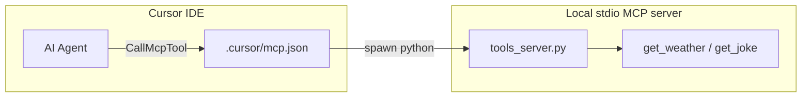

# Lecture 08 - Model Context Protocol (MCP)

---

## Overview

This lecture connects **standardized tool access** (MCP) with the ad-hoc JSON tool-calling pattern from earlier AI demos.

You will:

1. Run a **real stdio MCP server** (`server/tools_server.py`) with `get_weather` and `get_joke`.
2. Wire it into **Cursor** via `.cursor/mcp.json`.
3. Compare it with **`demos/tool_calling_demo.py`**, which uses Gemini + local JSON tool decisions (not MCP).

### Cursor agent vs Gemini demo (API keys)

These are **separate**:

| Path | Uses `GEMINI_API_KEY`? |
|------|------------------------|
| **MCP** (`course-tools` in `.cursor/mcp.json`) | No — local Python tools only |
| **Cursor chat** when invoking MCP tools | No — uses whatever model/API you configured in Cursor |
| **`demos/tool_calling_demo.py`** | Yes — reads `lectures/08_mcp/.env` or the shell environment |

The MCP server never forwards your Gemini key. Only the standalone Gemini demo script calls the Google API.

---

## Topics Covered

- Model Context Protocol: tools, stdio transport, MCP client vs server.
- Cursor MCP configuration (`mcp.json`, `${workspaceFolder}`).
- FastMCP server implementation in Python.
- Secrets via environment variables (no hardcoded API keys).
- MCP Inspector for local testing.
- Optional Playwright MCP as a hosted-tool example.

---

## Architecture



---

## Prerequisites

- Python 3.12+
- [Cursor](https://cursor.com/) with MCP enabled
- Node.js 18+ (for Playwright MCP and MCP Inspector via `npx`)
- `GEMINI_API_KEY` (only for the non-MCP Gemini demo)

---

## Setup

### 1. Virtual environment and dependencies

```powershell
cd lectures\08_mcp
python -m venv .venv
.\.venv\Scripts\Activate.ps1
pip install -r requirements.txt
```

### 2. Environment variables (Gemini demo only)

```powershell
copy .env.example .env
# Edit .env with your GEMINI_API_KEY
```

`tool_calling_demo.py` loads `lectures/08_mcp/.env` automatically via `python-dotenv`. You can still `export GEMINI_API_KEY` in the shell if you prefer.

The MCP server does not require API keys.

### 3. Cursor MCP configuration

`.cursor/` is gitignored. Copy the committed template to activate MCP in this workspace:

```powershell
# From repository root
mkdir .cursor -ErrorAction SilentlyContinue
copy lectures\08_mcp\config\mcp.json.example .cursor\mcp.json
```

Restart Cursor or reload MCP servers (**Settings → MCP**).

The template uses the lecture venv Python at `lectures/08_mcp/.venv/Scripts/python.exe`. **Create the venv and install dependencies before reloading MCP** (step 1 above).

**Linux/macOS:** Change `command` in `.cursor/mcp.json` to `${workspaceFolder}/lectures/08_mcp/.venv/bin/python`.

**Optional — Lovable remote MCP:** To control Lovable projects from Cursor (create, iterate, deploy), add the `lovable` entry from [`config/mcp.lovable.json.example`](config/mcp.lovable.json.example) into the same `.cursor/mcp.json` `mcpServers` object (do not replace other servers). Requires a Lovable account and OAuth on first connect. Official docs: https://docs.lovable.dev/integrations/lovable-mcp-server

**Merge, don't replace:** Project `.cursor/mcp.json` is one file — adding Lovable means appending a `lovable` key alongside `course-tools`, `playwright`, AWS servers, etc. It does not automatically inherit servers from a separate global config if the project file omits them.

**Windows fallback:** If the venv path fails, set `command` to the full path of your lecture venv Python:

```json
"command": "C:/dev/amdocs-ai-course/lectures/08_mcp/.venv/Scripts/python.exe"
```

---

## Run

### MCP server (manual smoke test)

```powershell
cd lectures\08_mcp
.\.venv\Scripts\python server\tools_server.py
```

The process waits on stdio — that is expected. Use MCP Inspector or Cursor to invoke tools.

### MCP Inspector

See [`demos/inspect_server.md`](demos/inspect_server.md).

### Gemini tool-calling demo (without MCP)

```powershell
cd lectures\08_mcp
.\.venv\Scripts\Activate.ps1
# Ensure GEMINI_API_KEY is set or load from .env
python demos\tool_calling_demo.py
```

### Unit tests

```powershell
cd lectures\08_mcp
.\.venv\Scripts\python -m pytest tests -q
```

---

## Verification checklist

1. Virtual environment exists and `pip install -r requirements.txt` succeeds in `lectures/08_mcp`.
2. `.cursor/mcp.json` exists at the repo root (copied from `config/mcp.json.example`).
3. Cursor **Settings → MCP** shows `course-tools` connected.
4. Agent can invoke `get_joke` or `get_weather` via MCP.
5. `pytest tests -q` passes.
6. No secrets committed (`git status` should not include `.env`).

---

## File layout

| Path | Purpose |
|------|---------|
| `config/mcp.json.example` | Committed Cursor MCP template |
| `config/mcp.lovable.json.example` | Optional Lovable remote MCP (`https://mcp.lovable.dev`) |
| `server/tools_server.py` | Stdio MCP server (FastMCP) |
| `demos/tool_calling_demo.py` | Gemini JSON tool-calling contrast demo |
| `demos/inspect_server.md` | MCP Inspector instructions |
| `tests/test_tools_server.py` | Offline tool logic tests |
| `.env.example` | `GEMINI_API_KEY` template |

---

## Troubleshooting

| Issue | Fix |
|-------|-----|
| `course-tools` not listed in Cursor | Copy `mcp.json.example` to `.cursor/mcp.json`, restart Cursor |
| Server exits immediately | Run with venv Python; install `mcp` in that venv |
| Wrong Python on Windows | Set full path to `.venv/Scripts/python.exe` in `mcp.json` |
| Gemini demo fails | Set `GEMINI_API_KEY` in `.env` or shell |
| Playwright MCP fails | Install Node.js; run `npx -y @playwright/mcp@0.0.75` once manually |

---

## Related documentation

- Course setup: [`docs/setup.md`](../../docs/setup.md)
- Exercises index: [`exercises/README.md`](../../exercises/README.md)
- MCP specification: https://modelcontextprotocol.io/
