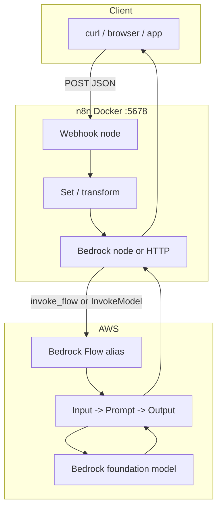

# Lecture 09 - Flows with Amazon Bedrock and n8n

---

## Overview

This lecture covers **visual workflow orchestration** for AI applications using two complementary tools:

1. **Amazon Bedrock Flows** — versioned, multi-step prompt pipelines on AWS (Input → Prompt → Output).
2. **n8n** — integration automation that triggers flows via webhooks and connects to AWS.

You will:

1. Define a summarizer **Bedrock Flow** (`bedrock_flows/flow_definition.json`).
2. Deploy and invoke it with **boto3** (`create_flow.py`, `invoke_flow.py`).
3. Run **n8n** locally and import webhook workflows that call Bedrock.
4. Complete the **exercise**: parse the Flow response stream in n8n and return a clean JSON payload.

---

## Topics Covered

- Bedrock Flows: nodes, connections, prepare/version/alias lifecycle.
- Boto3 clients: `bedrock-agent` (build) vs `bedrock-agent-runtime` (invoke).
- n8n: webhooks, Set nodes, AWS Bedrock node, HTTP Request with SigV4.
- Composing n8n (when to run) with Bedrock Flows (what AI logic runs).
- Environment-based configuration and IAM execution roles.

---

## Architecture



---

## Prerequisites

- Python 3.12+
- Docker (from Lecture 07)
- AWS account with:
  - Bedrock **model access** enabled (e.g. `amazon.nova-lite-v1:0`)
  - IAM **Flows execution role** ([AWS docs](https://docs.aws.amazon.com/bedrock/latest/userguide/flows-permissions.html))
- AWS CLI credentials (`aws configure` or `AWS_PROFILE`)

---

## Setup

### 1. Python environment

```powershell
cd lectures\09_flows_bedrock_n8n
python -m venv .venv
.\.venv\Scripts\Activate.ps1
pip install -r requirements.txt
copy .env.example .env
```

Edit `.env` with your `BEDROCK_FLOWS_EXECUTION_ROLE_ARN` and `AWS_REGION`.

### 2. Bedrock Flow (AWS)

```powershell
python bedrock_flows\create_flow.py
```

Copy printed `BEDROCK_FLOW_ID` and `BEDROCK_FLOW_ALIAS_ID` into `.env`.

Details: [`bedrock_flows/README.md`](bedrock_flows/README.md)

### 3. n8n (local)

```powershell
cd n8n
docker compose up -d
```

Import workflows and configure AWS credentials: [`n8n/README.md`](n8n/README.md)

---

## Run

### Invoke Bedrock Flow (Python)

```powershell
cd lectures\09_flows_bedrock_n8n
.\.venv\Scripts\Activate.ps1
python bedrock_flows\invoke_flow.py
```

### Invoke via n8n webhook

```powershell
# Workflow 01 — direct Bedrock model
curl -X POST http://localhost:5678/webhook/summarize `
  -H "Content-Type: application/json" `
  -d '{\"text\": \"Your text here.\"}'

# Workflow 02 — Bedrock Flow alias (set env vars in n8n first)
curl -X POST http://localhost:5678/webhook/bedrock-flow `
  -H "Content-Type: application/json" `
  -d '{\"text\": \"Your text here.\"}'
```

---

## Verification checklist

1. `.venv` created and `pip install -r requirements.txt` succeeds.
2. `create_flow.py` completes; `.env` has flow ID and alias ID.
3. `invoke_flow.py` prints a summary for sample text.
4. n8n reachable at http://localhost:5678.
5. Workflow 01 returns `{ "summary": "..." }` from the webhook.
6. No secrets committed (`git status` should not include `.env`).

---

## File layout

| Path | Purpose |
|------|---------|
| `bedrock_flows/flow_definition.json` | Flow node graph (summarizer) |
| `bedrock_flows/create_flow.py` | Create, prepare, version, alias |
| `bedrock_flows/invoke_flow.py` | Stream invoke and print result |
| `n8n/docker-compose.yml` | Local n8n instance |
| `n8n/workflow_01_webhook_summarizer.json` | Webhook → Bedrock → respond |
| `n8n/workflow_02_n8n_to_bedrock.json` | Webhook → invoke Flow alias |
| `exercise/README.md` | Hands-on extension task |
| `.env.example` | AWS and Flow ID template |

---

## Troubleshooting

| Issue | Fix |
|-------|-----|
| `create_flow` AccessDenied | Fix execution role trust + Bedrock permissions |
| Model access denied | Enable model in Bedrock console → Model access |
| n8n webhook 404 | Activate workflow; copy URL from n8n UI |
| Empty n8n response | Assign AWS credential on Bedrock/HTTP nodes |
| `invoke_flow` missing in boto3 | `pip install -U boto3` |

---

## Related documentation

- Bedrock Flows: [`bedrock_flows/README.md`](bedrock_flows/README.md)
- n8n: [`n8n/README.md`](n8n/README.md)
- Exercise: [`exercise/README.md`](exercise/README.md)
- Docker (prior lecture): [`lectures/07_docker_aws/README.md`](../07_docker_aws/README.md)
- Course setup: [`docs/setup.md`](../../docs/setup.md)
