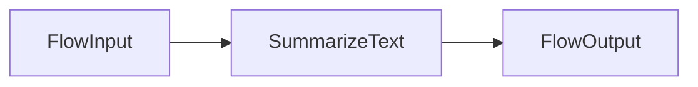
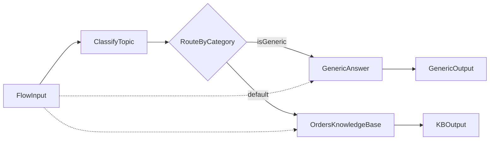

# Bedrock Flows Demo

Amazon Bedrock **Flows** are versioned, multi-step prompt pipelines. You define **nodes** (Input, Prompt, Output, Knowledge Base, Condition, …) and **connections** between them, then invoke the flow through an **alias**.

This folder implements a minimal summarizer:



---

## Prerequisites

1. **AWS account** with Bedrock model access (enable `amazon.nova-lite-v1:0` or your chosen model in the Bedrock console).
2. **IAM execution role** for Bedrock Flows — see [Create a service role for Flows](https://docs.aws.amazon.com/bedrock/latest/userguide/flows-permissions.html).
3. **AWS credentials** configured (`aws configure` or `AWS_PROFILE`).

---

## Files

| File | Purpose |
|------|---------|
| `flow_definition.json` | Node/connection definition (Input → Prompt → Output) |
| `create_flow.py` | Creates flow, prepares, versions, creates `latest` alias |
| `invoke_flow.py` | Invokes flow alias with sample or CLI text |
| `flow_kb_definition.json` | KB RAG flow with classifier router |
| `create_kb_flow.py` | Creates orders KB RAG flow, version, `latest` alias |
| `update_kb_flow.py` | Updates existing KB flow, publishes new version, repoints alias |
| `invoke_kb_flow.py` | Invokes KB flow with order lookup questions |
| `iam/flows-trust-policy.json` | Trust policy for KB Flows execution role |
| `iam/flows-kb-policy.json` | InvokeModel + Retrieve + RetrieveAndGenerate |

---

## KB RAG flow (orders knowledge base)

Classifies each question as **OCTANK** (order/company data) or **GENERIC** (general knowledge), then routes:

- **OCTANK** → `OrdersKnowledgeBase` (RetrieveAndGenerate on `BEDROCK_KB_ID`, default `KCYCNC0OSD`)
- **GENERIC** → `GenericAnswer` (direct LLM, no KB call)



Use a **dedicated** Flows execution role (`BEDROCK_KB_FLOWS_EXECUTION_ROLE_ARN`), separate from the KB ingestion role.

### 1. Create IAM role (one-time)

```powershell
aws iam create-role --role-name reem-knowledgebase-flow-flows-role `
  --assume-role-policy-document file://bedrock_flows/iam/flows-trust-policy.json
aws iam put-role-policy --role-name reem-knowledgebase-flow-flows-role `
  --policy-name reem-knowledgebase-flow-flows-kb-policy `
  --policy-document file://bedrock_flows/iam/flows-kb-policy.json
```

### 2. Deploy the KB flow

```powershell
python bedrock_flows\create_kb_flow.py
```

Copy `BEDROCK_KB_FLOW_ID` and `BEDROCK_KB_FLOW_ALIAS_ID` into `.env`.

### 3. Update the KB flow (after editing `flow_kb_definition.json`)

```powershell
python bedrock_flows\update_kb_flow.py
```

Creates a new flow version and repoints the `latest` alias.

### 4. Invoke

```powershell
python bedrock_flows\invoke_kb_flow.py
python bedrock_flows\invoke_kb_flow.py "Which orders have status Processing?"
python bedrock_flows\invoke_kb_flow.py "What is the capital of France?"
```

---

## Setup

From the lesson root:

```powershell
cd lectures\09_flows_bedrock_n8n
python -m venv .venv
.\.venv\Scripts\Activate.ps1
pip install -r requirements.txt
copy .env.example .env
```

Edit `.env`:

- `BEDROCK_FLOWS_EXECUTION_ROLE_ARN` — your Flows service role ARN
- `AWS_REGION` — region where Bedrock is enabled (e.g. `us-east-1`)
- `BEDROCK_MODEL_ID` — model enabled in your account

---

## Run

### 1. Create the flow (one-time)

```powershell
python bedrock_flows\create_flow.py
```

Copy the printed `BEDROCK_FLOW_ID` and `BEDROCK_FLOW_ALIAS_ID` into `.env`.

### 2. Invoke the flow

```powershell
python bedrock_flows\invoke_flow.py
```

Optional custom input:

```powershell
python bedrock_flows\invoke_flow.py "Your long paragraph to summarize here."
```

### 3. Console alternative

You can also build the same flow in **Amazon Bedrock → Flows** using the visual designer. Export the flow ID and alias from the console into `.env` and skip `create_flow.py`.

---

## API clients

| Operation | Boto3 client |
|-----------|--------------|
| `create_flow`, `prepare_flow`, `create_flow_version`, `create_flow_alias` | `bedrock-agent` |
| `invoke_flow` | `bedrock-agent-runtime` |

`invoke_flow` returns a **response stream** — collect events until `flowCompletionEvent.completionReason` is `SUCCESS`, then read `flowOutputEvent`.

---

## Troubleshooting

| Issue | Fix |
|-------|-----|
| `AccessDeniedException` on create | Execution role missing `bedrock:InvokeModel` and Flows trust policy |
| KB flow `AccessDenied` at invoke | Role needs `bedrock:Retrieve` on KB ARN and `bedrock:RetrieveAndGenerate` on `*` |
| Order queries hit GENERIC branch | Classifier returned `GENERIC`; strengthen `ClassifyTopic` prompt or check condition routing |
| Model not found | Enable the model in Bedrock console → Model access |
| `invoke_flow` not on client | Upgrade boto3 (`pip install -U boto3`); use `bedrock-agent-runtime` |
| Flow not prepared | Run `prepare_flow` or use `create_flow.py` which calls it |

---

## References

- [Flows code samples (AWS)](https://docs.aws.amazon.com/bedrock/latest/userguide/flows-code-ex.html)
- [Node types for flows](https://docs.aws.amazon.com/bedrock/latest/userguide/flows-nodes.html)
