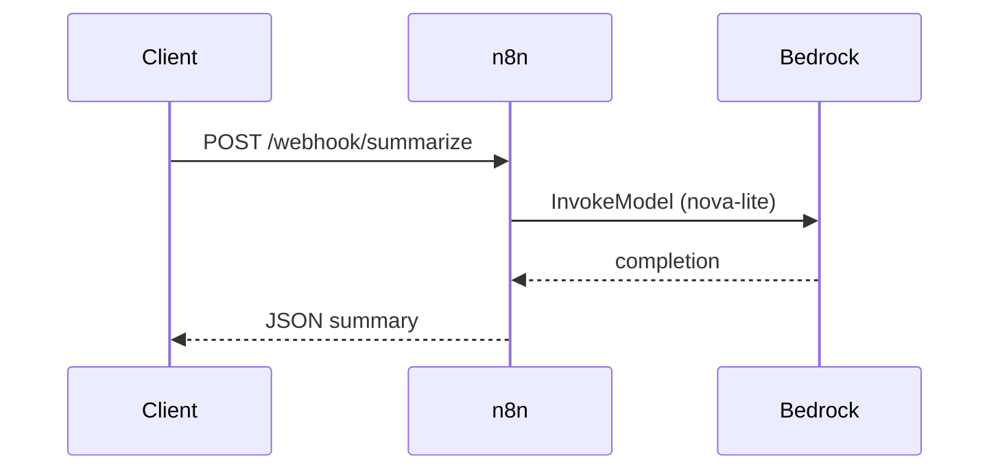

# n8n Workflows Demo

[n8n](https://n8n.io/) is a workflow automation tool. Nodes represent steps; connections define data flow. This lesson uses n8n to trigger AI summarization and bridge to Amazon Bedrock Flows.

---

## Start n8n locally

Requires Docker (from Lecture 07).

```powershell
cd lectures\09_flows_bedrock_n8n\n8n
docker compose up -d
```

Open **http://localhost:5678** and complete first-time setup (local account).

Stop:

```powershell
docker compose down
```

Data persists in the `n8n_data` volume.

---

## Import workflows

1. In n8n: **Workflows → Import from File**
2. Import each JSON:
   - `workflow_01_webhook_summarizer.json` — Webhook → Bedrock model → JSON response
   - `workflow_02_n8n_to_bedrock.json` — Webhook → HTTP invoke Bedrock Flow alias

3. **Credentials → Add credential → AWS**
   - Access Key ID / Secret Access Key (lab account), or use IAM role if n8n runs on EC2
   - Region must match your Bedrock setup

4. Open each workflow, assign the AWS credential on Bedrock/HTTP nodes, **Save**, then **Activate**.

---

## Workflow 01 — Webhook Summarizer

Direct model call (no Flow). Good for learning n8n triggers before Flow orchestration.

**Test** (workflow must be active):

```powershell
curl -X POST http://localhost:5678/webhook/summarize `
  -H "Content-Type: application/json" `
  -d '{\"text\": \"Amazon Bedrock Flows compose multi-step AI pipelines with versioned aliases.\"}'
```

Expected JSON: `{ "summary": "..." }`.



---

## Workflow 02 — n8n to Bedrock Flow

Calls your Flow alias created in `bedrock_flows/`. Set n8n environment variables (Settings → Variables, or docker-compose `environment`):

| Variable | Example |
|----------|---------|
| `BEDROCK_FLOW_ID` | From `create_flow.py` or console |
| `BEDROCK_FLOW_ALIAS_ID` | Alias `latest` ID |
| `AWS_REGION` | `us-east-1` |

**Test:**

```powershell
curl -X POST http://localhost:5678/webhook/bedrock-flow `
  -H "Content-Type: application/json" `
  -d '{\"text\": \"Long text to summarize via your Bedrock Flow.\"}'
```

`invoke_flow` returns an **event stream**. Workflow 02 returns raw output for teaching; the exercise asks you to parse `flowOutputEvent`.

---

## n8n vs Bedrock Flows

| Concern | n8n | Bedrock Flows |
|---------|-----|---------------|
| Primary use | Business automation, integrations, schedules | AI prompt pipelines, RAG, conditions |
| Designer | n8n canvas | Bedrock Flows canvas |
| Versioning | Workflow history | Flow versions + aliases |
| Best together | Trigger on webhook/schedule → call Flow alias | Reusable AI logic with governance |

---

## Troubleshooting

| Issue | Fix |
|-------|-----|
| Webhook 404 | Activate workflow; use production webhook URL shown in n8n UI |
| AWS credential error | Re-link credential; check IAM `bedrock:InvokeModel` |
| Empty summary | Confirm model access in Bedrock console |
| Flow invoke fails | Verify `BEDROCK_FLOW_ID` / alias env vars in n8n |
