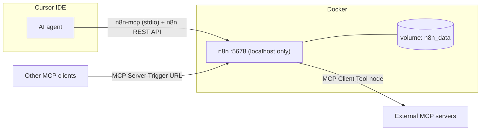

# n8n — Local Setup, Persistence and MCP Integration

[n8n](https://n8n.io/) is a workflow automation tool. Nodes represent steps; connections define data flow. This lesson uses n8n to trigger AI summarization and bridge to Amazon Bedrock Flows, with full data persistence and MCP integration for AI-assisted workflow development.

---

## Folder structure

```
n8n/
├── docker-compose.yml        # n8n container (pinned image, named volume, healthcheck)
├── .env.example              # Template — copy to .env and fill in
├── .env                      # Local values incl. N8N_ENCRYPTION_KEY (gitignored)
├── mcp.json.example          # Template for <repo-root>/.cursor/mcp.json
├── workflow_01_webhook_summarizer.json
├── workflow_02_n8n_to_bedrock.json
└── README.md
```

---

## First-time setup

```powershell
cd lectures\09_flows_bedrock_n8n\n8n
copy .env.example .env
```

Edit `.env` and set `N8N_ENCRYPTION_KEY` (generate one):

```powershell
$b=[byte[]]::new(32); [Security.Cryptography.RandomNumberGenerator]::Create().GetBytes($b); -join ($b | % { $_.ToString('x2') })
```

> The encryption key encrypts saved credentials. **Set it once and never change it** — changing or losing it makes all stored credentials unreadable.

---

## Start / stop / restart

```powershell
cd lectures\09_flows_bedrock_n8n\n8n

docker compose up -d        # start
docker compose down         # stop (data kept in volume)
docker compose restart      # restart
docker compose logs -f n8n  # follow logs
```

Open **http://localhost:5678** and complete first-time setup (local owner account).

**Upgrade:** bump `N8N_IMAGE_TAG` in `.env`, then `docker compose pull && docker compose up -d`.

---

## Data persistence

All n8n state (workflows, credentials, executions, SQLite DB, settings) lives in the named Docker volume `n8n_data`, mounted at `/home/node/.n8n`.

Verify:

```powershell
docker volume inspect n8n_data                                  # volume exists
docker inspect n8n --format "{{json .Mounts}}"                  # mounted into container
docker exec n8n ls /home/node/.n8n                              # database.sqlite, config...
```

Persistence test: create a workflow in the UI, then `docker compose down && docker compose up -d` — the workflow and your login must still be there. Data is only lost with `docker compose down -v` or `docker volume rm n8n_data` (**never run these unless you intend to wipe n8n**).

---

## MCP integration

MCP works in two directions:



### A. Cursor → n8n (build, validate, debug workflows from the IDE)

Configured in **`<repo-root>/.cursor/mcp.json`** (gitignored — safe for keys). Template: [`mcp.json.example`](mcp.json.example). Two servers:

| Server | Package | Purpose |
|--------|---------|---------|
| `n8n-workflows` | `n8n-mcp` | Node documentation, workflow CRUD, validation, debugging |
| `n8n-manager` | `n8n-manager-for-ai-agents` | Workflow lifecycle management for AI agents |

Setup:

1. Start n8n and create your owner account.
2. n8n UI → **Settings → n8n API → Create API Key** — copy the key.
3. Set it as a user environment variable so `${N8N_API_KEY}` resolves:
   ```powershell
   [Environment]::SetEnvironmentVariable("N8N_API_KEY", "<your-key>", "User")
   ```
   Never paste the real key into `.cursor/mcp.json` (or any MCP JSON) — keep `"N8N_API_KEY": "${N8N_API_KEY}"` and let it resolve from the environment.
4. Restart Cursor → **Settings → MCP** → verify `n8n-workflows` shows a green dot and lists tools.

Verify the connection: ask the agent to "list my n8n workflows" — it should call `n8n-workflows` tools and return the imported workflows.

### B. n8n as MCP server / client (AI agents inside n8n)

Native since n8n 1.88 — no extra packages:

- **MCP Server Trigger** node: exposes workflow tools to outside MCP clients over SSE/streamable HTTP at a generated URL (e.g. `http://localhost:5678/mcp/<path>`). Set **Authentication: Bearer/Header** — never `None` beyond throwaway local tests.
- **MCP Client Tool** node: attach to an **AI Agent** node so the agent can call tools from external MCP servers (URL + optional bearer/header auth).

Where each config lives:

| Config | Location |
|--------|----------|
| Cursor MCP servers (API key) | `<repo-root>/.cursor/mcp.json` (gitignored) |
| Tracked template | `n8n/mcp.json.example` |
| n8n container settings | `n8n/docker-compose.yml` + `n8n/.env` |
| MCP Server Trigger / Client Tool | inside n8n workflows (stored in the `n8n_data` volume) |

---

## Import the lesson workflows

1. In n8n: **Workflows → Import from File**
2. Import each JSON:
   - `workflow_01_webhook_summarizer.json` — Webhook → Bedrock model → JSON response
   - `workflow_02_n8n_to_bedrock.json` — Webhook → HTTP invoke Bedrock Flow alias
3. **Credentials → Add credential → AWS** — Access Key ID / Secret Access Key (lab account); region must match your Bedrock setup.
4. Open each workflow, assign the AWS credential on Bedrock/HTTP nodes, **Save**, then **Activate**.

### Workflow 01 — Webhook Summarizer

```powershell
curl -X POST http://localhost:5678/webhook/summarize `
  -H "Content-Type: application/json" `
  -d '{\"text\": \"Amazon Bedrock Flows compose multi-step AI pipelines with versioned aliases.\"}'
```

Expected JSON: `{ "summary": "..." }`.

### Workflow 02 — n8n to Bedrock Flow

Set n8n variables (Settings → Variables, or compose `environment`): `BEDROCK_FLOW_ID`, `BEDROCK_FLOW_ALIAS_ID`, `AWS_REGION`.

```powershell
curl -X POST http://localhost:5678/webhook/bedrock-flow `
  -H "Content-Type: application/json" `
  -d '{\"text\": \"Long text to summarize via your Bedrock Flow.\"}'
```

`invoke_flow` returns an **event stream**; the exercise asks you to parse `flowOutputEvent`.

---

## Security

- **Secrets**: real values only in `n8n/.env` (gitignored) or user environment variables. MCP JSON files must reference secrets via `${VAR}` only — never hardcode n8n/AWS/OpenAI keys, even in gitignored files. Only `*.example` files are committed. Before pushing: `git status` must not list `.env`.
- **Encryption key**: stable `N8N_ENCRYPTION_KEY` in `.env`; back it up (password manager). Without it a restored volume cannot decrypt credentials.
- **Network**: port bound to `127.0.0.1` only — n8n is not reachable from the LAN. No other ports exposed.
- **API keys in workflows**: store them as n8n **Credentials** (encrypted at rest), never hardcoded in node parameters or Code nodes.
- **Telemetry** disabled (`N8N_DIAGNOSTICS_ENABLED=false`).
- **Production later**: put n8n behind HTTPS (reverse proxy, e.g. Traefik/Caddy), set `N8N_PROTOCOL=https` + real `WEBHOOK_URL`, re-enable secure cookies (remove `N8N_SECURE_COOKIE=false`), use SSO/strong owner password, switch SQLite → Postgres for scale, keep the image pinned and patched, and require auth on every MCP Server Trigger.

---

## Validation checklist

```powershell
docker compose config -q                                        # 1. compose file valid
docker compose up -d                                            # 2. starts
docker inspect n8n --format "{{.State.Health.Status}}"          # 3. "healthy"
curl http://localhost:5678/healthz                              # 4. {"status":"ok"}
docker volume inspect n8n_data                                  # 5. volume exists
docker compose restart; curl http://localhost:5678/healthz      # 6. survives restart
docker logs n8n --tail 50                                       # 7. no errors
```

MCP: Cursor → Settings → MCP → `n8n-workflows` green; ask the agent to list workflows.

---

## Troubleshooting

| Issue | Fix |
|-------|-----|
| Container restarts / `N8N_ENCRYPTION_KEY` error | Set the key in `.env`; if it changed, restore the original or recreate credentials |
| Port 5678 already in use | Change `N8N_PORT` in `.env`, `docker compose up -d` |
| Credentials "could not be decrypted" | Encryption key changed — restore original key in `.env` |
| Webhook 404 | Activate the workflow; use the production webhook URL shown in n8n UI |
| MCP client can't connect to MCP Server Trigger | Use `127.0.0.1` instead of `localhost`; check auth header; for proxies disable gzip/buffering (SSE) |
| `n8n-workflows` MCP red in Cursor | n8n must be running; `N8N_API_KEY` env var set; restart Cursor after edits |
| AWS credential error | Re-link credential; check IAM `bedrock:InvokeModel` |
| Empty summary | Confirm model access in Bedrock console |
| Flow invoke fails | Verify `BEDROCK_FLOW_ID` / alias env vars in n8n |

---

## n8n vs Bedrock Flows

| Concern | n8n | Bedrock Flows |
|---------|-----|---------------|
| Primary use | Business automation, integrations, schedules | AI prompt pipelines, RAG, conditions |
| Designer | n8n canvas | Bedrock Flows canvas |
| Versioning | Workflow history | Flow versions + aliases |
| Best together | Trigger on webhook/schedule → call Flow alias | Reusable AI logic with governance |
