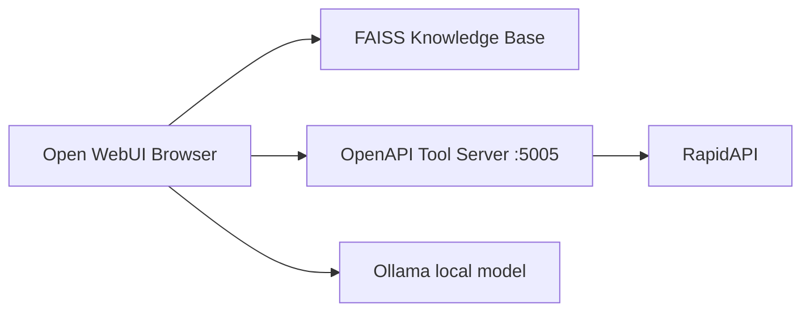

# Lecture 11 — Local Models, Open WebUI, and MCP

Course lecture covering **local LLM inference**, **Open WebUI** as a browser frontend, **Knowledge Bases** (FAISS), and how **MCP** relates to tool integration.

Homework implementation: [`homework/hw07/`](../../homework/hw07/) — see [`README.md`](../../homework/hw07/README.md) for setup.

---

## Topics covered

### Ollama

- Lightweight platform to run open-source LLMs locally (Llama, Mistral, Gemma, Phi-3, etc.).
- Privacy-preserving, offline inference; GPU recommended for larger models.
- CLI: `ollama pull <model>` then `ollama run <model>`.

### Open WebUI

- Browser UI for chatting with Ollama (or remote APIs like OpenAI).
- Persistent chat history (SQLite), multi-user admin, file attachments.
- Deploy via Docker:

```powershell
docker pull ghcr.io/open-webui/open-webui:main
docker run -d -p 3000:8080 -v open-webui:/app/backend/data --name open-webui ghcr.io/open-webui/open-webui:main
```

### Knowledge Base

- Upload documents (CSV, PDF, text); Open WebUI indexes with **FAISS** for retrieval-augmented chat.
- Attach a collection in chat so answers use your data, not just model weights.

### GPT API (optional)

- Open WebUI can also connect to OpenAI-compatible remote APIs via admin settings.

### MCP vs Open WebUI tools

| Mechanism | Transport | Typical client |
|-----------|-----------|----------------|
| **MCP** (Model Context Protocol) | stdio / HTTP / SSE | Cursor, Claude Desktop, Gemini CLI |
| **Open WebUI OpenAPI tools** | HTTP REST + OpenAPI | Open WebUI chat |

Both let models call external functions. MCP standardizes tool discovery for AI IDEs; Open WebUI expects **OpenAPI-compatible HTTP servers** (see [`open-webui/openapi-servers`](https://github.com/open-webui/openapi-servers)).

Lecture 08 in this repo implements **stdio MCP** for Cursor: [`lectures/08_mcp/`](../08_mcp/).  
Homework 07 implements an **HTTP tool server** + Web UI Tool for Open WebUI: [`homework/hw07/`](../../homework/hw07/).

---

## Architecture (homework)



---

## Related documentation

- MCP specification: https://modelcontextprotocol.io/
- Open WebUI tool servers: https://docs.openwebui.com/features/extensibility/plugin/tools/openapi-servers/
- Kaggle MCP: https://www.kaggle.com/docs/mcp
