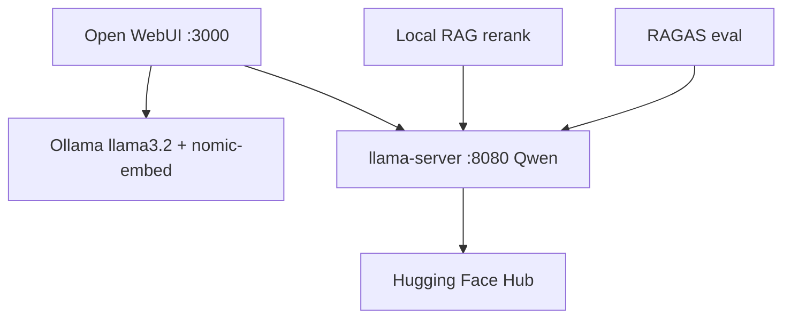

# Lecture 11 — Local Models, Open WebUI, and MCP

Course lecture covering **local LLM inference** (Ollama, llama.cpp, Hugging Face), **RAGAS** evaluation, **Open WebUI**, **Knowledge Bases** (FAISS), and how **MCP** relates to tool integration.

Homework stack: [`homework/hw07/`](../../homework/hw07/) · Agent skill: [`.cursor/skills/local-models/SKILL.md`](../../.cursor/skills/local-models/SKILL.md)

---

## Quick start

```powershell
# From repo root (after scripts/setup-dev.ps1)
.\.venv\Scripts\pip.exe install -r lectures/11_local_models_webui/requirements.txt `
  --extra-index-url https://abetlen.github.io/llama-cpp-python/whl/vulkan

# Set HF_TOKEN in repo-root .env, then:
.\lectures\11_local_models_webui\scripts\download_qwen36.ps1

# QA (no GPU): 
python -m pytest lectures/11_local_models_webui/tests/ -q

# Demos (GPU — Intel Arc: n_gpu_layers=999 via QWEN_N_GPU_LAYERS)
python lectures/11_local_models_webui/demos/qwen25_chat.py
python lectures/11_local_models_webui/demos/qwen3_reasoning_chat.py --mode fast
python lectures/11_local_models_webui/demos/qwen3_reasoning_chat.py --mode reasoning
python lectures/11_local_models_webui/demos/huggingface_model_info.py --download
python lectures/11_local_models_webui/demos/ragas_eval_smoke.py --dry-run
python lectures/11_local_models_webui/demos/ragas_eval_smoke.py --eval   # needs OPENAI_API_KEY

# Local RAG + rerank (CPU; first run downloads embedding models ~170 MB)
python lectures/11_local_models_webui/main.py --dry-run
python lectures/11_local_models_webui/main.py --retrieve-only --query "What port does llama-server use?"
python lectures/11_local_models_webui/main.py --query "What embedding model does Open WebUI use?"

# llama-server + Open WebUI
.\lectures\11_local_models_webui\scripts\start_llama_server.ps1
python lectures/11_local_models_webui/demos/llama_server_chat.py --thinking off
```

**Intel Arc note:** Use the **Vulkan** wheel and `QWEN_N_GPU_LAYERS=999` (or `QWEN36_N_GPU_LAYERS`). CPU-only `n_gpu_layers=0` may crash during tensor repack on some hosts.

---

## Layout

| Path | Role |
|------|------|
| [`requirements.txt`](requirements.txt) | llama-cpp-python, huggingface_hub, **ragas**, **faiss**, **sentence-transformers** |
| [`examples/`](examples/) | Recorded **input/output** JSON for each stack |
| [`demos/`](demos/) | Runnable scripts (Qwen, HF, llama-server, RAGAS) |
| [`rag_rerank.py`](rag_rerank.py) | Local RAG library — bi-encoder FAISS + cross-encoder rerank |
| [`main.py`](main.py) | CLI — retrieve, rerank, generate via llama-server |
| [`data/`](data/) | Sample knowledge-base corpus for RAG demo |
| [`scripts/`](scripts/) | Download Qwen3.6, start llama-server |
| [`tests/`](tests/) | QA — structure, imports, dry-run CLI |

### Demos

| Script | Stack | Example I/O |
|--------|-------|-------------|
| `demos/qwen25_chat.py` | llama-cpp-python | [`examples/io/qwen25_factual.json`](examples/io/qwen25_factual.json) |
| `demos/qwen3_reasoning_chat.py` | llama-cpp-python (thinking) | [`examples/io/qwen3_*.json`](examples/io/) |
| `demos/qwen36_vision_chat.py` | llama-cpp-python MTMD | Qwen3.6 vision |
| `demos/huggingface_model_info.py` | Hugging Face Hub | [`examples/io/huggingface_download.json`](examples/io/huggingface_download.json) |
| `demos/llama_server_chat.py` | llama-server OpenAI API | [`examples/io/llama_server_api.json`](examples/io/llama_server_api.json) |
| `demos/ragas_eval_smoke.py` | RAGAS | [`examples/io/ragas_eval_sample.json`](examples/io/ragas_eval_sample.json) |
| `main.py` | Local RAG + rerank + llama-server | [`examples/io/rag_rerank_sample.json`](examples/io/rag_rerank_sample.json) |

---

## Local RAG + rerank

Two-stage retrieval over a local corpus, then grounded generation via llama-server:

1. **Bi-encoder** (`all-MiniLM-L6-v2`) + FAISS — retrieve top-10 candidates
2. **Cross-encoder** (`ms-marco-MiniLM-L-6-v2`) — rerank to top-3
3. **Deterministic threshold** — refuse without LLM call if scores are too low
4. **llama-server** — generate answer from reranked context

```powershell
python main.py --dry-run
python main.py --retrieve-only --query "What port does llama-server use?"
python main.py --query "What embedding model does Open WebUI use?"
python main.py   # interactive REPL
```

Corpus: [`data/local_models_kb.txt`](data/local_models_kb.txt). Full generation requires `scripts/start_llama_server.ps1` running on `:8080`.

---

## Qwen best practice (input / output)

| Model | Fast Q&A | Reasoning |
|-------|----------|-----------|
| **Qwen 2.5** | Standard `messages` | Ask for steps — inline in `content` |
| **Qwen 3** | Append `/no_think` or `enable_thinking: false` | Default thinking — parse `` or use llama-server |

See [`examples/README.md`](examples/README.md) for full recorded I/O.

---

## Qwen3.6 local stack (production lecture path)

| Interface | Command | Use |
|-----------|---------|-----|
| **Python** | `python demos/qwen36_vision_chat.py` | Multimodal smoke test (MTMD + mmproj) |
| **llama-server** | `scripts/start_llama_server.ps1` | OpenAI API on `:8080` for Open WebUI |
| **Open WebUI** | hw07 Docker `:3000` | Browser chat + KB + tools |

**Model:** [`unsloth/Qwen3.6-27B-MTP-GGUF`](https://huggingface.co/unsloth/Qwen3.6-27B-MTP-GGUF) — use `UD-Q4_K_XL` (~17 GB), not BF16, on Intel Arc shared VRAM.

### Open WebUI + Qwen3.6

Start hw07 stack, then in Open WebUI **Admin → Connections → OpenAI API**:

- Base URL: `http://host.docker.internal:8080/v1`
- API key: leave empty

Keep Ollama for `llama3.2:3b` (hw07 tools/KB) and `nomic-embed-text` (embeddings).

---

## Topics covered

### llama.cpp / llama-cpp-python

- Load GGUF from Hugging Face (`Llama.from_pretrained`)
- Chat completions (`create_chat_completion`)
- Vulkan GPU offload on Intel Arc
- `llama_cpp.server` — OpenAI-compatible API on port 8080

### Hugging Face

- `HF_TOKEN` for downloads
- `huggingface_hub.list_repo_files` / `hf_hub_download`

### RAGAS

- Build `EvaluationDataset` from question / contexts / answer / reference
- Metrics: `faithfulness`, `answer_relevancy` (needs LLM — OpenAI or local)
- `--dry-run` for CI-safe validation

### Local RAG + rerank

- Bi-encoder FAISS retrieval + cross-encoder reranking (sentence-transformers, CPU)
- Grounded generation via llama-server OpenAI API
- Deterministic score threshold with no-context refusal

### Ollama / Open WebUI / MCP

See homework [`hw07`](../../homework/hw07/) and lecture [`08_mcp`](../08_mcp/).

---

## Architecture



---

## Related documentation

- Unsloth MTP: https://unsloth.ai/docs/models/mtp
- llama-cpp-python: https://llama-cpp-python.readthedocs.io/
- RAGAS: https://docs.ragas.io/
- MCP: https://modelcontextprotocol.io/
- Open WebUI: https://docs.openwebui.com/
