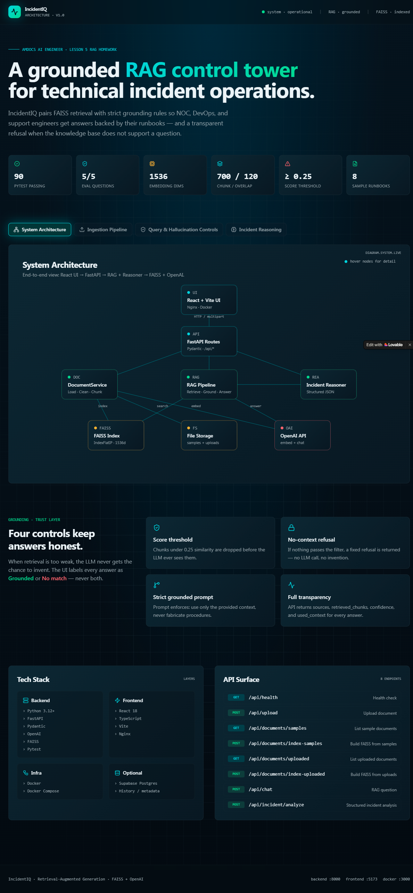
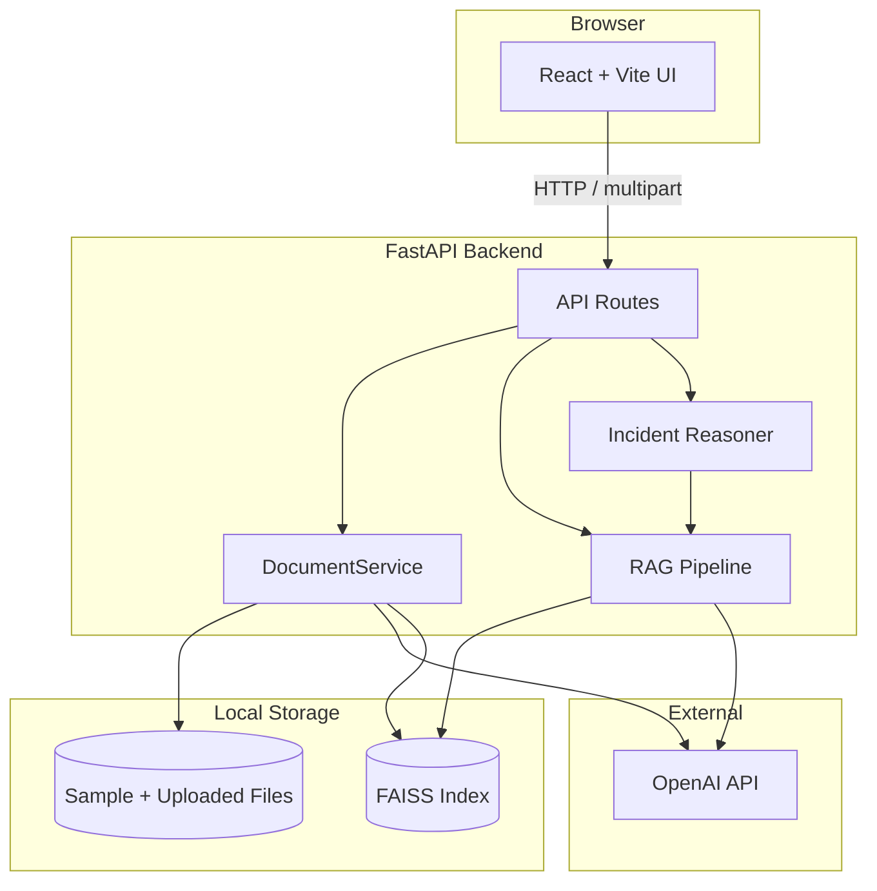

<div align="center">



# IncidentIQ

**A grounded RAG control tower for technical incident operations.**

FAISS retrieval + strict grounding rules so NOC, DevOps, and support engineers
get answers backed by their runbooks — and a transparent refusal when the
knowledge base doesn't support the question.

[]()
[]()
[]()
[]()
[]()
[]()
[]()

[Demo Script](docs/demo_script.md) ·
[Architecture Docs](docs/architecture.md) ·
[Reflection](docs/reflection.md)

</div>

---

## Table of Contents

- [Overview](#overview)
- [Architecture](#architecture)
- [Key Features](#key-features)
- [Tech Stack](#tech-stack)
- [Hallucination Controls](#hallucination-controls)
- [Quick Start](#quick-start)
- [API Endpoints](#api-endpoints)
- [Evaluation & Testing](#evaluation--testing)
- [Documentation](#documentation)

---

## Overview

IncidentIQ is a full-stack **Retrieval-Augmented Generation** web application
built for the **Amdocs AI Engineer course** (Lesson 5 RAG Homework). It
ingests runbooks and incident documents into a local FAISS index, then serves
grounded answers through a React operations UI — with visible sources, chunk
scores, and a no-context refusal path that prevents the LLM from inventing
procedures.

| | |
|---|---|
| **Pytest passing** | 90 |
| **Evaluation questions** | 5 / 5 |
| **Embedding dimensions** | 1536 (`text-embedding-3-small`) |
| **Chunk / overlap** | 700 / 120 chars |
| **Retrieval score threshold** | ≥ 0.25 |
| **Sample runbooks** | 8 |

---

## Architecture

> The diagram above shows the end-to-end flow: **React UI → FastAPI → RAG Pipeline + Incident Reasoner → FAISS + OpenAI**.

<details>
<summary><b>Mermaid source (click to expand)</b></summary>


</details>

---

## Key Features

- 📥 **Multi-format ingestion** — `.md` `.txt` `.csv` `.pdf` `.docx`
- 🧮 **Local FAISS index** — `IndexFlatIP`, 1536-dim, L2-normalized
- 💬 **RAG chat** — sources, chunk scores, confidence, `used_context` flag
- 🛡️ **Hallucination controls** — score threshold + no-context refusal path
- 🚨 **Incident analysis** — structured JSON triage with **P1–P4** severity
- 🐳 **Docker Compose** for one-command local stack
- ✅ **90 pytest tests** + 5-question evaluation harness

---

## Tech Stack

| Layer | Technologies |
|---|---|
| **Backend** | Python 3.12+, FastAPI, Pydantic, OpenAI API, FAISS, Pytest |
| **Frontend** | React 18, TypeScript, Vite, Nginx (Docker) |
| **Infra** | Docker, Docker Compose |
| **Optional** | Supabase Postgres (history / metadata) |

---

## Hallucination Controls

Four layered controls keep answers honest:

| Control | Detail |
|---|---|
| **Score threshold** | Chunks under `RETRIEVAL_SCORE_THRESHOLD=0.25` are dropped before the LLM ever sees them |
| **No-context refusal** | If nothing passes the filter → fixed message, **no LLM call** (saves cost, prevents invention) |
| **Strict grounded prompt** | "Use only provided context"; "do not invent" ([`prompt_builder.py`](backend/app/rag/prompt_builder.py)) |
| **Full transparency** | API returns `sources`, `retrieved_chunks`, `confidence`, `used_context` |

**Proof:** evaluation question 5 — *"What is the best restaurant in Tokyo?"* → knowledge-base refusal, no sources, `used_context: false`.

---

## Quick Start

### Backend

```powershell
cd backend
python -m venv .venv
.\.venv\Scripts\Activate.ps1
pip install -r requirements.txt
# Copy .env.example → .env and set OPENAI_API_KEY
uvicorn app.main:app --reload
```

API → http://localhost:8000 · Swagger → http://localhost:8000/docs

### Frontend

```powershell
cd frontend
npm install
npm run dev
```

UI → http://localhost:5173 — **index sample documents under Knowledge Base before chat**.

### Docker

```bash
docker compose build
docker compose up
```

Frontend → http://localhost:3000 · Backend → http://localhost:8000/docs

---

## API Endpoints

| Method | Endpoint | Description |
|---|---|---|
| `GET` | `/api/health` | Health check |
| `POST` | `/api/upload` | Upload document |
| `GET` | `/api/documents/samples` | List sample documents |
| `POST` | `/api/documents/index-samples` | Build FAISS index from samples |
| `GET` | `/api/documents/uploaded` | List uploaded documents |
| `POST` | `/api/documents/index-uploaded` | Build FAISS index from uploads |
| `POST` | `/api/chat` | RAG question |
| `POST` | `/api/incident/analyze` | Structured incident analysis |

---

## Evaluation & Testing

```powershell
# 5-question evaluation harness
$env:PYTHONPATH="backend"
python scripts/run_evaluation.py
```

```bash
# Backend tests (expect 90 passed)
cd backend && pytest

# Frontend build check
cd frontend && npm run build
```

Reports → `evaluation/evaluation_results.json` · `evaluation/evaluation_results.md`

---

## Documentation

- [`docs/architecture.md`](docs/architecture.md) — Full system architecture
- [`docs/rag_pipeline.md`](docs/rag_pipeline.md) — Retrieval and grounding details
- [`docs/incident_reasoning.md`](docs/incident_reasoning.md) — Structured triage output
- [`docs/testing_plan.md`](docs/testing_plan.md) — Test strategy
- [`docs/edge_cases.md`](docs/edge_cases.md) — All edge cases covered
- [`docs/reflection.md`](docs/reflection.md) — Course reflection
- [`docs/demo_script.md`](docs/demo_script.md) — 5-minute demo walkthrough

---

<div align="center">

Built for the **Amdocs AI Engineer course** · Lesson 5 RAG Homework
<br/>
<sub>Retrieval-Augmented Generation · FAISS + OpenAI · Grounded by design</sub>

</div>
