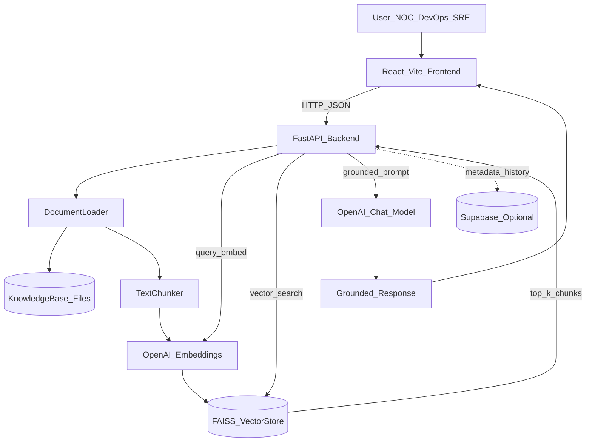
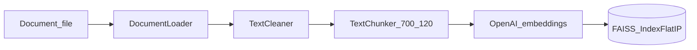
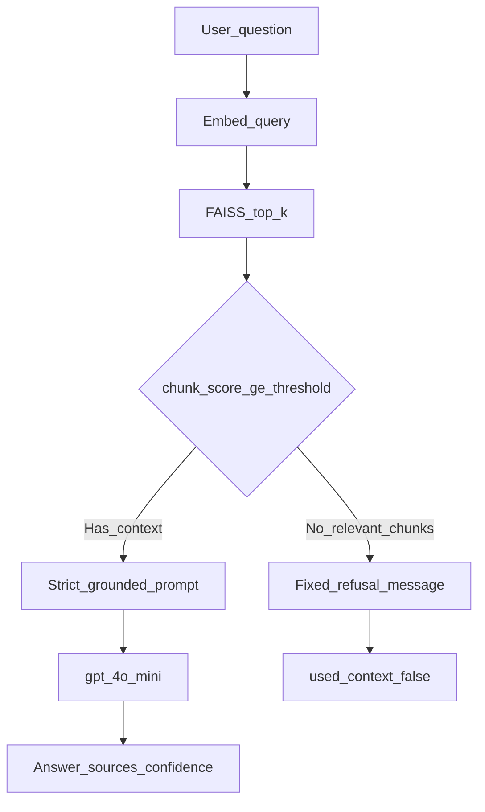

<div align="center">

# Incident Assistant RAG

**IncidentIQ** — a grounded RAG control tower for technical incident operations.

[]()
[]()
[]()
[]()
[]()
[]()
[]()

[Setup](docs/setup.md) · [Architecture](docs/architecture.md) · [RAG Pipeline](docs/rag_pipeline.md) · [Demo Script](docs/demo_script.md) · [Submission Notes](docs/submission-notes.md)

</div>

---

## Overview

Incident Assistant RAG (product name: **IncidentIQ**) is a full-stack **Retrieval-Augmented Generation** web application built for the **Amdocs AI-Augmented Software Engineering** course. It helps **NOC, DevOps, SRE, support, and Data Services** teams query runbooks, upload incident documents, and receive **grounded** answers with visible sources—without inventing procedures when the knowledge base does not support a question.

The system ingests operational documents (runbooks, SOPs, escalation policies, incident notes), indexes them in a local **FAISS** vector store, and serves answers through a React operations UI with trust indicators, source citations, and structured incident analysis.

## Problem

During incidents, engineers lose time searching across runbooks, Slack threads, escalation procedures, monitoring playbooks, and historical troubleshooting notes. Knowledge is fragmented; critical steps live in tribal memory or buried PDFs. That delay increases **MTTR**, causes inconsistent triage, and makes on-call handoffs harder—especially when the responder is new to a service or domain.

## Solution

IncidentIQ centralizes operational knowledge behind a **RAG pipeline** that:

- Retrieves the most relevant document chunks before any LLM call
- Applies a **score threshold** and **no-context refusal** when retrieval is too weak
- Returns **sources, chunk scores, confidence, and `used_context`** on every answer
- Supports **incident analysis** with structured severity, checks, and escalation guidance
- Exposes a full **REST API** and an operations-focused **web UI** for indexing, chat, and upload

Teams get faster triage, better runbook access, and a more professional incident response flow—with less dependence on tribal knowledge.

## Key Features

- **RAG-based question answering** with source transparency and hallucination controls
- **Document ingestion** — MD, TXT, CSV, PDF, DOCX via upload or sample corpus
- **Embedding generation** — OpenAI `text-embedding-3-small` (1536 dimensions)
- **Vector search** — local FAISS `IndexFlatIP` with L2-normalized vectors
- **Context-aware answers** — strict grounded prompts; fixed refusal when no chunks pass threshold
- **Incident and runbook retrieval** — semantic search over operational knowledge
- **Incident Analysis** — structured JSON-style triage output (severity, checks, escalation)
- **Backend API** — FastAPI with Swagger at `/docs`
- **Frontend UI** — React + TypeScript: Dashboard, Knowledge Base, RAG Chat, Upload, Incident Analysis
- **Local development** — Uvicorn + Vite dev servers
- **Docker support** — Docker Compose (backend + nginx frontend)
- **Environment configuration** — secrets in `backend/.env` only; frontend has no API keys
- **Automated tests** — 90 pytest tests; 5-question evaluation harness (5/5 PASS documented)

## System Architecture



Secrets (`OPENAI_API_KEY`, models) load only from [`backend/.env`](backend/.env). The frontend uses [`VITE_API_BASE_URL`](frontend/src/config/env.ts) (default `http://localhost:8000/api`).

Deep dive: [`docs/architecture.md`](docs/architecture.md)

### Ingestion pipeline



### Query pipeline and hallucination controls



| Control | Detail |
|---------|--------|
| Score threshold | Default `0.25` — chunks below are dropped ([`config.py`](backend/app/core/config.py)) |
| No-context path | If nothing passes → fixed message, **no LLM call** |
| Prompt rules | “Use only provided context”; “do not invent” ([`prompt_builder.py`](backend/app/rag/prompt_builder.py)) |
| Transparency | API returns `sources`, `retrieved_chunks`, `confidence`, `used_context` |
| UI | **Context · Grounded** vs **Context · No match** badges |

## RAG Pipeline

End-to-end query flow:

1. **User asks a question** in RAG Chat (or via `POST /api/chat`).
2. **Backend receives the request** and validates input (`top_k`, non-empty question).
3. **Query is embedded** with the same OpenAI embedding model used at index time.
4. **Vector search** retrieves top-k similar chunks from FAISS.
5. **Score filter** drops weak matches; if none remain, return refusal without calling the LLM.
6. **Context is injected** into a strict grounded prompt ([`prompt_builder.py`](backend/app/rag/prompt_builder.py)).
7. **LLM generates a grounded answer**; response includes sources and metadata to the frontend.

Ingestion: load → clean → chunk (700 chars, 120 overlap) → embed → write FAISS index. Details: [`docs/rag_pipeline.md`](docs/rag_pipeline.md)

## Technologies Used

| Technology | Purpose | Why it was used |
|------------|---------|-----------------|
| Python 3.12+ | Backend runtime | Course stack; async-friendly; strong AI ecosystem |
| FastAPI | REST API | Typed routes, OpenAPI/Swagger, async, Pydantic integration |
| Uvicorn | ASGI server | Production-standard server for FastAPI |
| Pydantic / pydantic-settings | Schemas & config | Validation and `.env` loading with type safety |
| OpenAI API | Embeddings + chat | Reliable `text-embedding-3-small` and `gpt-4o-mini` for RAG |
| FAISS (faiss-cpu) | Vector store | Course requirement; fast local similarity search |
| NumPy | Vector math | FAISS and embedding normalization |
| pypdf / python-docx | Document parsing | PDF and DOCX runbook ingestion |
| React 18 | Frontend UI | Component model for multi-page ops dashboard |
| TypeScript | Frontend types | Safer API contracts and maintainability |
| Vite 6 | Frontend tooling | Fast dev server and production builds |
| Nginx | Docker frontend | Serves static build; proxies `/api` to backend |
| Docker / Docker Compose | Container deployment | Reproducible full-stack local demo |
| Supabase (optional) | Postgres metadata | Chat/incident history when `DATABASE_ENABLED=true` |
| Pytest / httpx | Backend tests | 90 automated tests including API integration |
| Playwright (dev) | Screenshot capture | Submission and demo asset generation |

## Project Structure

```
incident-assistant-rag/
├── backend/
│   ├── app/                 # FastAPI app, RAG, routes, services
│   ├── tests/               # pytest suite (90 tests)
│   ├── Dockerfile
│   ├── requirements.txt
│   └── .env.example
├── frontend/
│   ├── src/                 # React pages, API client, components
│   ├── Dockerfile
│   └── .env.example
├── data/
│   ├── sample_documents/    # Curated runbooks (MD, TXT, CSV, PDF, DOCX)
│   └── faiss_index/         # Generated at runtime (gitignored)
├── docs/                    # Architecture, setup, pipeline, submission
├── evaluation/              # 5-question eval harness + results
├── screenshots/             # Submission captures (12 PNGs)
├── scripts/                 # Evaluation runner, screenshot capture
├── docker-compose.yml
└── README.md
```

## Getting Started

**Prerequisites:** Python 3.12+, Node.js 18+, OpenAI API key, optional Docker.

### Backend

```powershell
cd projects\incident-assistant-rag\backend
python -m venv .venv
.\.venv\Scripts\Activate.ps1
pip install -r requirements.txt
copy .env.example .env
# Edit .env — set OPENAI_API_KEY; never commit .env

uvicorn app.main:app --reload
```

- API: http://localhost:8000  
- Swagger: http://localhost:8000/docs  
- Health: http://localhost:8000/api/health  

### Frontend

```powershell
cd projects\incident-assistant-rag\frontend
npm install
npm run dev
```

Open http://localhost:5173 → **Knowledge Base** → **Index Sample Documents** before using RAG Chat.

Full guide: [`docs/setup.md`](docs/setup.md)

## Environment Variables

Copy [`backend/.env.example`](backend/.env.example) to `backend/.env`. Restart Uvicorn after changes.

```env
OPENAI_API_KEY=sk-your-openai-api-key-here
EMBEDDING_MODEL=text-embedding-3-small
EMBEDDING_DIMENSIONS=1536
ANSWER_MODEL=gpt-4o-mini
DATABASE_ENABLED=false
```

Optional Supabase (when `DATABASE_ENABLED=true`): `SUPABASE_URL`, `SUPABASE_SERVICE_ROLE_KEY`. Run [`backend/docs/supabase_schema.sql`](backend/docs/supabase_schema.sql) first.

**Frontend** — copy [`frontend/.env.example`](frontend/.env.example) only if the API is not on port 8000:

```env
VITE_API_BASE_URL=http://localhost:8000/api
```

OpenAI keys **never** belong in the frontend. Chunk size, overlap, and retrieval threshold use code defaults in [`backend/app/core/config.py`](backend/app/core/config.py).

## Running the Application

| Mode | Command | URL |
|------|---------|-----|
| Backend (dev) | `uvicorn app.main:app --reload` from `backend/` | http://localhost:8000 |
| Frontend (dev) | `npm run dev` from `frontend/` | http://localhost:5173 |
| Docker Compose | `docker compose up` from project root | http://localhost:3000 |

## Running with Docker

```powershell
cd projects\incident-assistant-rag
docker compose build
docker compose up
```

Requires `backend/.env` with a valid `OPENAI_API_KEY`. Data persists via volume mount on `./data`.

- Frontend: http://localhost:3000  
- Backend Swagger: http://localhost:8000/docs  

## Testing

**Backend (90 tests):**

```powershell
cd backend
python -m pytest tests -v --tb=short
```

From project root (uses root [`pytest.ini`](pytest.ini)):

```powershell
pytest
```

**Frontend type-check + build:**

```powershell
cd frontend
npm run build
```

**RAG evaluation (5 questions):**

```powershell
cd projects\incident-assistant-rag
$env:PYTHONPATH="backend"
python scripts/run_evaluation.py
```

Results: [`evaluation/evaluation_results.md`](evaluation/evaluation_results.md). More: [`TESTING.md`](TESTING.md)

## API Endpoints

| Method | Endpoint | Description |
|--------|----------|-------------|
| GET | `/api/health` | Health check |
| POST | `/api/upload` | Upload document |
| GET | `/api/documents/samples` | List sample documents |
| POST | `/api/documents/index-samples` | Build FAISS index from samples |
| GET | `/api/documents/uploaded` | List uploaded documents |
| POST | `/api/documents/index-uploaded` | Build FAISS index from uploads |
| POST | `/api/chat` | RAG question |
| POST | `/api/incident/analyze` | Structured incident analysis |

## Screenshots

Submission and demo captures live in [`screenshots/`](screenshots/) (output path for [`scripts/capture_screenshots.mjs`](scripts/capture_screenshots.mjs)). See [`screenshots/README.md`](screenshots/README.md) for captions and regeneration steps.

| Screenshot | What it shows |
|------------|---------------|
|  | Full REST API surface |
|  | Grounded answer with sources |
|  | Irrelevant question → no hallucination |
|  | Structured incident report |
|  | FAISS indexing from UI |
|  | Five validation questions passed |
|  | Automated test suite |

Architecture diagram: [`docs/architecture.png`](docs/architecture.png)

## Beyond Basic Requirements

| Enhancement | Description |
|-------------|-------------|
| **Hallucination controls** | Score threshold, no-context refusal, strict prompts, eval question 5 (irrelevant) |
| **Incident reasoning** | `/api/incident/analyze` with severity, checks, escalation ([`docs/incident_reasoning.md`](docs/incident_reasoning.md)) |
| **Trust UI** | Grounded / no-match badges; P1–P4 severity display; evidence-style source cards |
| **90 pytest tests** | Unit, integration, API, loader, FAISS, pipeline coverage |
| **Evaluation harness** | 5 scripted questions with markdown/JSON reports |
| **Playwright screenshots** | Automated capture for submission proof |
| **Optional Supabase** | Metadata and history layer (FAISS remains retrieval engine) |
| **Edge-case documentation** | [`docs/edge_cases.md`](docs/edge_cases.md) |

Homework alignment: [`docs/submission-notes.md`](docs/submission-notes.md)

## What I Learned

- **RAG architecture** — end-to-end flow from document load through chunk, embed, retrieve, prompt, and generate
- **Vector search** — FAISS indexing, similarity scoring, and threshold tuning for precision vs recall
- **Prompt grounding** — designing refusal paths when context is insufficient (reduces hallucination and cost)
- **Backend API design** — FastAPI routes, Pydantic schemas, health checks, and structured error responses
- **Docker basics** — multi-service Compose, volume mounts for `data/`, nginx reverse proxy for frontend
- **Environment security** — keeping API keys server-side only; `.env.example` with placeholders
- **Clean documentation** — architecture diagrams, demo scripts, and submission artifacts for reviewers
- **AI application structure** — separating ingestion, retrieval, generation, and optional persistence layers

Expanded reflection: [`docs/reflection.md`](docs/reflection.md)

## Future Improvements

- User authentication and role-based access
- Conversation memory and session history in UI
- Admin dashboard for corpus management and re-index jobs
- Document upload progress and batch ingestion UI
- Structured logging, metrics, and tracing (OpenTelemetry)
- Grafana or similar monitoring integration
- Cloud deployment (AWS ECS, Azure Container Apps)
- CI/CD pipeline with automated pytest and eval gates
- RAG quality metrics (faithfulness, context precision, human eval loop)
- Background ingestion (Celery / Inngest) and incremental FAISS updates

## Security Notes

- API keys only in `backend/.env` (gitignored)
- Frontend has no secrets; all AI calls go through the backend
- Uploads stored with UUID filenames; size and extension validation
- FAISS index and embeddings are not committed (regenerated via indexing)

## Documentation

| Document | Description |
|----------|-------------|
| [`docs/setup.md`](docs/setup.md) | Canonical local + Docker setup |
| [`docs/architecture.md`](docs/architecture.md) | Components and design rationale |
| [`docs/rag_pipeline.md`](docs/rag_pipeline.md) | Chunking, retrieval, grounding |
| [`docs/incident_reasoning.md`](docs/incident_reasoning.md) | Incident analysis endpoint |
| [`docs/submission-notes.md`](docs/submission-notes.md) | Homework checklist and proof |
| [`docs/demo_script.md`](docs/demo_script.md) | Step-by-step demo for graders |
| [`docs/testing_plan.md`](docs/testing_plan.md) | Test categories and strategy |
| [`docs/edge_cases.md`](docs/edge_cases.md) | Edge cases and expected behavior |
| [`docs/reflection.md`](docs/reflection.md) | Course reflection |
| [`docs/code_review_checklist.md`](docs/code_review_checklist.md) | Review checklist |
| [`TESTING.md`](TESTING.md) | Pytest and evaluation details |

## Author

**Re'em Mor**  
GitHub: [https://github.com/reem-mor](https://github.com/reem-mor)

Built as part of the Amdocs AI-Augmented Software Engineering course — Incident Assistant RAG / IncidentIQ.
