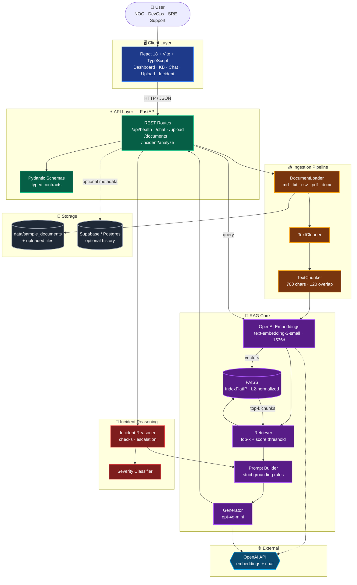
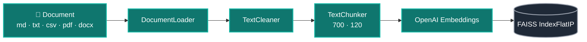
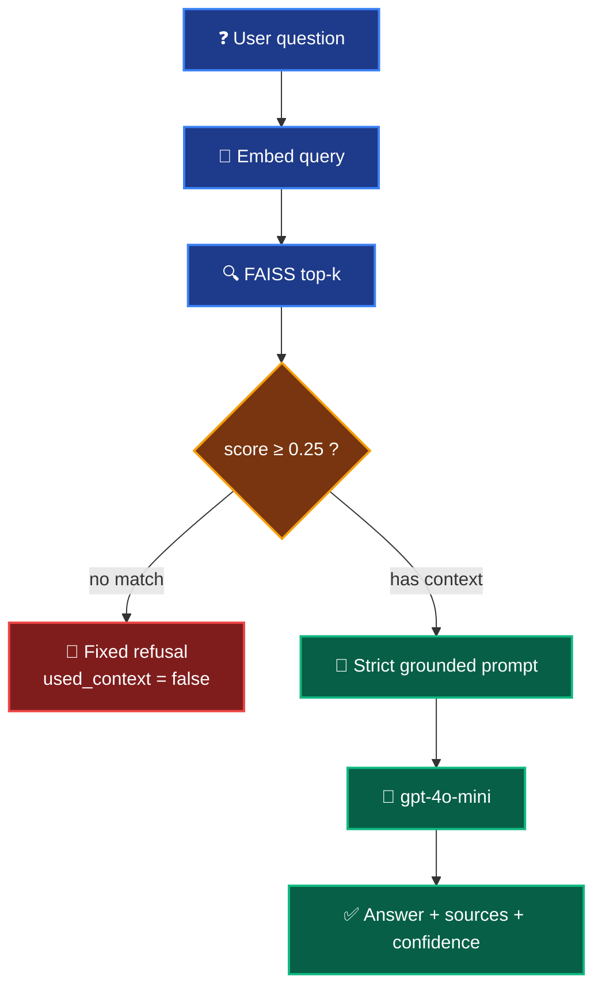

<div align="center">

<a id="top"></a>

# 🛰️ IncidentIQ

### *Incident Assistant RAG — a grounded knowledge copilot for NOC, DevOps, SRE & Support*

**Ask in plain English. Answer from your own runbooks. Cite the source. Refuse when unsure.**

<br/>

<!-- Status -->
[]()
[]()
[]()
[]()

<br/>

<!-- Stack -->


<br/>

<table>
<tr>
<td align="center" width="33%">

### 🧠 Grounded
Answers are built **only** from retrieved runbook chunks — no invention.

</td>
<td align="center" width="33%">

### 🔍 Transparent
Every reply ships with **sources, scores & confidence**.

</td>
<td align="center" width="33%">

### 🛑 Safe by default
No relevant context → **fixed refusal, zero LLM cost**.

</td>
</tr>
</table>

<br/>

**📖 Jump to:**
[Summary](#-executive-summary) ·
[Problem](#-the-problem) ·
[Solution](#-the-solution) ·
[Architecture](#%EF%B8%8F-system-architecture) ·
[Features](#-features) ·
[Quickstart](#-getting-started) ·
[Docs](#-documentation-index)

**📚 Deep dives:**
[Setup](docs/setup.md) ·
[Architecture](docs/architecture.md) ·
[RAG Pipeline](docs/rag_pipeline.md) ·
[Demo Script](docs/demo_script.md) ·
[Submission Notes](docs/submission-notes.md)

</div>

---

## 📌 Executive Summary

> During production incidents, operational knowledge is scattered across runbooks, SOPs, escalation policies, Slack threads, and tribal memory. **IncidentIQ** is a full-stack **Retrieval-Augmented Generation (RAG)** assistant that turns those documents into a queryable, trustworthy knowledge layer for **NOC, DevOps, SRE, and Support** engineers. Unlike a generic chatbot, every answer is **grounded in retrieved internal context** with visible sources, similarity scores, and a hard refusal when no relevant chunk passes the threshold — so the assistant never invents a procedure it cannot justify.

The project was built for the **Amdocs AI-Augmented Software Engineering** course and is structured as a production-inspired reference implementation: a typed FastAPI backend, a React + TypeScript operations UI, a local FAISS vector store, an automated evaluation harness, and a complete Docker Compose deployment.

---

## 🎯 The Problem

Incident response teams operate under time pressure, and the information they need is rarely in one place:

- 📚 **Knowledge fragmentation** — runbooks, SOPs, escalation policies and notes live across wikis, PDFs, repos and chat history.
- ⏱️ **MTTR pressure** — every minute spent hunting for the right document raises customer impact and SLA risk.
- 🧠 **Tribal knowledge** — critical steps live in a few senior engineers' heads; on-call handoffs suffer.
- 🤖 **Generic LLMs are not enough** — a vanilla model has no awareness of *your* runbooks and will confidently hallucinate procedures.

> **What's required:** an assistant that answers **only** from trusted internal knowledge, shows its sources, and politely refuses when it doesn't know.

---

## 💡 The Solution

IncidentIQ centralizes operational documentation behind a controlled RAG pipeline:

1. 📥 An engineer asks an incident or runbook question via the web UI or REST API.
2. 🔎 The system embeds the query and performs a **vector search** over a local **FAISS** index.
3. 🧪 A **score threshold** filters out weak matches; below threshold → fixed refusal, **no LLM call**.
4. 🧱 Passing chunks are injected into a **strict grounded prompt** ("use only provided context; do not invent").
5. 🧾 The LLM returns an answer alongside **sources, chunk scores, confidence, and a `used_context` flag**.
6. 🚨 For deeper triage, `POST /api/incident/analyze` returns a structured report — severity, suggested checks and escalation path.

The result: faster triage, consistent runbook access, and a defensible audit trail of *why* each answer was given.

---

## 🏗️ System Architecture



Deep dive: [`docs/architecture.md`](docs/architecture.md) · Rendered PNG: [`docs/architecture.png`](docs/architecture.png)

### Ingestion sub-flow



### Query flow with hallucination controls



| Hallucination control | Detail |
|---|---|
| 🎚️ Score threshold | Default `0.25` — chunks below are dropped ([`config.py`](backend/app/core/config.py)) |
| 🛑 No-context path | If nothing passes → fixed refusal message, **no LLM call**, zero cost |
| 📜 Prompt rules | "Use only provided context", "do not invent" ([`prompt_builder.py`](backend/app/rag/prompt_builder.py)) |
| 🔍 Transparency | API returns `sources`, `retrieved_chunks`, `confidence`, `used_context` |
| 🟢🟡 Trust UI | **Context · Grounded** vs **Context · No match** badges in the React UI |

---

## ✨ Features

### 🧠 RAG & AI
- ✅ Grounded question answering with strict no-invention prompt rules
- ✅ Local **FAISS** vector search (`IndexFlatIP` with L2-normalized vectors)
- ✅ OpenAI `text-embedding-3-small` (1536d) at index *and* query time
- ✅ Score-threshold filtering and no-context refusal — no LLM call on weak retrieval
- ✅ Structured **incident analysis** endpoint (severity, checks, escalation)
- ✅ Per-answer transparency: `sources`, `retrieved_chunks`, `confidence`, `used_context`

### ⚙️ Backend
- ✅ **FastAPI** with auto-generated Swagger at `/docs`
- ✅ Strict **Pydantic** schemas for every request and response
- ✅ Modular layout: `api/`, `rag/`, `reasoning/`, `services/`, `schemas/`, `db/`, `core/`
- ✅ Health endpoint, structured error responses, typed config via `pydantic-settings`
- ✅ Optional **Supabase / Postgres** persistence for chat & incident history (`DATABASE_ENABLED=true`)

### 🎨 Frontend
- ✅ **React 18 + TypeScript + Vite 6**, five operations-focused pages
- ✅ Dashboard · Knowledge Base · RAG Chat · Upload · Incident Analyze
- ✅ Trust indicators (grounded / no-match badges, P1–P4 severity chips)
- ✅ Source cards with chunk previews and similarity scores
- ✅ Example-question chips for guided NOC / DevOps workflows

### 📚 Knowledge Base
- ✅ Curated sample corpus (MD, TXT, CSV, PDF, DOCX) under `data/sample_documents/`
- ✅ One-click **Index Sample Documents** and **Index Uploaded Documents** from the UI
- ✅ User uploads stored with UUID filenames; extension & size validation

### 🐳 DevOps & Deployment
- ✅ **Docker Compose** — FastAPI + Vite-built frontend served by **nginx** with `/api` proxy
- ✅ Volume-mounted `./data` so FAISS index and uploads persist across restarts
- ✅ `.env.example` files for backend & frontend; secrets never leave the backend
- ✅ Local dev scripts under `backend/scripts/` (PowerShell + cmd)

### 🧪 Testing & Quality
- ✅ **90 pytest tests** across loader, chunker, cleaner, embeddings, FAISS, retriever, pipeline, prompts, generator, reasoner, severity classifier, upload, document routes, chat integration & health
- ✅ **5-question evaluation harness** (`scripts/run_evaluation.py`) — 5/5 PASS documented
- ✅ Playwright-based screenshot capture script for submission proof
- ✅ Code-review checklist & edge-case docs in `docs/`

---

## 🧰 Tech Stack

| Layer | Technology | Purpose |
|---|---|---|
| Language | **Python 3.12+** | Backend runtime |
| API | **FastAPI** + Uvicorn | Typed REST API with Swagger / OpenAPI |
| Validation | **Pydantic** + `pydantic-settings` | Schemas, config, env loading |
| LLM | **OpenAI** `gpt-4o-mini` | Grounded answer generation |
| Embeddings | **OpenAI** `text-embedding-3-small` (1536d) | Index + query vectors |
| Vector store | **FAISS** (`faiss-cpu`, `IndexFlatIP`) | Local similarity search |
| Numerics | **NumPy** | Embedding normalization & math |
| Parsers | **pypdf**, **python-docx** | PDF & DOCX runbook ingestion |
| Frontend | **React 18** + **TypeScript** + **Vite 6** | Operations UI |
| Web server | **nginx** (in Docker) | Static frontend + `/api` proxy |
| Containers | **Docker** + **Docker Compose** | Reproducible full-stack deploy |
| Persistence | **Supabase / Postgres** *(optional)* | Chat + incident history |
| Tests | **pytest** + **httpx** | 90 backend tests + API integration |
| Tooling | **Playwright** | Screenshot capture for submission |

---

## 📁 Project Structure

```text
incident-assistant-rag/
├── backend/
│   ├── app/
│   │   ├── api/             # FastAPI routers: health, chat, upload, documents, incident
│   │   ├── rag/             # document_loader, text_cleaner, chunker, embeddings,
│   │   │                    # faiss_store, retriever, prompt_builder, generator, rag_pipeline
│   │   ├── reasoning/       # incident_reasoner, severity_classifier, incident_prompts
│   │   ├── services/        # document_service, upload_service, history_service
│   │   ├── schemas/         # Pydantic request/response models
│   │   ├── db/              # Supabase client + repositories (optional)
│   │   ├── core/            # config, exceptions
│   │   └── main.py          # FastAPI app entry point
│   ├── tests/               # 90 pytest tests
│   ├── scripts/             # dev_local.ps1 / .cmd, check_health.ps1
│   ├── Dockerfile
│   ├── requirements.txt
│   └── .env.example
├── frontend/
│   ├── src/
│   │   ├── pages/           # Dashboard, KnowledgeBase, Chat, Upload, IncidentAnalyze
│   │   ├── components/      # ui/ (Card, Badge, Alert, …), chat/, incident/, layout/, dashboard/
│   │   ├── api/             # client + per-feature API modules
│   │   ├── types/           # shared TS types (chat, document, incident, health)
│   │   ├── utils/           # ragDisplay, ragIndexSession, badgeStyles, …
│   │   └── App.tsx, main.tsx
│   ├── Dockerfile · nginx.conf · vite.config.ts · .env.example
├── data/
│   ├── sample_documents/    # Curated runbooks (md, txt, csv, pdf, docx)
│   ├── raw/ · processed/ · chunks/ · embeddings/
│   └── faiss_index/         # Generated at runtime (gitignored)
├── database/schema.sql      # Optional Supabase schema
├── docs/                    # architecture, rag_pipeline, setup, demo_script, reflection, …
├── evaluation/              # test_questions.json, evaluation_results.md, expected_behavior.md
├── screenshots/             # 12 submission captures
├── scripts/                 # run_evaluation.py, capture_screenshots.mjs, create_sample_documents.py
├── docker-compose.yml
├── pytest.ini
├── TESTING.md
└── README.md
```

---

## 🔄 How It Works — Step by Step

1. **Load** documents from `data/sample_documents/` (or user uploads) — `DocumentLoader` supports MD, TXT, CSV, PDF, DOCX.
2. **Clean** raw text with `TextCleaner` (whitespace normalization, artifact stripping).
3. **Chunk** cleaned text with `TextChunker` (default **700 chars, 120 overlap**).
4. **Embed** each chunk via OpenAI `text-embedding-3-small` (1536d).
5. **Index** embeddings in **FAISS** `IndexFlatIP` with L2-normalized vectors.
6. **User asks** a question through the UI or `POST /api/chat`.
7. **Embed** the query using the *same* model used at index time.
8. **Retrieve** the top-k chunks from FAISS and apply the **score threshold** (default `0.25`).
9. **No-context guard** — if nothing passes, return a fixed refusal with `used_context=false` and **skip the LLM call**.
10. **Compose** a strict grounded prompt with the retrieved chunks ([`prompt_builder.py`](backend/app/rag/prompt_builder.py)).
11. **Generate** with `gpt-4o-mini`; return the answer **plus sources, scores, confidence, and `used_context`**.

Details: [`docs/rag_pipeline.md`](docs/rag_pipeline.md)

---

## 💬 Example Use Cases

Realistic NOC / DevOps / SRE questions that the assistant is designed to answer from indexed runbooks:

> ❓ *"What should I check first when users cannot log in after a production deployment?"*
>
> ❓ *"How do I triage an authentication service incident — which signals matter and in what order?"*
>
> ❓ *"Which runbook should I follow for database connectivity issues, and what's the rollback path?"*
>
> ❓ *"What are the escalation steps for a P1 production outage and who is on the on-call chain?"*
>
> ❓ *"Summarize the standard health-check checklist before declaring an incident resolved."*

And the deliberate failure case — irrelevant questions trigger the no-context refusal path:

> ❓ *"What's the best pasta recipe for dinner tonight?"* → **Context · No match**, no LLM call.

---

## 🚀 Getting Started

**Prerequisites:** Python 3.12+, Node.js 18+, an OpenAI API key, optional Docker.

### 1. Clone & enter the project

```powershell
git clone https://github.com/reem-mor/ai-engineering-portfolio.git
cd ai-engineering-portfolio\projects\incident-assistant-rag
```

### 2. Backend (FastAPI)

```powershell
cd backend
python -m venv .venv
.\.venv\Scripts\Activate.ps1
pip install -r requirements.txt
copy .env.example .env
# Edit .env — set OPENAI_API_KEY (never commit .env)

uvicorn app.main:app --reload
```

- API root: <http://localhost:8000>
- Swagger UI: <http://localhost:8000/docs>
- Health: <http://localhost:8000/api/health>

### 3. Frontend (React + Vite)

```powershell
cd ..\frontend
npm install
npm run dev
```

Then open <http://localhost:5173> → **Knowledge Base** → **Index Sample Documents** before using RAG Chat.

Full guide: [`docs/setup.md`](docs/setup.md) · macOS / Linux variants: [`backend/LOCAL_DEV.md`](backend/LOCAL_DEV.md)

---

## 🔐 Environment Variables

Copy [`backend/.env.example`](backend/.env.example) to `backend/.env`. Restart Uvicorn after changes.

```env
OPENAI_API_KEY=sk-your-openai-api-key-here
EMBEDDING_MODEL=text-embedding-3-small
EMBEDDING_DIMENSIONS=1536
ANSWER_MODEL=gpt-4o-mini
DATABASE_ENABLED=false
```

Optional Supabase (when `DATABASE_ENABLED=true`): `SUPABASE_URL`, `SUPABASE_SERVICE_ROLE_KEY`. Apply [`database/schema.sql`](database/schema.sql) first.

**Frontend** — copy [`frontend/.env.example`](frontend/.env.example) only if the API is not on port 8000:

```env
VITE_API_BASE_URL=http://localhost:8000/api
```

> ⚠️ **Security:** OpenAI keys belong in `backend/.env` only. The frontend has no secrets — all model calls flow through the backend. Never commit a real `.env` file.

---

## 🐳 Running with Docker

```powershell
cd projects\incident-assistant-rag
docker compose build
docker compose up
```

Requires a valid `backend/.env`. The `./data` directory is mounted as a volume so the FAISS index and uploads persist between runs.

- Frontend (nginx + Vite build): <http://localhost:3000>
- Backend Swagger: <http://localhost:8000/docs>

> Why Docker? One command reproduces the full stack — backend, frontend build, and nginx proxy — on any reviewer's machine without polluting the host environment.

---

## 🧪 Testing

**Backend — 90 pytest tests:**

```powershell
cd backend
python -m pytest tests -v --tb=short
```

Covers: document loader, text cleaner, chunker, embeddings, FAISS store, retriever, RAG pipeline, prompt builder, generator, incident reasoner, severity classifier, incident prompts, upload service, document routes, chat integration, and health.

**Frontend type-check + production build:**

```powershell
cd frontend
npm run build
```

**RAG evaluation harness (5 scripted questions):**

```powershell
cd projects\incident-assistant-rag
$env:PYTHONPATH="backend"
python scripts/run_evaluation.py
```

Results: [`evaluation/evaluation_results.md`](evaluation/evaluation_results.md) — full strategy: [`TESTING.md`](TESTING.md).

---

## 🌐 API Endpoints

| Method | Endpoint | Description |
|---|---|---|
| `GET`  | `/api/health` | Health check |
| `POST` | `/api/upload` | Upload a document (md / txt / csv / pdf / docx) |
| `GET`  | `/api/documents/samples` | List curated sample documents |
| `POST` | `/api/documents/index-samples` | Build FAISS index from samples |
| `GET`  | `/api/documents/uploaded` | List uploaded documents |
| `POST` | `/api/documents/index-uploaded` | Build FAISS index from uploads |
| `POST` | `/api/chat` | Ask a grounded RAG question |
| `POST` | `/api/incident/analyze` | Structured incident analysis (severity · checks · escalation) |

Interactive playground: <http://localhost:8000/docs>

---

## 📸 Screenshots

All captures live in [`screenshots/`](screenshots/) and are regenerated via [`scripts/capture_screenshots.mjs`](scripts/capture_screenshots.mjs). Captions: [`screenshots/README.md`](screenshots/README.md).

| Screenshot | What it shows |
|---|---|
|  | Full REST API surface |
|  | Grounded answer with sources |
|  | Irrelevant question → no hallucination |
|  | Structured incident report |
|  | FAISS indexing from UI |
|  | Five validation questions passed |
|  | Automated test suite |

Architecture diagram (rendered): [`docs/architecture.png`](docs/architecture.png)

---

## 🏆 Beyond Basic Requirements

| Enhancement | Description |
|---|---|
| **Hallucination controls** | Score threshold + no-context refusal + strict prompts + dedicated irrelevant-question eval |
| **Incident reasoning** | `/api/incident/analyze` with severity, checks, escalation ([`docs/incident_reasoning.md`](docs/incident_reasoning.md)) |
| **Trust UI** | Grounded / no-match badges; P1–P4 severity display; evidence-style source cards |
| **90 pytest tests** | Unit, integration, API, loader, FAISS, pipeline coverage |
| **Evaluation harness** | 5 scripted questions with markdown + JSON reports |
| **Playwright screenshots** | Automated, repeatable submission proof |
| **Optional Supabase layer** | Metadata & history persistence (FAISS remains the retrieval engine) |
| **Edge-case documentation** | [`docs/edge_cases.md`](docs/edge_cases.md) |

Homework alignment: [`docs/submission-notes.md`](docs/submission-notes.md)

---

## 🎓 What I Learned

- **RAG architecture** end-to-end — load, clean, chunk, embed, retrieve, prompt, generate, return with metadata.
- **Vector search** with FAISS — index types, L2 normalization, similarity scoring, threshold tuning for precision vs. recall.
- **Prompt grounding** — designing explicit refusal paths to reduce hallucination *and* avoid unnecessary LLM cost.
- **Backend API design** — FastAPI routers, Pydantic schemas, typed config, structured errors, health checks.
- **Frontend engineering** — typed API client, page-based React + Vite app, ops-focused trust UX (badges, source cards).
- **Dockerization** — multi-service Compose, volume mounts for runtime data, nginx reverse proxy for the SPA.
- **Environment security** — keeping secrets server-side, `.env.example` discipline, no keys in the client.
- **Testing & evaluation discipline** — 90 unit/integration tests plus a scripted RAG evaluation harness.
- **Documentation as a deliverable** — architecture, demo script, edge cases, reflection, and reviewer-ready artifacts.

Expanded reflection: [`docs/reflection.md`](docs/reflection.md)

---

## 🛣️ Future Improvements *(planned / optional — not implemented today)*

- 🔐 User authentication & role-based access (NOC / SRE / Admin)
- 💬 Conversation memory and session history in the UI
- 🛠️ Admin dashboard for corpus management and re-index jobs
- 📈 Observability — structured logging, metrics, tracing (OpenTelemetry → Grafana)
- ☁️ Cloud deployment (AWS ECS / Azure Container Apps)
- 🔁 CI/CD pipeline with automated pytest + RAG eval gates
- 📊 RAG quality metrics (faithfulness, context precision, human-eval loop)
- ⚡ Background ingestion (Celery / Inngest) and incremental FAISS updates
- 🔔 Integrations: Slack / Microsoft Teams / Confluence / PagerDuty hooks
- 🗄️ First-class PostgreSQL + Supabase rollout (extending the optional layer that exists today)

---

## 🔒 Security Notes

- API keys live **only** in `backend/.env` (gitignored).
- Frontend has no secrets; all AI calls are proxied through the backend.
- Uploads are stored with UUID filenames and validated for extension & size.
- FAISS index and embeddings are **not** committed — regenerated via the indexing endpoints.

---

## 📚 Documentation Index

| Document | Description |
|---|---|
| [`docs/setup.md`](docs/setup.md) | Canonical local + Docker setup |
| [`docs/architecture.md`](docs/architecture.md) | Components and design rationale |
| [`docs/rag_pipeline.md`](docs/rag_pipeline.md) | Chunking, retrieval, grounding |
| [`docs/incident_reasoning.md`](docs/incident_reasoning.md) | Incident analysis endpoint |
| [`docs/submission-notes.md`](docs/submission-notes.md) | Homework checklist and proof |
| [`docs/demo_script.md`](docs/demo_script.md) | Step-by-step demo for graders |
| [`docs/testing_plan.md`](docs/testing_plan.md) | Test categories and strategy |
| [`docs/edge_cases.md`](docs/edge_cases.md) | Edge cases and expected behavior |
| [`docs/reflection.md`](docs/reflection.md) | Course reflection |
| [`docs/code_review_checklist.md`](docs/code_review_checklist.md) | Review checklist |
| [`TESTING.md`](TESTING.md) | Pytest and evaluation details |

---

## 🎓 Course Context

This project was built as the capstone for the **Amdocs AI-Augmented Software Engineering** course. It demonstrates a **production-inspired RAG workflow** — typed API, grounded prompting, vector retrieval with explicit hallucination controls, container deployment, automated tests, and a reviewer-ready documentation set — applied to a realistic operations problem rather than a generic chatbot demo.

---

## 👤 Author

**Re'em Mor**
GitHub: [@reem-mor](https://github.com/reem-mor)

Built with care as part of the Amdocs AI-Augmented Software Engineering course — *IncidentIQ · Incident Assistant RAG*.
