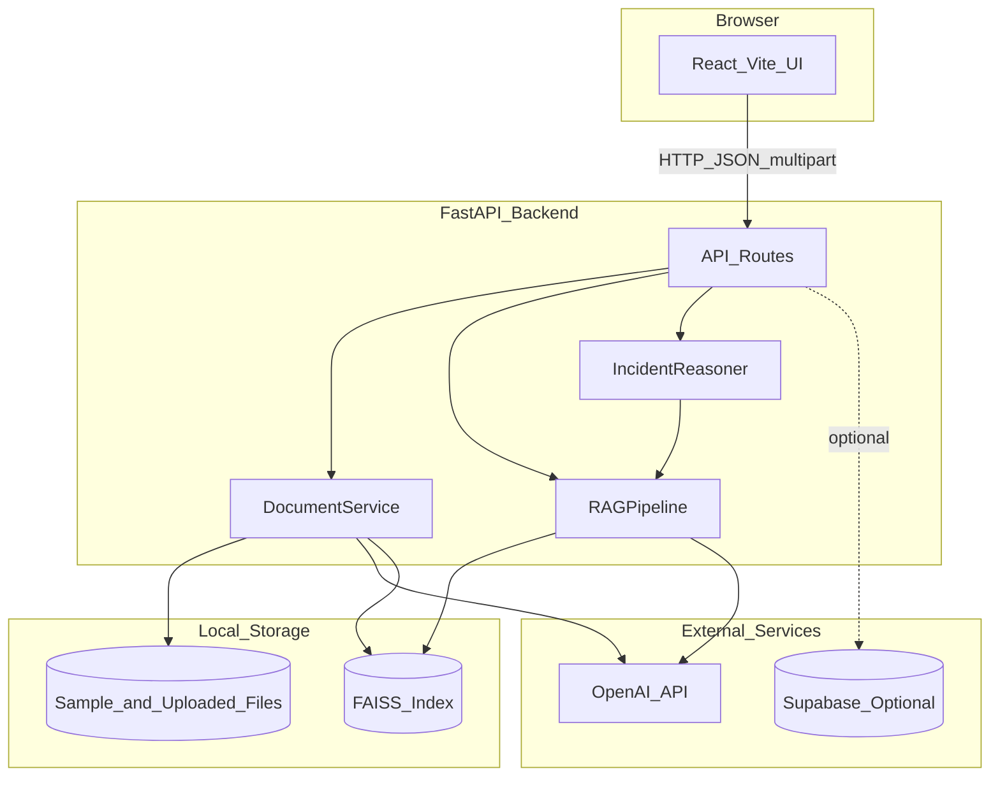
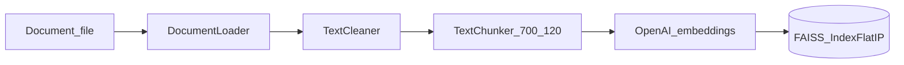
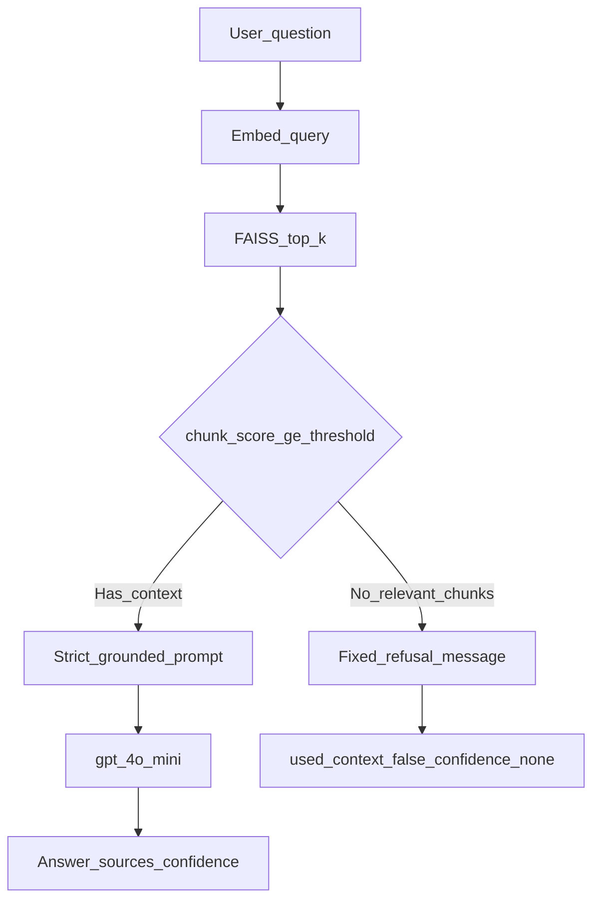
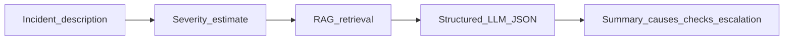

# IncidentIQ — Incident Assistant RAG Application

IncidentIQ is a full-stack Retrieval-Augmented Generation (RAG) web application for **technical incident operations**, built for the **Amdocs AI Engineer course** (RAG Application homework). It helps NOC, DevOps, and support engineers query runbooks, upload incident documents, and receive **grounded** answers with visible sources—without inventing procedures when the knowledge base does not support a question.

**Repository:** `C:\dev\amdocs-ai-course\projects\incident-assistant-rag`

## Course context

This project demonstrates a complete RAG pipeline (ingestion → FAISS → retrieval → grounded LLM), a React operations UI, Docker deployment, pytest coverage, and a five-question evaluation harness—including an **irrelevant** question to prove hallucination controls.

## What I Built (Homework Alignment)

This project satisfies the RAG Application Homework requirements (Lesson 5 — full RAG web app with FAISS, LLM, validation, and UI).

| Homework section | How IncidentIQ delivers it |
|------------------|----------------------------|
| **1. Meaningful topic** | Operational incident / runbook domain (auth, payments, deployments, monitoring) |
| **2. Knowledge base + FAISS** | Real corpus in `data/sample_documents/` + uploads; chunking, OpenAI embeddings, local FAISS index |
| **3. RAG pipeline** | Retrieve → filter by score → grounded prompt → LLM; hallucination controls (below) |
| **4. Web application** | React UI: chat, KB indexing, upload, incident analysis, loading states, errors, sources |
| **5. Validation** | 5 scripted eval questions (`evaluation/`), **90** pytest tests, edge-case docs |
| **6. Submission** | Source code, `docs/architecture.md`, `docs/reflection.md`, screenshots, example outputs |

## Main Features

- Upload and ingest documents (MD, TXT, CSV, PDF, DOCX).
- Clean, chunk, embed, and index into **FAISS**.
- **RAG Chat** with sources, chunk scores, confidence, and no-context behavior.
- **Incident Analysis** with structured JSON-style operational output.
- Optional Supabase history/metadata (`DATABASE_ENABLED=false` by default).
- Docker Compose for local full-stack runs.

## Tech Stack

| Layer | Technologies |
|-------|----------------|
| Backend | Python 3.12+, FastAPI, Pydantic, OpenAI API, FAISS, Pytest |
| Frontend | React 18, TypeScript, Vite, Nginx (Docker) |
| Infra | Docker, Docker Compose |
| Optional | Supabase Postgres |

## System Architecture



Secrets (`OPENAI_API_KEY`, models) load only from [`backend/.env`](backend/.env). The frontend uses [`VITE_API_BASE_URL`](frontend/src/config/env.ts) (default `http://localhost:8000/api`).

## Ingestion Pipeline



## Query Pipeline and Hallucination Controls

The system is designed so the LLM **does not freely answer** when retrieval is too weak. This addresses homework requirements for grounded responses and irrelevant questions.



| Control | Detail |
|---------|--------|
| **Score threshold** | Default `RETRIEVAL_SCORE_THRESHOLD=0.25` — chunks below this are dropped ([`rag_pipeline.py`](backend/app/rag/rag_pipeline.py)) |
| **No-context path** | If nothing passes → fixed message, **no LLM call** (saves cost, prevents invention) |
| **Prompt rules** | “Use only provided context”; “do not invent” ([`prompt_builder.py`](backend/app/rag/prompt_builder.py)) |
| **Transparency** | API returns `sources`, `retrieved_chunks`, `confidence`, `used_context` |
| **UI** | Badges: **Context · Grounded** vs **Context · No match** |
| **Proof** | Eval question 5 (irrelevant) — see [`evaluation/evaluation_results.md`](evaluation/evaluation_results.md) |

**Example irrelevant question:** “What is the best restaurant in Tokyo?” → knowledge-base refusal, no sources, `used_context: false`.

**UI behavior (IncidentIQ):** Operations-focused React UI—not a generic chat skin.

- **Dashboard:** Command-center overview, capability cards (grounded answers, FAISS, incident reasoning, source transparency), workspace links, and live API document counts (session index is browser-only, labeled).
- **RAG Chat:** Grouped example questions (triage, escalation, ownership, priority, runbooks), trust banners (grounded / no match / low confidence), and evidence-style source cards with score warnings.
- **Incident Analysis:** Triage report layout with **P1–P4** badges; sections labeled **From runbooks** vs **Generic triage** when retrieval does not match.
- **Knowledge Base:** Five-step pipeline (upload → chunk → embed → FAISS → query) and “index before chat” guidance.

Weak answers are never styled as authoritative: **Context · No match** plus guidance to add SOPs/runbooks and re-index.

**Severity display:** Incident Analysis maps Critical/High/Medium/Low to **P1–P4** badges for NOC-style readability (display only; API unchanged).

## Knowledge Base Design

| Topic | Implementation |
|-------|----------------|
| **Data sources** | Eight curated runbooks under `data/sample_documents/` (MD, TXT, CSV, PDF, DOCX) plus user uploads via `POST /api/upload` |
| **Cleaning** | Whitespace normalization and text cleanup before chunking |
| **Chunking** | **700** characters per chunk, **120** overlap, sentence-aware boundaries ([`config.py`](backend/app/core/config.py), [`chunker.py`](backend/app/rag/chunker.py)) |
| **Embeddings** | `text-embedding-3-small`, **1536** dimensions |
| **FAISS** | `IndexFlatIP` with L2-normalized vectors; files `data/faiss_index/incidentiq.index` + `incidentiq_metadata.json` |
| **Semantic retrieval** | Query embedding → top-k similarity search → score filter |

## Incident Reasoning (Extra)



## Supported File Types

`.md` · `.txt` · `.csv` · `.pdf` · `.docx`

## API Endpoints

| Method | Endpoint | Description |
|--------|----------|-------------|
| GET | `/api/health` | Health check |
| POST | `/api/upload` | Upload document |
| GET | `/api/documents/samples` | List sample documents |
| POST | `/api/documents/index-samples` | Build FAISS index from samples |
| GET | `/api/documents/uploaded` | List uploaded documents |
| POST | `/api/documents/index-uploaded` | Build FAISS index from uploads |
| POST | `/api/chat` | RAG question |
| POST | `/api/incident/analyze` | Structured incident analysis |

## Screenshots

Submission and demo captures live in [`screenshots/`](screenshots/). See [`screenshots/README.md`](screenshots/README.md) for captions.

| Screenshot | Homework / demo proof |
|------------|----------------------|
|  | API surface for graders |
|  | Context-based answering with sources |
|  | Irrelevant question → no hallucination |
|  | Structured operational output |
|  | FAISS indexing from UI |
|  | Five validation questions passed |
|  | Automated test depth |

## Environment Variables

Copy [`backend/.env.example`](backend/.env.example) to `backend/.env` and set a real OpenAI key. Restart uvicorn after changing `.env`.

```env
OPENAI_API_KEY=sk-...
EMBEDDING_MODEL=text-embedding-3-small
EMBEDDING_DIMENSIONS=1536
ANSWER_MODEL=gpt-4o-mini
DATABASE_ENABLED=false
```

### Frontend (no OpenAI secrets)

The React app never receives API keys. Optional [`frontend/.env.example`](frontend/.env.example) only sets `VITE_API_BASE_URL` when the API is not on port 8000.

## Quick Start (Local)

### Backend

```powershell
cd backend
python -m venv .venv
.\.venv\Scripts\Activate.ps1
pip install -r requirements.txt
# Edit .env with OPENAI_API_KEY, then:
uvicorn app.main:app --reload
```

- API: http://localhost:8000  
- Swagger: http://localhost:8000/docs  
- Health: http://localhost:8000/api/health  

### Frontend

```powershell
cd frontend
npm install
npm run dev
```

Open http://localhost:5173 — index sample documents under **Knowledge Base** before chat.

## Docker

```bash
docker compose build
docker compose up
```

- Frontend: http://localhost:3000  
- Backend docs: http://localhost:8000/docs  

## Recommended Demo Flow

1. **Knowledge Base** → Index sample documents.  
2. **RAG Chat** → Ask: `What should I check when users cannot log in after deployment?` (grounded answer + sources).  
3. **RAG Chat** → Ask: `What is the best restaurant in Tokyo?` (no-context / no match).  
4. **Incident Analysis** → Production login outage on `auth-service`.  
5. Show Swagger and evaluation results (`evaluation/evaluation_results.md`).

Full script: [`docs/demo_script.md`](docs/demo_script.md).

## Evaluation

```powershell
$env:PYTHONPATH="backend"
python scripts/run_evaluation.py
```

Questions: [`evaluation/test_questions.json`](evaluation/test_questions.json)  
Reports: `evaluation/evaluation_results.json`, `evaluation/evaluation_results.md`

## Testing

```bash
cd backend
pytest
```

Expect **90 passed**.

```bash
cd frontend
npm run build
```

## Edge Cases Covered

Empty uploads, unsupported types, large files, empty PDF/DOCX, empty questions, invalid `top_k`, missing FAISS index, low-confidence retrieval, **irrelevant questions**, bad incident JSON, DB disabled, embedding dimension mismatch, FAISS metadata mismatch. Details: [`docs/edge_cases.md`](docs/edge_cases.md).

## Security Notes

- API keys only in `backend/.env` (gitignored).  
- Frontend has no secrets.  
- Uploads stored with UUID filenames.  
- FAISS index and embeddings are not committed.

## Documentation

- [`docs/architecture.md`](docs/architecture.md)  
- [`docs/rag_pipeline.md`](docs/rag_pipeline.md)  
- [`docs/incident_reasoning.md`](docs/incident_reasoning.md)  
- [`docs/testing_plan.md`](docs/testing_plan.md)  
- [`docs/reflection.md`](docs/reflection.md)  
- [`docs/demo_script.md`](docs/demo_script.md)  
- [`docs/code_review_checklist.md`](docs/code_review_checklist.md)  
- [`docs/edge_cases.md`](docs/edge_cases.md)  

## Future Production Improvements

- Background ingestion (Celery / Inngest).  
- Retries and rate limiting for OpenAI.  
- Structured logging and auth.  
- Incremental FAISS updates (coursework requires FAISS as implemented).
