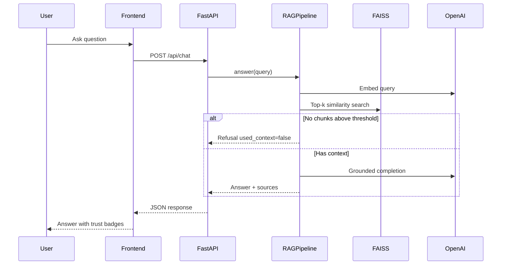

# Architecture

IncidentIQ (Incident Assistant RAG) uses a layered full-stack design: React frontend, FastAPI backend, local FAISS vector search, and optional Supabase Postgres for metadata and history.

## Request flow (RAG chat)

## Components

### React frontend

Five main pages:

- **Dashboard** — overview, capability cards, document counts
- **Knowledge Base** — index sample/uploaded documents into FAISS
- **RAG Chat** — grounded Q&A with example prompts and source cards
- **Incident Analysis** — structured triage from incident description
- **Upload** — add documents to the knowledge base

The UI shows loading states, validation errors, retrieved sources, confidence, and `used_context`. Trust labels distinguish **Context · Grounded** from **Context · No match**. Incident sections may show **From runbooks** vs **Generic triage** when retrieval is weak.

Tech: React 18, TypeScript, Vite. No OpenAI keys in the browser.

### FastAPI backend

Owns all secrets and AI calls. Route groups:

| Area | Routes |
|------|--------|
| Health | `GET /api/health` |
| Documents | samples, upload list, index-samples, index-uploaded |
| Upload | `POST /api/upload` |
| Chat | `POST /api/chat` |
| Incident | `POST /api/incident/analyze` |

Business logic lives in `app/services/`; RAG in `app/rag/`; optional DB in `app/db/`.

### RAG engine

Custom pipeline (not a black-box framework):

| Stage | Module |
|-------|--------|
| Load | `document_loader.py` |
| Clean | `text_cleaner.py` |
| Chunk | `chunker.py` (700 / 120 overlap) |
| Embed | `embeddings.py` (OpenAI) |
| Store / search | `faiss_store.py`, `retriever.py` |
| Prompt + generate | `prompt_builder.py`, `generator.py` |
| Orchestration | `rag_pipeline.py` |

### FAISS vector store

Local, in-process similarity search. Index files:

- `data/faiss_index/incidentiq.index`
- `data/faiss_index/incidentiq_metadata.json`

Uses `IndexFlatIP` on L2-normalized vectors. Required for course delivery; suitable for demo and moderate corpus sizes.

### Knowledge base

- **Sample corpus:** `data/sample_documents/` (MD, TXT, CSV, PDF, DOCX)
- **Uploads:** `data/raw/` with processed/chunk/embedding artifacts under `data/processed`, `data/chunks`, `data/embeddings`

Generated artifacts are gitignored; re-index after clone.

### LLM provider

OpenAI only (backend):

- Embeddings: `text-embedding-3-small` (1536 dims)
- Answers: `gpt-4o-mini`

Configured via `backend/.env`.

### Optional: Supabase Postgres

When `DATABASE_ENABLED=true`, Supabase stores application metadata (documents, chat sessions, retrieval logs, incident analyses). **FAISS remains the retrieval engine** — Postgres does not replace vector search.

Schema: [`../backend/docs/supabase_schema.sql`](../backend/docs/supabase_schema.sql)

## Why this design

| Decision | Rationale |
|----------|-----------|
| FAISS local | Fast, no external vector DB for coursework; easy to demo offline tests |
| Custom RAG pipeline | Transparent stages for learning and debugging |
| Backend-only secrets | Prevents API key exposure in frontend bundles |
| Score threshold + refusal | Reduces hallucination and unnecessary LLM cost |
| Optional Supabase | Persistence without complicating default local setup |
| nginx in Docker | Single origin for UI + `/api` proxy in production-like compose |

## Related docs

- [rag_pipeline.md](rag_pipeline.md) — ingestion and query details
- [incident_reasoning.md](incident_reasoning.md) — `/api/incident/analyze`
- [setup.md](setup.md) — run locally or with Docker
- [../README.md](../README.md) — project overview
