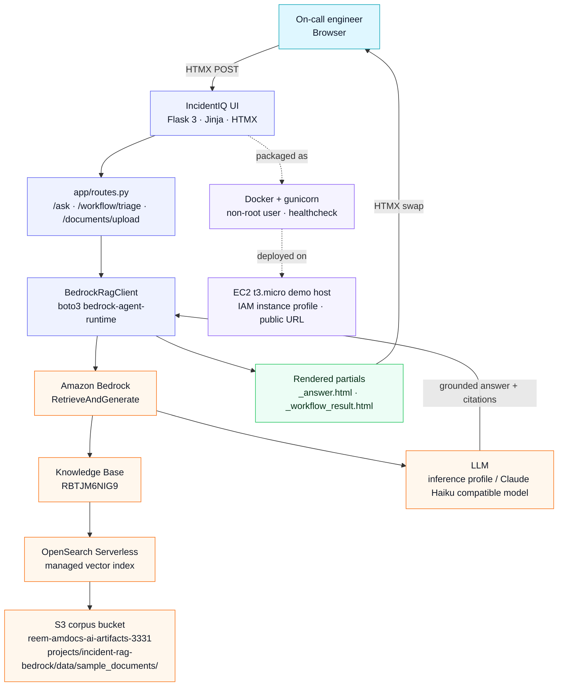

<div align="center">

# IncidentIQ · Bedrock RAG

### Topic-based RAG web app on Amazon Bedrock — Flask · boto3 · Docker · EC2

**Ask in plain English. Answer from your own runbooks. Cite every chunk. Refuse when unsure.**

[]()
[]()
[]()


</div>

---

## Topic

**Incident Operations** — NOC / SRE runbooks, alert triage, escalation policies, and post-mortems.

On-call engineers waste 5-15 minutes per incident searching for the right runbook, past ticket, or post-mortem. IncidentIQ turns that scattered knowledge into a Bedrock Knowledge Base: ask a question, get a grounded, cited answer in seconds.

---

## System Architecture



Text request path:

```text
User Browser
     |  HTMX POST /ask  or  POST /workflow/triage
     v
Flask 3 + Jinja + HTMX  (app/routes.py)
     |
     v  boto3 bedrock-agent-runtime
Amazon Bedrock - RetrieveAndGenerate
     |
     +--> Knowledge Base (RBTJM6NIG9)
     |        |
     |        v  vector search
     |   OpenSearch Serverless
     |        |
     |        v  reads source chunks
     |      S3 Bucket (reem-amdocs-ai-artifacts-3331)
     |        `-- projects/incident-rag-bedrock/data/sample_documents/
     |
     +--> LLM (inference profile / Claude Haiku compatible model)
              |
              v
     Grounded answer + citations
              |
              v
     Flask renders _answer.html or _workflow_result.html partial
              |
              v
     Browser (HTMX swaps partial into page)
```

Interactive architecture proof: [`screenshots/14_architecture.png`](screenshots/14_architecture.png)

Full deployment path: **Documents -> S3 -> Bedrock KB -> Flask + boto3 -> Docker -> EC2 -> Public URL -> Cleanup**

---

## Technologies Used

| Technology | Version | Role in this project |
|-----------|---------|---------------------|
| Python | 3.12 | Application language |
| Flask | 3.0.3 | Web framework, Jinja templates, HTMX integration |
| boto3 | 1.35.49 | AWS SDK; calls `bedrock-agent-runtime` |
| HTMX | 2.0.3 | Partial page swaps without a JavaScript framework |
| Amazon Bedrock | AWS managed | `RetrieveAndGenerate`; single API call per Q&A |
| Amazon S3 | AWS managed | Document corpus storage and KB data source |
| Amazon OpenSearch Serverless | AWS managed | Vector index managed by Bedrock KB |
| Docker | Docker Desktop / Engine | Containerization with gunicorn, non-root user, healthcheck |
| Amazon EC2 | t3.micro | Public demo host with IAM instance profile |
| gunicorn | 22.0.0 | Production WSGI server; never Flask dev server |
| Flask-WTF | 1.2.1 | CSRF protection on all POST forms |
| pytest | 8.3.4 | 89 offline unit tests with Stubber and fakes; zero live AWS calls |

---

## Documents Used in the Knowledge Base

10 documents across all 5 formats supported by the Bedrock S3 connector:

| # | File | Format | Covers |
|---|------|--------|--------|
| 1 | `auth_service_runbook.md` | MD | Authentication service triage: OIDC, Redis, pod rollbacks |
| 2 | `database_connectivity_runbook.md` | MD | Postgres + Redis health checks, connection pool recovery |
| 3 | `monitoring_alerts_reference.md` | MD | Alert catalog: P1/P2/P3 definitions, first actions, runbook links |
| 4 | `api_gateway_5xx_runbook.txt` | TXT | API Gateway 5xx storm: throttling, timeout, recovery validation |
| 5 | `payment_service_latency_runbook.txt` | TXT | Payment PSP failover, latency triage, idempotency rules |
| 6 | `incident_history.csv` | CSV | 30 past incidents with severity, service, root cause, MTTR |
| 7 | `deployment_rollback_sop.docx` | DOCX | When and how to roll back: Kubernetes and Lambda procedures |
| 8 | `postmortem_template.docx` | DOCX | Blameless postmortem structure, action item discipline |
| 9 | `escalation_policy.pdf` | PDF | P1-P4 severity matrix, on-call chain, communications policy |
| 10 | `on_call_handoff_checklist.pdf` | PDF | Start/end of shift checklist, mid-shift hygiene |

S3 location: `s3://reem-amdocs-ai-artifacts-3331/projects/incident-rag-bedrock/data/sample_documents/`

Rebuild corpus locally:

```bash
pip install reportlab python-docx
python scripts/build_corpus.py
```

---

## Setup & Running

### Prerequisites

- Python 3.12+
- Docker Desktop
- AWS account with Bedrock access
- AWS CLI configured with `aws configure` or `AWS_PROFILE`

### Environment Variables

Copy `.env.example` to `.env` and fill in your values:

```bash
cp .env.example .env
```

| Variable | Required | Description |
|----------|----------|-------------|
| `AWS_REGION` | Yes | Region where the KB lives, for this project `us-east-1` |
| `BEDROCK_KB_ID` | Yes | Knowledge Base ID from Bedrock console, `RBTJM6NIG9` for the submitted KB |
| `BEDROCK_MODEL_ARN` | Yes | Foundation model or inference profile ARN |
| `FLASK_SECRET_KEY` | Yes | Long random hex string for CSRF signing |
| `S3_BUCKET` | For upload | Bucket for document corpus, `reem-amdocs-ai-artifacts-3331` |
| `BEDROCK_DATA_SOURCE_ID` | For KB sync | Enables post-upload ingestion jobs |
| `FLASK_ENV` | Recommended | `development` locally, `production` on EC2 |

**Note:** No `AWS_ACCESS_KEY_ID` in `.env` on EC2. IAM instance profile handles credentials.

### Run with Docker (recommended)

```bash
docker compose up --build
# http://localhost:8080
```

### Run with Python directly

```bash
python -m venv .venv
source .venv/bin/activate
pip install -r requirements.txt
gunicorn -b 0.0.0.0:8080 wsgi:app
# http://localhost:8080
```

Windows activation alternative:

```powershell
.venv\Scripts\activate
```

### Run tests

```bash
pytest -v
# Expected: 89 passed, 0 failed; no live AWS calls required
```

---

## HTTP API

| Method | Path | Description |
|--------|------|-------------|
| `GET` | `/` | Full homepage with all presentation sections |
| `GET` | `/health` | `{"status":"ok"}`; used by Docker healthcheck |
| `POST` | `/ask` | HTMX partial: grounded answer + citations, or refusal |
| `POST` | `/workflow/triage` | HTMX partial: alert triage with recommendation + MTTR metrics |
| `POST` | `/documents/upload` | HTMX partial: S3 upload + optional KB sync |

`/ask` also accepts `?format=json` or `Accept: application/json` for API usage.

---

## Sample Questions & Answers

Real questions tested against the live Bedrock Knowledge Base (KB ID: `RBTJM6NIG9`):

**Q: How do I triage an authentication service incident?**

> To triage an authentication service incident: (1) Confirm scope by checking `auth_login_errors_total`; above 5% is P2 and above 25% is P1. (2) Check recent deployments with `kubectl -n auth get deploy -o wide`; if rollout is under 30 minutes old, treat it as the likely cause. (3) Verify Redis and Postgres are healthy before suspecting auth itself. (4) Validate the OIDC discovery document with `curl -sS https://auth.example.com/.well-known/openid-configuration`.
>
> Source: `auth_service_runbook.md`

**Q: Which runbook should I follow for database connectivity issues?**

> Follow the Database Connectivity Runbook. It covers connection refused, too many connections, SSL handshake failures, p95 query latency, replication lag, and Redis memory saturation. It also gives first checks such as active Postgres connections and Redis `INFO memory`.
>
> Source: `database_connectivity_runbook.md`

**Q: What are the escalation steps for a P1 production outage?**

> For P1: (1) Primary on-call is paged immediately. (2) If there is no acknowledgement within 8 minutes, secondary on-call is auto-paged. (3) If secondary does not acknowledge within 8 more minutes, the engineering manager on call is paged. The manager should be woken for any P1 over 30 minutes or incidents involving payment processing or customer data risk.
>
> Source: `escalation_policy.pdf`

**Q: What should I check first when users cannot log in after a deployment?**

> Check recent deployments first. If the latest `auth-api` rollout is less than 30 minutes old, treat it as the likely cause and prepare a rollback with `kubectl -n auth rollout undo deployment/auth-api`.
>
> Source: `auth_service_runbook.md`

**Q: What is the best restaurant in Tokyo?** (off-topic; tests graceful refusal)

> The system cannot find sufficient information to answer this question. The knowledge base does not contain information related to restaurants in Tokyo.
>
> Result: amber **Not in knowledge base** card; no hallucination.

Full smoke-test output: [`evaluation/qa_showcase.md`](evaluation/qa_showcase.md)

---

## Screenshots

All 19 proof screenshots are in [`screenshots/`](screenshots/). See [`screenshots/README.md`](screenshots/README.md) for capture instructions.

| # | File | Shows |
|---|------|-------|
| 01 | `01_bedrock_kb_overview.png` | Bedrock KB: name, ID, status Active |
| 02 | `02_bedrock_kb_data_source_synced.png` | Data source sync status = Available |
| 03 | `03_bedrock_model_access_granted.png` | Model access granted |
| 04 | `04_ec2_instance_running.png` | EC2 console: running instance with public IP |
| 05 | `05_security_group_rules.png` | SG inbound: SSH from my IP, HTTP from anywhere |
| 06 | `06_docker_ps_on_ec2.png` | `docker ps`: container Up (healthy) |
| 07 | `07_app_homepage_public.png` | Full app via public EC2 URL |
| 08 | `08_app_question_and_answer.png` | Grounded answer with citation cards |
| 09 | `09_app_refusal_or_low_confidence.png` | Off-topic refusal; amber card |
| 10 | `10_cleanup_console.png` | EC2 terminated / resources deleted |
| 11 | `11_pytest_passed.png` | pytest: 89 passed |
| 12 | `12_kb_smoke_evaluation.png` | Live KB smoke test: 6/6 PASS |
| 13 | `13_mvp_workflow.png` | MVP alert console + triage result |
| 14 | `14_architecture.png` | Interactive architecture panel |
| 15 | `15_document_upload_success.png` | Upload success + S3 key |
| 16 | `16_document_upload_validation.png` | Client validation: missing file |
| 17 | `17_document_upload_type_rejected.png` | Unsupported file type blocked |
| 18 | `18_dataset_corpus.png` | 10-document corpus catalog |
| 19 | `19_sample_questions_answers.png` | Live Q&A showcase: 4 grounded + 1 refusal |

---

## Deploy to EC2

Full walkthrough: [`docs/ec2_deployment.md`](docs/ec2_deployment.md)

Quick summary:

```bash
docker build -t incident-rag-bedrock:demo .
docker tag incident-rag-bedrock:demo ghcr.io/reemmor/incident-rag-bedrock:demo
docker push ghcr.io/reemmor/incident-rag-bedrock:demo
```

1. Launch EC2 t3.micro on Amazon Linux 2023.
2. Attach IAM role `incident-rag-ec2-role`.
3. Use security group rules: port 22 from my IP only, port 80 from `0.0.0.0/0`.
4. Use [`infra/ec2_user_data.sh`](infra/ec2_user_data.sh) to install Docker and run the image.
5. Copy `.env` to `/home/ec2-user/.env`; it contains no AWS keys and uses the instance profile.
6. Verify with `curl http://ec2-100-53-32-194.compute-1.amazonaws.com/health`.

Public URL used during testing: `http://ec2-100-53-32-194.compute-1.amazonaws.com/`

---

## Security Highlights

| Practice | Implementation |
|----------|---------------|
| No AWS keys on EC2 | IAM instance profile; no `AWS_ACCESS_KEY_ID` in `.env` on server |
| Scoped IAM policy | Bedrock retrieve/generate + S3 read + PutObject on KB prefix only |
| SSH locked to my IP | Port 22 not open to `0.0.0.0/0` |
| Non-root container | `useradd app` in Dockerfile, `USER app` before CMD |
| CSRF on all forms | Flask-WTF `CSRFProtect`, token in every POST form |
| Server-side validation | Questions 3-500 chars; upload type/size whitelist before any S3 call |
| `.env` gitignored | Only `.env.example` with placeholders is in the repo |
| Graceful refusal | No hallucination; amber card when KB has no relevant chunks |
| gunicorn in production | Docker and EC2 use gunicorn, not Flask dev server |
| Docker healthcheck | `CMD curl -fsS http://localhost:8080/health` every 30s |

---

## AWS Resources — Created & Deleted

| Resource | Created | Status |
|----------|---------|--------|
| Bedrock Knowledge Base `RBTJM6NIG9` | Yes | Retained for course reuse |
| S3 bucket `reem-amdocs-ai-artifacts-3331` | Yes | Retained; corpus prefix only |
| EC2 instance `i-03d3c5a59e849e5cf` | Yes | Terminated after demo |
| Security group `sg-0b405b6a42325979e` | Yes | Deleted after demo |
| IAM role `incident-rag-ec2-role` | Yes | Deleted after demo |
| IAM instance profile `incident-rag-ec2-profile` | Yes | Deleted after demo |

Full log: [`docs/cleanup_log.md`](docs/cleanup_log.md) · Procedure: [`docs/cleanup_checklist.md`](docs/cleanup_checklist.md)

---

## Challenges & Learnings

The trickiest parts were getting the Bedrock model ARN accepted in `us-east-1`, wiring the Bedrock Knowledge Base through one small `RetrieveAndGenerate` wrapper, and making the refusal path clear. If Bedrock returns no citations, the app renders a visible **Not in knowledge base** state instead of pretending it knows the answer.

The EC2 setup also mattered: using an IAM instance profile kept long-lived AWS keys off the server, while Docker made the same app run locally and on the demo host with the same command shape.

---

## Course Context

Built for the **AI-Augmented Software Engineering** course assignment: *Build a Topic-Based RAG Web App with Amazon Bedrock, Flask, Docker, and EC2.*

This is **Part 1**. Part 2 will wrap `BedrockRagClient.ask()` as an MCP tool so the same Knowledge Base is available to AI agents.

---

## Documentation Index

| Doc | Purpose |
|-----|---------|
| [`docs/bedrock_kb_setup.md`](docs/bedrock_kb_setup.md) | Step-by-step KB creation |
| [`docs/ec2_deployment.md`](docs/ec2_deployment.md) | EC2 launch and smoke test |
| [`docs/architecture.md`](docs/architecture.md) | Component breakdown and request flow |
| [`docs/edge_cases.md`](docs/edge_cases.md) | Validation and error paths |
| [`docs/code_review.md`](docs/code_review.md) | Self-review notes |
| [`docs/cleanup_checklist.md`](docs/cleanup_checklist.md) | Mandatory teardown steps |
| [`docs/cleanup_log.md`](docs/cleanup_log.md) | What was deleted vs retained |

---

## Author

**Re'em Mor**
