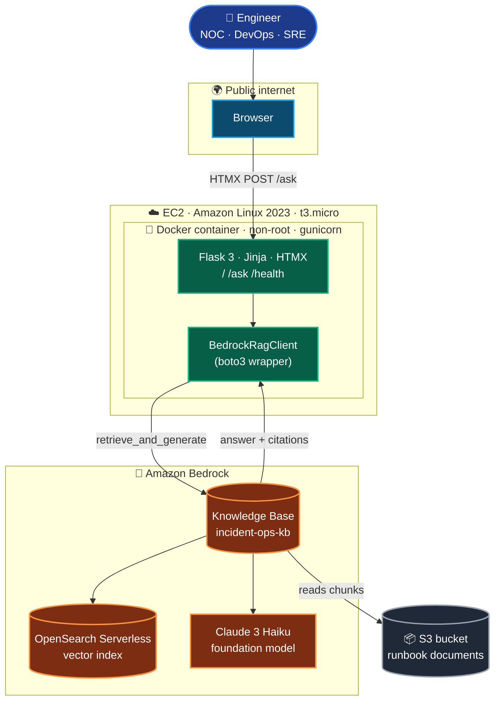

<div align="center">

# 🛰️ IncidentIQ · Bedrock RAG

### *Topic-based RAG web app on Amazon Bedrock — Flask · boto3 · Docker · EC2*

**Ask in plain English. Answer from your own runbooks. Cite every chunk. Refuse when unsure.**

<br/>

[]()
[]()
[]()

<br/>


</div>

---

## 📌 What this is

A **topic-based Retrieval-Augmented Generation web app** built for the *Build a Topic-Based RAG Web App with Amazon Bedrock, Flask, Docker, and EC2* assignment.

- **Topic:** **Incident Operations** — runbooks, SOPs, escalation policies for NOC / DevOps / SRE / Support.
- **Knowledge Base:** Amazon Bedrock KB on top of OpenSearch Serverless, fed from an S3 bucket of runbook documents.
- **Web app:** Flask + Jinja + HTMX, dark "NOC control-room" theme, hand-crafted CSS.
- **Backend call:** single `boto3` invocation of `bedrock-agent-runtime.retrieve_and_generate` → grounded answer + citations.
- **Container:** gunicorn-served, non-root, with healthcheck.
- **Deployment:** Amazon Linux 2023 EC2 (t3.micro) with an **IAM instance profile** — zero AWS keys on disk.

> Sibling project: a fuller RAG implementation in `../incident-assistant-rag/` (FastAPI + OpenAI + FAISS + React). This project deliberately uses the **Flask + Bedrock** stack required by the assignment.

---

## 🏗️ Architecture



Single API call = small surface area, easy to grade, leaves a clean seam to wrap with MCP next.

---

## 📁 Project structure

```text
incident-rag-bedrock/
├── app/
│   ├── __init__.py          # Flask app factory, CSRF, logging
│   ├── config.py            # Typed env loading (fails fast on missing vars)
│   ├── bedrock_client.py    # boto3 RetrieveAndGenerate wrapper
│   ├── errors.py            # ClientError → friendly message mapping
│   ├── routes.py            # /, /ask (HTMX partial), /health
│   ├── templates/
│   │   ├── base.html        # NOC dark theme shell
│   │   ├── index.html       # search form + example questions
│   │   └── _answer.html     # HTMX swap target (answer + citation cards)
│   └── static/css/styles.css
├── tests/
│   ├── conftest.py          # Flask test client + fake BedrockRagClient
│   ├── test_health.py
│   ├── test_routes.py       # form validation, grounded/no-match/error paths
│   └── test_bedrock_client.py  # botocore.Stubber — no real AWS calls
├── infra/
│   ├── iam_policy.json      # Bedrock + S3 read, scoped to KB ARN
│   ├── ec2_user_data.sh     # Installs Docker, pulls image, runs container
│   └── upload_docs_to_s3.sh
├── docs/
│   ├── bedrock_kb_setup.md  # Step-by-step KB creation
│   ├── ec2_deployment.md    # Launch + secure + smoke-test EC2
│   ├── cleanup_checklist.md # MANDATORY tear-down list
│   └── architecture.md
├── screenshots/             # Submission proof (19 captures)
├── Dockerfile               # python:3.12-slim, non-root, gunicorn, healthcheck
├── docker-compose.yml       # Local dev only
├── wsgi.py                  # gunicorn entry
├── requirements.txt
├── .env.example             # AWS_REGION, BEDROCK_KB_ID, BEDROCK_MODEL_ARN, FLASK_SECRET_KEY
├── .dockerignore · .gitignore · pytest.ini
└── README.md
```

---

## 🚀 Quickstart (local)

See [`docs/development_environment.md`](docs/development_environment.md) for what you can configure from Cursor vs AWS Console / Docker Desktop.

**Prereqs:** Python 3.12+, Docker Desktop (daemon running), AWS account with Bedrock access, AWS CLI configured (`aws configure`).

1. **Stand up the Bedrock Knowledge Base** — follow [`docs/bedrock_kb_setup.md`](docs/bedrock_kb_setup.md). Copy the KB ID and the Claude 3 Haiku model ARN.

2. **Configure env:**
   ```bash
   cd projects/incident-rag-bedrock
   cp .env.example .env
   # Edit .env: set AWS_REGION, BEDROCK_KB_ID, BEDROCK_MODEL_ARN, FLASK_SECRET_KEY
   ```

3. **Run with Docker:**
   ```bash
   docker compose up --build
   # → http://localhost:8080
   ```

   …or **run with Python directly:**
   ```bash
   python -m venv .venv && source .venv/bin/activate
   pip install -r requirements.txt
   gunicorn -b 0.0.0.0:8080 wsgi:app
   ```

4. **Try it:**
   - Open <http://localhost:8080/>
   - Click an example question chip, or type *"How do I triage an authentication service incident?"*

---

## ☁️ Deploy to EC2

See [`docs/ec2_deployment.md`](docs/ec2_deployment.md) for the full walkthrough.

In short:
1. Push the image to GHCR: `docker push ghcr.io/<you>/incident-rag-bedrock:demo` (make public)
2. Create IAM role `incident-rag-ec2-role` from [`infra/iam_policy.json`](infra/iam_policy.json)
3. Launch a **t3.micro** Amazon Linux 2023 with that role attached, security group allowing **22/tcp from your IP** and **80/tcp from anywhere**
4. Paste [`infra/ec2_user_data.sh`](infra/ec2_user_data.sh) as user-data (after replacing `<IMAGE>`)
5. `scp .env` onto the instance
6. Hit `http://<EC2_PUBLIC_DNS>/`

---

## 🧪 Testing

```powershell
cd projects/incident-rag-bedrock
py -3.12 -m pip install -r requirements.txt
py -3.12 -m pytest -v
```

Expected: **89 passed** across `test_health`, `test_config`, `test_errors`, `test_routes`, `test_bedrock_client`, `test_validators`, `test_upload_*`.

There is **no separate frontend unit test suite** (no Vitest/Jest). UI behavior is covered by server-rendered HTML assertions in `test_routes.py`. Playwright under `scripts/` is used for **manual screenshot capture**, not CI gates.

---

## ✅ Validation (local + live Bedrock)

End-to-end proof that the sample corpus, KB sync, Flask app, and grounded answers work together.

```powershell
cd projects/incident-rag-bedrock

# Environment + app
docker compose up --build -d
Invoke-WebRequest http://localhost:8080/health   # {"status":"ok"}

# Offline unit tests (89/89)
py -3.12 -m pytest -v

# Live KB smoke test against real Bedrock (6/6)
py -3.12 scripts/kb_smoke_test.py
# → evaluation/smoke_results.md, evaluation/qa_showcase.md

# Regenerate submission screenshots 07–09, 11–19
cd scripts && npm install && npx playwright install chromium
node capture_screenshots.mjs
```

**Model ARN note:** Legacy Claude 3 Haiku foundation-model IDs may be blocked. Use a Bedrock **inference profile** ARN in `.env` (e.g. `us.amazon.nova-lite-v1:0` or an active Anthropic Haiku profile after completing the use-case form).

| Check | Success criteria |
|---|---|
| `pytest` | 89/89 pass |
| `kb_smoke_test.py` | 6/6 pass (4 grounded + 1 refusal + 1 validation) |
| `/health` | HTTP 200 |
| Screenshots | `07`–`09`, `11`–`19` in [`screenshots/`](screenshots/) |

Details: [`screenshots/README.md`](screenshots/README.md) · [`evaluation/test_questions.json`](evaluation/test_questions.json) · [`docs/edge_cases.md`](docs/edge_cases.md)

---

## 🧪 Test coverage

**89 tests across 9 files**, every one runnable offline:

| File | Coverage |
|---|---|
| `test_health.py` | `/health` returns `{"status":"ok"}` |
| `test_config.py` | Each required env var missing/blank → `ConfigError`; defaults; numeric coercion |
| `test_errors.py` | `translate()` for `ClientError`, `BotoCoreError`, and unknown exceptions |
| `test_validators.py` | Empty, short, oversize, stopwords-only questions |
| `test_routes.py` | Validation + JSON `/ask`; workflow triage partial; HTMX partial rendering; **HTML/XSS escaping**; design-token markup on index; Unicode question; grounded / no-match cards; Bedrock errors → 502; 404 |
| `test_bedrock_client.py` | `RetrieveAndGenerate` happy path; typed Bedrock errors; citation `source_label`, dedupe, `latency_ms`; `to_dict()` contract |
| `test_upload_validators.py` | Missing file, unsupported type, empty/oversize payload |
| `test_upload_routes.py` | Upload success HTML/JSON, validation 400 (`missing_file`, `empty_file`, `file_too_large`), S3 error 502, disabled upload |
| `test_upload_service.py` | S3 `put_object` + optional `start_ingestion_job` via Stubber; `_object_key` timestamp prefix; upload disabled / KB sync not configured |

Tests use `botocore.stub.Stubber` and a fake injected client — **zero real AWS calls in CI**.

---

## 💬 Example questions

> ❓ "What should I check first when users cannot log in after a deployment?"
>
> ❓ "How do I triage an authentication service incident?"
>
> ❓ "Which runbook should I follow for database connectivity issues?"
>
> ❓ "What are the escalation steps for a P1 production outage?"

Irrelevant question → the assistant returns a graceful amber **Not in knowledge base** card. No hallucinations. See [`docs/edge_cases.md`](docs/edge_cases.md) for validation, workflow, and API edge cases.

---

## 📸 Screenshots (assignment requirement)

Captured into [`screenshots/`](screenshots/):

| # | File | Shows |
|---|---|---|
| 01 | `01_bedrock_kb_overview.png` | Bedrock Knowledge Base detail page |
| 02 | `02_bedrock_kb_data_source_synced.png` | Data source status = **Available** |
| 03 | `03_bedrock_model_access_granted.png` | Claude 3 Haiku model access enabled |
| 04 | `04_ec2_instance_running.png` | EC2 console with public DNS |
| 05 | `05_security_group_rules.png` | SG: SSH from my IP, HTTP from anywhere |
| 06 | `06_docker_ps_on_ec2.png` | `docker ps` → `Up (healthy)` |
| 07 | `07_app_homepage_public.png` | Lovable-style hero, sticky nav, Live KB section |
| 08 | `08_app_question_and_answer.png` | Grounded answer + citation labels (basename, not raw S3) |
| 09 | `09_app_refusal_or_low_confidence.png` | **Not in knowledge base** refusal |
| 10 | `10_cleanup_console.png` | AWS console after teardown |
| 11 | `11_pytest_passed.png` | `pytest` output (89 tests) |
| 12 | `12_kb_smoke_evaluation.png` | Live KB smoke test — 6/6 PASS |
| 13 | `13_mvp_workflow.png` | MVP alert console + live Bedrock triage result |
| 14 | `14_architecture.png` | Interactive architecture panel (S3 → KB → Flask) |
| 15 | `15_document_upload_success.png` | Upload section — file saved + optional KB sync |
| 16 | `16_document_upload_validation.png` | Client validation (missing file) |
| 17 | `17_document_upload_type_rejected.png` | Unsupported file type blocked |
| 18 | `18_dataset_corpus.png` | 10-document corpus — formats + topic coverage table |
| 19 | `19_sample_questions_answers.png` | Live Bedrock Q&A showcase (4 grounded + 1 refusal) |

---

## 🔐 Security & best practices

- ✅ **IAM instance profile** — no `AWS_ACCESS_KEY_ID` anywhere on the instance.
- ✅ **Scoped IAM policy** — Bedrock retrieve/generate + inference profile; S3 read + **PutObject** on KB bucket; optional **StartIngestionJob** for web upload sync.
- ✅ **SSH locked to your IP** (not `0.0.0.0/0`).
- ✅ **Non-root container user**, `HEALTHCHECK` directive, `gunicorn` (not the Flask dev server).
- ✅ **CSRF token** on the ask form (Flask-WTF).
- ✅ **Server-side input validation** (1–500 chars), client-side `maxlength`.
- ✅ **`.env` gitignored**, `.env.example` only.
- ✅ **Graceful refusal** when KB returns no citations — never invent procedures.

---

## 📚 Documents used (Knowledge Base corpus)

**10 documents, 5 formats** — generated reproducibly by [`scripts/build_corpus.py`](scripts/build_corpus.py) and stored under [`data/sample_documents/`](data/sample_documents/).

| Format | Count | Files |
|---|---|---|
| **MD** | 3 | `auth_service_runbook.md`, `database_connectivity_runbook.md`, `monitoring_alerts_reference.md` |
| **TXT** | 2 | `api_gateway_5xx_runbook.txt`, `payment_service_latency_runbook.txt` |
| **CSV** | 1 | `incident_history.csv` (30 past incidents — severity, root cause, MTTR) |
| **DOCX** | 2 | `deployment_rollback_sop.docx`, `postmortem_template.docx` |
| **PDF** | 2 | `escalation_policy.pdf`, `on_call_handoff_checklist.pdf` |

Build / rebuild the corpus locally:
```bash
pip install reportlab python-docx
python scripts/build_corpus.py
```

Upload to S3 (after the bucket exists):
```bash
BUCKET=reem-amdocs-ai-artifacts-3331 ./infra/upload_docs_to_s3.sh
# → s3://reem-amdocs-ai-artifacts-3331/projects/incident-rag-bedrock/data/sample_documents/
```

Then click **Sync** on the Bedrock KB data source. Detail: [`data/sample_documents/README.md`](data/sample_documents/README.md).

---

## 📋 Submission checklist (assignment)

| Required item | Location |
|---|---|
| **Topic chosen** | Incident Operations — NOC / SRE runbooks and playbooks |
| **Documents used** | 10 files in [`data/sample_documents/`](data/sample_documents/) (MD, TXT, CSV, DOCX, PDF) |
| **S3 bucket + prefix** | `s3://reem-amdocs-ai-artifacts-3331/projects/incident-rag-bedrock/data/sample_documents/` |
| **Bedrock KB ID** | `RBTJM6NIG9` — see [`docs/bedrock_kb_setup.md`](docs/bedrock_kb_setup.md) |
| **How the app works** | Corpus → S3 sync → Bedrock KB ingest → Flask `POST /ask` → boto3 `retrieve_and_generate` → grounded answer + citations |
| **Code** | [`wsgi.py`](wsgi.py), [`app/`](app/), [`requirements.txt`](requirements.txt), [`Dockerfile`](Dockerfile) |
| **Screenshots** | All 17 PNGs in [`screenshots/`](screenshots/) — see table below |
| **Public URL** | Filled in after EC2 launch — see [Public URL used during testing](#-public-url-used-during-testing) |
| **Cleanup note** | Filled in after teardown — see [Cleanup confirmation](#-cleanup-confirmation) |

**End-to-end chain:** documents → Bedrock Knowledge Base → Flask + boto3 → Docker → EC2 → public access → cleanup.

---

## 🧹 Cleanup confirmation

> **Demo EC2 resources deleted on 2026-05-31:**
> EC2 instance `i-03d3c5a59e849e5cf` (`incident-rag-demo`, terminated),
> security group `sg-0b405b6a42325979e` (`incident-rag-sg`),
> IAM instance profile `incident-rag-ec2-profile`,
> IAM role `incident-rag-ec2-role` (inline Bedrock + ECR policy removed first).

**Retained for course reuse:** Bedrock Knowledge Base `RBTJM6NIG9`, S3 bucket `reem-amdocs-ai-artifacts-3331` (prefix `projects/incident-rag-bedrock/data/sample_documents/`), ECR image `incident-rag-bedrock:demo`.

Full log: [`docs/cleanup_log.md`](docs/cleanup_log.md) · procedure: [`docs/cleanup_checklist.md`](docs/cleanup_checklist.md)

---

## 🌐 Public URL used during testing

```
http://ec2-100-53-32-194.compute-1.amazonaws.com/
```

Used for screenshots `04`–`09` (homepage, grounded Q&A, refusal). Instance terminated immediately after capture.

---

## 🎓 Course context

Built for the **AI-Augmented Software Engineering** course assignment *"Build a Topic-Based RAG Web App with Amazon Bedrock, Flask, Docker, and EC2."*

This is **part 1**. Part 2 will wrap `BedrockRagClient.ask()` as an **MCP tool** so the same Knowledge Base becomes available to other AI agents.

---

## 👤 Author

**Re'em Mor** — [@reem-mor](https://github.com/reem-mor)
