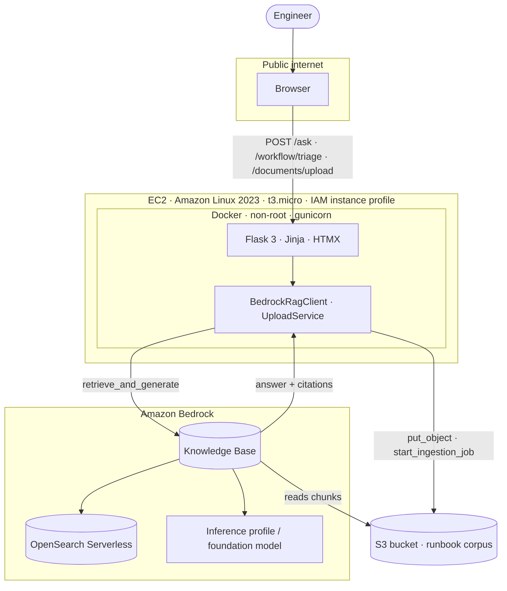

<div align="center">

# IncidentIQ · Bedrock RAG

### Topic-based RAG web app on Amazon Bedrock — Flask · boto3 · Docker · EC2

**Ask in plain English. Answer from your own runbooks. Cite every chunk. Refuse when unsure.**

<br/>

[]()
[]()
[]()

<br/>


</div>

---

## Table of contents

- [Overview](#overview)
- [Features](#features)
- [Architecture](#architecture)
- [How it works](#how-it-works)
- [Project structure](#project-structure)
- [Configuration](#configuration)
- [Quickstart (local)](#quickstart-local)
- [Deploy to EC2](#deploy-to-ec2)
- [HTTP API](#http-api)
- [Testing and validation](#testing-and-validation)
- [Example questions](#example-questions)
- [Screenshots](#screenshots)
- [Security and best practices](#security-and-best-practices)
- [Knowledge Base corpus](#knowledge-base-corpus)
- [Submission checklist](#submission-checklist)
- [Cleanup confirmation](#cleanup-confirmation)
- [Public URL used during testing](#public-url-used-during-testing)
- [Documentation index](#documentation-index)
- [Course context](#course-context)
- [Author](#author)

---

## Overview

A **topic-based Retrieval-Augmented Generation web app** for the assignment *Build a Topic-Based RAG Web App with Amazon Bedrock, Flask, Docker, and EC2*.

| Layer | Choice |
|-------|--------|
| **Topic** | Incident Operations — runbooks, SOPs, escalation policies for NOC / DevOps / SRE |
| **Knowledge Base** | Amazon Bedrock KB on OpenSearch Serverless, fed from S3 runbook documents |
| **Web app** | Flask + Jinja + HTMX, IncidentIQ-inspired dark NOC theme, hand-crafted CSS |
| **RAG call** | Single `boto3` `bedrock-agent-runtime.retrieve_and_generate` → grounded answer + citations |
| **Container** | gunicorn, non-root user, Docker healthcheck |
| **Deployment** | Amazon Linux 2023 EC2 (t3.micro) with **IAM instance profile** — no AWS keys on disk |

> Sibling project: a fuller stack in [`../incident-assistant-rag/`](../incident-assistant-rag/) (FastAPI + OpenAI + FAISS + React). This repo uses the **Flask + Bedrock** stack required by the assignment.

---

## Features

What you get on `http://localhost:8080/` (section order matches [`app/templates/index.html`](app/templates/index.html)):

| Section | ID | Behavior |
|---------|-----|----------|
| **MVP workflow** | `#mvp` | Pick a P1/P2/P3 alert → **Run triage** (live Bedrock) → KB match, suggested actions, recommendation + MTTR metrics → **Mark alert as resolved**. Business impact saved in browser `localStorage` (session-only UX metric). |
| **Interactive architecture** | `#architecture` | Click S3 / KB / Flask / LLM blocks → inline detail panel with example tool calls |
| **Document upload** | `#document-upload` | Multipart upload to S3 + optional **Sync to KB** (`StartIngestionJob`) |
| **Live KB** | `#live-kb` | Free-form question → `/ask` → citation cards or graceful refusal |
| **System guide** | dialog | Top nav or hero **How it works** opens [`_system_guide.html`](app/templates/_system_guide.html): Browser → Flask → Bedrock KB → LLM → UI |
| **Flow** | `#flow` | Static step-by-step assignment narrative + link to system guide |

Design is ported from the IncidentIQ reference (React/shadcn) to **Flask + HTMX** — no Vite/React build in this repo.

Edge-case behavior: [`docs/edge_cases.md`](docs/edge_cases.md).

---

## Architecture



Single Bedrock retrieve-and-generate call per Q&A or triage = small surface area, easy to grade, clean seam for MCP in Part 2.

Deep dive: [`docs/architecture.md`](docs/architecture.md).

---

## How it works

**Live KB / triage request path:**

1. Browser sends HTMX `POST` with CSRF token (`/ask` or `/workflow/triage`).
2. Flask validates the question in [`app/validators.py`](app/validators.py) — no AWS call on bad input.
3. `BedrockRagClient.ask()` calls `RetrieveAndGenerate` with your KB ID and model ARN.
4. Citations are mapped to human-readable runbook basenames (not raw S3 URIs in the UI).
5. Jinja partial swaps into the page (`_answer.html` or `_workflow_result.html`).

**Upload path:** validate file → S3 `PutObject` under `S3_PREFIX` → optional `StartIngestionJob` when `BEDROCK_DATA_SOURCE_ID` is set.

Open the in-app **How it works** dialog (top nav or hero) for the full five-step diagram, or read [`docs/architecture.md`](docs/architecture.md).

---

## Project structure

```text
incident-rag-bedrock/
├── app/
│   ├── __init__.py              # App factory, CSRF, logging
│   ├── config.py                # Typed env loading (fails fast)
│   ├── routes.py                # /, /ask, /workflow/triage, /documents/upload, /health
│   ├── bedrock_client.py        # RetrieveAndGenerate wrapper
│   ├── upload_service.py        # S3 put + optional KB ingestion job
│   ├── upload_validators.py     # Upload file rules
│   ├── validators.py            # Question validation (shared)
│   ├── errors.py                # boto3 ClientError → BedrockError
│   ├── text_utils.py · data_loader.py
│   ├── data/
│   │   ├── workflow_alerts.json # MVP alert fixtures (UI only)
│   │   └── example_questions.json
│   ├── templates/
│   │   ├── base.html · index.html
│   │   ├── _hero · _problem · _mvp_workflow · _workflow_result
│   │   ├── _architecture · _document_upload · _upload_result
│   │   ├── _live_kb · _answer · _flow · _stack · _deliverables
│   │   └── _system_guide.html   # Architecture dialog
│   └── static/
│       ├── css/styles.css       # Design tokens, neon-ring utilities
│       └── js/app.js            # Alert picker, stages, system guide, upload checks
├── tests/                       # 89 offline tests (Stubber + fakes)
├── scripts/
│   ├── kb_smoke_test.py         # Live Bedrock smoke (6/6)
│   ├── capture_screenshots.mjs  # Playwright proof captures (not CI)
│   ├── verify_e2e.py · build_corpus.py
│   └── capture_*_proof.mjs      # AWS/EC2 CLI screenshot helpers
├── evaluation/                  # Generated smoke_results.md, qa_showcase.md
├── data/sample_documents/       # 10-file corpus (see corpus section)
├── infra/                       # IAM policy, EC2 user-data, S3 upload script
├── docs/                        # Setup, deploy, edge cases, cleanup
├── screenshots/                 # 19 submission PNGs
├── Dockerfile · docker-compose.yml · wsgi.py · requirements.txt
├── .env.example · pytest.ini
└── README.md
```

---

## Configuration

Copy [`.env.example`](.env.example) to `.env` and fill in values from the Bedrock console.

| Variable | Required | Purpose |
|----------|----------|---------|
| `AWS_REGION` | Yes | Region where the KB lives |
| `BEDROCK_KB_ID` | Yes | Knowledge Base ID |
| `BEDROCK_MODEL_ARN` | Yes | Foundation model or **inference profile** ARN |
| `BEDROCK_NUM_RESULTS` | No (default `5`) | Chunks retrieved per query |
| `S3_BUCKET` | For upload | Corpus bucket; upload disabled if blank |
| `S3_PREFIX` | For upload | Key prefix under bucket |
| `BEDROCK_DATA_SOURCE_ID` | For KB sync | Enables post-upload ingestion job |
| `MAX_UPLOAD_BYTES` | No (default 5 MB) | Upload size cap |
| `FLASK_SECRET_KEY` | Yes | CSRF and session signing |
| `FLASK_ENV` | Recommended | `development` locally, `production` on EC2 |

**Credentials:** No `AWS_ACCESS_KEY_ID` in `.env` on purpose. EC2 uses an **IAM instance profile**. Locally, use `aws configure` or `AWS_PROFILE`.

**Model ARN note:** Legacy Claude 3 Haiku foundation-model IDs may be blocked. Prefer an inference profile (e.g. Nova Lite or an active Anthropic Haiku profile after completing the Bedrock use-case form).

---

## Quickstart (local)

See [`docs/development_environment.md`](docs/development_environment.md) for Cursor vs AWS Console setup.

**Prerequisites:** Python 3.12+, Docker Desktop, AWS account with Bedrock access, AWS CLI configured.

1. **Create the Bedrock Knowledge Base** — [`docs/bedrock_kb_setup.md`](docs/bedrock_kb_setup.md). Copy KB ID and model ARN.

2. **Configure environment:**
   ```powershell
   cd projects/incident-rag-bedrock
   Copy-Item .env.example .env
   # Edit .env: AWS_REGION, BEDROCK_KB_ID, BEDROCK_MODEL_ARN, FLASK_SECRET_KEY
   ```

3. **Run with Docker:**
   ```powershell
   docker compose up --build
   # → http://localhost:8080
   ```

   Or with Python directly:
   ```bash
   python -m venv .venv && source .venv/bin/activate
   pip install -r requirements.txt
   gunicorn -b 0.0.0.0:8080 wsgi:app
   ```

4. **Try it:**
   - `#mvp` — select an alert, click **Run triage**, then **Mark alert as resolved**
   - `#live-kb` — ask *"How do I triage an authentication service incident?"*
   - **How it works** — open the system architecture dialog

---

## Deploy to EC2

Full walkthrough: [`docs/ec2_deployment.md`](docs/ec2_deployment.md).

1. Push image to GHCR: `docker push ghcr.io/<you>/incident-rag-bedrock:demo` (public)
2. Create IAM role `incident-rag-ec2-role` from [`infra/iam_policy.json`](infra/iam_policy.json)
3. Launch **t3.micro** Amazon Linux 2023 with that role; SG: **22/tcp from your IP**, **80/tcp from anywhere**
4. User-data: [`infra/ec2_user_data.sh`](infra/ec2_user_data.sh) (replace `<IMAGE>`)
5. `scp .env` to the instance
6. Open `http://<EC2_PUBLIC_DNS>/`

---

## HTTP API

| Method | Path | Response |
|--------|------|----------|
| `GET` | `/` | Full homepage (all sections) |
| `GET` | `/health` | `{"status":"ok"}` |
| `POST` | `/ask` | `_answer.html` HTMX partial, or JSON with `Accept: application/json` / `?format=json` |
| `POST` | `/workflow/triage` | `_workflow_result.html` — alert triage with recommendation + metrics |
| `POST` | `/documents/upload` | `_upload_result.html` — multipart file + optional `sync_to_kb` checkbox |

Validation errors return `400` with stable codes (`empty_question`, `missing_file`, etc.). Bedrock/boto failures return `502` with mapped codes from [`app/errors.py`](app/errors.py). Details: [`docs/edge_cases.md`](docs/edge_cases.md).

---

## Testing and validation

### Unit tests (offline)

```powershell
cd projects/incident-rag-bedrock
py -3.12 -m pip install -r requirements.txt
py -3.12 -m pytest -v
```

**Expected: 89 passed** — no live AWS calls (Stubber + injected fakes).

| File | Coverage |
|------|----------|
| `test_health.py` | `/health` returns `{"status":"ok"}` |
| `test_config.py` | Missing/blank env vars → `ConfigError`; defaults; numeric coercion |
| `test_errors.py` | `translate()` for `ClientError`, `BotoCoreError`, unknown |
| `test_validators.py` | Empty, short, oversize, stopwords-only questions |
| `test_routes.py` | `/ask` HTML+JSON; workflow triage; HTMX partials; XSS escape; system guide + workflow markup on index; grounded / no-match; 502 paths |
| `test_bedrock_client.py` | Happy path; errors; citations; `latency_ms`; `to_dict()` |
| `test_upload_validators.py` | Missing file, unsupported type, empty/oversize |
| `test_upload_routes.py` | Success; `missing_file`, `empty_file`, `file_too_large`; S3 502; disabled upload |
| `test_upload_service.py` | S3 `put_object`; optional `start_ingestion_job`; `_object_key` prefix |

There is **no separate frontend unit test suite** (no Vitest/Jest). UI behavior is covered by server-rendered HTML assertions in `test_routes.py`. Playwright under `scripts/` is for **manual screenshot capture**, not CI gates.

### End-to-end validation (local + live Bedrock)

```powershell
docker compose up --build -d
Invoke-WebRequest http://localhost:8080/health   # {"status":"ok"}

py -3.12 -m pytest -v                            # 89/89

py -3.12 scripts/kb_smoke_test.py                # 6/6 live KB
# → evaluation/smoke_results.md, evaluation/qa_showcase.md

cd scripts; npm install; npx playwright install chromium
node capture_screenshots.mjs                     # screenshots 07–09, 11–19
```

| Check | Success criteria |
|-------|------------------|
| `pytest` | 89/89 pass |
| `kb_smoke_test.py` | 6/6 (4 grounded + 1 refusal + 1 validation) |
| `/health` | HTTP 200 |
| Screenshots | `07`–`09`, `11`–`19` in [`screenshots/`](screenshots/) |

See [`screenshots/README.md`](screenshots/README.md), [`evaluation/test_questions.json`](evaluation/test_questions.json), [`docs/code_review.md`](docs/code_review.md).

---

## Example questions

- *"What should I check first when users cannot log in after a deployment?"*
- *"How do I triage an authentication service incident?"*
- *"Which runbook should I follow for database connectivity issues?"*
- *"What are the escalation steps for a P1 production outage?"*

Off-topic questions → amber **Not in knowledge base** card (`grounded=false`). No hallucinated procedures.

---

## Screenshots

Captured into [`screenshots/`](screenshots/) — **19 PNGs** total.

| # | File | Shows |
|---|------|-------|
| 01 | `01_bedrock_kb_overview.png` | Bedrock Knowledge Base detail page |
| 02 | `02_bedrock_kb_data_source_synced.png` | Data source status = **Available** |
| 03 | `03_bedrock_model_access_granted.png` | Model access enabled |
| 04 | `04_ec2_instance_running.png` | EC2 console with public DNS |
| 05 | `05_security_group_rules.png` | SG: SSH from my IP, HTTP from anywhere |
| 06 | `06_docker_ps_on_ec2.png` | `docker ps` → `Up (healthy)` |
| 07 | `07_app_homepage_public.png` | Hero, sticky nav, Live KB section |
| 08 | `08_app_question_and_answer.png` | Grounded answer + citation labels |
| 09 | `09_app_refusal_or_low_confidence.png` | **Not in knowledge base** refusal |
| 10 | `10_cleanup_console.png` | AWS console after teardown |
| 11 | `11_pytest_passed.png` | `pytest` output (89 tests) |
| 12 | `12_kb_smoke_evaluation.png` | Live KB smoke test — 6/6 PASS |
| 13 | `13_mvp_workflow.png` | MVP alert console + live triage result |
| 14 | `14_architecture.png` | Interactive architecture panel |
| 15 | `15_document_upload_success.png` | Upload success + optional KB sync |
| 16 | `16_document_upload_validation.png` | Client validation (missing file) |
| 17 | `17_document_upload_type_rejected.png` | Unsupported file type blocked |
| 18 | `18_dataset_corpus.png` | 10-document corpus catalog |
| 19 | `19_sample_questions_answers.png` | Live Q&A showcase (4 grounded + 1 refusal) |

**Capture methods:** `01`–`06` and `10` — AWS Console or CLI scripts in `scripts/`; `07`–`09` and `11`–`19` — [`scripts/capture_screenshots.mjs`](scripts/capture_screenshots.mjs). See [`screenshots/README.md`](screenshots/README.md).

---

## Security and best practices

- **IAM instance profile** — no `AWS_ACCESS_KEY_ID` on EC2
- **Scoped IAM policy** — Bedrock retrieve/generate + inference profile; S3 read + `PutObject` on KB prefix; optional `StartIngestionJob`
- **SSH locked to your IP** (not `0.0.0.0/0`)
- **Non-root container**, `HEALTHCHECK`, **gunicorn** (not Flask dev server)
- **CSRF** on ask, workflow, and upload forms (Flask-WTF)
- **Server-side validation** (questions 1–500 chars; upload type/size whitelist)
- **`.env` gitignored**; `.env.example` only in repo
- **Graceful refusal** when KB returns no citations
- **MVP metrics** (`localStorage`) are client-side session UX only — not authoritative incident records

---

## Knowledge Base corpus

**10 documents, 5 formats** — generated by [`scripts/build_corpus.py`](scripts/build_corpus.py) under [`data/sample_documents/`](data/sample_documents/).

| Format | Count | Files |
|--------|-------|-------|
| **MD** | 3 | `auth_service_runbook.md`, `database_connectivity_runbook.md`, `monitoring_alerts_reference.md` |
| **TXT** | 2 | `api_gateway_5xx_runbook.txt`, `payment_service_latency_runbook.txt` |
| **CSV** | 1 | `incident_history.csv` |
| **DOCX** | 2 | `deployment_rollback_sop.docx`, `postmortem_template.docx` |
| **PDF** | 2 | `escalation_policy.pdf`, `on_call_handoff_checklist.pdf` |

Rebuild locally:
```bash
pip install reportlab python-docx
python scripts/build_corpus.py
```

Upload to S3:
```bash
BUCKET=reem-amdocs-ai-artifacts-3331 ./infra/upload_docs_to_s3.sh
# → s3://reem-amdocs-ai-artifacts-3331/projects/incident-rag-bedrock/data/sample_documents/
```

Then **Sync** the Bedrock KB data source. Detail: [`data/sample_documents/README.md`](data/sample_documents/README.md).

---

## Submission checklist

| Required item | Location |
|---------------|----------|
| **Topic chosen** | Incident Operations — NOC / SRE runbooks |
| **Documents used** | 10 files in [`data/sample_documents/`](data/sample_documents/) |
| **S3 bucket + prefix** | `s3://reem-amdocs-ai-artifacts-3331/projects/incident-rag-bedrock/data/sample_documents/` |
| **Bedrock KB ID** | `RBTJM6NIG9` — [`docs/bedrock_kb_setup.md`](docs/bedrock_kb_setup.md) |
| **How the app works** | Corpus → S3 sync → KB ingest → Flask (`/ask`, `/workflow/triage`, optional `/documents/upload`) → `retrieve_and_generate` → grounded answer + citations |
| **MVP workflow proof** | Screenshot `13_mvp_workflow.png` |
| **Upload proof** | Screenshots `15`–`17` |
| **Code** | [`wsgi.py`](wsgi.py), [`app/`](app/), [`requirements.txt`](requirements.txt), [`Dockerfile`](Dockerfile) |
| **Screenshots** | **19 PNGs** in [`screenshots/`](screenshots/) — table above |
| **Public URL** | [Public URL used during testing](#public-url-used-during-testing) |
| **Cleanup note** | [Cleanup confirmation](#cleanup-confirmation) |

**End-to-end chain:** documents → Bedrock Knowledge Base → Flask + boto3 → Docker → EC2 → public access → cleanup.

---

## Cleanup confirmation

> **Demo EC2 resources deleted on 2026-05-31:**
> EC2 instance `i-03d3c5a59e849e5cf` (`incident-rag-demo`, terminated),
> security group `sg-0b405b6a42325979e` (`incident-rag-sg`),
> IAM instance profile `incident-rag-ec2-profile`,
> IAM role `incident-rag-ec2-role` (inline Bedrock + ECR policy removed first).

**Retained for course reuse:** Bedrock Knowledge Base `RBTJM6NIG9`, S3 bucket `reem-amdocs-ai-artifacts-3331` (prefix `projects/incident-rag-bedrock/data/sample_documents/`), ECR image `incident-rag-bedrock:demo`.

Full log: [`docs/cleanup_log.md`](docs/cleanup_log.md) · procedure: [`docs/cleanup_checklist.md`](docs/cleanup_checklist.md)

---

## Public URL used during testing

```
http://ec2-100-53-32-194.compute-1.amazonaws.com/
```

Used for screenshots `04`–`09` (homepage, grounded Q&A, refusal). Instance terminated immediately after capture.

---

## Documentation index

| Doc | Purpose |
|-----|---------|
| [`docs/bedrock_kb_setup.md`](docs/bedrock_kb_setup.md) | Create and sync the Knowledge Base |
| [`docs/development_environment.md`](docs/development_environment.md) | Local dev vs AWS Console |
| [`docs/ec2_deployment.md`](docs/ec2_deployment.md) | EC2 launch and smoke test |
| [`docs/architecture.md`](docs/architecture.md) | Components and request flow |
| [`docs/edge_cases.md`](docs/edge_cases.md) | Validation, workflow, upload edge cases |
| [`docs/code_review.md`](docs/code_review.md) | Self-review notes (upload + RAG stack) |
| [`docs/cleanup_checklist.md`](docs/cleanup_checklist.md) | Mandatory tear-down steps |
| [`docs/cleanup_log.md`](docs/cleanup_log.md) | What was deleted vs retained |
| [`screenshots/README.md`](screenshots/README.md) | How to regenerate proof PNGs |
| [`screenshots/deployment_validation.md`](screenshots/deployment_validation.md) | Latest automated check log |
| [`data/sample_documents/README.md`](data/sample_documents/README.md) | Corpus catalog |

---

## Course context

Built for the **AI-Augmented Software Engineering** course assignment *"Build a Topic-Based RAG Web App with Amazon Bedrock, Flask, Docker, and EC2."*

This is **Part 1**. Part 2 will wrap `BedrockRagClient.ask()` as an **MCP tool** so the same Knowledge Base is available to other AI agents.

---

## Author

**Re'em Mor** — [@reem-mor](https://github.com/reem-mor)
