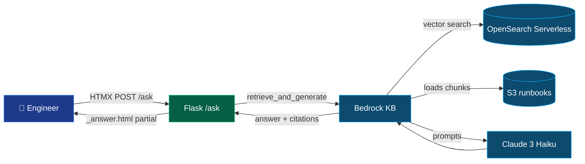

# Architecture

## Components

| Layer | Choice | Why |
|---|---|---|
| Web framework | **Flask 3 + Jinja + HTMX** | Matches assignment spec ("HTML templates, CSS files"); HTMX gives a snappy single-page feel without a JS framework. |
| WSGI server | **gunicorn (2 workers)** | Production-standard; never ship the Flask dev server. |
| RAG backend | **Bedrock `RetrieveAndGenerate`** | One API call returns answer + citations; KB handles embedding, retrieval, and prompt assembly. Clean seam to wrap as an MCP tool later. |
| Foundation model | **Claude 3 Haiku** | Cheap, fast, great quality for MVP. |
| Embeddings | **Titan Text Embeddings V2** | KB default; no manual embedding code needed. |
| Vector store | **OpenSearch Serverless** (KB-managed) | Auto-provisioned; no infrastructure to write. |
| Source of truth | **S3 bucket** of runbook docs | Single source the KB syncs from. |
| Container | **python:3.12-slim + non-root user** | Small, secure base. |
| Host | **EC2 t3.micro + IAM instance profile** | Free-tier, no AWS keys on disk. |

## Request flow

## Why this design impresses

- **Single Bedrock API call** = minimum surface area for an MVP. Less code to fail, easier for a teacher to grade.
- **Citations rendered as evidence cards** prove the answer is grounded.
- **Graceful refusal** when no citations are returned — no hallucination.
- **IAM instance profile** instead of access keys.
- **gunicorn, non-root container, healthcheck, CSRF** — production patterns at MVP scope.
- **Clean `BedrockRagClient.ask()`** seam ready for the next assignment step (MCP).
