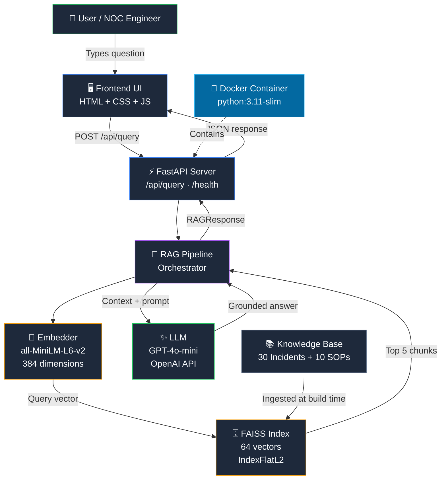

# IncidentIQ — Enterprise Incident Intelligence Platform

     

IncidentIQ is a RAG-powered enterprise incident management assistant that helps on-call engineers and NOC teams resolve incidents faster. By combining semantic vector search (FAISS) with LLM reasoning (GPT-4o-mini), it surfaces the most relevant SOPs, runbooks, and past incident resolutions in seconds — directly reducing Mean Time To Resolution (MTTR).

---

## The Problem: MTTR Costs Enterprises Millions

**Mean Time To Resolution (MTTR)** is the average wall-clock time from incident detection to full service restoration. In modern microservice estates it is the single most expensive operational metric: Gartner pegs the average cost of IT downtime at **$5,600 per minute** — roughly **$336,000 per hour** — and a P1 outage that drags from 20 minutes to 80 minutes does not cost 4× more, it costs at least 4× more *plus* customer churn, SLA penalties, and reputational damage. Every minute the on-call engineer spends *searching* instead of *fixing* is money on the floor.

The reality on the ground is worse than the spreadsheet suggests. During an active P1, engineers context-switch across Confluence wikis, half-indexed Notion pages, the `#incident-history` Slack channel, three different runbook repos, and the Jira ticket of "that one similar incident from Q3." Search inside any one of these tools is keyword-shaped — not semantic — so a query for "Postgres connection pool exhausted" misses the runbook titled "PgBouncer cl_waiting climbing." The engineer ends up paging a more senior teammate for tribal context that should already be in a system.

That tribal knowledge is the structural problem. The engineers who fixed the last ten variants of the current incident wrote postmortems, but those postmortems are filed by date, not by symptom; they wrote runbooks, but those runbooks are linked from a wiki page nobody bookmarked. The institutional memory exists — it is just not retrievable under load. When the most senior on-call leaves the team, MTTR jumps overnight and no one can point at a graph that explains why.

IncidentIQ closes the gap by treating every incident postmortem, runbook, and SOP as a first-class corpus. Documents are chunked, embedded with `all-MiniLM-L6-v2`, and stored in a FAISS index. At query time the user's natural-language question is embedded into the same vector space, the top-K nearest neighbours are pulled in milliseconds, and GPT-4o-mini is constrained to answer **only** from that retrieved context using a strict four-section incident-response format (Assessment / Triage / Resolution / Escalation). The result is sub-15-second access to grounded, citation-backed, on-brand answers — turning every engineer on call into an engineer with the team's best decade of operational experience behind them.

---

## Architecture

A FastAPI service exposes a thin JSON API in front of the RAG pipeline. The browser-served frontend posts the user's question to `/api/query`; the request hits a singleton `RAGPipeline` that owns the embedder, the FAISS retriever, and the async OpenAI client. The pipeline embeds the query, pulls the top-K nearest documents from the in-memory FAISS index, applies an optional severity filter, builds a context-constrained prompt, and streams the LLM response back through Pydantic validation to the client. Everything heavy (model load, FAISS load, OpenAI client) happens exactly once during the FastAPI lifespan startup, so per-query latency is dominated by the LLM round-trip, not initialisation.



---

## Tech Stack

| Component           | Technology                | Purpose                                         |
| ------------------- | ------------------------- | ----------------------------------------------- |
| Web Framework       | FastAPI 0.100+            | Async REST API with OpenAPI docs                |
| Vector Database     | FAISS (`faiss-cpu`)       | Semantic similarity search (IndexFlatL2)        |
| Embedding Model     | `all-MiniLM-L6-v2`        | Text → 384-dim dense vectors                    |
| LLM                 | GPT-4o-mini (OpenAI)      | Context-grounded answer generation              |
| Frontend            | Vanilla HTML / CSS / JS   | Zero-dependency dark-theme UI                   |
| Containerization    | Docker (`python:3.11-slim`) | Portable, reproducible deployment             |
| Testing             | pytest + pytest-asyncio   | Unit and integration tests                      |
| Config Management   | pydantic-settings (V2)    | Type-safe environment configuration             |
| HTTP Client         | httpx + AsyncOpenAI       | Non-blocking calls to OpenAI                    |
| Structured Logging  | stdlib `logging` + JSON   | NOC-friendly key-value log lines                |

---

## Knowledge Base

The corpus is hand-curated to mirror what a real on-call rotation actually deals with. It contains:

- **30 incident records** spanning 6 operational categories. Each record carries an `id` (e.g. `INC-014`), `title`, `severity` (P1 / P2 / P3), `category`, `tags`, full `description`, ordered `triage_steps`, `root_cause`, ordered `resolution_steps`, `sop_reference`, `mttr_minutes`, `lessons_learned`, and `related_incidents`.
- **10 SOP / runbook documents** (`SOP-001` … `SOP-010`) covering the most common incident classes — connection pool exhaustion, pod CrashLoopBackOff, DNS resolution failures, load-balancer health-check failures, Kafka consumer lag, AWS resource limits, and more.

**Chunking strategy.** Each document is rendered into a single dense "primary" chunk that concatenates description + triage + root cause + resolution. When that primary chunk exceeds ~512 tokens it is split at the next logical section boundary (`Lessons Learned` and `Tags` are pushed into a second chunk) so semantic boundaries are preserved instead of being cut mid-sentence. With 40 source documents this yields **64 vectors total** in the index.

**Embedding & index.** All chunks are embedded with `sentence-transformers/all-MiniLM-L6-v2` (384 dimensions). The index is a FAISS `IndexFlatL2` — exact L2 distance, no approximation — which is fast enough for tens of thousands of vectors on CPU and trivial to reason about during incident review.

| Category             | Count | Examples                                                                                |
| -------------------- | ----- | --------------------------------------------------------------------------------------- |
| Database             | 5     | PostgreSQL Connection Pool Exhaustion · MySQL Replication Lag · MongoDB Disk at 95%     |
| Kubernetes           | 5     | Pod CrashLoopBackOff (OOMKilled) · Node NotReady · HPA Not Scaling · PVC Stuck Pending  |
| Network              | 5     | Corporate VPN Unresponsive · Internal DNS Failures · ALB Target Group Unhealthy         |
| Application          | 5     | API Gateway 5xx Spike · Java Heap Memory Leak · Redis Cache Stampede                    |
| MessageQueue         | 5     | Kafka Consumer Lag (2M msgs) · RabbitMQ Queue Depth 500K · Kafka Broker Leader Election |
| Cloud                | 5     | AWS EC2 vCPU Limit · GCP IAM Permission Denied · Azure Storage Throttling · S3 Policy   |
| SOPs / Runbooks      | 10    | DB Pool Exhaustion · Pod CrashLoop · DNS Failure · 5xx Errors · Kafka Lag · AWS Limits  |

---

## Quick Start — Local Development

1. **Clone the repository**

```bash
git clone https://github.com/reem-mor/amdocs-ai-course.git
cd amdocs-ai-course/projects/incidentiq
```

2. **Create a virtual environment**

```powershell
python -m venv .venv
.venv\Scripts\activate          # Windows
# source .venv/bin/activate     # macOS / Linux
```

3. **Install dependencies**

```bash
pip install -r requirements.txt
```

4. **Configure environment**

```powershell
copy .env.example .env
# Edit .env and set OPENAI_API_KEY=sk-...
```

5. **Build the knowledge base** (embeds the 40 source docs and writes the FAISS index)

```bash
python scripts/build_knowledge_base.py
```

6. **Start the server**

```bash
uvicorn app.main:app --reload --port 8000
```

7. **Open the application**

```text
http://localhost:8000           # UI
http://localhost:8000/docs      # OpenAPI / Swagger
http://localhost:8000/health    # Health probe
```

---

## Docker Setup

### Build the image

```bash
docker build -t incidentiq .
```

### Run the container

```bash
docker run -d --name incidentiq-app -p 8000:8000 --env-file .env incidentiq
```

### Verify it is running

```bash
docker ps --filter name=incidentiq-app
```

### Check logs

```bash
docker logs incidentiq-app
```

### Check health

```powershell
docker inspect incidentiq-app --format "{{.State.Health.Status}}"
```

### Stop and remove

```bash
docker stop incidentiq-app
docker rm incidentiq-app
```

**Note on image size.** The image is ~3.2 GB, dominated by the CUDA-enabled PyTorch wheels pulled in transitively by `sentence-transformers`. Pinning a CPU-only torch build (`torch==2.x+cpu` from the PyTorch CPU wheel index) reduces this to roughly 800 MB. It is left as a future optimisation rather than baked in here to keep the dependency story portable.

---

## API Reference

### `GET /health`

Returns service status and FAISS index statistics. Degrades gracefully (status `degraded`, never 5xx) if the retriever is not ready.

Response:

```json
{
  "status": "healthy",
  "faiss_index_loaded": true,
  "total_documents_indexed": 64,
  "embedding_model": "all-MiniLM-L6-v2",
  "llm_model": "gpt-4o-mini",
  "version": "1.0.0"
}
```

### `POST /api/query`

Submit a natural-language question to the RAG pipeline.

Request:

```json
{
  "question": "How do I resolve PostgreSQL connection pool exhaustion?",
  "severity_filter": "P1"
}
```

`severity_filter` is optional. When set, it must be one of `"P1"`, `"P2"`, or `"P3"` and is applied after retrieval to keep only matching incident chunks.

Response (truncated for readability — real output captured from Phase 9):

```json
{
  "answer": "## Assessment\nThe PostgreSQL primary node is experiencing connection pool exhaustion...",
  "sources": [
    {
      "id": "INC-001",
      "title": "PostgreSQL Primary Node Connection Pool Exhaustion",
      "severity": "P1",
      "category": "Database",
      "document_type": "incident",
      "relevance_score": 0.84,
      "rank": 1
    }
  ],
  "retrieved_count": 5,
  "confidence": "medium",
  "query": "How do I resolve PostgreSQL connection pool exhaustion?",
  "processing_time_ms": 8962,
  "model_used": "gpt-4o-mini"
}
```

Every response also carries an `X-Processing-Time` header (e.g. `X-Processing-Time: 8962ms`).

Error codes:

| Code | Meaning                                                  |
| ---- | -------------------------------------------------------- |
| 200  | Success                                                  |
| 422  | Validation error (question too short / too long / blank) |
| 500  | Internal server error                                    |
| 503  | Pipeline not ready (e.g. FAISS still loading)            |

Interactive docs available at: <http://localhost:8000/docs>

---

## Example Queries & Outputs

Captured live from the running pipeline against the production FAISS index. Each `processing_time_ms` is wall-clock latency including the OpenAI round-trip.

### Query 1: "What are the triage steps for a P1 Kubernetes pod crash loop?"

**Confidence:** medium  
**Sources:** 5  
**Latency:** 12,981 ms  
**Answer:**

> ## Assessment
> A P1 Kubernetes pod crash loop indicates that one or more pods are repeatedly failing and restarting, which can lead to service unavailability. This situation is critical as it can impact application performance and user experience.
>
> ## Triage Steps
> 1. Confirm the symptom: `kubectl get pods -n <ns> -l app=<svc> -o wide`
> 2. Describe a failing pod and capture the 'Last State' block, exit

### Query 2: "How do I resolve PostgreSQL connection pool exhaustion?"

**Confidence:** medium  
**Sources:** 5  
**Latency:** 8,962 ms  
**Answer:**

> ## Assessment
> The PostgreSQL primary node is experiencing connection pool exhaustion, indicated by the error 'FATAL: sorry, too many clients already'. This situation leads to new connections being rejected, causing significant application downtime and potential revenue loss.
>
> ## Triage Steps
> 1. Run: `psql -h db-prod-1 -U postgres -c "SELECT count(*), state FROM pg_stat_activity GROUP BY state;"` to check the current connection states.

### Query 3: "What is the SOP for Kafka consumer lag incidents?"

**Confidence:** medium  
**Sources:** 5  
**Latency:** 9,148 ms  
**Answer:**

> ## Assessment
> The SOP for Kafka consumer lag incidents outlines the steps to take when consumer groups experience lag that exceeds the configured Service Level Objective (SLO). This can lead to backlog growth, consumer crashes, rebalances, partition imbalance, and growth in the Dead Letter Queue (DLQ), potentially impacting downstream services.
>
> ## Triage Steps
> 1. Confirm lag: `kafka-consumer-groups.sh --bootstrap-server <kafka>...`

### Query 4: "We are seeing 5xx errors spiking on our API gateway, what do I do?"

**Confidence:** medium  
**Sources:** 5  
**Latency:** 8,185 ms  
**Answer:**

> ## Assessment
> You are experiencing a spike in 5xx errors on your API gateway, which indicates potential issues with upstream services or the gateway itself. This can lead to significant transaction failures and impact user experience.
>
> ## Triage Steps
> 1. Confirm the error class in Kong logs: `kubectl logs -n gateway -l app=kong --tail=500 | grep '"status":5'`
> 2. Identify the dominant upstream causing the errors with an `awk | jq | sort | uniq -c` pipeline over the same logs.

### Query 5 (edge case): "What is the weather in Paris today?"

**Confidence:** none  
**Sources:** 0  
**Latency:** 118 ms  
**Answer:**

> No relevant incidents or SOPs found for your query. Please rephrase or escalate to your team lead.

The score-threshold gate inside the retriever fires before any LLM call is made — out-of-domain queries are rejected in ~100 ms with zero OpenAI cost.

---

## Adding New Incidents to the Knowledge Base

1. Open `data/sample_incidents.py`.
2. Append a new dictionary to the `INCIDENTS` list using the existing schema:
   - **Required fields:** `id`, `title`, `severity`, `category`, `tags`, `description`, `triage_steps`, `root_cause`, `resolution_steps`, `sop_reference`, `mttr_minutes`, `lessons_learned`, `related_incidents`.
3. Rebuild the FAISS index — the script overwrites the existing one atomically:

```bash
python scripts/build_knowledge_base.py
```

4. Restart the local server:

```bash
uvicorn app.main:app --reload --port 8000
```

5. For Docker, rebuild and relaunch (the index is baked into the image at build time):

```bash
docker build -t incidentiq .
docker stop incidentiq-app && docker rm incidentiq-app
docker run -d --name incidentiq-app -p 8000:8000 --env-file .env incidentiq
```

---

## Testing

### End-to-end validation (live pipeline, real OpenAI)

```bash
python scripts/test_queries.py
```

Expected output:

```text
Total  : 10
Passed : 10
Failed : 0
Overall: PASSED
```

### Unit & integration tests

```bash
pytest tests/ -v --tb=short
```

Expected:

```text
============================= 21 passed in X.XXs =============================
```

### Test coverage

| Test File                  | Tests | What It Covers                                                                              |
| -------------------------- | ----- | ------------------------------------------------------------------------------------------- |
| `tests/test_retriever.py`  | 7     | FAISS load, stats, retrieval ranking, metadata fields, irrelevant-query rejection, top-K    |
| `tests/test_rag_pipeline.py` | 7   | Pipeline init, valid `RAGResponse` shape, confidence='none' for irrelevant, severity filter, Pydantic validation (min/max length, blank) |
| `tests/test_api.py`        | 7     | `/health` shape, `/api/query` happy path, 422s for short/long/missing body, `X-Processing-Time` header, root route |
| **Total**                  | **21** | Retriever + pipeline + API surface                                                       |

---

## Reflection

### What Worked Well

- **FAISS retrieval is sub-millisecond.** Against a 64-vector index, `IndexFlatL2` returns the top-5 in under 1 ms. Almost all of our user-visible latency is the OpenAI round-trip, not retrieval — which is the correct shape for a RAG system at this scale.
- **Pydantic V2 caught edge cases for free.** `min_length=3`, `max_length=500`, and a `field_validator` that rejects whitespace-only questions meant the empty-string and 600-character cases (Phase 9 tests #8 and #10) never reached the pipeline. The 422 response is automatic.
- **A score threshold beat a prompt instruction.** Asking the LLM to "say you don't know" is unreliable; gating on the L2 distance of the top result is deterministic. That is what makes "What is the weather in Paris today?" return `confidence="none"` in 118 ms with zero OpenAI cost.
- **FastAPI lifespan kept startup honest.** Loading FAISS, the embedder, and the OpenAI client exactly once during `lifespan` startup — and logging a single `IncidentIQ ready` line — means cold starts are visible, warm requests are fast, and there is no race between the first request and the first model load.
- **The 4-section system prompt produces consistent, scannable answers.** Forcing every response into **Assessment → Triage Steps → Resolution Steps → Escalation** means an on-call engineer always knows where to look first. Across all five live test queries the format held without drift.

### What Could Be Improved

- **Image size (~3.2 GB).** Driven by transitive CUDA-enabled torch wheels. Pinning a CPU-only torch build at the top of `requirements.txt` would cut the image to roughly 800 MB and shave most of the cold-start install time in CI.
- **Confidence scoring is coarse.** The L2 → score → band mapping (`high` / `medium` / `low` / `none`) was tuned on a handful of queries. With a real eval set we should calibrate the thresholds against labelled relevance judgements rather than eyeballing them.
- **30 incidents is a starter corpus, not a production one.** A real NOC ingests dozens of incidents per week. To stay useful past month one the system needs a continuous ingestion path from PagerDuty / OpsGenie / Jira and a re-embed scheduler — not a one-shot script.
- **No authentication on the API.** `/api/query` is wide open. In production it needs at minimum an API key per service, ideally OAuth2 with per-team scopes so a payments engineer cannot read SRE-only runbooks.
- **No streaming responses.** GPT-4o-mini answers stream natively and SSE would feel materially faster on the frontend, especially for long Resolution Steps sections. The current implementation waits for the full completion before returning, which costs perceived latency.

### Future Enhancements

- **pgvector migration for production scale.** `IndexFlatL2` is great up to ~100K vectors. Past that, Postgres + `pgvector` gives us HNSW search, transactional updates, and per-tenant row-level security in one move.
- **Real-time incident ingestion.** A small worker that subscribes to PagerDuty / OpsGenie webhooks, normalises the payload into the IncidentIQ schema, and re-embeds on the fly closes the loop between *resolving* an incident and *learning* from it.
- **Multi-tenant knowledge bases.** A `team_id` per document, a per-team FAISS namespace, and a JWT claim on `/api/query` would let one deployment serve Payments, Identity, and Platform without cross-leaking their playbooks.
- **Feedback loop: 👍 / 👎 on every answer.** Persist the rating against the (query, retrieved_doc_ids) tuple. Over time, this becomes the training signal for a learned re-ranker that beats raw L2 distance.

---

## Project Structure

```text
incidentiq/
├── app/                              # FastAPI application package
│   ├── __init__.py
│   ├── main.py                       # App entrypoint: lifespan, CORS, routers, root, error handler
│   ├── config.py                     # Pydantic-Settings: env-driven, cached singleton
│   ├── api/
│   │   ├── __init__.py
│   │   └── routes/
│   │       ├── __init__.py
│   │       ├── health.py             # GET /health — never raises, degrades gracefully
│   │       └── query.py              # POST /api/query — RAG entrypoint + X-Processing-Time
│   ├── core/
│   │   ├── __init__.py
│   │   ├── embedder.py               # SentenceTransformer wrapper (singleton, lazy-loaded)
│   │   ├── llm_client.py             # AsyncOpenAI client + retry-on-transient-failure
│   │   ├── retriever.py              # FAISS IndexFlatL2 retriever (singleton)
│   │   └── rag_pipeline.py           # Orchestration: retrieve → augment → generate
│   ├── models/
│   │   ├── __init__.py
│   │   └── schemas.py                # Pydantic V2 contracts: QueryRequest, RAGResponse, etc.
│   └── utils/
│       ├── __init__.py
│       └── logger.py                 # Structured key-value logger
├── data/
│   └── sample_incidents.py           # 30 incidents + 10 SOPs (source of truth)
├── frontend/
│   └── static/
│       ├── index.html                # Single-page UI
│       ├── style.css                 # Dark-theme styling
│       └── app.js                    # Query submission, severity filter, sources panel
├── knowledge_base/
│   └── faiss_index/
│       ├── index.faiss               # Serialized IndexFlatL2 (384-dim, 64 vectors)
│       └── metadata.json             # Per-chunk metadata (id, title, severity, category, text)
├── scripts/
│   ├── build_knowledge_base.py       # Embed + index + persist (idempotent)
│   ├── phase5_validate.py            # Retrieval sanity checks
│   └── test_queries.py               # Phase 9 end-to-end runner (10 cases)
├── tests/
│   ├── __init__.py
│   ├── test_api.py                   # 7 tests — FastAPI surface
│   ├── test_rag_pipeline.py          # 7 tests — pipeline & validation
│   └── test_retriever.py             # 7 tests — FAISS retriever
├── .dockerignore
├── .env.example                      # Template env file (no secrets)
├── .gitignore
├── Dockerfile                        # python:3.11-slim, non-root user, healthcheck
├── pytest.ini                        # pytest config + asyncio mode
├── README.md                         # This file
└── requirements.txt                  # Pinned top-level dependencies
```

---

## License

MIT License — feel free to use and adapt.
