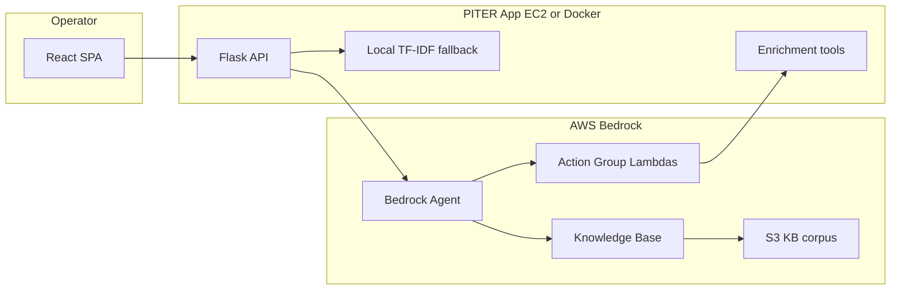
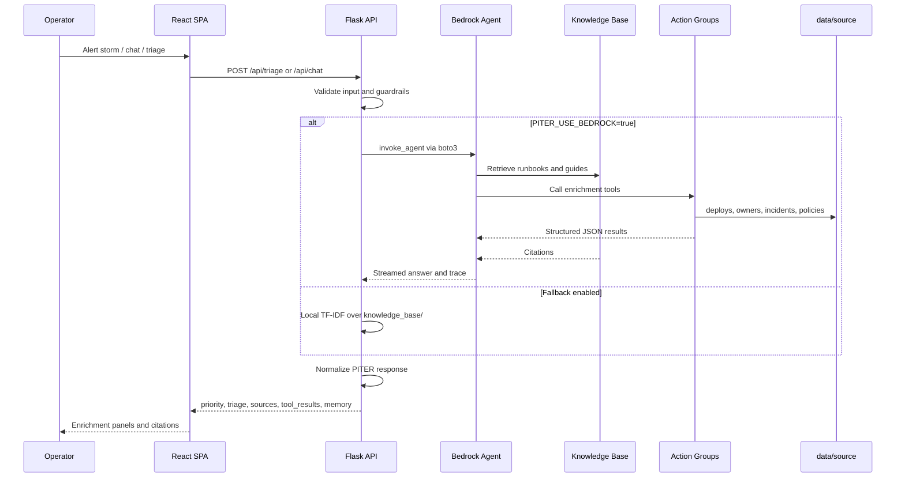
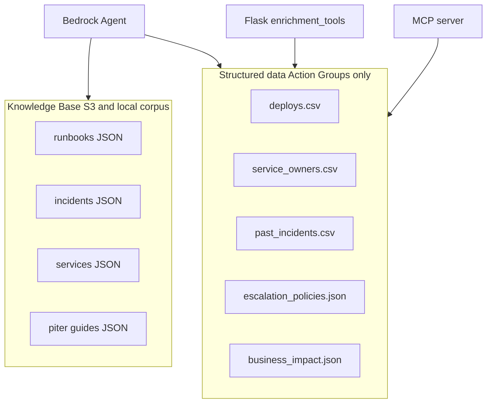
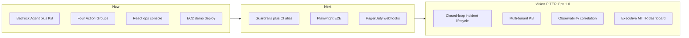

# PITER AiOps

**AI-powered incident response for regulated betting and enterprise production operations.**

[](https://www.python.org/)
[](https://flask.palletsprojects.com/)
[](frontend/)
[](https://aws.amazon.com/bedrock/)
[](docker-compose.yml)
[](tests/)

| | |
|---|---|
| **Live demo** | http://ec2-3-235-22-143.compute-1.amazonaws.com:8080/ |
| **Live KB chat** | http://ec2-3-235-22-143.compute-1.amazonaws.com:8080/#live-kb |
| **MVP triage flow** | http://ec2-3-235-22-143.compute-1.amazonaws.com:8080/#mvp |
| **Local Docker** | http://localhost:8080/ (offline mode by default) |

> [!IMPORTANT]
> Escalation is **preview-only by default** — no auto-SMS or email unless `PITER_ENABLE_LIVE_DISPATCH=true` and notification channels are explicitly configured.

---

## Table of contents

- [What is PITER AiOps?](#what-is-piter-aiops)
- [Business value: MTTR, KPIs, and ROI](#business-value-mttr-kpis-and-roi)
- [Problem and solution](#problem-and-solution)
- [System architecture](#system-architecture)
- [Agent instructions (system prompt)](#agent-instructions-system-prompt)
- [Bedrock Knowledge Base](#bedrock-knowledge-base)
- [Action Groups and Lambda functions](#action-groups-and-lambda-functions)
- [boto3 integration](#boto3-integration)
- [Use cases: input and output](#use-cases-input-and-output)
- [Error handling and safety](#error-handling-and-safety)
- [UI and UX](#ui-and-ux)
- [Backend and API](#backend-and-api)
- [MCP integrations](#mcp-integrations)
- [Cursor skills used](#cursor-skills-used)
- [Testing evidence](#testing-evidence)
- [Challenges faced](#challenges-faced)
- [Next steps and product vision](#next-steps-and-product-vision)
- [Quick start](#quick-start)
- [Documentation index](#documentation-index)

---

## What is PITER AiOps?

PITER AiOps is an AI incident-response assistant for **NOC, DevOps, SRE, and production operations** teams. It combines Amazon Bedrock Agent orchestration, Knowledge Base RAG, structured operational tools, and a React ops console so on-call engineers get **grounded, cited triage guidance in seconds** instead of hunting runbooks under alert pressure.

**PITER** is the operating model every response follows:

| Stage | Meaning |
|-------|---------|
| **P**riority | Classify P1–P4 using severity policy, alert context, and business impact evidence |
| **I**nvestigation | Use KB citations and Action Group tool results only — never invent facts |
| **T**riage | Ordered, reversible steps first; cite the runbook for each step |
| **E**scalation | When P1–P3 or regulatory exposure; name the on-call path from policy |
| **R**esolution | Validation checks, safe recovery path, and post-incident follow-up |

### What this project demonstrates

- Flask backend with normalized PITER API responses
- React + Vite SPA (dark NOC console)
- Amazon Bedrock Agent via `boto3` with Knowledge Base RAG
- Four Bedrock Action Groups backed by Lambda (same logic as local MCP tools)
- Local TF-IDF fallback when Bedrock is unavailable
- Pandas / CSV / JSON operational data layer
- Chat memory and session history
- Docker deployment on EC2
- **279** automated tests plus live AWS smoke scripts

---

## Business value: MTTR, KPIs, and ROI

### Mean time to resolution (MTTR)

On-call engineers typically lose the **first 5–15 minutes** of an incident searching for the right runbook, past ticket, or post-mortem. PITER compresses that discovery phase by:

- **Deployment correlation** — links alert time to recent deploys (`piter-recent-deployments`)
- **Similar-incident baselines** — surfaces historical root cause, resolution, and prior MTTR (`piter-similar-incidents`)
- **Structured triage** — five PITER fields in every response so operators act instead of reformatting chat output

The demo UI tracks illustrative session KPIs (e.g. **31 min MTTR reduced** vs baseline). These are **demo estimates for presentation**, not production metrics.

### Key performance indicators (KPIs)

| KPI | What PITER measures or improves |
|-----|----------------------------------|
| P1 detection time | Alert storm view ranks P1 candidates; triage card assigns priority with evidence |
| Escalation accuracy | `piter-escalation` previews owner, policy path, and regulatory triggers |
| Citation grounding rate | KB retrieval + agent trace; smoke tests assert `grounded=true` |
| Tool enrichment coverage | Four tools run on triage; `/api/tools/status` reports readiness |
| Session memory continuity | Follow-up questions reuse context without repeating full triage |

### Return on investment (ROI)

Demo business-impact data ([`data/source/business_impact.json`](data/source/business_impact.json)) models **revenue-at-risk per minute** for tier-0 services (e.g. auth-service P1 ≈ $14,000/min in sanitized demo figures). Faster triage directly reduces:

- Customer-facing downtime minutes
- Regulatory exposure (UKGC, DGE, MGM in demo corpus)
- Escalation noise and duplicate war-room effort

> [!NOTE]
> Dollar figures in the UI and data files are **sanitized demo estimates**. See `calculation_note` in `business_impact.json`. Use them to tell the ROI story, not for financial reporting.

---

## Problem and solution

| | |
|---|---|
| **The problem** | Alerts fire 24/7. Engineers spend critical minutes hunting runbooks, past tickets, and post-mortems — pure business impact while severity climbs. |
| **The idea** | Feed runbooks, alert histories, and post-mortems into a Bedrock Knowledge Base. When an alert hits, ask a question and get a **grounded, cited answer in seconds**. |
| **Why it matters** | Lower MTTR, less tribal knowledge, faster onboarding for new on-call. Same RAG pattern enterprises use for internal SRE assistants and support copilots. |

**Solution stack:** Bedrock Agent + KB RAG + four enrichment Action Groups + safe escalation preview + React ops console + local fallback for offline demos.

---

## System architecture

### High-level containers



### Request flow (sequence)



### Data split (single source of truth)



| Layer | Location | Used for |
|-------|----------|----------|
| Procedural text | [`knowledge_base/`](knowledge_base/) runbooks, incidents, services, piter | Remediation steps, service context, historical write-ups |
| Numeric / tabular ops data | [`data/source/`](data/source/) | Deploy correlation, owners, MTTR, escalation scores |
| Index | [`knowledge_base/structured_data_index.json`](knowledge_base/structured_data_index.json) | Maps tools to datasets — no duplicate tables in KB |

See also [`docs/architecture.md`](docs/architecture.md).

### Screenshot gallery

| View | Screenshot |
|------|------------|
| Dashboard | [screenshots/final/01_dashboard.png](screenshots/final/01_dashboard.png) |
| Alert storm | [screenshots/final/03_alert_storm_running.png](screenshots/final/03_alert_storm_running.png) |
| P1 detected | [screenshots/final/04_p1_detected.png](screenshots/final/04_p1_detected.png) |
| Investigation / triage | [screenshots/final/05_investigation_detail_triage.png](screenshots/final/05_investigation_detail_triage.png) |
| RAG citations | [screenshots/final/06_rag_citations.png](screenshots/final/06_rag_citations.png) |
| Lambda / MCP tools | [screenshots/final/07_lambda_mcp_tools.png](screenshots/final/07_lambda_mcp_tools.png) |
| Memory / follow-up | [screenshots/final/08_memory_followup_context.png](screenshots/final/08_memory_followup_context.png) |
| Escalation preview | [screenshots/final/09_escalation_preview.png](screenshots/final/09_escalation_preview.png) |
| Knowledge base | [screenshots/final/11_knowledge_base.png](screenshots/final/11_knowledge_base.png) |
| Architecture / settings | [screenshots/final/13_architecture_settings.png](screenshots/final/13_architecture_settings.png) |
| Tests passing | [screenshots/final/14_tests_passing.png](screenshots/final/14_tests_passing.png) |
| Live demo checks | [screenshots/final/14b_live_demo_checks.png](screenshots/final/14b_live_demo_checks.png) |

---

## Agent instructions (system prompt)

The Bedrock Agent system prompt lives in [`infra/bedrock_agent_instructions.txt`](infra/bedrock_agent_instructions.txt) (console) and is mirrored at runtime in [`app/bedrock_agent_client.py`](app/bedrock_agent_client.py) (`AGENT_INSTRUCTION`).

<details>
<summary><strong>Condensed agent instructions (click to expand)</strong></summary>

**Role:** PITER AiOps — production-grade AI incident response for NOC, DevOps, SRE on regulated betting platforms.

**Mandatory workflow (always in order):**

1. Priority — P1–P4 using severity policy, alert context, business impact
2. Investigation — KB citations and Action Group results only
3. Triage — reversible steps first; cite runbook per step
4. Escalation — P1–P3 or regulatory exposure; name on-call path
5. Resolution — validation, safe recovery, post-incident follow-up

**Grounding rules:**

- Every remediation step must cite a runbook, policy, or incident record
- Business impact and escalation rules: call `piter-service-context` / `piter-escalation` (structured data)
- If evidence is missing: state *"Not in knowledge base"* and recommend what to collect
- Never invent owners, deploy versions, contacts, escalation paths, or past incidents
- Include confidence (high/medium/low), evidence, next steps, escalation owner

**Safety rules (non-negotiable):**

- REFUSE executable steps for: FLUSHALL/FLUSHDB, DROP/TRUNCATE, mass DELETE, unapproved failover, disabling WAF/MFA/auth, firewall widening, kill-all-sessions without approval
- Escalation preview/mock does **not** send messages; live notify only with explicit confirmation
- Never expose secrets or bypass notification allowlists

**Required output format:**

```
Priority:
Investigation findings:
Triage plan:
Escalation recommendation:
Resolution plan:
Business impact:
Sources:
Confidence and uncertainty:
```

</details>

### Session attributes

| Attribute | Purpose |
|-----------|---------|
| `service` | Target service for tool calls and impact scoring |
| `environment` | prod/staging/etc. for deploy correlation |
| `severity` | Alert severity hint for priority |
| `symptom` | Short symptom text for similar-incident search |
| `alert_time` | ISO timestamp for deployment correlation |
| `triage_complete` | When `true`, follow-ups use prior context without full re-triage |

Built by [`build_session_attributes()`](app/bedrock_agent_client.py) and passed to `invoke_agent`.

---

## Bedrock Knowledge Base

| Topic | Detail |
|-------|--------|
| **Corpus** | [`knowledge_base/`](knowledge_base/) — runbooks, incidents, services, piter guides (JSON + legacy markdown) |
| **Catalog** | [`knowledge_base/catalog.csv`](knowledge_base/catalog.csv) — document index metadata |
| **Structured index** | [`knowledge_base/structured_data_index.json`](knowledge_base/structured_data_index.json) — tool-to-dataset map |
| **S3 prefix** | `s3://reem-amdocs-ai-artifacts-3331/projects/piter-aiops/knowledge_base/` |
| **Knowledge base ID** | `RBTJM6NIG9` |
| **Data source ID** | `YICXAB6WOG` |
| **Agent ID** | `HH4YGSLZUE` |
| **Agent alias ID** | `O2EM03R4R3` (PREPARED) |

**Sync and ingest:**

```powershell
aws s3 sync knowledge_base/ s3://<bucket>/projects/piter-aiops/knowledge_base/
python scripts/sync_knowledge_base.py --ingest --wait
python scripts/kb_smoke_test.py
```

**Local fallback:** When `PITER_USE_BEDROCK=false` or Bedrock fails with fallback enabled, Flask answers from TF-IDF over `knowledge_base/` via [`app/services/local_rag.py`](app/services/local_rag.py). Responses include `fallback_used: true`.

> [!TIP]
> Full AWS sync steps: [`docs/aws_sync_guide.md`](docs/aws_sync_guide.md)

---

## Action Groups and Lambda functions

Four Bedrock Action Groups call Lambda handlers that **reuse the same Python logic** as Flask enrichment and the local MCP server ([`app/enrichment_tools.py`](app/enrichment_tools.py)) — no duplicate business rules.

| Action group | Lambda | Data source | Purpose |
|--------------|--------|-------------|---------|
| `piter-recent-deployments` | [`lambda_function.py`](action_groups/piter-recent-deployments/lambda_function.py) | `data/source/deploys.csv` | Correlate alert time with recent deploys |
| `piter-service-context` | [`lambda_function.py`](action_groups/piter-service-context/lambda_function.py) | `service_owners.csv`, `business_impact.json` | Owners, Slack, on-call, business impact |
| `piter-similar-incidents` | [`lambda_function.py`](action_groups/piter-similar-incidents/lambda_function.py) | `past_incidents.csv` | Historical match, root cause, MTTR |
| `piter-escalation` | [`lambda_function.py`](action_groups/piter-escalation/lambda_function.py) | `escalation_policies.json`, `priority_matrix.json` | Escalation preview and priority matrix |

Each group has an OpenAPI schema under its action group folder. Deploy with:

```powershell
.\scripts\aws_deploy_fix.ps1
```

> [!WARNING]
> Create Lambda functions **before** attaching action groups in the Bedrock console. Re-run the deploy script after creating missing groups.

---

## boto3 integration

| Client | Service | Used in | Calls |
|--------|---------|---------|-------|
| `bedrock-agent-runtime` | Agent + KB | [`app/bedrock_agent_client.py`](app/bedrock_agent_client.py), [`app/bedrock_client.py`](app/bedrock_client.py) | `invoke_agent`, `retrieve_and_generate` |
| `bedrock-agent` | Agent admin | [`app/upload_service.py`](app/upload_service.py) | Start KB ingestion jobs after S3 upload |
| `s3` | Object storage | upload service, sync scripts | `put_object`, sync for KB corpus |

**Resilience patterns:**

- `BotoConfig`: 120s read timeout, 10s connect, 3 retries (standard mode)
- Event stream parsing for `invoke_agent` completion chunks
- Trace merge: KB `retrievedReferences` + action group output into enrichment payload
- Errors translated to user-safe messages via [`app/errors.py`](app/errors.py) (`BedrockError`)

**Runtime modes** (see [`docs/environment.md`](docs/environment.md)):

| Mode | Config | Behavior |
|------|--------|----------|
| Bedrock Agent | `PITER_USE_BEDROCK=true`, `RAG_BACKEND=agent` | Full agent + tools + KB |
| Direct KB RAG | `RAG_BACKEND=retrieve_and_generate` | KB-only retrieve-and-generate |
| Local demo | `PITER_USE_BEDROCK=false` | TF-IDF over local corpus |
| Docker default | `PITER_DOCKER_USE_BEDROCK=false` | Offline unless opted in |

---

## Use cases: input and output

Acceptable answers must satisfy [`evaluation/expected_answer_checklist.md`](evaluation/expected_answer_checklist.md): structured `piter` object, business impact, next action, sources, tool results when applicable, memory, no raw stack traces.

### 1. Knowledge Base Q&A

<details>
<summary><strong>POST /api/chat — login failure after deployment</strong></summary>

**Request:**

```json
{
  "message": "What should I check when users cannot log in after the latest deployment?",
  "session_id": "demo-session-1"
}
```

**Expected response shape:**

```json
{
  "ok": true,
  "answer": "...",
  "piter": {
    "priority": "P2",
    "investigation": "...",
    "triage": "...",
    "escalation": "...",
    "resolution": "..."
  },
  "business_impact": "...",
  "next_action": "...",
  "confidence": "high",
  "sources": [{ "source_label": "auth_service_login_failure", "preview": "..." }],
  "tool_results": [],
  "memory": { "last_question": "..." },
  "mode": "bedrock"
}
```

</details>

### 2. Alert triage / incident analysis

<details>
<summary><strong>POST /api/incidents/analyze (alias) or POST /api/triage — auth-service outage</strong></summary>

**Request:**

```json
{
  "alert_title": "High error rate on auth-service",
  "service": "auth-service",
  "environment": "production",
  "severity": "high",
  "description": "Many users cannot log in after the latest production deployment."
}
```

**Expected additions vs chat:**

- `tool_results` from all four enrichment tools (deployments, service context, similar incidents, escalation preview)
- `business_impact` scored from `business_impact.json`
- P1–P4 priority with regulatory context (UKGC in demo data)

SPA equivalent: select P1 betting outage in Alert Storm or POST `/api/triage`.

</details>

### 3. Follow-up with session memory

<details>
<summary><strong>POST /api/follow-up — escalation question</strong></summary>

**Request:**

```json
{
  "message": "Based on the previous incident, who should I escalate to?",
  "session_id": "demo-session-1"
}
```

**Behavior:**

- Reuses session attributes when `triage_complete=true`
- Does not repeat full triage unless context is missing
- `/api/history` and `/api/sessions/<id>/history` expose prior turns

</details>

**Demo question (presenter):**

```text
What should I check when users cannot log in after the latest deployment?
```

Presenter flow: [`docs/demo_script.md`](docs/demo_script.md)

---

## Error handling and safety

| Layer | Mechanism | Location |
|-------|-----------|----------|
| Input validation | Empty, oversize, stopwords-only questions | [`app/validators.py`](app/validators.py) |
| Operator guardrails | Blocks FLUSHALL, DROP, WAF bypass, policy bypass | [`app/guardrails.py`](app/guardrails.py) |
| Guardrail tests | Parametrized dangerous prompts | [`tests/test_guardrails.py`](tests/test_guardrails.py) |
| boto3 translation | Throttling, AccessDenied → friendly `BedrockError` | [`app/errors.py`](app/errors.py) |
| Bedrock failure UX | `ok=false`, `fallback_used`, no silent success | [`docs/troubleshooting.md`](docs/troubleshooting.md) |
| Tool errors | Structured `error` in JSON; Lambda HTTP 400 | `action_groups/*/lambda_function.py` |
| Escalation safety | `PITER_NOTIFICATION_MODE=mock` default | [`docs/environment.md`](docs/environment.md) |
| Unknown service | Tools return error object; API does not crash | [`app/enrichment_tools.py`](app/enrichment_tools.py) |

> [!IMPORTANT]
> When Bedrock fails and fallback is disabled, the UI shows failure explicitly — never fake a grounded answer.

---

## UI and UX

**Stack:** React 18 + Vite + TypeScript + Tailwind CSS + shadcn/ui ([`frontend/`](frontend/))

**Primary surfaces** ([`frontend/src/App.tsx`](frontend/src/App.tsx)):

| Nav | Purpose |
|-----|---------|
| Alert Storm | Live alert stream, P1 candidate detection, one-click triage |
| Dashboard | Session KPI tiles (MTTR reduced, incidents triaged — demo metrics) |
| Investigations | Incident queue and triage cards |
| Live KB Chat | Free-form RAG Q&A with citations |
| Memory | Session context and follow-up flow visualization |
| Knowledge Base | KB manifest browser and document upload |
| Tools / MCP | Enrichment pipeline and tool call status |
| Architecture | System diagram and AWS status |
| Settings | Runtime mode, AWS connectivity, notification mode |

**UX patterns:**

- Dark NOC theme with cyan/violet/orange accent hierarchy
- Color-coded document-type badges ([`frontend/src/components/piter/ops-ui.tsx`](frontend/src/components/piter/ops-ui.tsx))
- Agent enrichment pipeline visualization (deploy → context → similar → escalation)
- Escalation preview modal (mock/preview — not live send by default)
- Chat thread with citation previews and loading states
- KPI tiles that update as demo triage progresses

**Lovable:** Initial SPA scaffold and iteration via [Lovable](https://lovable.dev); optional Lovable AI Gateway path in [`frontend/src/lib/rag.functions.ts`](frontend/src/lib/rag.functions.ts) for retrieval-only demos when Bedrock is offline.

Legacy Flask templates remain for `/console` and HTMX workflow paths.

---

## Backend and API

**Stack:** Flask blueprint [`app/routes.py`](app/routes.py) · services layer · Gunicorn in Docker [`Dockerfile`](Dockerfile) · [`docker-compose.yml`](docker-compose.yml)

### Endpoints

| Method | Path | Purpose |
|--------|------|---------|
| GET | `/health`, `/api/health` | Liveness; `?deep=1` checks Bedrock when configured |
| GET | `/`, `/ask` | SPA shell |
| POST | `/ask` | Legacy ask endpoint |
| GET | `/api/bootstrap` | SPA bootstrap payload |
| POST | `/api/chat` | Chat with PITER normalization (course API) |
| POST | `/api/incidents/analyze` | Incident analysis alias |
| POST | `/api/incident/analyze` | Singular alias (same as `/api/triage`) |
| POST | `/api/triage` | Primary SPA triage |
| GET | `/api/investigations` | Investigation queue from alert stream |
| GET | `/api/metrics/recent-deployments` | Deploy correlation metrics |
| GET | `/api/metrics/service-context` | Owner / on-call context |
| GET | `/api/metrics/similar-incidents` | Historical incident match |
| GET | `/api/metrics/escalation-preview` | Safe escalation preview (no send) |
| GET | `/api/metrics/business-impact` | Business impact scoring |
| POST | `/api/follow-up` | Session follow-up |
| POST | `/api/escalation/notify` | Escalation dispatch (gated) |
| GET | `/api/tools/status` | Four enrichment tools readiness |
| GET | `/api/history` | Process-local chat history |
| DELETE | `/api/history` | Clear history |
| GET | `/api/sessions/<id>/history` | Session-scoped history |
| GET | `/api/alert-stream` | Demo alert stream |
| GET | `/api/kb/manifest` | KB document manifest |
| GET | `/api/demo-alert` | Demo P1 alert payload |
| POST | `/documents/upload` | S3 upload + optional KB ingest |
| POST | `/workflow/triage`, `/api/workflow/triage` | HTMX workflow triage |
| GET | `/console` | Legacy console |

Full contract: [`docs/api_contract.md`](docs/api_contract.md)

---

## MCP integrations

### A. Project-local MCP server

[`mcp/server.py`](mcp/server.py) — stdio JSON-RPC MCP exposing four **read-only** tools (no AWS, no notifications):

| Tool | Purpose |
|------|---------|
| `get_recent_deployments` | Deploy correlation |
| `get_service_context` | Service owners and impact |
| `find_similar_incidents` | Historical match + MTTR |
| `get_escalation_recommendation` | Escalation preview |

```powershell
python mcp/server.py --selftest
python -m mcp.server
```

Same contracts as Bedrock Action Groups — single source of truth in [`app/enrichment_tools.py`](app/enrichment_tools.py).

### B. Cursor / course MCP servers (development)

| MCP server | Role in PITER development |
|------------|---------------------------|
| **bedrock-kb** | List/query Knowledge Bases during KB setup and retrieval smoke tests |
| **aws-knowledge** / **aws-api** | IAM, Bedrock, EC2 deployment guidance |
| **awspricing** | Cost awareness (Bedrock, OpenSearch Serverless minimums) |
| **awsiac** | CloudFormation validation, deploy troubleshooting |
| **playwright** | Browser automation for UI verification and screenshot capture |
| **lovable** | SPA iteration and cloud preview builds |
| **course-tools** | Lecture 08 demo MCP (weather/joke pattern reference) |

---

## Cursor skills used

Skills invoked via Cursor Agent during this project:

| Skill / area | Used for |
|--------------|----------|
| **AWS Deploy** (`deploy`) | EC2 hosting, architecture recommendations, cost awareness |
| **Frontend design** | Dark ops-console UX, shadcn/Tailwind component polish |
| **Systematic debugging** | pytest loops, Bedrock smoke scripts, failure triage |
| **Git / PR workflows** | Course submission hygiene and readiness reports |
| **MCP integration patterns** | Local MCP server + Bedrock Action Group parity |

---

## Testing evidence

| Suite | Result | Scope |
|-------|--------|-------|
| `py -3.12 -m pytest -q` | **279 passed** | Routes, agent client, lambdas, MCP, guardrails, RAG |
| `scripts/agent_smoke_test.py` | **6/6 PASS** | Live Bedrock grounding ([`evaluation/agent_smoke_results.md`](evaluation/agent_smoke_results.md)) |
| `scripts/verify_credentials.py` | OK | AWS auth |
| `scripts/verify_live_demo.py` | PASS on EC2 | End-to-end public demo |
| `frontend npm run build` + lint | Build OK | SPA production bundle |
| Manual scorecard | Presenter checklist | [`evaluation/manual_demo_scorecard.md`](evaluation/manual_demo_scorecard.md) |

<details>
<summary><strong>Key test modules</strong></summary>

- [`tests/test_piter_lambdas.py`](tests/test_piter_lambdas.py) — Action Group handlers
- [`tests/test_mcp_server.py`](tests/test_mcp_server.py) — MCP stdio protocol
- [`tests/test_bedrock_agent_client.py`](tests/test_bedrock_agent_client.py) — invoke_agent streaming
- [`tests/test_guardrails.py`](tests/test_guardrails.py) — destructive action blocking
- [`tests/test_incident_analysis.py`](tests/test_incident_analysis.py) — triage enrichment
- [`tests/test_routes.py`](tests/test_routes.py) / [`tests/test_flask_routes.py`](tests/test_flask_routes.py) — HTTP API
- [`tests/test_knowledge_base.py`](tests/test_knowledge_base.py) — corpus integrity

</details>

Validation report: [`screenshots/deployment_validation.md`](screenshots/deployment_validation.md) · Readiness: [`docs/readiness_report.md`](docs/readiness_report.md)

---

## Challenges faced

| Challenge | Resolution |
|-----------|------------|
| Legacy `iiq-*` naming drift | Renamed to `piter-*` across agent, Lambdas, deploy scripts |
| Bedrock CLI gaps (`invoke-agent` missing in some CLI versions) | Python smoke scripts (`agent_smoke_test.py`) |
| KB S3 IAM 403 during ingestion | Policy patch [`infra/kb_s3_policy_patch.json`](infra/kb_s3_policy_patch.json) |
| Action group deploy ordering | Create Lambdas first; `aws_deploy_fix.ps1` skips missing groups |
| Frontend/backend field mismatch | Normalized `business_impact` and `business_explanation` |
| Silent success when Bedrock failed | Explicit `ok=false`, `fallback_used` in API responses |
| Docker local-first vs live Bedrock on Windows | `PITER_DOCKER_USE_BEDROCK` opt-in; mount `~/.aws` read-only |
| Duplicate demo data files | Archived under [`data/archive/`](data/archive/) |
| String priority compare bug (`priority > "P2"`) | Rank-based `_raise_priority()` in incident analysis |
| `/api/chat` ignored `session_id` for history | Fixed `append_turn(session_id=...)` |

Details: [`docs/troubleshooting.md`](docs/troubleshooting.md) · [`docs/readiness_report.md`](docs/readiness_report.md)

---

## Next steps and product vision

### Near-term (course → production pilot)

- Attach **Bedrock Guardrails** for production safety layer
- Automate agent alias promotion in CI (extend `aws_deploy_fix.ps1` → pipeline)
- **Playwright E2E** suite for SPA triage flow (MCP-assisted screenshots already captured)
- Real **PagerDuty / ServiceNow** webhooks (keep preview as default)

### Vision — PITER Ops 1.0

- **Co-pilot, not auto-pilot:** every remediation step cited; human approval for destructive actions
- **Closed loop:** alert ingest → triage → escalation → post-mortem draft → KB re-ingestion
- **Multi-tenant KB** per business unit; observability correlation (CloudWatch/Datadog + deploy markers)
- **Executive dashboard:** MTTR trend, cost-of-incident, grounding quality score, agent tool hit rate



---

## Quick start

### 1. Install and test

```powershell
cd projects/piter-aiops
py -3.12 -m pip install -r requirements-dev.txt
py -3.12 -m pytest -q
```

### 2. Build frontend

```powershell
cd frontend
npm ci
npm run build
cd ..
```

### 3. Run with Docker (offline by default)

```powershell
docker compose up --build
# http://localhost:8080/
```

Smoke checks:

```powershell
Invoke-RestMethod http://localhost:8080/health
Invoke-RestMethod http://localhost:8080/api/health
Invoke-RestMethod http://localhost:8080/api/tools/status
Invoke-RestMethod http://localhost:8080/api/history
```

### 4. Enable Bedrock (optional)

```powershell
copy .env.example .env
# Edit PITER_BEDROCK_* IDs, PITER_AWS_REGION, PITER_FLASK_SECRET_KEY
# See docs/environment.md
```

For Docker with live Bedrock:

```powershell
$env:PITER_DOCKER_USE_BEDROCK = "true"
docker compose up --build
```

### 5. Sync Knowledge Base

```powershell
aws s3 sync knowledge_base/ s3://<bucket-name>/projects/piter-aiops/knowledge_base/
python scripts/sync_knowledge_base.py --ingest --wait
python scripts/kb_smoke_test.py
```

### 6. Validate data

```powershell
python scripts/validate_data.py
```

### 7. Pre-demo checklist

```powershell
py -3.12 scripts/verify_credentials.py
py -3.12 scripts/agent_smoke_test.py
py -3.12 scripts/verify_live_demo.py --base-url http://ec2-3-235-22-143.compute-1.amazonaws.com:8080
```

Presenter script: [`docs/demo_script.md`](docs/demo_script.md)

> [!TIP]
> Terminate EC2 instance `i-0c53b195878f0ea5f` after presentations to avoid ongoing cost. See [`screenshots/deployment_validation.md`](screenshots/deployment_validation.md).

---

## Documentation index

| Document | Description |
|----------|-------------|
| [`docs/architecture.md`](docs/architecture.md) | Components and request flow |
| [`docs/api_contract.md`](docs/api_contract.md) | API request/response shapes |
| [`docs/environment.md`](docs/environment.md) | Environment variables |
| [`docs/aws_sync_guide.md`](docs/aws_sync_guide.md) | S3 sync and KB ingestion |
| [`docs/aws_credentials.md`](docs/aws_credentials.md) | Credential setup |
| [`docs/ec2_deployment.md`](docs/ec2_deployment.md) | EC2 deploy checklist |
| [`docs/demo_script.md`](docs/demo_script.md) | 5–7 minute presenter flow |
| [`docs/data_dictionary.md`](docs/data_dictionary.md) | CSV/JSON data layout |
| [`docs/troubleshooting.md`](docs/troubleshooting.md) | Common failures and fixes |
| [`docs/readiness_report.md`](docs/readiness_report.md) | Course readiness matrix |
| [`docs/cleanup_log.md`](docs/cleanup_log.md) | Archived files log |
| [`evaluation/expected_answer_checklist.md`](evaluation/expected_answer_checklist.md) | Acceptable PITER answer criteria |
| [`evaluation/manual_demo_scorecard.md`](evaluation/manual_demo_scorecard.md) | Manual demo scoring |
| [`screenshots/deployment_validation.md`](screenshots/deployment_validation.md) | Latest deploy validation |

---

## License and course context

Built for the **Amdocs AI-Augmented Software Engineering** course — demonstrating Flask, RAG, MCP-style tools, Bedrock Agent, Docker, and production-minded incident-response UX.
