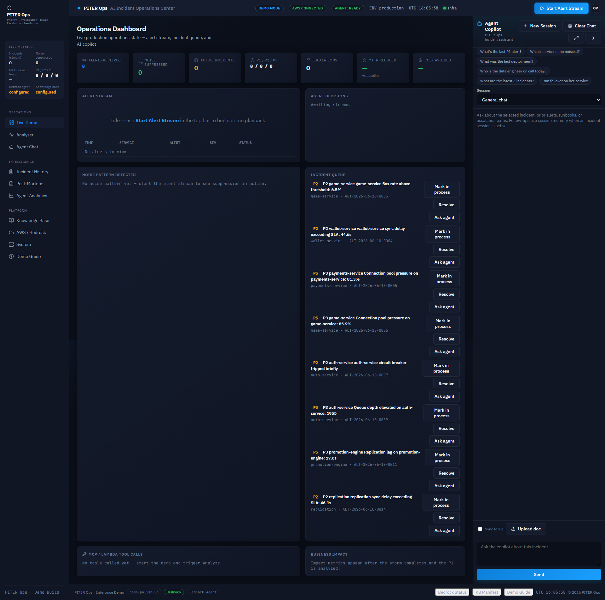
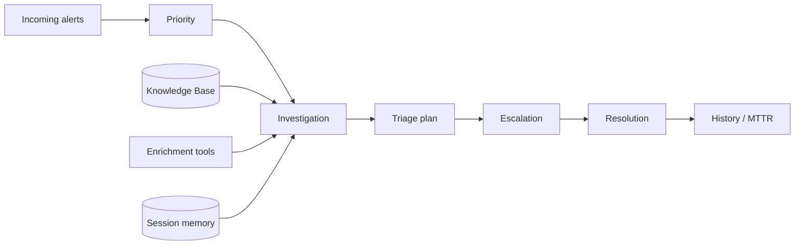
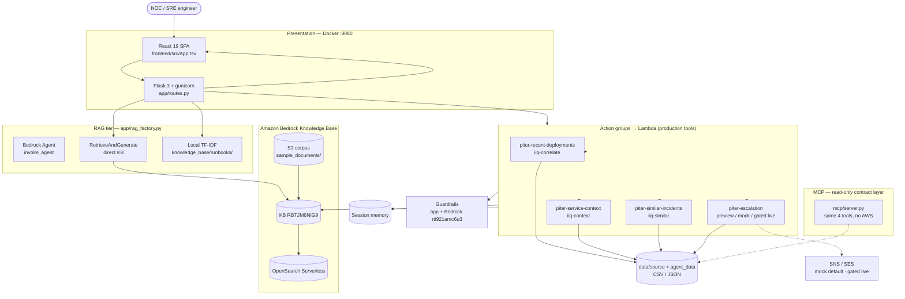
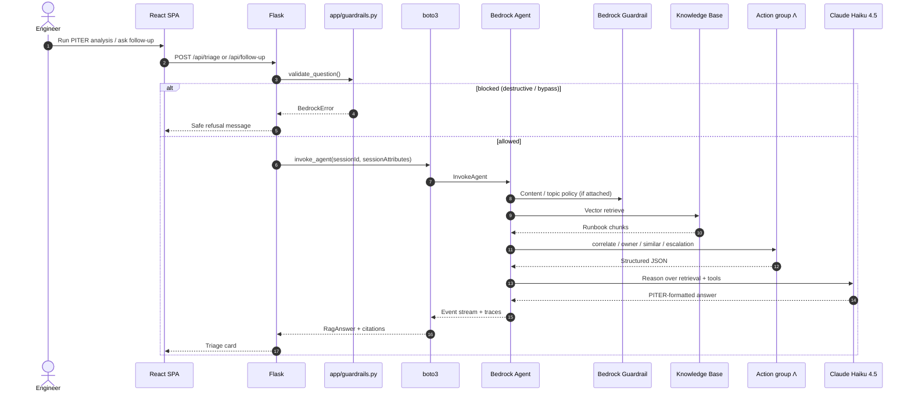
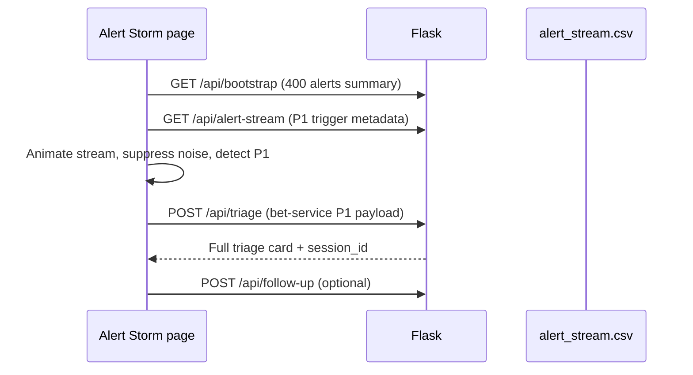
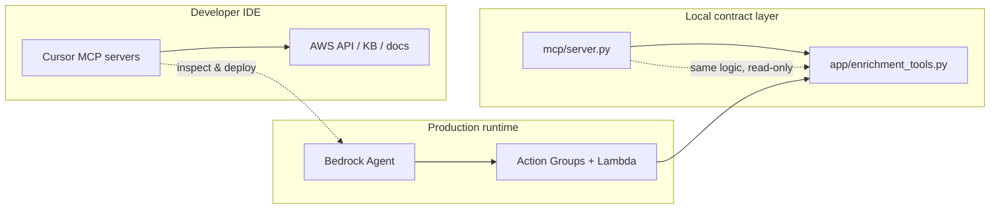

# PITER AiOps

**Priority · Investigation · Triage · Escalation · Resolution**

An AI-assisted incident operations platform for NOC and SRE teams. PITER connects runbooks, alert history, and structured ops data to **Amazon Bedrock** (Knowledge Base + Agent + Lambda action groups), then presents grounded, cited triage through a **React** ops console and **Flask** API—with a **local TF-IDF fallback** when AWS is unavailable.

| | |
|---|---|
| **Enterprise console** | [http://localhost:8080/](http://localhost:8080/) (React SPA) |
| **Legacy demo console** | [http://localhost:8080/console](http://localhost:8080/console) |
| **Health** | [http://localhost:8080/health](http://localhost:8080/health) |
| **Tests** | `pytest -q` — **275 tests**, offline by default |
| **Live validation** | `python scripts/verify_live_demo.py` — **29/29** |
| **Presentation assets** | [`screenshots/final/`](screenshots/final/) |

**Author:** Re'em Mor · NOC / SRE background · [GitHub @reemmor](https://github.com/reemmor)  
**Course:** AI-Augmented Software Engineering (mid-project)

---

## Table of contents

1. [What this application does](#what-this-application-does)
2. [PITER workflow](#piter-workflow)
3. [System architecture](#system-architecture)
4. [Request logic flow](#request-logic-flow)
5. [Bedrock Agent instruction (system prompt)](#bedrock-agent-instruction-system-prompt)
6. [Action groups and Lambda tools](#action-groups-and-lambda-tools)
7. [Guardrails configuration](#guardrails-configuration)
8. [MCP integration](#mcp-integration)
9. [AI-assisted development (skills and tooling)](#ai-assisted-development-skills-and-tooling)
10. [Project structure](#project-structure)
11. [Demo questions and flow](#demo-questions-and-flow)
12. [Testing and verification](#testing-and-verification)
13. [Quick start](#quick-start)
14. [HTTP API](#http-api)
15. [Challenges and design trade-offs](#challenges-and-design-trade-offs)
16. [Next steps](#next-steps)
17. [Security and further reading](#security-and-further-reading)

---

## What this application does

PITER AiOps reduces mean time to understand during incidents. Instead of searching Confluence, Slack, deploy logs, and ticket history separately, an on-call engineer submits an alert (or runs the **alert storm** demo) and receives:

- A **grounded triage narrative** with numbered steps
- **RAG citations** (runbook name, excerpt, relevance score)
- **Structured enrichment** from four ops tools: recent deploys, service owner/escalation path, business impact, similar past incidents
- **Session memory** for follow-ups (*"Who do I escalate to?"*, *"What was the suspect deploy?"*)
- **Escalation preview** (mock/preview by default; live SNS/SES only behind explicit gates)
- **Honest refusal** when evidence is missing — no invented owners, versions, or contacts

### Primary demo scenarios

| Scenario | What you see |
|----------|----------------|
| **Single-alert triage** | Postgres CPU, checkout 5xx, queue lag — cited runbook steps |
| **Alert storm** | **400** deterministic alerts → noise suppression → one P1 on `bet-service` → Run PITER analysis |
| **Follow-up chat** | Same `session_id`; context reused without re-running enrichment |
| **Document upload** | Local/demo indexing; optional S3 + Bedrock sync when configured |
| **Off-topic guardrail test** | *"Best restaurant in Tokyo?"* → refusal / low-confidence path |



*Use the final submission capture set in [`screenshots/final/`](screenshots/final/). Older root-level and `console_demo/` captures are retained only as historical proof, not as the primary README set.*

### Naming (PITER vs legacy AWS)

| Surface | Name |
|---------|------|
| Product / UI | **PITER AiOps** |
| Repo folder | `projects/piter-aiops/` |
| Local action groups | `action_groups/piter-*` |
| AWS agent (console) | `incidentiq-triage-agent` **v6**, alias `live` |
| AWS Lambdas | `iiq-correlate`, `iiq-context`, `iiq-similar`, **`piter-escalation`** |
| Legacy ops group | `incidentiq-ops` — **DISABLED** on live alias (v6) |

---

## PITER workflow

Every incident follows the same operational sequence the UI and agent instruction enforce:



| Phase | Operator question | System behavior |
|-------|-------------------|-----------------|
| **Priority** | How severe is this? | P1–P4 from severity policy + business impact evidence |
| **Investigation** | What do we know? | KB retrieval + tool JSON — no invented facts |
| **Triage** | What do I do first? | Ordered, reversible steps; each tied to a citation |
| **Escalation** | Who owns this? | On-call path from catalog; preview/mock notify |
| **Resolution** | How do we close? | Validation checks, MTTR, post-mortem hooks |

---

## System architecture

Diagrams render **interactively on GitHub** (Mermaid). Source file for editing or [Eraser.io](https://app.eraser.io) import: [`piter_architecture.mermaid`](piter_architecture.mermaid).

### Topology



### RAG fallback chain

```mermaid
flowchart TD
  REQ[POST /api/triage or /ask] --> CFG{RAG_BACKEND + USE_BEDROCK}
  CFG -->|agent + bedrock| AG[invoke_agent]
  CFG -->|retrieve_and_generate| RNG[RetrieveAndGenerate]
  CFG -->|bedrock off or error| LOC[Local TF-IDF]
  AG -->|failure| RNG
  RNG -->|failure| LOC
  AG & RNG & LOC --> OUT[Triage card JSON<br/>mode: bedrock | local]
```

| Configuration | Response `mode` | UI label |
|---------------|-----------------|----------|
| `RAG_BACKEND=agent`, Bedrock on | `bedrock` | Bedrock Agent |
| `RAG_BACKEND=retrieve_and_generate` | `bedrock` | Direct Bedrock KB |
| Bedrock off or unreachable | `local` | Local fallback |

### Component map

| Layer | Technology | Role |
|-------|------------|------|
| UI | React 19, Vite 7, Tailwind 4, shadcn/ui | Enterprise SOC dashboard → `app/static/spa/` |
| API | Flask 3, gunicorn | JSON routes, memory, upload, escalation gates |
| RAG | [`app/rag_factory.py`](app/rag_factory.py) | Agent → RnG → local |
| Enrichment | [`app/enrichment_tools.py`](app/enrichment_tools.py) | Single source of truth for Flask, Lambda, MCP |
| Memory | [`app/services/session_memory.py`](app/services/session_memory.py) | Store, summarize, retrieve, reuse context |
| Container | Docker Compose `piter-aiops:dev` | Non-root, healthcheck on `:8080` |

---

## Request logic flow

### Sequence — Bedrock Agent triage



### Alert storm (client-side orchestration)



---

## Bedrock Agent instruction (system prompt)

The agent instruction is the **system prompt** synced to AWS on every `update_agent` / prepare cycle. Canonical source: [`app/bedrock_agent_client.py`](app/bedrock_agent_client.py) (`AGENT_INSTRUCTION`).

Provision scripts that push this text to Bedrock:

- [`scripts/setup_piter_aws_mutations.py`](scripts/setup_piter_aws_mutations.py)
- [`scripts/setup_action_group.py`](scripts/setup_action_group.py)
- [`scripts/ensure_agent_alias.py`](scripts/ensure_agent_alias.py)

### Instruction text (as deployed)

```
You are PITER AiOps, an enterprise Site Reliability Engineering assistant for regulated betting platforms.

Mandatory workflow (always in this order):
1. Priority — classify P1–P4 using severity policy and business impact evidence.
2. Investigation — use knowledge-base citations and tool results only; never invent facts.
3. Triage — ordered, reversible steps first; cite the runbook for each step.
4. Escalation — when P1–P3 or regulatory exposure; name the on-call path from policy.
5. Resolution — validation checks and post-incident follow-up.

Grounding rules:
- Every remediation step must cite a runbook, policy, or incident record from retrieval.
- If evidence is missing, state "Not in knowledge base" and recommend what data to collect.
- Never invent service owners, deploy versions, contacts, escalation paths, or past incidents.

Safety rules (non-negotiable):
- REFUSE to provide executable steps for: FLUSHALL/FLUSHDB, DROP/TRUNCATE, mass DELETE,
  unapproved failover/replica promotion, disabling WAF/MFA/auth, firewall widening, or
  "scale to zero" / kill-all-sessions without scoped approval.
- For those topics, explain risk, cite the runbook's "Dangerous actions" section, and
  direct the operator to human approval and change control.
- Never recommend auto-executing production changes without explicit human sign-off.
- Never help bypass notification allowlists, confirmation tokens, or audit requirements.

Output format (concise, scannable for on-call):

Priority:
Investigation findings:
Triage plan:
Escalation recommendation:
Resolution plan:
Business impact:
Sources:
Confidence and uncertainty:
```

### Agent resource IDs

| Item | Value |
|------|-------|
| Agent ID | `HH4YGSLZUE` |
| Alias | `O2EM03R4R3` (`live`) |
| Agent version (live alias) | **v6** |
| Foundation model | Claude Haiku 4.5 (`PITER_BEDROCK_MODEL_ARN`) |
| Linked KB | `RBTJM6NIG9` |

---

## Action groups and Lambda tools

**Action groups** are how Bedrock Agent discovers and invokes tools. Each group has an OpenAPI schema (S3) and a Lambda handler.

> **Important:** Production tool calls use **Bedrock Action Groups + Lambda**, not MCP. MCP mirrors the same contracts locally ([`mcp/README.md`](mcp/README.md)).

### Enrichment and escalation (enabled on live alias v6)

| Local folder | AWS action group | Lambda | OpenAPI operation | Data sources |
|--------------|------------------|--------|-------------------|--------------|
| [`piter-recent-deployments`](action_groups/piter-recent-deployments/) | correlate group | `iiq-correlate` | `correlateDeployments` | `deploys.csv`, `service_catalog.json` |
| [`piter-service-context`](action_groups/piter-service-context/) | context group | `iiq-context` | owner / impact | `service_owners.csv`, `business_impact.json` |
| [`piter-similar-incidents`](action_groups/piter-similar-incidents/) | similar group | `iiq-similar` | similar incidents | `past_incidents.csv` |
| [`piter-escalation`](action_groups/piter-escalation/) | `piter-escalation` | `piter-escalation` | `GET /escalation` | Escalation policies; **mock/preview default** |

Shared business logic: [`app/enrichment_tools.py`](app/enrichment_tools.py) — used by Flask local triage, Lambdas, and MCP.

### Legacy ops group (disabled on live alias)

| Folder | AWS name | Status on v6 |
|--------|----------|----------------|
| [`incidentiq-ops`](action_groups/incidentiq-ops/) | `incidentiq-ops` / `incidentiq-actions` | **DISABLED** — mock NOC ops superseded by PITER enrichment set |

Deploy / sync:

```powershell
python scripts/setup_enrichment_lambdas.py --agent-id HH4YGSLZUE
python scripts/setup_piter_aws_mutations.py --dry-run   # review first
python scripts/setup_piter_aws_mutations.py             # escalation + guardrail + alias
```

---

## Guardrails configuration

PITER uses **defense in depth**: application guardrails always run; Bedrock Guardrail adds account-level policy when attached to the agent.

### Layer 1 — Application guardrails (always on)

Module: [`app/guardrails.py`](app/guardrails.py) · wired through [`app/validators.py`](app/validators.py) before any RAG call.

| Category | Blocked patterns (examples) | User-facing behavior |
|----------|----------------------------|----------------------|
| Destructive data | `FLUSHALL`, `DROP TABLE`, mass `DELETE` | Refusal + escalate to DBA / change control |
| Unsafe failover | `promote replica`, `force failover` | Explain criteria; require human sign-off |
| Security bypass | `disable WAF`, `open 0.0.0.0/0`, `disable MFA` | Refuse; open security-reviewed CR |
| Mass disruption | `kill all sessions`, `scale to zero` | Targeted remediation only |
| Policy bypass | `skip confirmation`, `disable guardrail` | Direct to gated Escalate on-call flow |

Tests: [`tests/test_guardrails.py`](tests/test_guardrails.py)

### Layer 2 — Amazon Bedrock Guardrail

| Field | Value |
|-------|-------|
| Guardrail ID | `rti921amc6u3` |
| Name | `incidentiq-demo-guardrail` |
| Version on agent (v6) | **v2** (published via mutation script) |
| Attached to agent | **Yes** — `guardrailConfiguration` on alias v6 |

**Topic policies (DENY):** credential exfiltration; unauthorized production changes.

**Content filters:** e.g. `PROMPT_ATTACK` (HIGH input block), violence filters.

IAM requirement: agent role needs `bedrock:ApplyGuardrail` on the guardrail ARN (added during AWS alignment).

### Layer 3 — Agent instruction safety rules

Embedded in `AGENT_INSTRUCTION` (see above) — complements guardrails with PITER-specific refusal language for destructive ops and notification bypass.

### Notification safety (escalation)

| Gate | Default |
|------|---------|
| `PITER_NOTIFICATION_MODE` | `mock` or `preview` |
| Live dispatch | Requires mode=live + confirmation token + allowlist + P1/P2 + idempotency |
| UI | Masked recipients; Escalation preview modal |

---

## MCP integration

Three distinct MCP-related paths — do not conflate them:



### A — PITER MCP server (project)

Read-only stdio server exposing the **same four tools** as action groups for contract review and demos.

```bash
python mcp/server.py --selftest
python -m mcp.server
```

| MCP tool | Maps to |
|----------|---------|
| `recent_deployments` | `correlate_deployments` |
| `service_context` | owner + business impact |
| `similar_incidents` | `find_similar_incidents` |
| `escalation_preview` | masked preview only — **never sends** |

Details: [`mcp/README.md`](mcp/README.md) · tests: [`tests/test_mcp_server.py`](tests/test_mcp_server.py)

### B — Bedrock action groups (production)

The agent at runtime uses **Lambda action groups**, not MCP. See [Action groups](#action-groups-and-lambda-tools).

### C — Cursor IDE MCP (development)

Used while **building** PITER — not invoked by `invoke_agent` at runtime.

Copy [`config/mcp.json.example`](config/mcp.json.example) → `.cursor/mcp.json` at repo root.

| Server | Purpose |
|--------|---------|
| `aws-api` | Inspect agent, Lambdas, S3, EC2 |
| `bedrock-kb` | Direct KB `RBTJM6NIG9` retrieval |
| `aws-knowledge` | Live AWS/Bedrock documentation |
| `playwright` | Screenshot capture scripts |
| `course-tools` | Lecture 08 demo MCP (`get_weather`, `get_joke`) |

Full setup: [`docs/MCP_PATH.md`](docs/MCP_PATH.md)

---

## AI-assisted development (skills and tooling)

This project was built with **AI-augmented engineering**: Cursor Agent, Claude, and structured verification loops—not vibe-coded demos.

### Development practices

| Practice | How it shows up in PITER |
|----------|--------------------------|
| **Grounded RAG** | Every triage step must cite KB or tool output |
| **Single source of truth** | `enrichment_tools.py` shared by Flask, Lambda, MCP |
| **Fail-open fallback** | Bedrock failure → local TF-IDF; demo never hard-fails |
| **Safety by default** | Mock notifications, guardrails, masked contacts |
| **Evidence-based AWS changes** | Mutation script with dry-run + rollback docs in `docs/review/` |

### Cursor / agent skills used during development

These skill areas guided implementation and review (representative—not an exhaustive plugin list):

| Domain | Applied to |
|--------|------------|
| AWS Bedrock Agent + KB | Agent instruction, alias routing, citation parsing |
| AWS Lambda + action groups | OpenAPI schemas, enrichment handlers |
| Flask / FastAPI patterns | API design, structured errors, health checks |
| React / Next.js performance | SPA dashboard, loading states, enterprise UX |
| Testing & QA | 275 pytest cases + live verify scripts |
| Security review | Guardrails, upload validation, notification gates |
| RAG evaluation | Grounding checks, refusal path, citation coverage |
| DevOps / Docker | `piter-aiops:dev` image, compose, EC2 user-data |

### AI model roles

| Role | Model / service |
|------|-----------------|
| **Runtime triage (production demo)** | Amazon Bedrock — Claude Haiku 4.5 via Agent or RetrieveAndGenerate |
| **Development assistant** | Cursor Agent (Composer) for code, docs, AWS alignment, screenshot automation |
| **Evaluation** | `agent_smoke_test.py`, `verify_live_demo.py` as automated judges |

---

## Project structure

```text
piter-aiops/
  app/                  Flask app, API routes, local RAG, memory, services, legacy templates
  frontend/             React/Vite source dashboard; builds into app/static/spa/
  action_groups/        Bedrock Agent Lambda action-group handlers and OpenAPI schemas
  mcp/                  Local read-only MCP-style server exposing the same four tools
  data/source/          Canonical CSV/JSON demo datasets for owners, deploys, incidents, impact
  data/sample_documents/ Knowledge Base source documents and upload examples
  knowledge_base/       Markdown runbooks, policies, glossary, incident records
  scripts/              AWS setup, verification, capture, and demo utility scripts
  tests/                Backend, tool, data, route, Lambda, memory, and fallback tests
  screenshots/final/    Final submission screenshots referenced by this README
```

`app/` is the backend package, not a duplicate React frontend. The React source of truth is `frontend/`; the committed production build is `app/static/spa/` so Flask and Docker can serve the dashboard directly.

---

## Demo questions and flow

Use these in the live demo after the dashboard loads:

1. `What should I check when users cannot log in after the latest deployment?`
2. `Analyze this alert: high error rate on auth-service in production after deployment.`
3. `Who should I escalate this incident to?`
4. `Are there similar incidents from the past?`
5. `What is the business impact of this issue?`
6. `What was my previous question?`
7. `Based on the previous incident, what should I do next?`

Recommended 5-7 minute path: open Dashboard, run Alert Storm, run PITER analysis, show RAG citations, show Lambda/MCP-style tool results, ask an escalation follow-up, open Context Memory, then finish on Architecture/Settings to show Bedrock mode and fallback status.

---

## Testing and verification

### Automated test suite

```powershell
cd projects/piter-aiops
py -3.12 -m pip install -r requirements-dev.txt
py -3.12 -m pytest -q                    # 275 passed (offline)
```

| Area | Test modules |
|------|----------------|
| RAG + Bedrock clients | `test_bedrock_client.py`, `test_bedrock_agent_client.py`, `test_rag_factory.py` |
| Flask / SPA routes | `test_routes.py`, `test_flask_routes.py`, `test_spa_mode.py` |
| Enrichment tools | `test_enrichment_tools.py`, `test_tools.py`, `test_piter_lambdas.py` |
| MCP server | `test_mcp_server.py` |
| Guardrails + validators | `test_guardrails.py`, `test_validators.py` |
| Escalation + notifications | `test_escalation_api.py`, `test_notification_dispatch.py` |
| Upload safety | `test_upload_validators.py`, `test_upload_routes.py` |
| Alert storm data | `test_alert_stream_api.py`, `test_source_data.py` |
| Session / follow-up | `test_follow_up_triage_alignment.py` |

### Live and E2E scripts

| Script | Checks | When to run |
|--------|--------|-------------|
| [`verify_live_demo.py`](scripts/verify_live_demo.py) | **29/29** — Bedrock live + local fallback | Before every demo |
| [`verify_spa_demo.py`](scripts/verify_spa_demo.py) | **36/36** — SPA API parity + storm | After frontend changes |
| [`agent_smoke_test.py`](scripts/agent_smoke_test.py) | **7/7** — `RAG_BACKEND=agent` | After agent/alias changes |
| [`verify_e2e.py`](scripts/verify_e2e.py) | HTTP E2E against running container | After Docker build |
| [`capture_final_demo.mjs`](scripts/capture_final_demo.mjs) | Presentation screenshots | Recording prep |

Windows helper: [`scripts/verify.ps1`](scripts/verify.ps1)

Evidence screenshots: [`screenshots/final/14_tests_passing.png`](screenshots/final/14_tests_passing.png), [`screenshots/final/14b_live_demo_checks.png`](screenshots/final/14b_live_demo_checks.png)

---

## Quick start

### Docker (recommended — works offline)

```bash
cp .env.example .env          # optional; PITER_USE_BEDROCK=false by default
docker compose up --build     # → http://localhost:8080/
```

| Docker setting | Value |
|----------------|-------|
| Image | `piter-aiops:dev` |
| Container | `piter-aiops` |
| Port | `8080:8080` |

### Enable live Bedrock

Set in `.env` (never commit secrets):

| Variable | Purpose |
|----------|---------|
| `PITER_USE_BEDROCK=true` | Enable AWS backends |
| `PITER_BEDROCK_KB_ID` | `RBTJM6NIG9` |
| `PITER_BEDROCK_AGENT_ID` / `PITER_BEDROCK_AGENT_ALIAS_ID` | When `RAG_BACKEND=agent` |
| `RAG_BACKEND` | `retrieve_and_generate` (default) or `agent` |
| `AWS_PROFILE` | Profile in `~/.aws/credentials` |

Credential layout: [`docs/aws_credentials.md`](docs/aws_credentials.md)

### Frontend development

```bash
gunicorn -b 127.0.0.1:8080 wsgi:app    # terminal 1
cd frontend && npm install && npm run dev   # terminal 2 → :5173
cd frontend && npm run build              # production → app/static/spa/
```

---

## HTTP API

| Method | Path | Description |
|:------:|------|-------------|
| `GET` | `/` | React SPA |
| `GET` | `/console` | Legacy triage console |
| `GET` | `/health` | Liveness (`?deep=1` for config) |
| `GET` | `/api/bootstrap` | Examples, storm summary (400 alerts), upload limits |
| `GET` | `/api/alert-stream` | Storm metadata + P1 trigger |
| `GET` | `/api/kb/manifest` | KB document list |
| `POST` | `/api/triage` | Full triage card (RAG + tools + session) |
| `POST` | `/api/follow-up` | Session-aware follow-up |
| `GET` | `/api/sessions/<session_id>/history` | Saved session memory and chat history |
| `POST` | `/ask` | Grounded Q&A + citations |
| `POST` | `/documents/upload` | Validated upload + optional S3/KB sync |
| `POST` | `/api/escalation/notify` | Gated SNS/SES (mock default) |

**Triage card fields:** `answer`, `citations[]`, `recommended_steps[]`, `suspect_deploys[]`, `owner`, `impact`, `similar_incidents[]`, `session_id`, `memory_used`, `mode` (`local` | `bedrock`).

---

## Challenges and design trade-offs

| Challenge | What we did | Residual risk |
|-----------|-------------|---------------|
| **Bedrock latency (10–20s)** | Loading states, legacy console loader, async SPA | Audience wait during live demo — pre-run triage once |
| **Agent vs direct KB** | `rag_factory` supports both; default RnG for reliable citations in class | Agent path needs alias prepare after every DRAFT change |
| **Legacy IncidentIQ naming in AWS** | Document mapping; disable legacy ops group on v6 | Console still shows old Lambda names (`iiq-*`) |
| **Grounding vs helpfulness** | Strict instruction + refusal UI | Occasional under-answer when KB chunk missing |
| **Notification safety** | Mock default, confirmation token, allowlist, idempotency | Lambda live path needs full app bundle for dispatch module |
| **MCP vs action groups confusion** | Clear docs: production = Lambda; MCP = local contract | Students may assume MCP runs in production |
| **400-alert storm UX** | Client animation over real CSV; deterministic P1 | Not a live streaming bus — labeled as simulated |
| **CSRF on JSON API** | Bootstrap token for SPA; demo-only exemption | Not production-hardened auth model |

---

## Next steps

### Demo and course delivery

- [ ] Run [`docs/review/PITER_FINAL_DEMO_READINESS_REPORT.md`](docs/review/PITER_FINAL_DEMO_READINESS_REPORT.md) demo script (10 min)
- [ ] Set `PITER_CONSOLE_REDIRECT_SPA=true` when legacy `/console` retirement is approved
- [ ] Optional: AgentCore Gateway (MCP over Cognito) — [`scripts/setup_agentcore_gateway.py`](scripts/setup_agentcore_gateway.py)

### Production hardening (if beyond course scope)

- [ ] Bundle `notification_dispatch` into `piter-escalation` Lambda for live path parity
- [ ] Persistent idempotency store (DynamoDB) instead of in-memory Lambda set
- [ ] Rename AWS resources `iiq-*` → `piter-*` with zero-downtime alias cutover
- [ ] OAuth / SSO for SPA; remove CSRF exemptions on JSON routes
- [ ] Automatic Bedrock KB sync after UI upload (today: manual sync step)
- [ ] CloudWatch dashboards: triage latency, citation rate, guardrail blocks, tool error rate
- [ ] Load test alert storm API path separately from client animation

### Observability

- [ ] Enable and archive agent traces for demo post-mortems
- [ ] Structured correlation IDs across Flask → boto3 → Lambda logs

---

## Security and further reading

| Control | Implementation |
|---------|----------------|
| No keys on EC2 | IAM instance profile only |
| Scoped IAM | Bedrock retrieve/generate, S3 prefix, Lambda invoke, ApplyGuardrail |
| Non-root container | `USER app` in Dockerfile |
| Input validation | Question length, upload type/size, path traversal blocks |
| Operator guardrails | [`app/guardrails.py`](app/guardrails.py) |
| Secrets | `.env` gitignored; `.env.example` only in repo |

| Document | Topic |
|----------|-------|
| [`docs/architecture.md`](docs/architecture.md) | Component breakdown |
| [`docs/bedrock_kb_setup.md`](docs/bedrock_kb_setup.md) | Knowledge Base create + sync |
| [`docs/bedrock_agent_setup.md`](docs/bedrock_agent_setup.md) | Agent + alias |
| [`docs/MCP_PATH.md`](docs/MCP_PATH.md) | MCP vs action groups vs Cursor |
| [`docs/live_demo.md`](docs/live_demo.md) | Instructor demo flow |
| [`docs/review/PITER_FINAL_DEMO_READINESS_REPORT.md`](docs/review/PITER_FINAL_DEMO_READINESS_REPORT.md) | Live validation summary |
| [`TESTING.md`](TESTING.md) | Test commands |
| [`screenshots/README.md`](screenshots/README.md) | Capture instructions |

Teardown: [`docs/TEARDOWN.md`](docs/TEARDOWN.md)

---

Built for **AI-Augmented Software Engineering** — demonstrating grounded RAG, Bedrock Agents, Lambda action groups, MCP tool contracts, guardrails, and production-minded ops UX on AWS.
