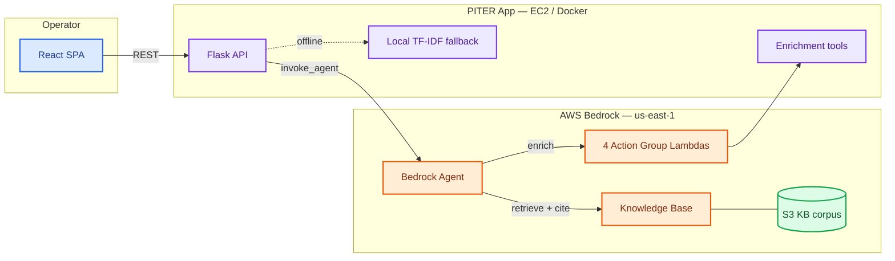
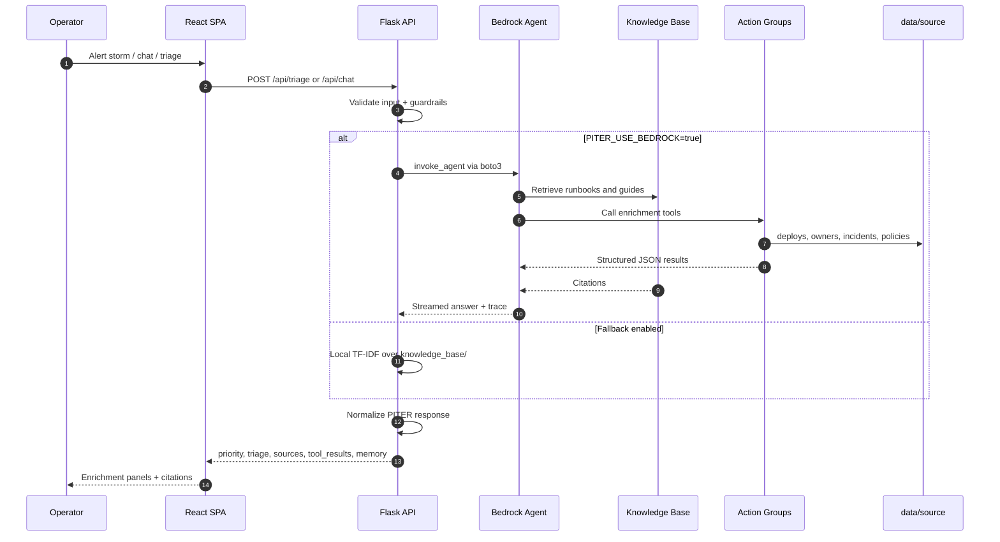
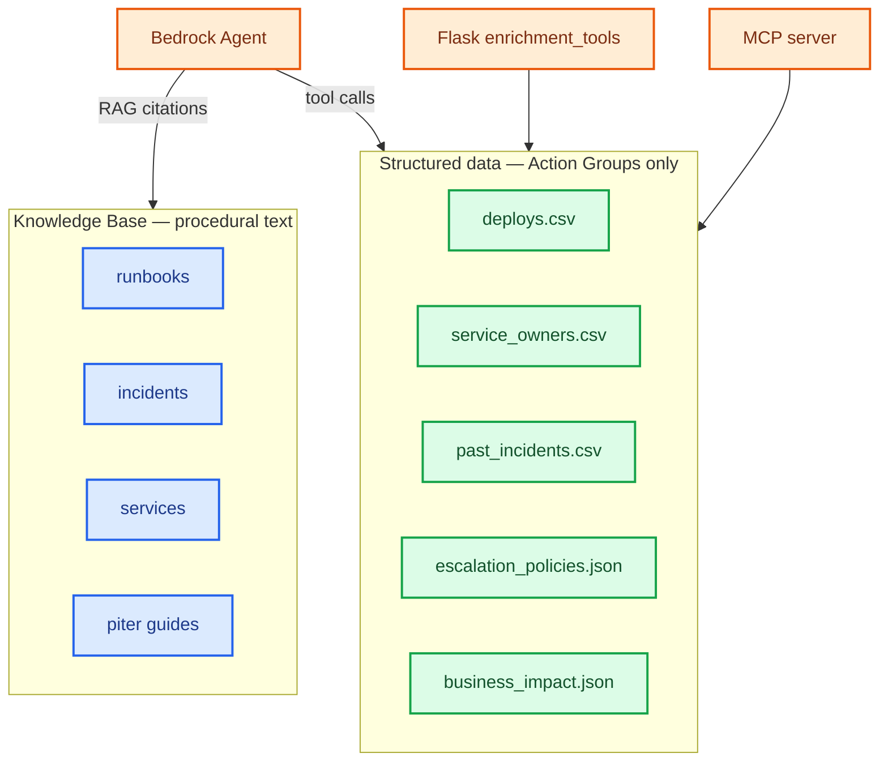
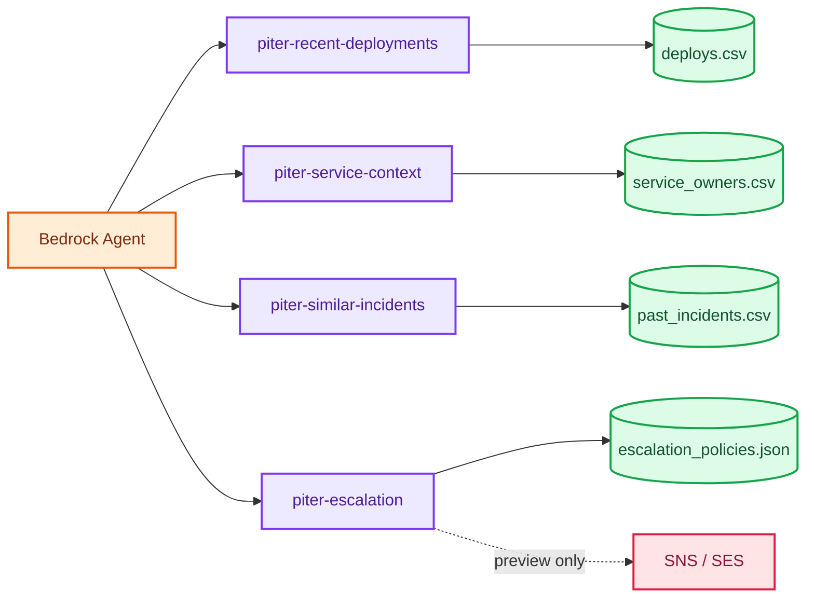

# PITER AiOps

**AI-powered incident response for NOC, DevOps, and SRE teams**

**P**riority · **I**nvestigation · **T**riage · **E**scalation · **R**esolution

[Python 3.12](https://www.python.org/)
[Flask](https://flask.palletsprojects.com/)
[React](frontend/)
[Amazon Bedrock](https://aws.amazon.com/bedrock/)
[Docker](docker-compose.yml)
[Tests](tests/)

  


### Submission links


| Resource            | Link                                                                                                                                          |
| ------------------- | --------------------------------------------------------------------------------------------------------------------------------------------- |
| **Live demo (EC2)** | **[http://ec2-3-235-22-143.compute-1.amazonaws.com:8080/](http://ec2-3-235-22-143.compute-1.amazonaws.com:8080/)** *(verified `/health` 200)* |
| **Presentation**    | `[presentation/PITER_AiOps_Mid_Course_Presentation_Improved.pptx](presentation/PITER_AiOps_Mid_Course_Presentation_Improved.pptx)`            |
| **Demo script**     | `[docs/demo_script.md](docs/demo_script.md)`                                                                                                  |
| **Deploy guide**    | `[docs/ec2_deployment.md](docs/ec2_deployment.md)`                                                                                            |


  


*[Editable diagram in Eraser](https://app.eraser.io/workspace/k7BPJorv6ubjEktGOH3u)*


> **Safety:** Escalation is preview-only by default. No auto-SMS or email unless `PITER_ENABLE_LIVE_DISPATCH=true` and notification channels are configured.

---

## Table of contents

- [Project goal](#project-goal)
- [Course requirements mapping](#course-requirements-mapping)
- [Quick start](#quick-start)
- [System architecture](#system-architecture)
- [Key components](#key-components)
- [Use cases](#use-cases)
- [Screenshots](#screenshots)
- [Error handling and safety](#error-handling-and-safety)
- [Testing evidence](#testing-evidence)
- [Challenges and next steps](#challenges-and-next-steps)
- [Documentation index](#documentation-index)
- [Course context](#course-context)

---

## Project goal

PITER AiOps is an AI incident-response assistant for production operations teams. It combines Amazon Bedrock Agent orchestration, Knowledge Base RAG, structured enrichment tools, and a React ops console so on-call engineers get **grounded, cited triage guidance in seconds** instead of hunting runbooks under alert pressure.


| Stage             | Meaning                                                                  |
| ----------------- | ------------------------------------------------------------------------ |
| **Priority**      | Classify P1–P4 using severity policy, alert context, and business impact |
| **Investigation** | Use KB citations and Action Group tool results only — never invent facts |
| **Triage**        | Ordered, reversible steps first; cite the runbook for each step          |
| **Escalation**    | When P1–P3 or regulatory exposure; name the on-call path from policy     |
| **Resolution**    | Validation checks, safe recovery path, and post-incident follow-up       |


**Problem:** Alerts fire 24/7. Engineers lose critical minutes searching runbooks, past tickets, and post-mortems while severity climbs.

**Solution:** Feed runbooks, alert histories, and post-mortems into a Bedrock Knowledge Base. When an alert hits, ask a question and get a **grounded, cited answer in seconds** — plus deploy correlation, similar incidents, and escalation preview via four Action Group tools.

**Business impact (demo):** The UI tracks illustrative KPIs (e.g. MTTR reduced). Dollar figures in `data/source/business_impact.json` are **sanitized demo estimates** for presentation only, not financial reporting.

---

## Course requirements mapping

Mid-course requirements from the **AI-Augmented Software Engineering** training, with evidence in this repository.


| Requirement           | Status   | Evidence                                                                                                                           |
| --------------------- | -------- | ---------------------------------------------------------------------------------------------------------------------------------- |
| Flask web application | Met      | `[app/routes.py](app/routes.py)`, `[wsgi.py](wsgi.py)`                                                                             |
| RAG (document Q&A)    | Met      | Bedrock KB + `[knowledge_base/](knowledge_base/)`, local TF-IDF `[app/services/local_rag.py](app/services/local_rag.py)`           |
| MCP / tools           | Met      | `[mcp/server.py](mcp/server.py)`, four enrichment tools, Bedrock Action Groups                                                     |
| Docker                | Met      | `[Dockerfile](Dockerfile)`, `[docker-compose.yml](docker-compose.yml)`                                                             |
| Pandas / CSV / JSON   | Met      | `[app/services/data_access.py](app/services/data_access.py)`, `[data/source/](data/source/)`                                       |
| GitHub + README       | Met      | This file — install, run, goal, components                                                                                         |
| Live demo             | Ready    | EC2: [http://ec2-3-235-22-143.compute-1.amazonaws.com:8080/](http://ec2-3-235-22-143.compute-1.amazonaws.com:8080/)                |
| Presentation          | Included | `[presentation/PITER_AiOps_Mid_Course_Presentation_Improved.pptx](presentation/PITER_AiOps_Mid_Course_Presentation_Improved.pptx)` |


Full readiness matrix: `[docs/readiness_report.md](docs/readiness_report.md)`

---

## Quick start

```powershell
cd projects/piter-aiops
py -3.12 -m pip install -r requirements-dev.txt
py -3.12 -m pytest -q                       # 279 passing
cd frontend; npm ci; npm run build; cd ..
docker compose up --build -d
# http://localhost:8080/ → Start Alert Stream → P1 at ~20s → Analyze P1 Incident
```

**Smoke checks (local):**

```powershell
Invoke-RestMethod http://localhost:8080/health
Invoke-RestMethod http://localhost:8080/api/tools/status
```

**Enable Bedrock (optional):**

```powershell
copy .env.example .env
# Edit PITER_BEDROCK_* IDs — see docs/environment.md
$env:PITER_DOCKER_USE_BEDROCK = "true"
docker compose up --build
```

**Sync Knowledge Base:**

```powershell
aws s3 sync knowledge_base/ s3://<bucket>/projects/piter-aiops/knowledge_base/
python scripts/sync_knowledge_base.py --ingest --wait
python scripts/kb_smoke_test.py
```

**Pre-demo checklist (EC2):**

```powershell
py -3.12 scripts/verify_credentials.py
py -3.12 scripts/agent_smoke_test.py
py -3.12 scripts/verify_live_demo.py --base-url http://ec2-3-235-22-143.compute-1.amazonaws.com:8080
```

Daily dev loop: `[docs/LOCAL_DEV.md](docs/LOCAL_DEV.md)` · Presenter flow: `[docs/demo_script.md](docs/demo_script.md)`

> Terminate EC2 instance `i-0c53b195878f0ea5f` after presentations to avoid ongoing cost. See `[screenshots/deployment_validation.md](screenshots/deployment_validation.md)`.

---

## System architecture

Full doc: `[docs/architecture.md](docs/architecture.md)`

### High-level containers




### Request flow




### Data split




| Layer                      | Location                                                                   | Used for                                                 |
| -------------------------- | -------------------------------------------------------------------------- | -------------------------------------------------------- |
| Procedural text            | `[knowledge_base/](knowledge_base/)`                                       | Remediation steps, service context, historical write-ups |
| Numeric / tabular ops data | `[data/source/](data/source/)`                                             | Deploy correlation, owners, MTTR, escalation scores      |
| Index                      | `[docs/kb/structured_data_index.json](docs/kb/structured_data_index.json)` | Maps tools to datasets                                   |


---

## Key components

### Bedrock Agent

System prompt: `[infra/bedrock_agent_instructions.txt](infra/bedrock_agent_instructions.txt)` · Runtime mirror: `[app/bedrock_agent_client.py](app/bedrock_agent_client.py)`

**Agent instructions (condensed)**

**Workflow (always in order):** Priority → Investigation → Triage → Escalation → Resolution

**Grounding:** Every remediation step must cite a runbook, policy, or incident record. Never invent owners, deploy versions, contacts, or past incidents. If evidence is missing, state *"Not in knowledge base"*.

**Safety:** Refuse FLUSHALL, DROP/TRUNCATE, mass DELETE, unapproved failover, disabling WAF/MFA/auth. Escalation preview does not send messages unless explicitly confirmed.

**Session attributes:** `service`, `environment`, `severity`, `symptom`, `alert_time`, `triage_complete` — built by `build_session_attributes()` in `[app/bedrock_agent_client.py](app/bedrock_agent_client.py)`.


### Knowledge Base


| Topic             | Detail                                                                             |
| ----------------- | ---------------------------------------------------------------------------------- |
| Corpus            | `[knowledge_base/](knowledge_base/)` — runbooks, incidents, services, piter guides |
| S3 prefix         | `s3://reem-amdocs-ai-artifacts-3331/projects/piter-aiops/knowledge_base/`          |
| Knowledge base ID | `RBTJM6NIG9`                                                                       |
| Agent ID          | `HH4YGSLZUE` (alias `O2EM03R4R3`)                                                  |


Local fallback: When `PITER_USE_BEDROCK=false` or Bedrock fails with fallback enabled, Flask answers from TF-IDF via `[app/services/local_rag.py](app/services/local_rag.py)`.

### Action Groups and Lambda functions

Four Bedrock Action Groups reuse the same Python logic as Flask enrichment and the local MCP server (`[app/enrichment_tools.py](app/enrichment_tools.py)`).




| Action group               | Data source                                  | Purpose                                  |
| -------------------------- | -------------------------------------------- | ---------------------------------------- |
| `piter-recent-deployments` | `deploys.csv`                                | Correlate alert time with recent deploys |
| `piter-service-context`    | `service_owners.csv`, `business_impact.json` | Owners, on-call, business impact         |
| `piter-similar-incidents`  | `past_incidents.csv`                         | Historical match, root cause, MTTR       |
| `piter-escalation`         | `escalation_policies.json`                   | Escalation preview and priority matrix   |


Deploy: `.\scripts\aws_deploy_fix.ps1` — create Lambda functions **before** attaching action groups in the Bedrock console.

### boto3 integration


| Client                  | Used in                                                      | Calls                                   |
| ----------------------- | ------------------------------------------------------------ | --------------------------------------- |
| `bedrock-agent-runtime` | `[app/bedrock_agent_client.py](app/bedrock_agent_client.py)` | `invoke_agent`, `retrieve_and_generate` |
| `bedrock-agent`         | `[app/upload_service.py](app/upload_service.py)`             | KB ingestion jobs after S3 upload       |
| `s3`                    | upload service, sync scripts                                 | `put_object`, corpus sync               |


**Runtime modes** (`[docs/environment.md](docs/environment.md)`):


| Mode           | Config                                        | Behavior                      |
| -------------- | --------------------------------------------- | ----------------------------- |
| Bedrock Agent  | `PITER_USE_BEDROCK=true`, `RAG_BACKEND=agent` | Full agent + tools + KB       |
| Direct KB RAG  | `RAG_BACKEND=retrieve_and_generate`           | KB-only retrieve-and-generate |
| Local demo     | `PITER_USE_BEDROCK=false`                     | TF-IDF over local corpus      |
| Docker default | `PITER_DOCKER_USE_BEDROCK=false`              | Offline unless opted in       |


### MCP server

`[mcp/server.py](mcp/server.py)` — stdio JSON-RPC MCP exposing four **read-only** tools (same contracts as Action Groups):


| Tool                            | Purpose                   |
| ------------------------------- | ------------------------- |
| `get_recent_deployments`        | Deploy correlation        |
| `get_service_context`           | Service owners and impact |
| `find_similar_incidents`        | Historical match + MTTR   |
| `get_escalation_recommendation` | Escalation preview        |


```powershell
python mcp/server.py --selftest
```

### UI stack

React 18 + Vite + TypeScript + Tailwind + shadcn/ui (`[frontend/](frontend/)`). Primary surfaces: Alert Storm, Dashboard, Investigations, Live KB Chat, Memory, Knowledge Base, Tools/MCP, Architecture, Settings.

**API endpoints (summary)**


| Method | Path                     | Purpose                            |
| ------ | ------------------------ | ---------------------------------- |
| GET    | `/health`, `/api/health` | Liveness; `?deep=1` checks Bedrock |
| POST   | `/api/chat`              | Chat with PITER normalization      |
| POST   | `/api/triage`            | Primary SPA triage                 |
| POST   | `/api/incidents/analyze` | Incident analysis alias            |
| POST   | `/api/follow-up`         | Session follow-up                  |
| GET    | `/api/tools/status`      | Four enrichment tools readiness    |
| GET    | `/api/alert-stream`      | Demo alert stream                  |
| POST   | `/documents/upload`      | S3 upload + optional KB ingest     |


Full contract: `[docs/api_contract.md](docs/api_contract.md)`


---

## Use cases

Acceptable answers must satisfy `[evaluation/expected_answer_checklist.md](evaluation/expected_answer_checklist.md)`: structured `piter` object, business impact, next action, sources, tool results when applicable, memory, no raw stack traces.

**1. Knowledge Base Q&A — POST /api/chat**

**Request:**

```json
{
  "message": "What should I check when users cannot log in after the latest deployment?",
  "session_id": "demo-session-1"
}
```

**Response includes:** `piter` (priority, investigation, triage, escalation, resolution), `sources[]`, `confidence`, `mode: "bedrock"`.


**2. Alert triage — POST /api/triage**

**Request:**

```json
{
  "alert_title": "High error rate on auth-service",
  "service": "auth-service",
  "environment": "production",
  "severity": "high",
  "description": "Many users cannot log in after the latest production deployment."
}
```

**Response adds:** `tool_results` from all four enrichment tools, `business_impact` from `business_impact.json`, P1–P4 priority with regulatory context.


**3. Follow-up with session memory — POST /api/follow-up**

**Request:**

```json
{
  "message": "Based on the previous incident, who should I escalate to?",
  "session_id": "demo-session-1"
}
```

Reuses session attributes when `triage_complete=true`. Does not repeat full triage unless context is missing.


**Demo question:** *What should I check when users cannot log in after the latest deployment?*

---

## Screenshots

Curated captures from `[screenshots/final/](screenshots/final/)` — aligned with mid-course demo requirements (RAG, tools, live action).


|                                    |                                             |
| ---------------------------------- | ------------------------------------------- |
| **Dashboard — KPI tiles**          | **Alert storm — live streaming**            |
| **P1 detected — wallet-service**   | **Investigation — structured PITER triage** |
| **Grounded answer — KB citations** | **Four Lambda / MCP tools**                 |
| **Session memory follow-up**       | **Escalation preview — no auto-send**       |


**Full screenshot index**


| File                                                                                         | Shows                   |
| -------------------------------------------------------------------------------------------- | ----------------------- |
| `[01_dashboard.png](screenshots/final/01_dashboard.png)`                                     | React dashboard         |
| `[02_investigations_table.png](screenshots/final/02_investigations_table.png)`               | Investigation queue     |
| `[03_alert_storm_running.png](screenshots/final/03_alert_storm_running.png)`                 | Alert storm running     |
| `[04_p1_detected.png](screenshots/final/04_p1_detected.png)`                                 | P1 detected             |
| `[05_investigation_detail_triage.png](screenshots/final/05_investigation_detail_triage.png)` | Structured PITER triage |
| `[06_rag_citations.png](screenshots/final/06_rag_citations.png)`                             | KB citations            |
| `[07_lambda_mcp_tools.png](screenshots/final/07_lambda_mcp_tools.png)`                       | Lambda/MCP tools        |
| `[08_memory_followup_context.png](screenshots/final/08_memory_followup_context.png)`         | Session memory          |
| `[09_escalation_preview.png](screenshots/final/09_escalation_preview.png)`                   | Escalation preview      |
| `[10_post_mortem_summary.png](screenshots/final/10_post_mortem_summary.png)`                 | Post-mortem view        |
| `[11_knowledge_base.png](screenshots/final/11_knowledge_base.png)`                           | Knowledge Base browser  |
| `[12_upload_document_flow.png](screenshots/final/12_upload_document_flow.png)`               | Document upload         |
| `[13_architecture_settings.png](screenshots/final/13_architecture_settings.png)`             | Architecture view       |
| `[13b_settings_aws_status.png](screenshots/final/13b_settings_aws_status.png)`               | AWS status settings     |
| `[14_tests_passing.png](screenshots/final/14_tests_passing.png)`                             | 279 pytest tests        |
| `[14b_live_demo_checks.png](screenshots/final/14b_live_demo_checks.png)`                     | Live demo verification  |
| `[15_docker_running.png](screenshots/final/15_docker_running.png)`                           | Docker container proof  |


---

## Error handling and safety


| Layer               | Mechanism                                      | Location                                             |
| ------------------- | ---------------------------------------------- | ---------------------------------------------------- |
| Input validation    | Empty, oversize, stopwords-only questions      | `[app/validators.py](app/validators.py)`             |
| Operator guardrails | Blocks FLUSHALL, DROP, WAF bypass              | `[app/guardrails.py](app/guardrails.py)`             |
| boto3 translation   | Throttling, AccessDenied → friendly errors     | `[app/errors.py](app/errors.py)`                     |
| Bedrock failure UX  | `ok=false`, `fallback_used`, no silent success | `[docs/troubleshooting.md](docs/troubleshooting.md)` |
| Escalation safety   | `PITER_NOTIFICATION_MODE=mock` default         | `[docs/environment.md](docs/environment.md)`         |


When Bedrock fails and fallback is disabled, the UI shows failure explicitly — never fake a grounded answer.

**Tokenless escalation + structured analysis (Jun 2026):** Live email dispatch no longer accepts a confirmation token from the browser — `POST /api/escalation/notify` injects `PITER_NOTIFICATION_CONFIRMATION_TOKEN` server-side while the UI keeps preview + explicit confirm only (`EscalationModal.tsx`). Analyze Alert responses now include a `structured_analysis` contract (correlation chain, evidence, recommended actions, escalation suggestion) with markdown stripped before render; see `app/services/structured_analysis.py`, `PiterAnalysisPanel.tsx`, and `screenshots/final/16_structured_analysis_panel.png`. Live SES proof on EC2: message ID `0100019eb06b31ee-7bfe623d-98fe-4d94-98e9-451931918d4a-000000` to `reem.mor3@gmail.com` (sandbox).

---

## Testing evidence


| Suite                         | Result         | Scope                                        |
| ----------------------------- | -------------- | -------------------------------------------- |
| `py -3.12 -m pytest -q`       | **279 passed** | Routes, agent, lambdas, MCP, guardrails, RAG |
| `scripts/agent_smoke_test.py` | **6/6 PASS**   | Live Bedrock grounding                       |
| `scripts/verify_live_demo.py` | PASS on EC2    | End-to-end public demo                       |
| `frontend npm run build`      | Build OK       | SPA production bundle                        |
| `frontend npm run test:e2e`   | **12 passed**  | EC2 demo path + output-hardening screenshots |
| `tests/test_structured_analysis.py` | PASS   | wallet-service v4.12.3 correlation chain     |
| Live SES escalation           | **sent**       | `0100019eb06b31ee-7bfe623d-98fe-4d94-98e9-451931918d4a-000000` |


|                              |                              |
| ---------------------------- | ---------------------------- |
| **279 pytest tests passing** | **Docker container running** |


Key modules: `[tests/test_piter_lambdas.py](tests/test_piter_lambdas.py)`, `[tests/test_mcp_server.py](tests/test_mcp_server.py)`, `[tests/test_guardrails.py](tests/test_guardrails.py)`, `[tests/test_incident_analysis.py](tests/test_incident_analysis.py)`.

Validation: `[screenshots/deployment_validation.md](screenshots/deployment_validation.md)` · Scorecard: `[evaluation/manual_demo_scorecard.md](evaluation/manual_demo_scorecard.md)`

---

## Challenges and next steps

### Challenges resolved


| Challenge                          | Resolution                                                                    |
| ---------------------------------- | ----------------------------------------------------------------------------- |
| Legacy `iiq-`* naming drift        | Renamed to `piter-*` across agent, Lambdas, deploy scripts                    |
| Bedrock CLI gaps                   | Python smoke scripts (`agent_smoke_test.py`)                                  |
| KB S3 IAM 403 during ingestion     | Policy patch `[infra/kb_s3_policy_patch.json](infra/kb_s3_policy_patch.json)` |
| Silent success when Bedrock failed | Explicit `ok=false`, `fallback_used` in API responses                         |
| String priority compare bug        | Rank-based `_raise_priority()` in incident analysis                           |


Details: `[docs/troubleshooting.md](docs/troubleshooting.md)`

### Roadmap

```mermaid
flowchart LR
  subgraph now [Now]
    A1[Bedrock Agent + KB]
    A2[4 Action Groups]
    A3[React ops console]
    A4[EC2 demo deploy]
  end
  subgraph next [Next]
    B1[Guardrails + CI alias]
    B2[Playwright E2E]
    B3[PagerDuty webhooks]
  end
  subgraph vision [Vision — PITER Ops 1.0]
    C1[Closed-loop incident lifecycle]
    C2[Multi-tenant KB]
    C3[Observability correlation]
    C4[Executive MTTR dashboard]
  end
  now ==> next ==> vision

  classDef nowStyle fill:#dcfce7,stroke:#16a34a,stroke-width:2px,color:#14532d
  classDef nextStyle fill:#fef9c3,stroke:#ca8a04,stroke-width:2px,color:#713f12
  classDef visionStyle fill:#ede9fe,stroke:#7c3aed,stroke-width:2px,color:#4c1d95
  class A1,A2,A3,A4 nowStyle
  class B1,B2,B3 nextStyle
  class C1,C2,C3,C4 visionStyle
```




**Near-term:** Bedrock Guardrails, Playwright E2E, PagerDuty/ServiceNow webhooks (preview remains default).

**Vision:** Co-pilot not auto-pilot — every step cited, human approval for destructive actions, closed-loop alert → triage → post-mortem → KB re-ingestion.

---

## Documentation index


| Document                                                                             | Description                      |
| ------------------------------------------------------------------------------------ | -------------------------------- |
| `[docs/architecture.md](docs/architecture.md)`                                       | Components and request flow      |
| `[docs/api_contract.md](docs/api_contract.md)`                                       | API request/response shapes      |
| `[docs/environment.md](docs/environment.md)`                                         | Environment variables            |
| `[docs/aws_sync_guide.md](docs/aws_sync_guide.md)`                                   | S3 sync and KB ingestion         |
| `[docs/LOCAL_DEV.md](docs/LOCAL_DEV.md)`                                             | Local dev + EC2 ship workflow    |
| `[docs/ec2_deployment.md](docs/ec2_deployment.md)`                                   | EC2 deploy checklist             |
| `[docs/demo_script.md](docs/demo_script.md)`                                         | 5–7 minute presenter flow        |
| `[docs/readiness_report.md](docs/readiness_report.md)`                               | Course readiness matrix          |
| `[docs/troubleshooting.md](docs/troubleshooting.md)`                                 | Common failures and fixes        |
| `[evaluation/expected_answer_checklist.md](evaluation/expected_answer_checklist.md)` | Acceptable PITER answer criteria |


---

## Course context

Built for the **Amdocs AI-Augmented Software Engineering** course — demonstrating Flask, RAG, MCP-style tools, Bedrock Agent, Docker, and production-minded incident-response UX.

PITER AiOps · Priority → Investigation → Triage → Escalation → Resolution · Amazon Bedrock