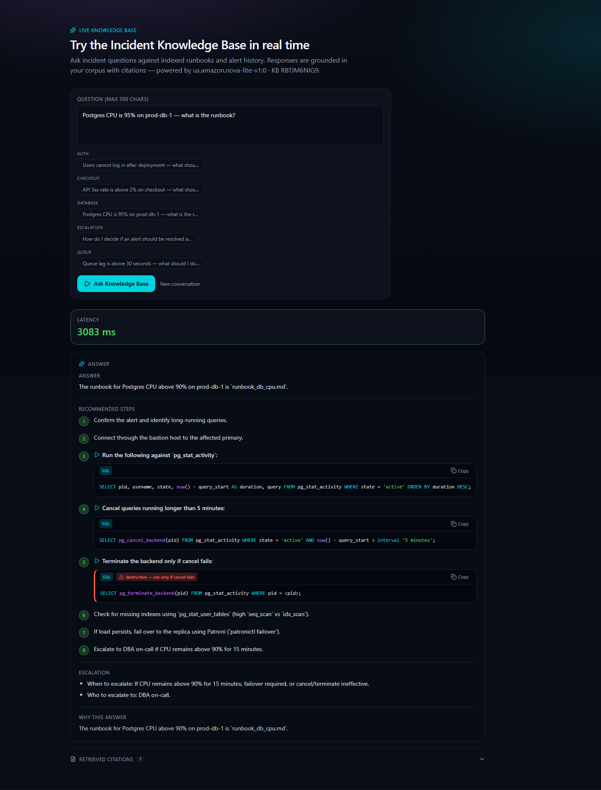
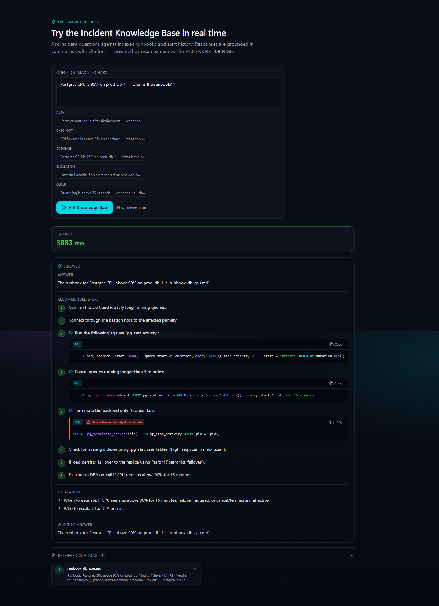
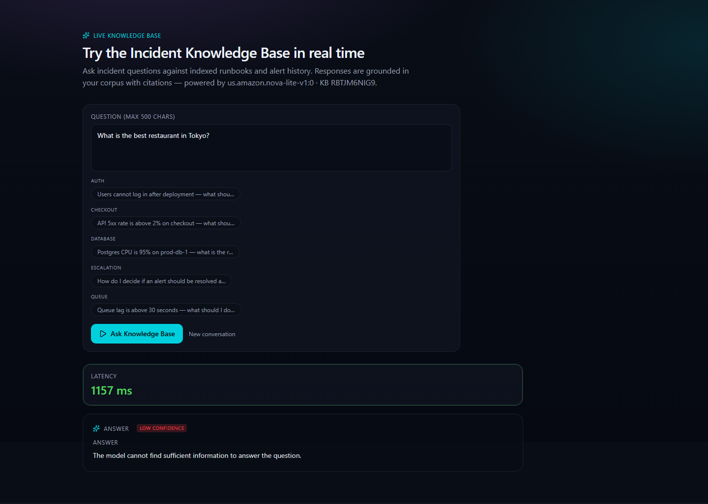
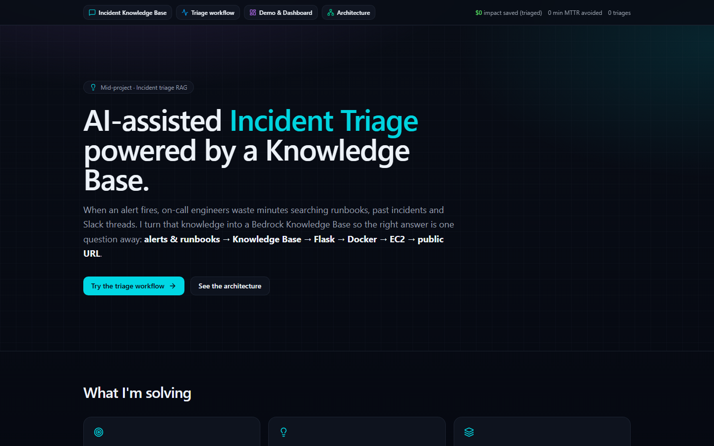
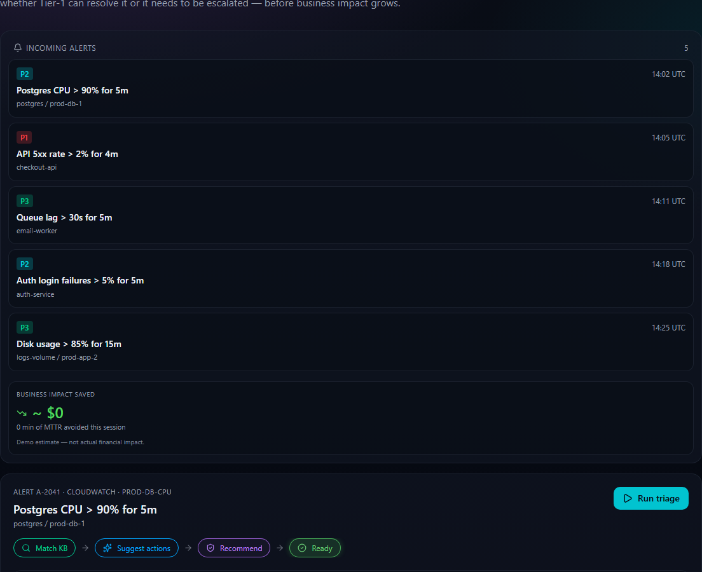
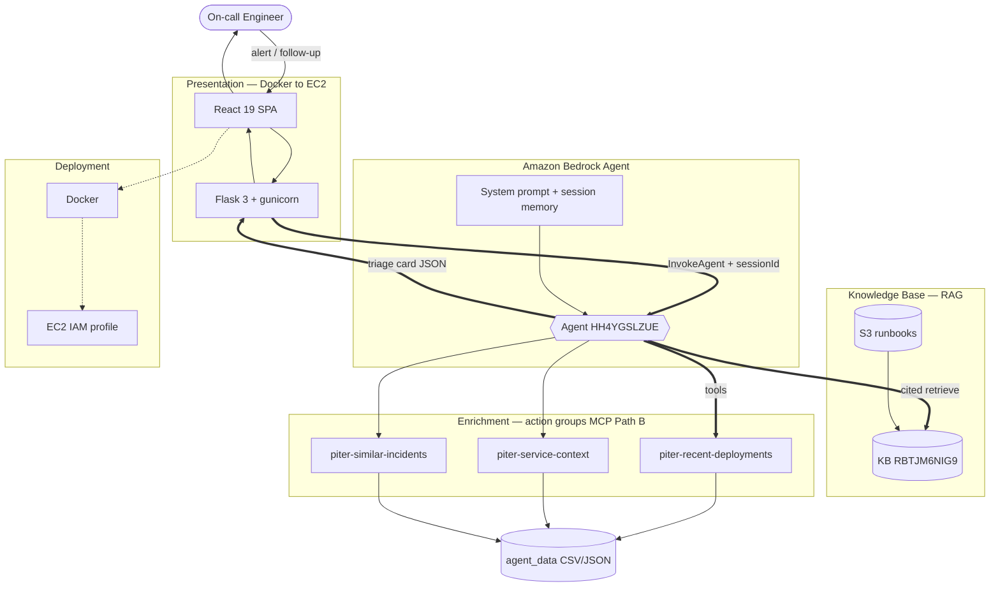
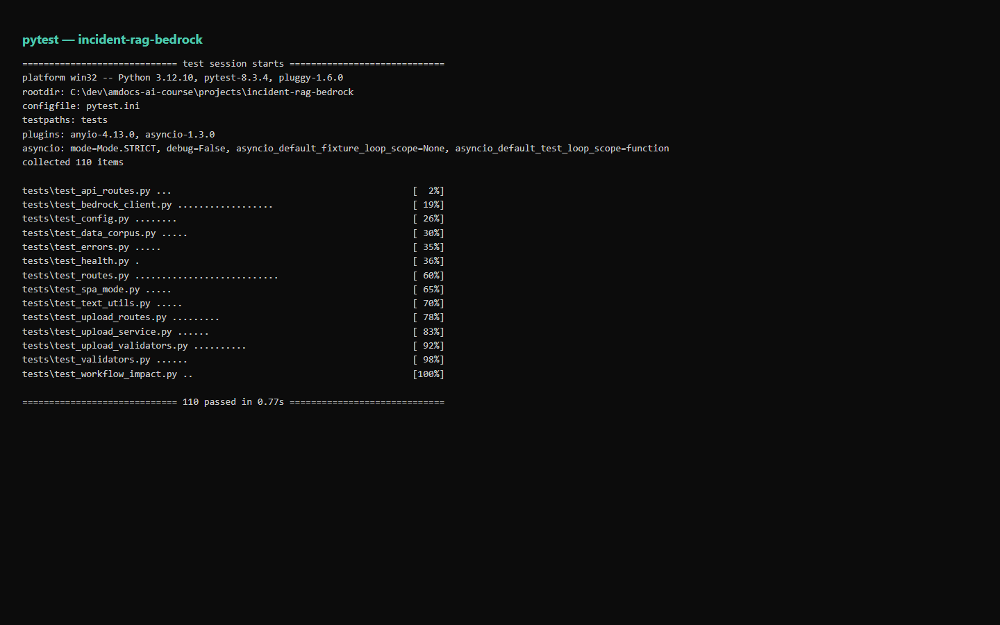
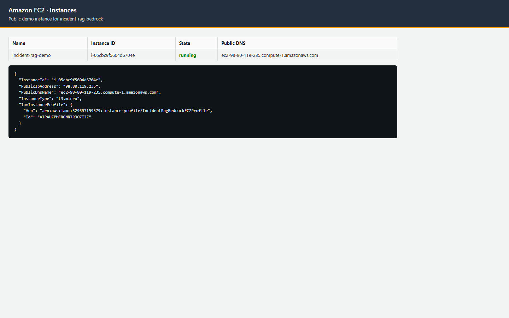
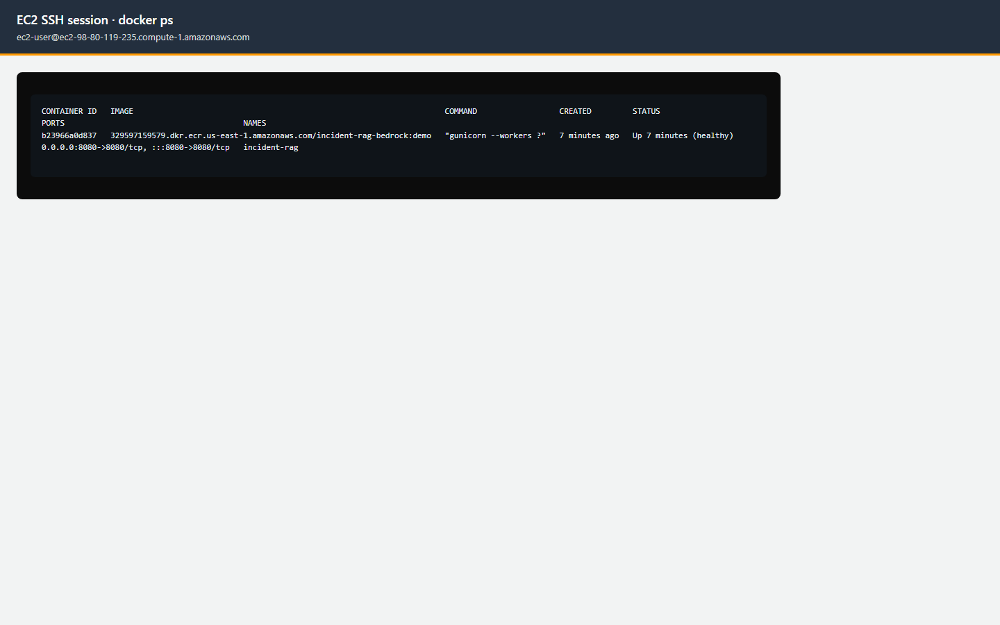

<div align="center">

# 🛰️ PITER AiOps — Bedrock Agent Mid-Project

### From Alert to Resolution, Faster.

*Priority · Investigation · Triage · Escalation · Resolution — a topic-based RAG web app for NOC / SRE incident operations —*
*built on **Amazon Bedrock Agent · Knowledge Base · Flask · boto3 · React · Docker · EC2**.*

<br/>

[](#-overview)
[](#-topic)
[](#-running-tests)
[](#-course-context)

<br/>


<br/>

<!-- "Button" navigation — anchor links styled as badges -->
[**▶&nbsp;&nbsp;Live Demo**](#-demo-questions) &nbsp;·&nbsp;
[**🏗️&nbsp;&nbsp;Architecture**](#%EF%B8%8F-system-architecture) &nbsp;·&nbsp;
[**⚡&nbsp;&nbsp;Quick Start**](#-quick-start) &nbsp;·&nbsp;
[**🔌&nbsp;&nbsp;API**](#-http-api) &nbsp;·&nbsp;
[**🚀&nbsp;&nbsp;Deploy**](#-deploy-to-ec2) &nbsp;·&nbsp;
[**🔒&nbsp;&nbsp;Security**](#-security-highlights)

</div>

---

## 📑 Table of Contents

<table>
<tr>
<td valign="top" width="33%">

- [Overview](#-overview)
- [Topic](#-topic)
- [Demo Questions](#-demo-questions)
- [System Architecture](#%EF%B8%8F-system-architecture)

</td>
<td valign="top" width="33%">

- [Technologies Used](#-technologies-used)
- [Knowledge Base Documents](#-knowledge-base-documents)
- [Quick Start](#-quick-start)
- [HTTP API](#-http-api)

</td>
<td valign="top" width="33%">

- [Sample Q&A](#-sample-questions--answers)
- [Screenshots](#-screenshots)
- [Deploy to EC2](#-deploy-to-ec2)
- [Security](#-security-highlights)
- [Cleanup](#-aws-resources--cleanup)

</td>
</tr>
</table>

---

## 🎯 Overview

On-call engineers waste **5–15 minutes per incident** searching for the right runbook, past ticket, or post-mortem. **PITER AiOps** links that corpus to a **managed Amazon Bedrock Agent** — ask a question, get a **grounded, cited answer in seconds**.

> [!NOTE]
> Every answer is grounded in retrieved source chunks and **cites the document it came from**. When the Knowledge Base has no relevant content, the app shows a visible **"Not in knowledge base"** state instead of hallucinating.

<div align="center">

| ✅ Grounded answers | 📎 Always cited | 🚫 Graceful refusal | 🔒 No keys on server |
|:---:|:---:|:---:|:---:|
| Bedrock Agent `invoke_agent` | Source chunk per answer | Amber card, no hallucination | IAM instance profile |

</div>

### 📷 See it in action

Four submission-grade app shots (viewport homepage + Live Knowledge Base panels).

<table>
<tr>
<td width="50%" valign="top" style="padding:4px">

<br/><sub><b>Grounded answer</b> — numbered steps + cited SQL</sub>
</td>
<td width="50%" valign="top" style="padding:4px">

<br/><sub><b>Citations</b> — expanded cards + relevance scores</sub>
</td>
</tr>
<tr>
<td width="50%" valign="top" style="padding:4px">

<br/><sub><b>Graceful refusal</b> — low confidence, no hallucination</sub>
</td>
<td width="50%" valign="top" style="padding:4px">

<br/><sub><b>Homepage</b> — hero + live Knowledge Base entry</sub>
</td>
</tr>
</table>

### MVP workflow — alert to resolution

End-to-end on-call loop: pick an alert, run triage, get grounded steps from the Knowledge Base, then resolve or escalate.



---

## 🖥️ Local-First Mode & Mid-Project Requirements

PITER AiOps runs a **reliable offline demo by default** — no AWS, no keys, no
network. Bedrock is optional and, when enabled, auto-falls back to local mode if
it is unavailable, so a live demo never fails.

### Run the local demo

```bash
cp .env.example .env          # optional; defaults to USE_BEDROCK=false
docker compose up --build     # → http://localhost:8080/console   (offline, no AWS)
```

Or with Python directly:

```bash
pip install -r requirements-dev.txt   # or requirements.txt for runtime-only (Docker matches this)
# USE_BEDROCK defaults to local fallback; force it explicitly if you like:
#   set USE_BEDROCK=false   (Windows)   /   export USE_BEDROCK=false   (bash)
gunicorn -b 0.0.0.0:8080 wsgi:app      # → http://localhost:8080/console
```

### Local-first API

| Method | Path | Purpose |
|:------:|------|---------|
| `GET`  | `/api/demo-alert` | Canned demo alert (Postgres CPU 95% on `prod-db-1`, NJ-DGE, P2) |
| `POST` | `/api/triage` | Run triage for a free-form alert → one triage card (JSON contract below) |
| `POST` | `/api/follow-up` | Follow-up question reusing the incident session memory |
| `GET`  | `/health` | Liveness (`?deep=1` for config checks) |
| `GET`  | `/console` | Self-contained HTML triage console for the live demo |

**Triage card JSON contract** (`POST /api/triage`): `answer`, `citations[{document, excerpt, score}]`,
`recommended_steps[]`, `suspect_deploys[]`, `owner{}`, `impact{}`, `similar_incidents[]`,
`session_id`, `memory_used`, `mode` (`local` | `bedrock`).

### How RAG works (local)

`app/services/local_rag.py` loads the 10 markdown runbooks in
`knowledge_base/runbooks/`, splits them into heading-delimited chunks, and ranks
them with a **pure-Python TF-IDF cosine** retriever (no heavy deps). Every answer
cites the source document + excerpt + score; below the relevance threshold the
app returns a visible **"Not in knowledge base"** refusal instead of guessing.

### How MCP / tools work

`app/services/tool_router.py` holds a `TOOLS` registry (name, description,
parameters) and emits/executes JSON decisions `{"tool": name, "arguments": {...}}`
— the same shape a model would produce. Triage runs all four deterministically;
follow-ups reuse stored tool outputs from session memory.

### The 4 enrichment tools (`app/enrichment_tools.py`)

1. **`correlate_deployments`** — recent deploys for the service + dependency hops; returns the suspect deploy + reason.
2. **`lookup_owner_and_escalation`** — owner team, on-call, secondary escalation, Slack channel, escalation chain, dependencies.
3. **`score_business_impact`** — cost per 15 min, estimated total cost, SLA risk, regulatory risk (with fallback estimate).
4. **`find_similar_incidents`** — similar past incidents with root cause, resolution, MTTR, similarity reason.

### Data files (Pandas / CSV / JSON)

`app/services/data_access.py` provides validated loaders (Pandas when available,
stdlib `csv`/`json` fallback) for `data/agent_data/deploys.csv`,
`data/agent_data/service_catalog.json`, `data/agent_data/impact_matrix.csv`,
`data/sample_documents/incident_history.csv`, and `data/external_status.json`.
Each raises a clear `DataAccessError` on missing files, missing columns, or
malformed JSON.

### Session memory

`app/services/session_memory.py` keeps one session per incident (`session_id`):
alert, citations, tool outputs, final card, and follow-up history. Follow-ups
reuse the same session so questions like *"who do I escalate to?"* are answered
**from memory** without re-running the tools.

### Course requirement coverage

- **Flask app** — `app/` factory + `app/routes.py` (JSON API + `/console` HTML UI).
- **RAG over documents** — local TF-IDF over `knowledge_base/runbooks/` (+ optional Bedrock KB), always cited.
- **MCP / tools** — `app/services/tool_router.py` JSON tool-calling over 4 tools.
- **Docker** — `docker compose up --build` runs offline out of the box.
- **Pandas / CSV / JSON** — `app/services/data_access.py` validated loaders.
- **Clean repo + README** — this document + `docs/`.
- **Live demo** — `/console`, reliable without AWS.
- **6-slide presentation** — `docs/presentation_outline.md`.

### Environment variables (local mode)

| Variable | Default | Purpose |
|----------|---------|---------|
| `USE_BEDROCK` | `false` | `false` = offline local mode; `true` = Bedrock (requires the AWS vars below) |
| `AWS_REGION`, `BEDROCK_KB_ID`, `BEDROCK_MODEL_ARN`, `BEDROCK_AGENT_ID`, `BEDROCK_AGENT_ALIAS_ID` | — | Only required when `USE_BEDROCK=true` |
| `FLASK_SECRET_KEY` | dev random | Set a long random hex in production |

### Run tests

```bash
pytest -q     # 189 offline tests, no AWS
```

> [!NOTE]
> **Spec folder mapping:** the spec's `app/tools/` and `app/agent/` are realized
> additively as `app/services/*` (`local_rag`, `data_access`, `tool_router`,
> `session_memory`, `triage_service`) plus `app/local_agent.py`, reusing the
> existing flat layout. Datasets stay under `data/agent_data/` (shared with the
> Bedrock action-group lambdas); only `data/external_status.json` and
> backward-compatible columns were added.

---

## 🧭 Topic

**Incident Operations** — NOC / SRE runbooks, alert triage, escalation policies, and post-mortems.

---

## ▶ Demo Questions

Five grounded questions aligned with the workflow alerts and [`data/demo_qa_expected.md`](data/demo_qa_expected.md):

| # | Question | Expected source |
|:-:|----------|-----------------|
| 1 | Postgres CPU is 95% on `prod-db-1` — what is the runbook? | `runbook_db_cpu.md` |
| 2 | API 5xx rate is above 2% on checkout — what should I check? | `runbook_checkout_5xx.md` |
| 3 | Queue lag is above 30 seconds — what should I do? | `runbook_queue_lag.md` |
| 4 | Users cannot log in after deployment — what should I check? | `runbook_auth_login.md` |
| 5 | Should an alert be resolved at Tier 1 or escalated? | `tier1_escalation_guide.md`, `escalation_policy.pdf` |

> [!TIP]
> **Off-topic refusal test:** *"What is the best restaurant in Tokyo?"* → returns an amber **Not in knowledge base** card, proving the refusal path works.

---

## 🏗️ System Architecture

> The diagram below renders **interactively on GitHub** (Mermaid) — pan, zoom, and click to enlarge.



**Primary backend:** `invoke_agent` via [`app/bedrock_agent_client.py`](app/bedrock_agent_client.py) (not direct `RetrieveAndGenerate`). **Tools:** three enrichment Lambdas wired as Bedrock action groups ([`docs/MCP_PATH.md`](docs/MCP_PATH.md) — Path B landed; AgentCore Gateway is optional Path A). **Memory:** `sessionId` + `sessionAttributes` on triage and follow-up `/ask`.

Source diagram: [`PITER AiOps_architecture.mermaid`](PITER AiOps_architecture.mermaid)

**Deployment path:** `Runbooks → S3 → KB sync → Agent + tools → Flask/React → Docker → EC2 → Cleanup`

<details>
<summary><b>📜 Text request path (click to expand)</b></summary>

<br/>

```text
User Browser
     |  POST /ask  or  POST /api/workflow/triage  (JSON or HTMX)
     v
Flask 3 + JSON API / optional Jinja + HTMX  (app/routes.py)
     |
     v  boto3 invoke_agent
Amazon Bedrock Agent (linked Knowledge Base)
     |
     +--> Knowledge Base (RBTJM6NIG9)
     |        |
     |        v  vector search
     |   OpenSearch Serverless
     |        |
     |        v  reads source chunks
     |      S3 Bucket (reem-amdocs-ai-artifacts-3331)
     |        `-- projects/piter-aiops/data/sample_documents/
     |
     +--> LLM (inference profile / Claude Haiku compatible model)
              |
              v
     Grounded answer + citations
              |
              v
     React SPA renders answer + citation cards
     (or Flask renders _answer.html / _workflow_result.html partial)
```

</details>

📷 Interactive architecture panel: [`screenshots/14_architecture.png`](screenshots/14_architecture.png)

---

## 🧰 Technologies Used

| Technology | Version | Role in this project |
|-----------|---------|---------------------|
| **Python** | 3.12 | Application language |
| **Flask** | 3.0.3 | Web framework, JSON API, optional legacy Jinja/HTMX |
| **React** | 19 | SPA UI ported from [`incident-iq-compass`](https://github.com/reem-mor/incident-iq-compass) |
| **Vite** | 7 | Frontend build; dev proxy to Flask `:8080` |
| **shadcn/ui** | — | Component library under `frontend/src/components/ui/` |
| **boto3** | 1.35.49 | AWS SDK; calls `bedrock-agent-runtime` |
| **HTMX** | 2.0.3 | Legacy UI only when `FORCE_LEGACY_UI=1` |
| **Amazon Bedrock** | AWS managed | `RetrieveAndGenerate` — single API call per Q&A |
| **Amazon S3** | AWS managed | Document corpus storage and KB data source |
| **OpenSearch Serverless** | AWS managed | Vector index managed by Bedrock KB |
| **Docker** | Engine / Desktop | Containerization with gunicorn, non-root user, healthcheck |
| **Amazon EC2** | t3.micro | Public demo host with IAM instance profile |
| **gunicorn** | 22.0.0 | Production WSGI server — never the Flask dev server |
| **Flask-WTF** | 1.2.1 | CSRF for legacy forms; JSON SPA routes exempt (token via `/api/bootstrap`) |
| **pytest** | 8.3.4 | 189 offline unit tests with Stubber and fakes; zero live AWS calls |

---

## 📚 Knowledge Base Documents

**17 files** under `data/sample_documents/` (original 10 + course demo runbooks). After adding files locally, upload to S3 and **Sync** the Bedrock data source.

### Course demo documents *(primary for grading Q&A)*

| File | Purpose |
|------|---------|
| `runbook_db_cpu.md` | Postgres CPU 95% — `pg_stat_activity`, cancel >5m queries, indexes, Patroni |
| `runbook_checkout_5xx.md` | Checkout / API 5xx triage |
| `runbook_queue_lag.md` | Email worker queue lag >30s |
| `runbook_auth_login.md` | Post-deploy login failures |
| `alerts_last_3mo.json` | Structured alert history (A-1042 checkout, prod-db CPU, etc.) |
| `postmortem_2024_07.md` | Checkout outage / N+1 / 47 min impact |
| `tier1_escalation_guide.md` | Tier 1 vs escalation decision guide |

<details>
<summary><b>📦 Original corpus — 10 files, still indexed (click to expand)</b></summary>

<br/>

| # | File | Format | Covers |
|:-:|------|:------:|--------|
| 1 | `auth_service_runbook.md` | MD | Authentication service triage |
| 2 | `database_connectivity_runbook.md` | MD | Postgres + Redis health checks |
| 3 | `monitoring_alerts_reference.md` | MD | Alert catalog P1/P2/P3 |
| 4 | `api_gateway_5xx_runbook.txt` | TXT | API Gateway 5xx storm |
| 5 | `payment_service_latency_runbook.txt` | TXT | Payment PSP failover |
| 6 | `incident_history.csv` | CSV | Past incidents with MTTR |
| 7 | `deployment_rollback_sop.docx` | DOCX | Rollback procedures |
| 8 | `postmortem_template.docx` | DOCX | Blameless post-mortem structure |
| 9 | `escalation_policy.pdf` | PDF | P1–P4 severity matrix |
| 10 | `on_call_handoff_checklist.pdf` | PDF | Shift handoff checklist |

</details>

**S3 location:** `s3://reem-amdocs-ai-artifacts-3331/projects/piter-aiops/data/sample_documents/`

> [!TIP]
> **Recommended S3 tags:** `Project=Amdocs-AI-Course`, `Environment=Course`, `Owner=Reem`, `Purpose=Bedrock-Knowledge-Base`. Keep **Block Public Access** enabled on the bucket.

<details>
<summary><b>🔧 Rebuild corpus locally</b></summary>

<br/>

```bash
pip install reportlab python-docx
python scripts/build_corpus.py
```

</details>

---

## ⚡ Quick Start

> [!IMPORTANT]
> **Prerequisites:** Python 3.12+ · Docker Desktop · an AWS account with Bedrock access · AWS CLI configured (`aws configure` or `AWS_PROFILE`). **Credential layout:** [docs/aws_credentials.md](docs/aws_credentials.md) — keys in `~/.aws/credentials`, IDs in `projects/piter-aiops/.env` (`PITER_*`).

**The fastest path — Docker (recommended):**

```bash
cp .env.example .env        # fill in your values (see table below)
docker compose up --build   # → http://localhost:8080  (includes built React SPA)
```

That's it. The container runs gunicorn on port **8080** with the built React SPA, a non-root user, and a healthcheck.

<details>
<summary><b>🔑 Environment variables (click to expand)</b></summary>

<br/>

| Variable | Required | Description |
|----------|:--------:|-------------|
| `PITER_AWS_REGION` | ✅ | Region where the KB lives — prefer `PITER_*` prefix (see `.env.example`) |
| `PITER_BEDROCK_KB_ID` | ✅ | Knowledge Base ID |
| `PITER_BEDROCK_MODEL_ARN` | ✅ | Foundation model or inference profile ARN |
| `PITER_FLASK_SECRET_KEY` | ✅ | Long random hex string for CSRF signing |
| `PITER_USE_BEDROCK` | ✅ | `false` offline / `true` live Bedrock |
| `AWS_PROFILE` | local | Profile name in `~/.aws/credentials` — **never put access keys in `.env`** |
| `PITER_S3_BUCKET` | upload | Corpus bucket for document upload scripts |
| `PITER_BEDROCK_DATA_SOURCE_ID` | KB sync | Enables post-upload ingestion jobs |
| `FLASK_ENV` | recommended | `development` locally, `production` on EC2 |

> [!WARNING]
> **Port:** The container listens on **8080** (gunicorn). Course handouts sometimes mention port 5000 — only map `5000:8080` in compose if you need that host port.
>
> **No `AWS_ACCESS_KEY_ID` in `.env` on EC2** — the IAM instance profile handles credentials.

</details>

<details>
<summary><b>🐍 Run with Python directly</b></summary>

<br/>

```bash
python -m venv .venv
source .venv/bin/activate        # Windows: .venv\Scripts\activate
pip install -r requirements-dev.txt   # or requirements.txt for runtime-only (Docker matches this)
gunicorn -b 0.0.0.0:8080 wsgi:app
# → http://localhost:8080
```

</details>

<details>
<summary><b>⚛️ React UI — local development</b></summary>

<br/>

The production UI lives in `frontend/` (design ported from **incident-iq-compass**). Build output is written to `app/static/spa/` and served by Flask when present.

```bash
# Terminal 1 — API
gunicorn -b 127.0.0.1:8080 wsgi:app

# Terminal 2 — Vite dev server (proxies /api, /ask, /documents to Flask)
cd frontend
npm install
npm run dev          # → http://localhost:5173
```

Build the SPA for Docker or same-origin Flask:

```bash
cd frontend && npm ci && npm run build
# served at http://localhost:8080 when gunicorn is running
```

Set `FORCE_LEGACY_UI=1` to fall back to the original Jinja + HTMX templates (used by most pytest fixtures). SPA-specific tests live in `tests/test_spa_mode.py`.

</details>

<details>
<summary><b>✅ Production verification</b></summary>

<br/>

Run from the **project root** (`projects/piter-aiops`). The Python venv is `.venv` here — not under `frontend/`.

**Windows (PowerShell):**

```powershell
cd projects\piter-aiops
.\scripts\verify.ps1
# Offline only (no AWS): .\scripts\verify.ps1 -SkipLiveAws -SkipE2e
```

**Linux / macOS:**

```bash
pytest -q
cd frontend && npm run build
docker compose up -d --build
APP_URL=http://127.0.0.1:8080 python scripts/verify_e2e.py   # SPA-aware E2E
python scripts/agent_smoke_test.py                         # live Bedrock Agent (requires AWS)
curl http://127.0.0.1:8080/health?deep=1
```

See [`docs/PRODUCTION_REVIEW.md`](docs/PRODUCTION_REVIEW.md) and [`docs/GRADING_CHECKLIST.md`](docs/GRADING_CHECKLIST.md) for the full checklist and course guideline mapping.

</details>

### 🧪 Running Tests

```bash
pytest -q          # 189 offline unit tests — no live AWS calls required
```

See [`TESTING.md`](TESTING.md) for the full checklist.

<div align="center">

<br/><sub><b>189 offline tests passing</b> — Stubber and fakes, zero live AWS calls</sub>
</div>

---

## 🔌 HTTP API

| Method | Path | Description |
|:------:|------|-------------|
| `GET` | `/` | React SPA (`app/static/spa`) or legacy Jinja homepage |
| `GET` | `/api/bootstrap` | JSON: examples, workflow alerts, upload limits, `alert_stream`, execution mode, notification mode |
| `GET` | `/api/alert-stream` | Deterministic storm summary (399 alerts); optional `?include_rows=true` |
| `GET` | `/api/kb/manifest` | Knowledge base document metadata from `knowledge_base/` |
| `GET` | `/console` | Legacy Jinja demo (redirects to SPA when `PITER_CONSOLE_REDIRECT_SPA=true`) |
| `POST` | `/api/triage` | Full incident triage card (RAG + tools + session) |
| `POST` | `/api/follow-up` | Session-aware follow-up questions |
| `GET` | `/health` | `{"status":"ok"}`; optional `?deep=1` for config checks |
| `POST` | `/ask` | JSON or HTMX: grounded answer + citations; optional `session_id` for follow-ups |
| `POST` | `/api/workflow/triage` | JSON: alert triage (Bedrock-backed) |
| `POST` | `/workflow/triage` | JSON or HTMX: same triage payload as above |
| `POST` | `/documents/upload` | JSON (`?format=json`) or HTMX: S3 upload + optional KB sync |

> [!NOTE]
> `/ask` accepts `Content-Type: application/json` with `{"question":"...","session_id":"..."}` (omit or null `session_id` to start a new Bedrock session). Upload with KB-sync issues returns **`202`** when the file reached S3 but ingestion did not start (`partial`, `sync_warning`).

---

## 💬 Sample Questions & Answers

See **[Demo Questions](#-demo-questions)** above and [`evaluation/qa_showcase.md`](evaluation/qa_showcase.md) for live Bedrock smoke output.

> **Q: Postgres CPU is 95% on `prod-db-1` — what is the runbook?**
>
> Check `pg_stat_activity`, cancel queries running longer than 5 minutes, review indexes, and escalate to DBA if CPU stays above 90%.
> **Source:** `runbook_db_cpu.md`

> **Q: What is the best restaurant in Tokyo?** *(off-topic — tests graceful refusal)*
>
> The system cannot find sufficient information to answer this question.
> **Result:** amber **Not in knowledge base** card — no hallucination.

📨 Submission deliverable (dataset + sample Q&A, ready to email): [`docs/teacher_submission_email.md`](docs/teacher_submission_email.md) · Dataset card: [`data/sample_documents/README.md`](data/sample_documents/README.md)

---

## 📸 Screenshots

All proof screenshots live in [`screenshots/`](screenshots/). See [`screenshots/README.md`](screenshots/README.md) for capture instructions.

**What to submit:** Tier 1 — `01`–`10` plus `08b_app_citations_expanded.png` (11 files). Tier 2 (`11`–`19`) and `extras/partA_*` are optional depth. Details in [`screenshots/README.md`](screenshots/README.md).

<details>
<summary><b>🗂️ Course submission name map (click to expand)</b></summary>

<br/>

| Course filename | Existing file in repo |
|-----------------|----------------------|
| `01-bedrock-knowledge-base.png` | `01_bedrock_kb_overview.png` |
| `02-bedrock-data-source-sync.png` | `02_bedrock_kb_data_source_synced.png` |
| `03-flask-local-app.png` | `07_app_homepage_public.png` / `08_app_question_and_answer.png` |
| `04-successful-question-answer.png` | `08_app_question_and_answer.png` |
| `05-docker-container-running.png` | `06_docker_ps_on_ec2.png` / local `docker ps` |
| `06-ec2-instance-details.png` | `04_ec2_instance_running.png` |
| `07-public-ec2-app.png` | `07_app_homepage_public.png` |
| `08-cleanup-proof.png` | `10_cleanup_console.png` |

</details>

<details>
<summary><b>🖼️ Full screenshot index — Tier 1 (11) + Tier 2 (9) + extras (click to expand)</b></summary>

<br/>

| # | File | Shows |
|:-:|------|-------|
| 01 | `01_bedrock_kb_overview.png` | Bedrock KB: name, ID, status Active |
| 02 | `02_bedrock_kb_data_source_synced.png` | Data source sync status = Available |
| 03 | `03_bedrock_model_access_granted.png` | Model access granted |
| 04 | `04_ec2_instance_running.png` | EC2 console: running instance with public IP (historical) |
| 05 | `05_security_group_rules.png` | SG inbound: **8080/tcp** from `0.0.0.0/0` |
| 06 | `06_docker_ps_on_ec2.png` | `docker ps`: container Up (healthy) on 8080 |
| 07 | `07_app_homepage_public.png` | Full app homepage |
| 08 | `08_app_question_and_answer.png` | Grounded answer — numbered steps + SQL |
| 08b | `08b_app_citations_expanded.png` | Same answer — citations expanded |
| 09 | `09_app_refusal_or_low_confidence.png` | Off-topic refusal only |
| 10 | `10_cleanup_console.png` | EC2 terminated / resources deleted |
| 11 | `11_pytest_passed.png` | pytest: full suite passed |
| 12 | `12_kb_smoke_evaluation.png` | Live KB smoke test: 6/6 PASS |
| 13 | `13_mvp_workflow.png` | MVP alert console + triage result |
| 14 | `14_architecture.png` | Interactive architecture panel |
| 15 | `15_document_upload_success.png` | Upload success + S3 key |
| 16 | `16_document_upload_validation.png` | Client validation: missing file |
| 17 | `17_document_upload_type_rejected.png` | Unsupported file type blocked |
| 18 | `18_dataset_corpus.png` | 10-document corpus catalog |
| 19 | `19_sample_questions_answers.png` | Live Q&A showcase: 4 grounded + 1 refusal |

Extras: `screenshots/extras/partA_*` (responsive crops). Archive: `screenshots/archive/` (not for submission).

</details>

---

## 🚀 Deploy to EC2

Full walkthrough: [`docs/ec2_deployment.md`](docs/ec2_deployment.md)

```bash
docker build -t piter-aiops:demo .
docker tag piter-aiops:demo ghcr.io/reemmor/piter-aiops:demo
docker push ghcr.io/reemmor/piter-aiops:demo
```

1. Launch EC2 **t3.micro** on Amazon Linux 2023.
2. Attach IAM instance profile **`IncidentRagBedrockEC2Profile`** (role **`IncidentRagBedrockEC2Role`**).
3. Security group: **8080/tcp** from `0.0.0.0/0` for the demo app (SSH optional, my IP only).
4. Use [`infra/ec2_user_data_demo.sh`](infra/ec2_user_data_demo.sh) to install Docker and run the ECR image on port **8080**.
5. Copy `.env` to `/home/ec2-user/.env` — **no AWS keys**; Bedrock auth via instance profile.
6. Verify: `curl http://<public-ip>:8080/health`

> [!NOTE]
> Demo instance `i-05cbc9f5604d6704e` was **terminated** after capture; `04`–`06` are historical proof. App shots `07`–`08b` use the same `:demo` image (captured locally or on the public IP before teardown).

<table>
<tr>
<td width="50%" valign="top">

<br/><sub><b>EC2 t3.micro running</b> — with public IP</sub>
</td>
<td width="50%" valign="top">

<br/><sub><b><code>docker ps</code> on EC2</b> — container Up (healthy)</sub>
</td>
</tr>
</table>

---

## 🔒 Security Highlights

| Practice | Implementation |
|----------|----------------|
| **No AWS keys on EC2** | IAM instance profile; no `AWS_ACCESS_KEY_ID` in `.env` on server |
| **Scoped IAM policy** | Bedrock retrieve/generate + S3 read + PutObject on KB prefix only |
| **SSH locked to my IP** | Port 22 not open to `0.0.0.0/0` |
| **Non-root container** | `useradd app` in Dockerfile, `USER app` before CMD |
| **CSRF protection** | Flask-WTF `CSRFProtect`; legacy POSTs validated; JSON SPA uses exempt routes + bootstrap token |
| **Server-side validation** | Questions 3–500 chars; upload type/size whitelist **before** any S3 call |
| **`.env` gitignored** | Only `.env.example` with placeholders is committed |
| **Graceful refusal** | No hallucination; amber card when KB has no relevant chunks |
| **gunicorn in production** | Docker and EC2 use gunicorn, never the Flask dev server |
| **Docker healthcheck** | `CMD curl -fsS http://localhost:8080/health` every 30s |

---

## Mid-project upgrade — Agent + enrichment tools + memory

**Live IDs (account `329597159579`, `us-east-1`):**

| Component | ID / name |
|-----------|-----------|
| Knowledge Base | `RBTJM6NIG9` |
| Bedrock Agent | `HH4YGSLZUE` |
| Enrichment Lambdas | Current deployed names: `iiq-correlate`, `iiq-context`, `iiq-similar`; final local target: `piter-recent-deployments`, `piter-service-context`, `piter-similar-incidents`, `piter-escalation` |
| Ops Lambda (unchanged) | `PITER AiOps-actions` |

### System prompt

The agent instruction is the **exact** brief in [`app/bedrock_agent_client.py`](app/bedrock_agent_client.py) (`AGENT_INSTRUCTION`). Sync to AWS:

```powershell
python scripts/setup_action_group.py --agent-id HH4YGSLZUE
python scripts/ensure_agent_alias.py --agent-id HH4YGSLZUE
```

### Session memory

`invoke_agent` receives `sessionAttributes` and `promptSessionAttributes` built by `build_session_attributes()` (alert id, service, env, severity, symptom, `triage_complete`). The workflow triage API accepts optional `session_id` for follow-up turns without re-triage.

### Enrichment tools (action groups)

| Tool | Data | Purpose |
|------|------|---------|
| `correlate_deployments` | `data/agent_data/deploys.csv`, `service_catalog.json` | Recent deploys + dependency hop |
| `lookup_owner` / `score_business_impact` | catalog + `impact_matrix.csv` | Owner + revenue impact |
| `find_similar_incidents` | `incident_history.csv` | Past incidents |

Deploy Lambdas and wire action groups:

```powershell
python scripts/setup_enrichment_lambdas.py --agent-id HH4YGSLZUE
```

Core logic is unit-tested in [`app/enrichment_tools.py`](app/enrichment_tools.py) and [`tests/test_enrichment_tools.py`](tests/test_enrichment_tools.py).

### MCP path (Phase 3)

- **Path B (landed):** Bedrock action groups — reliable agent tool path. See [`docs/MCP_PATH.md`](docs/MCP_PATH.md).
- **Path A (optional):** AgentCore Gateway + Cognito over the same Lambdas — probe with `python scripts/setup_agentcore_gateway.py --report-only`.

### Docker

```powershell
docker compose up --build
# http://localhost:8080
```

### Teardown after demo

Resource list and delete order: [`docs/TEARDOWN.md`](docs/TEARDOWN.md) (manual; no auto-delete in repo).

---

## 🧹 AWS Resources — Created & Deleted

Latest re-deployment (2026-06-02), region `us-east-1` — torn down same day after capture:

| Resource | Created | Status |
|----------|:-------:|--------|
| Bedrock Knowledge Base `RBTJM6NIG9` (`S3_VECTORS`) | ✅ | 🟢 Retained for course reuse (negligible cost) |
| S3 bucket `reem-amdocs-ai-artifacts-3331` | ✅ | 🟢 Retained; corpus prefix only |
| EC2 instance `i-05cbc9f5604d6704e` (`t3.micro`, `98.80.119.235`) | ✅ | 🔴 **Terminated** after demo (billing stopped) |
| Security group `sg-032f462d8ff507604` (`piter-aiops-sg`, 8080/tcp 0.0.0.0/0) | ✅ | 🔴 **Deleted** after demo (closed public 8080) |
| IAM role `IncidentRagBedrockEC2Role` (Bedrock+S3+ECR least-priv, SSM core) | ✅ | 🟢 Retained (free, reusable for redeploy) |
| IAM instance profile `IncidentRagBedrockEC2Profile` | ✅ | 🟢 Retained (free) |
| ECR repository `piter-aiops` (`:demo`, 165 MB) | ✅ | 🟢 Retained (free tier ≤500 MB; image ready for redeploy) |

Full log: [`docs/cleanup_log.md`](docs/cleanup_log.md) · Procedure: [`docs/cleanup_checklist.md`](docs/cleanup_checklist.md)

<details>
<summary><b>⚠️ Manual cleanup steps — run only after you approve</b></summary>

<br/>

1. Terminate EC2 demo instance
2. Remove temporary ECR images if used
3. Local Docker (review output first):

```powershell
docker images
docker ps -a
docker image prune -f
docker container prune -f
# Remove project image only after confirming tag:
# docker rmi piter-aiops:dev
```

4. Empty/delete S3 objects created only for this project (keep shared course bucket if reused)
5. Review/delete Bedrock KB if course allows
6. Review IAM roles/policies created for demo
7. Remove temporary security group rules (SSH/HTTP wide open)

**Concrete teardown for the 2026-06-02 deployment** (run after approval; deletes the only paid item first):

```powershell
$env:AWS_PROFILE="reemmor"; $env:AWS_REGION="us-east-1"
# 1) Terminate EC2 (stops billing)
aws ec2 terminate-instances --instance-ids i-05cbc9f5604d6704e
aws ec2 wait instance-terminated --instance-ids i-05cbc9f5604d6704e
# 2) Delete security group (after instance is gone)
aws ec2 delete-security-group --group-id sg-032f462d8ff507604
# 3) (optional) Tear down free IAM + ECR if not reusing
aws iam remove-role-from-instance-profile --instance-profile-name IncidentRagBedrockEC2Profile --role-name IncidentRagBedrockEC2Role
aws iam delete-instance-profile --instance-profile-name IncidentRagBedrockEC2Profile
aws iam delete-role-policy --role-name IncidentRagBedrockEC2Role --policy-name IncidentRagBedrockInline
aws iam detach-role-policy --role-name IncidentRagBedrockEC2Role --policy-arn arn:aws:iam::aws:policy/AmazonSSMManagedInstanceCore
aws iam delete-role --role-name IncidentRagBedrockEC2Role
aws ecr delete-repository --repository-name piter-aiops --force
```

> [!CAUTION]
> **Do not** auto-delete AWS resources from scripts in this repo. All teardown is manual and reviewed.

</details>

---

## 🧗 Challenges & Learnings

The trickiest parts were getting the Bedrock model ARN accepted in `us-east-1`, wiring the Knowledge Base through one small `RetrieveAndGenerate` wrapper, and making the refusal path unmistakable. If Bedrock returns no citations, the app renders a visible **Not in knowledge base** state instead of pretending it knows the answer.

The EC2 setup mattered too: an IAM instance profile kept long-lived AWS keys off the server, while Docker let the same app run locally and on the demo host with the same command shape.

---

## 🎓 Course Context

Built for the **AI-Augmented Software Engineering** course mid-project: *PITER AiOps with Amazon Bedrock Agent, Knowledge Base, Flask, Docker, and EC2.*

> [!NOTE]
> Primary backend: **`invoke_agent`** via [`app/bedrock_agent_client.py`](app/bedrock_agent_client.py). Set `RAG_BACKEND=retrieve_and_generate` to use direct KB [`RetrieveAndGenerate`](app/bedrock_client.py). Agent setup: [`docs/bedrock_agent_setup.md`](docs/bedrock_agent_setup.md).

See also [`../README.md`](../README.md) at the repo projects index.

<details>
<summary><b>📖 Documentation index (click to expand)</b></summary>

<br/>

| Doc | Purpose |
|-----|---------|
| [`TESTING.md`](TESTING.md) | pytest, Docker smoke, live KB test |
| [`docs/bedrock_agent_setup.md`](docs/bedrock_agent_setup.md) | Bedrock Agent create + alias |
| [`docs/bedrock_kb_setup.md`](docs/bedrock_kb_setup.md) | Step-by-step KB creation |
| [`docs/ec2_deployment.md`](docs/ec2_deployment.md) | EC2 launch and smoke test |
| [`docs/architecture.md`](docs/architecture.md) | Component breakdown and request flow |
| [`docs/edge_cases.md`](docs/edge_cases.md) | Validation and error paths |
| [`docs/code_review.md`](docs/code_review.md) | Self-review notes |
| [`docs/cleanup_checklist.md`](docs/cleanup_checklist.md) | Mandatory teardown steps |
| [`docs/cleanup_log.md`](docs/cleanup_log.md) | What was deleted vs retained |
| [`docs/PHASE0_AUDIT.md`](docs/PHASE0_AUDIT.md) | Mid-project folder audit + gaps |
| [`docs/MCP_PATH.md`](docs/MCP_PATH.md) | MCP Path A vs B decision |
| [`docs/TEARDOWN.md`](docs/TEARDOWN.md) | Post-demo resource teardown |
| [`docs/SUBMISSION_CHECKLIST.md`](docs/SUBMISSION_CHECKLIST.md) | R1–R11 evidence, smoke commands, screenshot list |
| [`docs/READONLY_VERIFICATION.md`](docs/READONLY_VERIFICATION.md) | Read-only AWS + local verification log |

</details>

---

<div align="center">

### Author

**Re'em Mor** &nbsp;·&nbsp; NOC / SRE Engineer &nbsp;·&nbsp; [@reemmor](https://github.com/reemmor)

<sub>Built with Amazon Bedrock · Flask · React · Docker · EC2 — grounded answers, real citations, honest refusals.</sub>

[⬆ Back to top](#%EF%B8%8F-PITER AiOps--bedrock-agent-mid-project)

</div>
