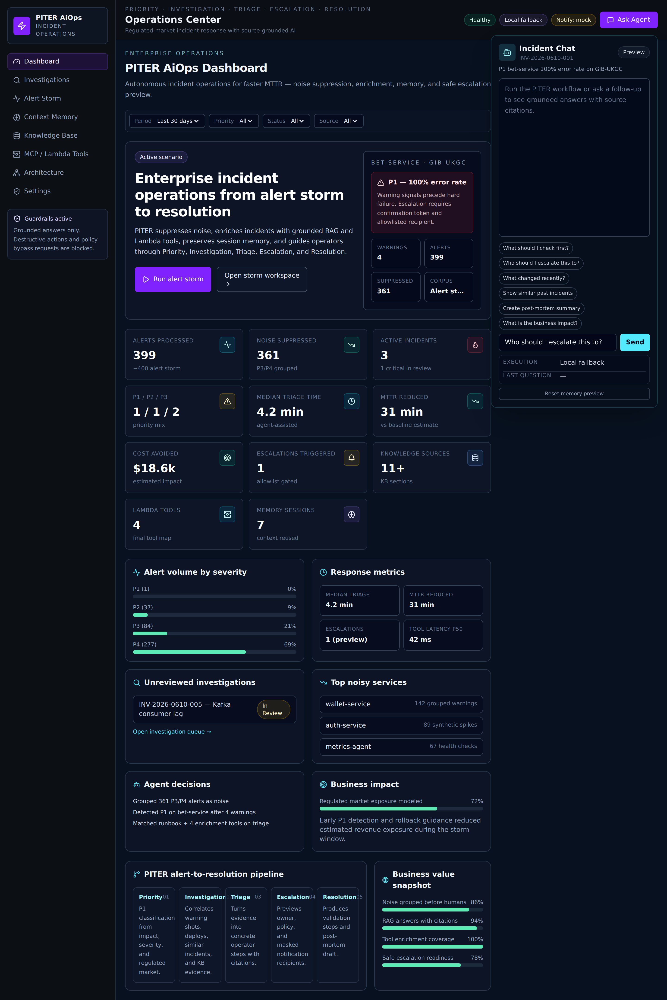
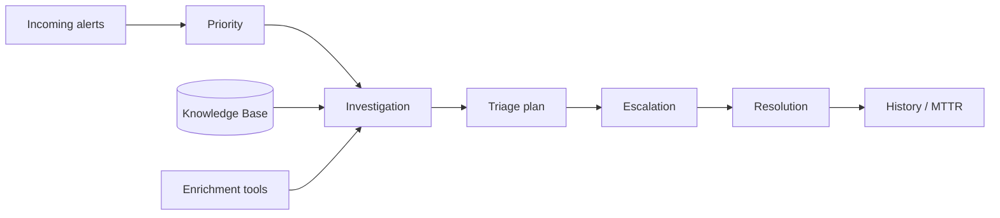
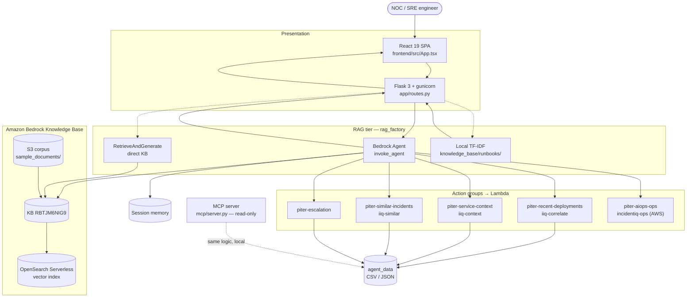
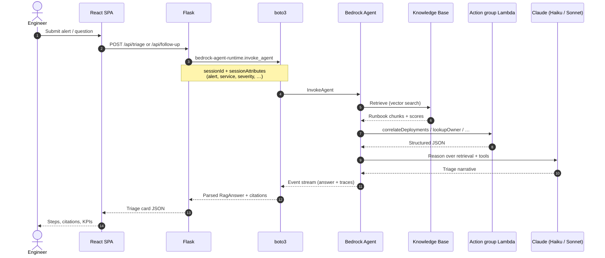
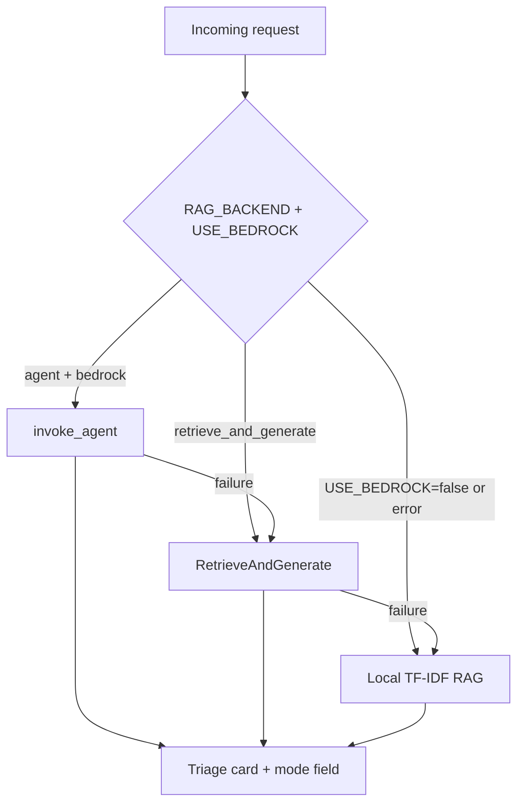

# PITER AiOps

**Priority · Investigation · Triage · Escalation · Resolution** — an AI-assisted incident operations demo for NOC and SRE teams.

Ground runbooks, alert history, and structured ops data in **Amazon Bedrock** (Knowledge Base + Agent + Lambda action groups). A **Flask** API and **React** ops console turn alerts into cited triage plans, with a **local TF-IDF fallback** when AWS is off.

| | |
|---|---|
| **Demo console** | [http://localhost:8080/console](http://localhost:8080/console) after `docker compose up --build` |
| **Lovable design** | [`lovable.project.json`](lovable.project.json) · [editor](https://lovable.dev/projects/45406342-f6e0-4ad6-8e49-bb456a6c47d0) |
| **Tests** | `pytest -q` — offline, no live AWS required |
| **Course** | AI-Augmented Software Engineering mid-project |

### Naming (PITER vs legacy)

| Surface | Name |
|---------|------|
| Product / UI | **PITER AiOps** |
| Repo folder | `projects/piter-aiops/` |
| S3 corpus prefix | `projects/piter-aiops/data/sample_documents/` |
| Local action group folders | `action_groups/piter-*` (enrichment), `action_groups/incidentiq-ops/` (ops — legacy folder name) |
| AWS console (post-mutation, 2026-06-08) | Agent `incidentiq-triage-agent` **v6** (alias `live`), Lambdas `iiq-*` + **`piter-escalation`**, ops group **`incidentiq-ops` DISABLED** on live alias |

Older docs or screenshots may still say `incident-rag-bedrock` (pre-rename repo path) or **IncidentIQ** (early working title). The live KB data source uses the `piter-aiops` S3 prefix — see [`evaluation/live_demo_aws_state.md`](evaluation/live_demo_aws_state.md).

---

## Table of contents

- [Problem and solution](#problem-and-solution)
- [Use cases](#use-cases)
- [Architecture](#architecture)
- [Stack in depth](#stack-in-depth)
- [Quick start](#quick-start)
- [HTTP API](#http-api)
- [Development and verification](#development-and-verification)
- [Deploy to EC2](#deploy-to-ec2)
- [Security](#security)
- [Further reading](#further-reading)

---

## Problem and solution

On-call engineers lose **5–15 minutes per incident** hunting runbooks, past tickets, Slack threads, and deploy history. PITER AiOps connects that corpus to a managed Bedrock Agent so the operator asks one question and gets a **grounded, cited answer in seconds**.

| Principle | How it is enforced |
|-----------|-------------------|
| Grounded answers | Every step ties to a retrieved chunk or tool result |
| Citations | Document name, excerpt, and relevance score on every card |
| Honest refusal | Amber **Not in knowledge base** when evidence is missing — no hallucination |
| Safe demo | Local mode works with zero AWS credentials; Bedrock is optional |



*Alert-storm KPIs, PITER pipeline, agent chat, and investigation workspace — [`screenshots/`](screenshots/) for full capture set.*

---

## Use cases

### 1. Single-alert triage (Q&A)

An engineer pastes or selects an alert (e.g. *Postgres CPU 95% on `prod-db-1`*). The app retrieves matching runbook sections, ranks them, and returns a structured triage card with numbered steps and sources.

**Example questions:** see [`data/demo_qa_expected.md`](data/demo_qa_expected.md).

| Question | Expected source |
|----------|-----------------|
| Postgres CPU 95% on `prod-db-1` — what is the runbook? | `runbook_db_cpu.md` |
| API 5xx rate above 2% on checkout — what should I check? | `runbook_checkout_5xx.md` |
| Queue lag above 30 seconds — what should I do? | `runbook_queue_lag.md` |
| Users cannot log in after deployment — what should I check? | `runbook_auth_login.md` |
| Tier 1 resolve or escalate? | `tier1_escalation_guide.md`, `escalation_policy.pdf` |

**Off-topic test:** *"What is the best restaurant in Tokyo?"* → refusal card (proves the guardrail path).

### 2. Alert storm and noise suppression

A deterministic stream of **399 alerts** (`data/source/alert_stream.csv`) drives the **Alert Storm** demo: KPI tiles show noise suppressed vs one P1 candidate, then **Run PITER Analysis** runs full triage, escalation, chat with session memory, document upload, and **Mark resolved** with MTTR impact.

Flow: **Start Alert Storm → Run PITER Analysis → follow-up chat / upload → escalate → resolve.**

### 3. Session memory and follow-ups

After triage, follow-ups reuse the same `session_id` — tool outputs, citations, and alert context stay in memory. Questions like *"Who do I escalate to?"* or *"What was the suspect deploy?"* answer from stored state without re-running enrichment.

Implementation: [`app/services/session_memory.py`](app/services/session_memory.py) + Bedrock `sessionId` / `sessionAttributes` on `invoke_agent`.

### 4. Enrichment during triage (deploys, owners, impact, history)

The agent (or local tool router) calls four enrichment tools backed by CSV/JSON under `data/agent_data/`:

| Tool | Data | Output |
|------|------|--------|
| `correlate_deployments` | `deploys.csv`, `service_catalog.json` | Suspect deploy + reason |
| `lookup_owner_and_escalation` | service catalog | Owner, on-call, Slack, escalation chain |
| `score_business_impact` | `impact_matrix.csv` | Cost / SLA / regulatory risk |
| `find_similar_incidents` | `incident_history.csv` | Past incidents, MTTR, root cause |

### 5. Document upload and KB sync

Operators upload runbooks or post-mortems via the UI. Flask validates type/size, writes to **S3**, and optionally starts a **Bedrock ingestion job** when `PITER_BEDROCK_DATA_SOURCE_ID` is set.

### 6. Live ops actions (Bedrock action group)

The **ops action group** exposes environment status, recent alerts, and incident creation (mock backend in v1). Handler code lives in [`action_groups/incidentiq-ops/`](action_groups/incidentiq-ops/) (legacy folder name); in AWS the group is still named `incidentiq-ops` with Lambda `incidentiq-actions`. The agent discovers tools via OpenAPI schema stored in S3.

---

## Architecture

Diagrams below render **interactively on GitHub** (Mermaid). Source: [`piter_architecture.mermaid`](piter_architecture.mermaid).

### PITER product flow



### System topology



> **AWS naming:** deployed Lambdas may still use `iiq-*` names; local folders under `action_groups/piter-*` mirror the same contracts. See [`evaluation/live_demo_aws_state.md`](evaluation/live_demo_aws_state.md).

### Request sequence (Bedrock Agent path)



### Fallback chain



| Config | Response `mode` | UI label |
|--------|-----------------|----------|
| `RAG_BACKEND=agent`, `PITER_USE_BEDROCK=true` | `bedrock` | Bedrock Agent |
| `RAG_BACKEND=retrieve_and_generate`, Bedrock on | `bedrock` | Direct KB |
| Bedrock off or unreachable | `local` | Local fallback |

---

## Stack in depth

### Amazon Bedrock Knowledge Base

The **Knowledge Base** is the managed RAG layer: documents live in **S3**, Bedrock chunks and embeds them into **OpenSearch Serverless**, and retrieval returns scored passages for the model to cite.

| Item | Value |
|------|-------|
| KB ID | `RBTJM6NIG9` |
| Data source | `YICXAB6WOG` — `piter-aiops-runbooks-datasource` |
| Corpus prefix | `s3://reem-amdocs-ai-artifacts-3331/projects/piter-aiops/data/sample_documents/` |
| Local mirror | `data/sample_documents/` (17 files) + `knowledge_base/runbooks/` for offline RAG |

**Lifecycle:** add files locally → upload to S3 → **Sync** data source in console or via script → ingestion job completes → retrieval works in Agent or `RetrieveAndGenerate`.

Setup walkthrough: [`docs/bedrock_kb_setup.md`](docs/bedrock_kb_setup.md).

### boto3 — how the app talks to AWS

All AWS access goes through **boto3** with explicit clients and retries — no raw HTTP.

| Module | boto3 client | Purpose |
|--------|--------------|---------|
| [`app/bedrock_agent_client.py`](app/bedrock_agent_client.py) | `bedrock-agent-runtime` | `invoke_agent` — primary production path |
| [`app/bedrock_client.py`](app/bedrock_client.py) | `bedrock-agent-runtime` | `retrieve_and_generate` — direct KB Q&A |
| Upload / sync scripts | `s3`, `bedrock-agent` | PutObject, start ingestion |
| Deploy scripts | `lambda`, `iam`, `bedrock-agent` | Action group provisioning |

Credentials follow the standard chain: `AWS_PROFILE` → `~/.aws/credentials` locally; **IAM instance profile** on EC2 (no keys in `.env`). Region and resource IDs come from [`app/config.py`](app/config.py) (`PITER_*` preferred).

```python
# Simplified pattern (bedrock_agent_client.py)
client = boto3.client(
    "bedrock-agent-runtime",
    region_name=cfg.AWS_REGION,
    config=BotoConfig(retries={"max_attempts": 3, "mode": "adaptive"}),
)
response = client.invoke_agent(
    agentId=cfg.BEDROCK_AGENT_ID,
    agentAliasId=cfg.BEDROCK_AGENT_ALIAS_ID,
    sessionId=session_id,
    inputText=question,
    sessionState={"sessionAttributes": attrs, "promptSessionAttributes": prompt_attrs},
)
```

### Amazon Bedrock Agent

The **Agent** orchestrates retrieval, tool use, and generation under a fixed instruction set ([`AGENT_INSTRUCTION`](app/bedrock_agent_client.py)) aligned to the PITER workflow: Priority → Investigation → Triage → Escalation → Resolution.

| Item | Value |
|------|-------|
| Agent ID | `HH4YGSLZUE` |
| Alias | `O2EM03R4R3` (`live`) |
| Model | Claude Haiku 4.5 inference profile (configurable via `PITER_BEDROCK_MODEL_ARN`) |
| Linked KB | `RBTJM6NIG9` |

Provision / sync: [`docs/bedrock_agent_setup.md`](docs/bedrock_agent_setup.md).

### Action groups and Lambda functions

**Action groups** teach the agent *what tools exist*. Each group has:

1. An **OpenAPI 3 schema** (`openapi_schema.yaml`) uploaded to S3  
2. A **Lambda** that implements the paths the schema describes  
3. An IAM **agent resource role** allowed to `lambda:InvokeFunction` and `bedrock:Retrieve`

#### Enrichment Lambdas (triage context)

| Action group (local folder) | Deployed name (AWS) | OpenAPI operation | Handler |
|----------------------------|---------------------|-------------------|---------|
| [`piter-recent-deployments`](action_groups/piter-recent-deployments/) | `iiq-correlate` | `correlateDeployments` | [`lambda_function.py`](action_groups/piter-recent-deployments/lambda_function.py) |
| [`piter-service-context`](action_groups/piter-service-context/) | `iiq-context` | owner / impact lookups | [`lambda_function.py`](action_groups/piter-service-context/lambda_function.py) |
| [`piter-similar-incidents`](action_groups/piter-similar-incidents/) | `iiq-similar` | similar incident search | [`lambda_function.py`](action_groups/piter-similar-incidents/lambda_function.py) |
| [`piter-escalation`](action_groups/piter-escalation/) | (preview / mock / gated live) | escalation preview | [`lambda_function.py`](action_groups/piter-escalation/lambda_function.py) |

Shared business logic also lives in [`app/enrichment_tools.py`](app/enrichment_tools.py) so Flask, Lambdas, and tests use one implementation.

Deploy:

```powershell
python scripts/setup_enrichment_lambdas.py --agent-id HH4YGSLZUE
python scripts/setup_action_group.py --agent-id HH4YGSLZUE
```

#### Ops Lambda (live environment tools)

| Action group | Lambda | Tools |
|--------------|--------|-------|
| [`incidentiq-ops`](action_groups/incidentiq-ops/) (legacy folder) | `incidentiq-actions` (AWS) | `GET /environments/{env}/status`, `GET /alerts`, `POST /incidents` |

See [`docs/bedrock_action_group_setup.md`](docs/bedrock_action_group_setup.md).

### MCP layer (local contract)

[`mcp/server.py`](mcp/server.py) exposes the same four enrichment tools over **Model Context Protocol** (stdio JSON-RPC) for IDE agents and demos — read-only, no AWS. Production tool calls still go through Bedrock action groups; MCP is the standardized local mirror. Details: [`docs/MCP_PATH.md`](docs/MCP_PATH.md).

### Application layers

| Layer | Technology | Role |
|-------|------------|------|
| UI | React 19, Vite 7, shadcn/ui, Tailwind 4 | Ops console — built to `app/static/spa/` |
| API | Flask 3, gunicorn | JSON routes, session memory, upload |
| RAG factory | [`app/rag_factory.py`](app/rag_factory.py) | Agent → RnG → local fallback |
| Local RAG | [`app/services/local_rag.py`](app/services/local_rag.py) | TF-IDF over markdown runbooks |
| Tool router | [`app/services/tool_router.py`](app/services/tool_router.py) | JSON tool-calling shape for local triage |
| Container | Docker Compose | Non-root user, healthcheck on `:8080` |
| Host | EC2 t3.micro + IAM profile | Public demo without long-lived keys |

---

## Quick start

### Docker (recommended)

Works **offline by default** — no AWS account required.

```bash
cp .env.example .env          # optional; PITER_USE_BEDROCK=false
docker compose up --build     # → http://localhost:8080/console
```

### Python directly

```bash
python -m venv .venv
# Windows: .venv\Scripts\activate
pip install -r requirements-dev.txt
gunicorn -b 0.0.0.0:8080 wsgi:app
```

### Enable live Bedrock

Set in `.env` (see [`.env.example`](.env.example)):

| Variable | Purpose |
|----------|---------|
| `PITER_USE_BEDROCK=true` | Turn on AWS backends |
| `PITER_AWS_REGION` | e.g. `us-east-1` |
| `PITER_BEDROCK_KB_ID` | Knowledge Base ID |
| `PITER_BEDROCK_AGENT_ID` / `PITER_BEDROCK_AGENT_ALIAS_ID` | When `RAG_BACKEND=agent` |
| `PITER_BEDROCK_MODEL_ARN` | Foundation model or inference profile |
| `AWS_PROFILE` | Profile in `~/.aws/credentials` — **never put access keys in `.env`** |

Credential layout: [`docs/aws_credentials.md`](docs/aws_credentials.md).

### Frontend dev (Vite proxy)

```bash
# Terminal 1
gunicorn -b 127.0.0.1:8080 wsgi:app

# Terminal 2
cd frontend && npm install && npm run dev   # → http://localhost:5173
```

Production build: `cd frontend && npm run build` → served from Flask at `/` and `/console`.

---

## HTTP API

| Method | Path | Description |
|:------:|------|-------------|
| `GET` | `/` | React SPA (or legacy UI if `FORCE_LEGACY_UI=1`) |
| `GET` | `/console` | Ops demo console |
| `GET` | `/health` | Liveness; `?deep=1` for config checks |
| `GET` | `/api/bootstrap` | Examples, storm summary, execution mode, upload limits |
| `GET` | `/api/alert-stream` | Alert storm metadata (399 alerts) |
| `GET` | `/api/kb/manifest` | Local KB document list |
| `POST` | `/api/triage` | Full triage card (RAG + tools + session) |
| `POST` | `/api/follow-up` | Session-aware follow-up |
| `POST` | `/ask` | Grounded Q&A + citations (`session_id` optional) |
| `POST` | `/documents/upload` | S3 upload + optional KB sync |

**Triage card fields:** `answer`, `citations[]`, `recommended_steps[]`, `suspect_deploys[]`, `owner`, `impact`, `similar_incidents[]`, `session_id`, `memory_used`, `mode` (`local` \| `bedrock`).

---

## Development and verification

```bash
pytest -q                                    # offline unit tests
cd frontend && npm run build
docker compose up -d --build
python scripts/verify_e2e.py                 # SPA-aware E2E (APP_URL=http://127.0.0.1:8080)
python scripts/verify_spa_demo.py          # Alert storm workflow
python scripts/agent_smoke_test.py         # live Bedrock Agent (needs AWS)
```

Windows: `.\scripts\verify.ps1`

Full checklist: [`docs/GRADING_CHECKLIST.md`](docs/GRADING_CHECKLIST.md) · [`TESTING.md`](TESTING.md)

---

## Deploy to EC2

1. Build and push image (or use ECR `:demo` tag).
2. Launch **t3.micro** with IAM profile **`IncidentRagBedrockEC2Profile`**.
3. Security group: **8080/tcp** for demo HTTP.
4. User data: [`infra/ec2_user_data_demo.sh`](infra/ec2_user_data_demo.sh).
5. Copy `.env` to the host — **no AWS keys**; Bedrock via instance profile.

Walkthrough: [`docs/ec2_deployment.md`](docs/ec2_deployment.md)

---

## Security

| Control | Implementation |
|---------|----------------|
| No keys on EC2 | IAM instance profile only |
| Scoped IAM | Bedrock retrieve/generate, S3 prefix, Lambda invoke |
| Non-root container | `USER app` in Dockerfile |
| Input validation | Question length, upload type/size before S3 |
| CSRF | Flask-WTF on legacy forms; JSON routes exempt with bootstrap token |
| Operator guardrails | [`app/guardrails.py`](app/guardrails.py) blocks destructive SQL/Redis patterns before Bedrock |
| Refusal path | No citations → visible amber card, not invented steps |
| Secrets | `.env` gitignored; only `.env.example` committed |

Teardown: [`docs/TEARDOWN.md`](docs/TEARDOWN.md) · [`docs/cleanup_checklist.md`](docs/cleanup_checklist.md)

---

## Further reading

| Document | Topic |
|----------|-------|
| [`docs/architecture.md`](docs/architecture.md) | Component breakdown |
| [`docs/bedrock_kb_setup.md`](docs/bedrock_kb_setup.md) | Create and sync Knowledge Base |
| [`docs/bedrock_agent_setup.md`](docs/bedrock_agent_setup.md) | Agent + alias |
| [`docs/bedrock_action_group_setup.md`](docs/bedrock_action_group_setup.md) | Ops Lambda action group |
| [`docs/MCP_PATH.md`](docs/MCP_PATH.md) | MCP vs Bedrock action groups |
| [`docs/knowledge_base.md`](docs/knowledge_base.md) | Corpus layout |
| [`docs/SUBMISSION_CHECKLIST.md`](docs/SUBMISSION_CHECKLIST.md) | Screenshots and grading evidence |
| [`docs/review/PITER_AWS_MUTATION_FINAL_REPORT.md`](docs/review/PITER_AWS_MUTATION_FINAL_REPORT.md) | AWS agent/guardrail/tool alignment (2026-06-08) |
| [`evaluation/qa_showcase.md`](evaluation/qa_showcase.md) | Live Q&A samples |
| [`screenshots/README.md`](screenshots/README.md) | Capture instructions |

---

**Author:** Re'em Mor · NOC / SRE · [GitHub @reemmor](https://github.com/reemmor)

Built for the **AI-Augmented Software Engineering** course — Amazon Bedrock Agent, Knowledge Base, Flask, React, Docker, and EC2.
