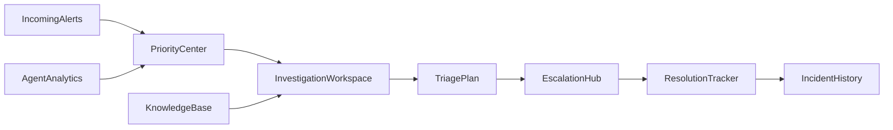
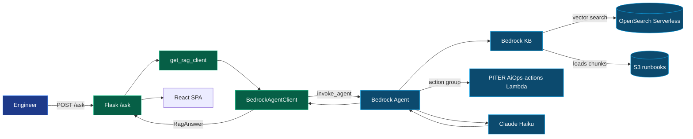

# Architecture

## PITER product flow

## Components

| Layer | Choice | Why |
|---|---|---|
| Web framework | **Flask 3 + React SPA** | REST/HTMX API with modern React UI for incident ops demos. |
| WSGI server | **gunicorn (2 workers)** | Production-standard; never ship the Flask dev server. |
| RAG backend | **Amazon Bedrock Agent (`invoke_agent`)** | Managed orchestration over the linked Knowledge Base; same `RagAnswer` contract as Part 1. |
| Fallback | **Bedrock `RetrieveAndGenerate`** | Set `RAG_BACKEND=retrieve_and_generate` when agent is not provisioned. |
| Foundation model | **Claude Haiku (inference profile)** | Cheap, fast, great quality for MVP. |
| Vector store | **OpenSearch Serverless** (KB-managed) | Auto-provisioned; no infrastructure to write. |
| Source of truth | **S3** `projects/piter-aiops/data/sample_documents/` | Single canonical corpus (RB ids in doc headings); local RAG reads the same path |
| Container | **python:3.12-slim + non-root user** | Small, secure base. |
| Host | **EC2 t3.micro + IAM instance profile** | Free-tier, no AWS keys on disk. |

## Execution modes (UI honesty)

| Config | Response `mode` | UI label |
|---|---|---|
| `RAG_BACKEND=agent`, `USE_BEDROCK=true` | `bedrock` | Bedrock Agent |
| `RAG_BACKEND=retrieve_and_generate`, `USE_BEDROCK=true` | `bedrock` | Direct Bedrock KB |
| Bedrock failure or invalid KB id | `local` | Local fallback |

`/api/bootstrap` exposes `rag_backend`, `use_bedrock`, and `execution_mode_hint` without secrets.
The React SPA and legacy `/console` both call `POST /api/triage` and `POST /api/follow-up`.

## Alert storm demo data

The deterministic storm lives in `data/source/alert_stream.csv` (**399 rows**). `GET /api/alert-stream`
returns summary metadata for the SPA dashboard and storm page. Do not change the generator to 500 —
tests assert `390 <= total <= 400`.

## Request flow

## Why this design impresses

- **Managed Bedrock Agent** adds orchestration and session memory while reusing the same KB corpus.
- **Lambda action group** (`PITER AiOps-ops`) for live environment status, alerts, and incident creation — see [`bedrock_action_group_setup.md`](bedrock_action_group_setup.md).
- **Same `RagAnswer` contract** — UI, workflow triage, and tests unchanged.
- **Citations rendered as evidence cards** prove the answer is grounded.
- **Graceful refusal** when no citations are returned — no hallucination.
- **`RAG_BACKEND` fallback** to direct `RetrieveAndGenerate` for local dev without agent IDs.
- **IAM instance profile** instead of access keys.
- **gunicorn, non-root container, healthcheck, CSRF** — production patterns at MVP scope.

See [`bedrock_agent_setup.md`](bedrock_agent_setup.md) for agent provisioning. For Lambda action groups (ops tools), see [`bedrock_action_group_setup.md`](bedrock_action_group_setup.md).
