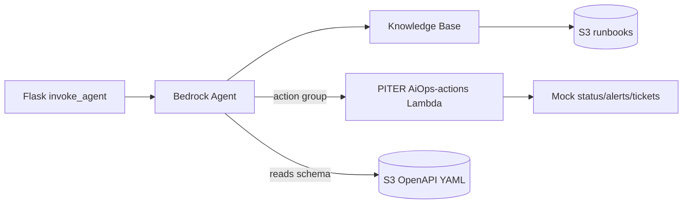

# Bedrock Agent Action Group — Setup Walkthrough

Deploy the **PITER AiOps-ops** Lambda action group so your existing Bedrock Agent can query live environment status, list alerts, and create incident tickets (mock backend in v1).

> Prerequisites: Bedrock Agent already provisioned ([`bedrock_agent_setup.md`](bedrock_agent_setup.md)), `BEDROCK_AGENT_ID` and `BEDROCK_KB_ID` in `.env`, `S3_BUCKET` set.

---

## Architecture



| Component | Purpose |
|-----------|---------|
| [`action_groups/PITER AiOps-ops/lambda_function.py`](../action_groups/PITER AiOps-ops/lambda_function.py) | Routes Bedrock action calls by `apiPath` + `httpMethod` |
| [`action_groups/PITER AiOps-ops/openapi_schema.yaml`](../action_groups/PITER AiOps-ops/openapi_schema.yaml) | Tool definitions for the agent |
| `PITER AiOps-lambda-role` | Lambda execution (CloudWatch logs) |
| `PITER AiOps-agent-role` | Agent resource role: KB retrieve, Lambda invoke, S3 schema read, model invoke |

---

## Automated deploy

From project root:

```powershell
cd projects\piter-aiops
.\.venv\Scripts\Activate.ps1
# .env must include BEDROCK_AGENT_ID, BEDROCK_AGENT_ALIAS_ID, BEDROCK_KB_ID, S3_BUCKET, BEDROCK_MODEL_ARN

python scripts/setup_action_group.py --dry-run
python scripts/setup_action_group.py
```

The script is idempotent: creates/updates IAM roles, Lambda, S3 upload, action group, agent instruction, and runs `prepare_agent`.

Optional flags:

- `--agent-id ID` — override `.env` agent ID
- `--skip-lambda` — wire action group only (Lambda already deployed)

---

## Manual fallback (Console)

1. **IAM** — Create `PITER AiOps-lambda-role` (Lambda trust) and `PITER AiOps-agent-role` (Bedrock trust). Attach policies from [`infra/`](../infra/).
2. **Lambda** — Create `PITER AiOps-actions`, Python 3.12, arm64, handler `lambda_function.lambda_handler`, upload zip of `lambda_function.py`.
3. **S3** — Upload `openapi_schema.yaml` to `s3://<bucket>/agent/PITER AiOps-ops/openapi_schema.yaml`.
4. **Lambda permission** — Allow `bedrock.amazonaws.com` to invoke, source ARN scoped to your agent.
5. **Bedrock Agent** — Action groups → Add → Define with API schemas → select Lambda + S3 schema → **Prepare**.
6. **Agent resource role** — Must include `lambda:InvokeFunction`, `bedrock:Retrieve` on KB, `s3:GetObject` on schema prefix.

---

## Verify

```powershell
pytest tests/test_lambda_action_handler.py -q
python scripts/agent_smoke_test.py --ops
```

### Test prompts (Bedrock console or `--ops` smoke)

- "What's the current status of GIB?" → expect DEGRADED, 2 active alerts
- "Show me alerts in GIB from the last 6 hours."
- "Open a P2 incident in GIB titled replication lag investigation." → agent should **confirm** before write

Screenshot for submission: `screenshots/final/07_lambda_mcp_tools.png`

---

## Troubleshooting

| Symptom | Likely cause | Fix |
|---------|--------------|-----|
| `Failed to create OpenAPI 3 model` | Bedrock rejects `enum`, `format: date-time`, inline `example:` | Use the repo schema (already sanitized) |
| `Access denied … inference profile` on `update_agent` | IAM propagation race | Re-run script (retries built-in) or wait 30s |
| `on-demand throughput isn't supported` on invoke | Agent uses raw model ID | Set `BEDROCK_MODEL_ARN` to an inference profile ARN and re-run setup |
| `accessDeniedException` during `invoke_agent` stream | Agent role missing `bedrock:UseInferenceProfile` or model not enabled in Bedrock console | Re-run setup; enable model access under **Bedrock → Model access** |
| `dependencyFailedException` with Nova profiles | Known agent + Nova instability in some accounts | Prefer `us.anthropic.claude-haiku-4-5-20251001-v1:0` inference profile |

Set a non-placeholder model before deploy when possible:

```env
BEDROCK_MODEL_ARN=arn:aws:bedrock:us-east-1:329597159579:inference-profile/us.anthropic.claude-haiku-4-5-20251001-v1:0
```

---

## Going to production

Replace mock data in `lambda_function.py` with real monitoring/ticketing APIs. Use Secrets Manager for credentials, VPC only if reaching internal NOC endpoints. Extend [`infra/lambda_execution_policy.json`](../infra/lambda_execution_policy.json) with least-privilege API access.
