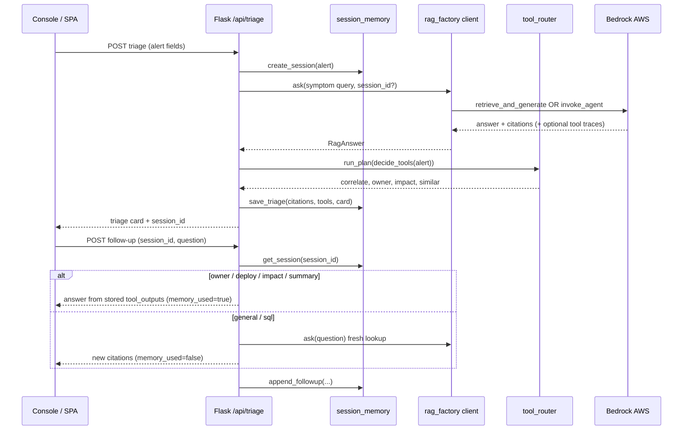

# PITER AiOps — Memory & History Audit

Read-only audit · 2026-06-06

## Terminology

The application **stores, summarizes, retrieves, and reuses** incident context within a session. It does not permanently train the model. Memory layers:

1. **Bedrock session ID** — passed to `invoke_agent` / `retrieve_and_generate` for AWS-side multi-turn (when used).
2. **Session attributes** — `build_session_attributes()` → `sessionState.sessionAttributes` / `promptSessionAttributes` on agent calls.
3. **Application session store** — `app/services/session_memory.py` (in-process dict, max 200 sessions).

## Flow diagram

## Verification checklist

| Requirement | Status | Evidence |
|-------------|--------|----------|
| Session ID creation | **Yes** | `session_memory.create_session` |
| Session reuse on follow-up | **Yes** | `/api/follow-up` requires `session_id` |
| Separation between incidents | **Yes** | New session per triage |
| `MEMORY_ENABLED` config flag | **Present** | `config.py` — not heavily branched in code |
| History persistence across restarts | **No** | In-memory only — document for demo |
| Reset behavior | **Yes** | `session_memory.reset()` in tests |
| Cross-incident contamination | **Prevented** | Unknown session → 404 |
| Tool output persistence | **Yes** | Stored in session on triage |
| Tests | **Yes** | `tests/test_agent.py`, `tests/test_flask_routes.py` |

## Bedrock Agent memory

- `invoke_agent` receives `sessionId` (reuse or UUID).
- Session attributes carry alert context for multi-turn agent reasoning.
- **No** separate Bedrock Agent Memory (long-term) resource verified in code — relies on session ID + app store.

## Production caveat

`Dockerfile` uses gunicorn `--workers 1` explicitly because `session_memory` is process-local. Scaling workers without Redis would break follow-ups.

## Gaps (P2)

- `MEMORY_ENABLED` is loaded but not enforced to skip memory paths when false.
- Follow-up path does not pass `session_id` back to Bedrock on re-query (only app memory for classified follow-ups).
